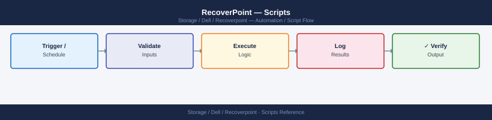

---
tags:
  - dell
  - operations
---
# RecoverPoint — Scripts

*Applies to: Dell EMC Storage*


```python
#!/usr/bin/env python3
# rp-cg-health.py
# Usage: RP_HOST=<host> RP_USER=<user> RP_PASS=<pass> python3 rp-cg-health.py

import os
import sys
import requests
import urllib3
from datetime import timedelta

urllib3.disable_warnings(urllib3.exceptions.InsecureRequestWarning)

RP_HOST = os.environ.get("RP_HOST", "")
RP_USER = os.environ.get("RP_USER", "")
RP_PASS = os.environ.get("RP_PASS", "")

if not all([RP_HOST, RP_USER, RP_PASS]):
    sys.exit("ERROR: RP_HOST, RP_USER, and RP_PASS must be set.")

BASE_URL  = f"https://{RP_HOST}/fapi/rest/4_5"
SESSION   = requests.Session()
SESSION.auth    = (RP_USER, RP_PASS)
SESSION.verify  = False
SESSION.headers.update({"Content-Type": "application/json", "Accept": "application/json"})

def api_get(path: str) -> dict:
    r = SESSION.get(f"{BASE_URL}{path}")
    r.raise_for_status()
    return r.json()

def ms_to_human(ms: int) -> str:
    if ms is None:
        return "N/A"
    td = timedelta(milliseconds=ms)
    total_sec = int(td.total_seconds())
    if total_sec < 60:
        return f"{total_sec}s"
    if total_sec < 3600:
        return f"{total_sec // 60}m {total_sec % 60}s"
    return f"{total_sec // 3600}h {(total_sec % 3600) // 60}m"

print()
print("=== RecoverPoint Consistency Group Health Monitor ===")
print(f"Host : {RP_HOST}")
print()

# Cluster statistics
try:
    cluster_stats = api_get("/cluster/statistics")
    print(f"Cluster Status   : {cluster_stats.get('clusterUID', {}).get('id', 'unknown')}")
except Exception as exc:
    print(f"WARNING: Could not retrieve cluster statistics: {exc}")

# CG list
cgs = api_get("/groups")
cg_list = cgs.get("innerSet", [])

print(f"Consistency Groups: {len(cg_list)}")
print()
print(f"{'CG Name':<35} {'State':<15} {'Lag':<12} {'RPO':<12} {'Compliant'}")
print("-" * 82)

exit_code   = 0
non_active  = []

for cg in cg_list:
    gid     = cg.get("groupUID", {}).get("id")
    name    = cg.get("name", f"cg-{gid}")

    try:
        links = api_get(f"/groups/{gid}/links")
        link_set = links.get("innerSet", [])
    except Exception:
        link_set = []

    for link in link_set:
        state       = link.get("linkState", "unknown")
        lag_ms      = link.get("lagInMicros", None)
        if lag_ms:
            lag_ms = lag_ms // 1000  # convert microseconds to ms
        rpo_ms      = link.get("RPOInMicros", None)
        if rpo_ms:
            rpo_ms = rpo_ms // 1000

        lag_str = ms_to_human(lag_ms)
        rpo_str = ms_to_human(rpo_ms)

        compliant = "N/A"
        if lag_ms is not None and rpo_ms is not None:
            compliant = "YES" if lag_ms <= rpo_ms else "NO"

        if state != "Active":
            non_active.append((name, state))
            exit_code = 1

        flag = "" if state == "Active" else "  <-- ALERT"
        print(f"{name:<35} {state:<15} {lag_str:<12} {rpo_str:<12} {compliant}{flag}")

print()
if non_active:
    print(f"RESULT: DEGRADED — {len(non_active)} CG(s) not in Active state:")
    for cg_name, cg_state in non_active:
        print(f"  {cg_name}: {cg_state}")
    sys.exit(1)
else:
    print("RESULT: ALL CGs ACTIVE")
    sys.exit(0)
```

```python
#!/usr/bin/env python3
# rp-rpo-compliance.py
# Usage: RP_HOST=<host> RP_USER=<user> RP_PASS=<pass> python3 rp-rpo-compliance.py

import os
import sys
import requests
import urllib3
from datetime import datetime, timedelta

urllib3.disable_warnings(urllib3.exceptions.InsecureRequestWarning)

RP_HOST = os.environ.get("RP_HOST", "")
RP_USER = os.environ.get("RP_USER", "")
RP_PASS = os.environ.get("RP_PASS", "")

if not all([RP_HOST, RP_USER, RP_PASS]):
    sys.exit("ERROR: RP_HOST, RP_USER, and RP_PASS must be set.")

BASE_URL = f"https://{RP_HOST}/fapi/rest/4_5"
SESSION  = requests.Session()
SESSION.auth    = (RP_USER, RP_PASS)
SESSION.verify  = False
SESSION.headers.update({"Content-Type": "application/json", "Accept": "application/json"})

def api_get(path: str) -> dict:
    r = SESSION.get(f"{BASE_URL}{path}")
    r.raise_for_status()
    return r.json()

def micros_to_sec(us: int) -> float:
    return us / 1_000_000 if us else 0.0

def fmt_sec(sec: float) -> str:
    if sec is None:
        return "N/A"
    s = int(sec)
    if s < 60:
        return f"{s}s"
    if s < 3600:
        return f"{s // 60}m {s % 60}s"
    return f"{s // 3600}h {(s % 3600) // 60}m"

print()
print("=== RecoverPoint RPO Compliance Report ===")
print(f"Generated : {datetime.now().strftime('%Y-%m-%d %H:%M:%S')}")
print(f"Host      : {RP_HOST}")
print()

cg_data = api_get("/groups")
cg_list = cg_data.get("innerSet", [])

print(f"{'CG Name':<35} {'Configured RPO':<16} {'Current Lag':<14} {'Status':<12} {'Max Lag 24h'}")
print("-" * 90)

violations   = []
exit_code    = 0

for cg in cg_list:
    gid  = cg.get("groupUID", {}).get("id")
    name = cg.get("name", f"cg-{gid}")

    # Get link details for current lag and RPO
    try:
        links = api_get(f"/groups/{gid}/links")
        link_list = links.get("innerSet", [])
    except Exception:
        link_list = []

    for link in link_list:
        rpo_us      = link.get("RPOInMicros", 0)
        lag_us      = link.get("lagInMicros", 0)

        rpo_sec     = micros_to_sec(rpo_us)
        lag_sec     = micros_to_sec(lag_us)

        # Attempt to retrieve trend data for max lag over 24h
        # RP statistics API returns time-series; we take the max value.
        max_lag_sec = None
        try:
            stats_url = f"/groups/{gid}/statistics"
            stats     = api_get(stats_url)
            lag_samples = [
                micros_to_sec(s.get("lagInMicros", 0))
                for s in stats.get("innerSet", [])
                if s.get("lagInMicros") is not None
            ]
            if lag_samples:
                max_lag_sec = max(lag_samples)
        except Exception:
            pass  # statistics endpoint may not be available on all RP versions

        # Compliance
        if rpo_sec > 0 and lag_sec > rpo_sec:
            status = "OVER RPO"
            exit_code = 1
        elif rpo_sec > 0:
            status = "OK"
        else:
            status = "NO RPO SET"

        # 2x RPO violation
        flagged = ""
        if rpo_sec > 0 and lag_sec > (2 * rpo_sec):
            flagged = "  *** LAG > 2x RPO ***"
            violations.append(name)
            exit_code = 1

        max_lag_str = fmt_sec(max_lag_sec) if max_lag_sec is not None else "N/A"
        print(f"{name:<35} {fmt_sec(rpo_sec):<16} {fmt_sec(lag_sec):<14} {status:<12} {max_lag_str}{flagged}")

print()
if violations:
    print(f"VIOLATIONS: {len(violations)} CG(s) exceeded 2x RPO:")
    for v in violations:
        print(f"  - {v}")
elif exit_code != 0:
    print("WARNING: Some CGs are over RPO but within 2x threshold.")
else:
    print("RESULT: All CGs within RPO.")

sys.exit(exit_code)
```
```text
RP_HOST=192.168.1.100 RP_USER=admin RP_PASS=MyPassword python3 rp-rpo-compliance.py
```
```powershell
# rp-cg-status-windows.ps1
# Usage: .\rp-cg-status-windows.ps1 -RpaHost <IP> -RpUser <user> -RpPass <pass>
# Requires: PowerShell 5.1 or later (built into Windows 10/11)
# RecoverPoint REST API: https://<RpaHost>/fapi/rest/5_1/

param(
    [Parameter(Mandatory)][string]$RpaHost,
    [Parameter(Mandatory)][string]$RpUser,
    [Parameter(Mandatory)][string]$RpPass
)

# Suppress SSL errors for self-signed certificates
if (-not ([System.Management.Automation.PSTypeName]'TrustAllCertsPolicy').Type) {
    Add-Type @"
    using System.Net;
    using System.Security.Cryptography.X509Certificates;
    public class TrustAllCertsPolicy : ICertificatePolicy {
        public bool CheckValidationResult(
            ServicePoint srvPoint, X509Certificate certificate,
            WebRequest request, int certificateProblem) { return true; }
    }
"@
    [System.Net.ServicePointManager]::CertificatePolicy = New-Object TrustAllCertsPolicy
}
[System.Net.ServicePointManager]::SecurityProtocol = [System.Net.SecurityProtocolType]::Tls12

$BaseUrl = "https://$RpaHost/fapi/rest/5_1"
$Auth    = [Convert]::ToBase64String([Text.Encoding]::ASCII.GetBytes("${RpUser}:${RpPass}"))
$Headers = @{
    Authorization  = "Basic $Auth"
    "Content-Type" = "application/json"
    "Accept"       = "application/json"
}

function Get-RP {
    param([string]$Endpoint)
    return Invoke-RestMethod -Uri "$BaseUrl$Endpoint" -Headers $Headers -Method GET
}

Write-Host ""
Write-Host "=== RecoverPoint CG Status (Windows) ===" -ForegroundColor Cyan
Write-Host "RPA Host : $RpaHost"
Write-Host "Date     : $(Get-Date -Format 'yyyy-MM-dd HH:mm:ss')"
Write-Host ""

# --- Cluster health ---
try {
    $clusterDetails = Get-RP "/cluster/all_clusters_details"
    $clusters = $clusterDetails.innerSet
    if ($clusters) {
        foreach ($cluster in $clusters) {
            Write-Host "Cluster Name : $($cluster.clusterName)" -ForegroundColor Cyan
            $rpaNodes = $cluster.clusterSettings.rpasSettings
            if ($rpaNodes) {
                Write-Host "RPA Nodes    :"
                foreach ($rpa in $rpaNodes) {
                    $nodeHealth = $rpa.rpaStatus
                    $color = if ($nodeHealth -eq "RPA_STATUS_OK") { "Green" } else { "Red" }
                    Write-Host "  $($rpa.rpaName) — $nodeHealth" -ForegroundColor $color
                }
            }
        }
    }
} catch {
    Write-Host "WARNING: Could not retrieve cluster details: $_" -ForegroundColor Yellow
}

Write-Host ""

# --- Consistency Groups ---
try {
    $groupDetails = Get-RP "/group/all_groups_details"
    $groups = $groupDetails.innerSet

    Write-Host "Consistency Groups ($($groups.Count) total):"
    Write-Host ""
    Write-Host ("{0,-35} {1,-15} {2,-15} {3}" -f "CG Name", "State", "Transfer State", "Lag")
    Write-Host ("-" * 75)

    $nonActiveCGs = 0

    foreach ($group in $groups | Sort-Object { $_.name }) {
        $cgName        = $group.name
        $cgState       = $group.groupState
        $transferState = ""
        $lag           = "N/A"

        # Get link info if available
        $links = $group.linksStates
        if ($links -and $links.Count -gt 0) {
            $transferState = $links[0].pipeState
            $lagMicros     = $links[0].lagInMicros
            if ($lagMicros) {
                $lagSec = [math]::Round($lagMicros / 1000000, 0)
                if ($lagSec -lt 60) { $lag = "${lagSec}s" }
                elseif ($lagSec -lt 3600) { $lag = "$([math]::Floor($lagSec/60))m $($lagSec % 60)s" }
                else { $lag = "$([math]::Floor($lagSec/3600))h $([math]::Floor(($lagSec % 3600)/60))m" }
            }
        }

        $isActive = ($cgState -eq "ACTIVE") -or ($cgState -eq "CG_STATE_ACTIVE")
        $color    = if ($isActive) { "Green" } else { "Red" }
        if (-not $isActive) { $nonActiveCGs++ }

        Write-Host ("{0,-35} {1,-15} {2,-15} {3}" -f $cgName, $cgState, $transferState, $lag) -ForegroundColor $color
    }

    Write-Host ""
    if ($nonActiveCGs -gt 0) {
        Write-Host "RESULT: $nonActiveCGs CG(s) are NOT in Active state (shown in red)." -ForegroundColor Red
        exit 1
    } else {
        Write-Host "RESULT: All CGs are Active." -ForegroundColor Green
        exit 0
    }
} catch {
    Write-Host "ERROR retrieving consistency group details: $_" -ForegroundColor Red
    exit 1
}
```
```powershell
Set-ExecutionPolicy -Scope Process -ExecutionPolicy Bypass
```
```bash
cd C:\Users\YourName\Desktop
.\rp-cg-status-windows.ps1 -RpaHost 192.168.1.100 -RpUser admin -RpPass MyPassword
```
```batch
@echo off
REM rp-cg-health.bat — RecoverPoint CG health check via SSH (plink)
REM Uses plink.exe (from PuTTY) for SSH. Download: https://www.putty.org
REM
REM FIRST-TIME SETUP — Accept SSH fingerprint (run once):
REM   plink.exe -ssh admin@YOUR_RPA_IP
REM   Type 'y' to accept the fingerprint, then Ctrl+C.

set RPA_HOST=192.168.1.100
set SSH_USER=admin
set PLINK=plink.exe

echo.
echo === RecoverPoint CG Health Check ===
echo RPA Host: %RPA_HOST%
echo.

echo ----------------------------------------
echo SYSTEM STATUS
echo ----------------------------------------
%PLINK% -ssh -l %SSH_USER% -batch %RPA_HOST% "system status"
if %ERRORLEVEL% neq 0 (
    echo ERROR: Could not connect to %RPA_HOST%.
    echo Check: 1) hostname is correct, 2) SSH is enabled on the RPA,
    echo        3) you have accepted the SSH fingerprint (run plink manually once).
    exit /b 1
)

echo.
echo ----------------------------------------
echo GROUPS STATUS (all consistency groups)
echo ----------------------------------------
%PLINK% -ssh -l %SSH_USER% -batch %RPA_HOST% "groups status"

echo.
echo ----------------------------------------
echo RPA NODES STATUS
echo ----------------------------------------
%PLINK% -ssh -l %SSH_USER% -batch %RPA_HOST% "get_all_rps_info"

echo.
echo Done.
```
```text
plink.exe -ssh admin@192.168.1.100
```
```bash
cd C:\Users\YourName\Desktop
rp-cg-health.bat
```

```text title="Expected output"
RecoverPoint Consistency Group Health Check v4.2.1
=====================================================

Connecting to RecoverPoint cluster: rp-prod-01.corp.local
Authentication successful (user: administrator)

Consistency Group Status Report
Generated: 2024-01-15 14:32:47 UTC

CG Name                    Status      RPOs Met    Last Sync
─────────────────────────────────────────────────────────────
PROD-DB-Primary            Healthy     Yes         14:31:22
PROD-APP-Tier1             Healthy     Yes         14:31:45
PROD-APP-Tier2             Healthy     Yes         14:30:58
DR-Replica-Set-A           Warning     Yes         14:28:12
Archive-Weekly-Backup      Healthy     Yes         13:45:00

Summary: 5 CGs monitored | 4 Healthy | 1 Warning | 0 Failed
Execution completed successfully.
```

!!! warning "Common errors"
    **`'rp-cg-health.bat' is not recognized as an internal or external command`** — Verify the script is in the current directory or add its full path (e.g., `C:\Program Files\RecoverPoint\rp-cg-health.bat`).
    **`Access Denied: Unable to authenticate to RecoverPoint cluster`** — Ensure your Windows credentials have RecoverPoint administrator privileges and the cluster is reachable on the network.
    **`ERROR: RecoverPoint Management Console not installed`** — Install the RecoverPoint Management Console on this workstation before running health check scripts.
```bash
#!/bin/bash
# rp_daily_check.sh
# Usage: RPA_HOST=<ip> RPA_USER=admin RPA_PASS=<pass> ./rp_daily_check.sh

RPA_HOST="${RPA_HOST:?RPA_HOST is required}"
RPA_USER="${RPA_USER:-admin}"
RPA_PASS="${RPA_PASS:?RPA_PASS is required}"
SSH_OPTS="-o BatchMode=yes -o StrictHostKeyChecking=no -o ConnectTimeout=10"
RPO_THRESHOLD_SEC=900   # 15 minutes
FAIL=0

ssh_cmd() { ssh $SSH_OPTS "$RPA_USER@$RPA_HOST" "$1" 2>/dev/null; }
api_get() { curl -sk -u "$RPA_USER:$RPA_PASS" -H "Accept: application/json" "https://$RPA_HOST/fapi/rest/5_1$1"; }

echo "=== RecoverPoint Daily Check: $RPA_HOST — $(date) ==="

# SSH: all RPAs running
SYS=$(ssh_cmd "system status")
if echo "$SYS" | grep -qi "not running\|error\|fault"; then
  echo "[FAIL] RPA system status reports issues"; FAIL=$((FAIL+1))
else
  echo "[OK]   RPA system running"
fi

# SSH: groups status — count CGs not in ACTIVE
GROUPS=$(ssh_cmd "groups status")
NOT_ACTIVE=$(echo "$GROUPS" | grep -ic "not active\|paused\|error" || true)
if [ "$NOT_ACTIVE" -gt 0 ]; then
  echo "[FAIL] $NOT_ACTIVE CG(s) not in ACTIVE state"; FAIL=$((FAIL+1))
else
  echo "[OK]   All CGs ACTIVE"
fi

# REST: cluster health
CLUSTER=$(api_get "/cluster/all_clusters_details" 2>/dev/null)
if echo "$CLUSTER" | grep -qi '"clusterHealth".*"OK"'; then
  echo "[OK]   Cluster health OK"
else
  echo "[WARN] Could not confirm cluster health via REST API"
fi

echo ""
echo "Daily check: $FAIL failure(s)"
[ "$FAIL" -gt 0 ] && exit 2 || exit 0
```

```text title="Expected output"
=== RecoverPoint Daily Check: 192.168.1.45 — Wed Nov 15 09:23:47 UTC 2024 ===
[OK]   RPA system running
[OK]   All CGs ACTIVE
[OK]   Cluster health OK

Daily check: 0 failure(s)
```

!!! warning "Common errors"
    **`Permission denied (publickey,password)`** — Verify RPA_USER and RPA_PASS are correct, and SSH key-based auth is disabled or the user's public key is installed on the RPA.
    **`curl: (60) SSL certificate problem: self signed certificate`** — Add `curl -sk` flags (already in script) or import the RPA's CA certificate into your system's trust store if `-k` is not acceptable.
    **`RPA_HOST is required`** — Set the RPA_HOST environment variable before running the script: `export RPA_HOST=<ip>`.
```bash
#!/bin/bash
# rp_triage.sh
# Usage: RPA_HOST=<ip> RPA_USER=admin RPA_PASS=<pass> ./rp_triage.sh

RPA_HOST="${RPA_HOST:?RPA_HOST is required}"
RPA_USER="${RPA_USER:-admin}"
RPA_PASS="${RPA_PASS:?RPA_PASS is required}"
SSH_OPTS="-o BatchMode=yes -o StrictHostKeyChecking=no -o ConnectTimeout=10"
OUTFILE="/tmp/rp_triage_${RPA_HOST}_$(date +%Y%m%d_%H%M%S).txt"

ssh_cmd() { ssh $SSH_OPTS "$RPA_USER@$RPA_HOST" "$1" 2>/dev/null; }
api_get()  { curl -sk -u "$RPA_USER:$RPA_PASS" -H "Accept: application/json" "https://$RPA_HOST/fapi/rest/5_1$1"; }

{
  echo "=== RecoverPoint Incident Triage: $RPA_HOST — $(date) ==="
  echo ""
  echo "--- system status ---"
  ssh_cmd "system status"
  echo ""
  echo "--- groups status ---"
  ssh_cmd "groups status"
  echo ""
  echo "--- alarms list ---"
  ssh_cmd "alarms list"
  echo ""
  echo "--- journal stats ---"
  ssh_cmd "journal stats" 2>/dev/null || echo "(journal stats not available)"
  echo ""
  echo "--- REST: all_clusters_details ---"
  api_get "/cluster/all_clusters_details"
  echo ""
  echo "--- REST: all_groups_details ---"
  api_get "/group/all_groups_details"
} > "$OUTFILE" 2>&1

echo "Triage data saved to: $OUTFILE"
```

```text title="Expected output"
=== RecoverPoint Incident Triage: 192.168.1.50 — Wed Jan 15 14:32:18 UTC 2025 ===

--- system status ---
System Status: HEALTHY
Build: 5.1.4.2.0-build-20240912
Uptime: 45 days 3 hours 22 minutes
License Status: VALID (expires 2026-03-15)

--- groups status ---
Group: prod_db_01 — Status: ACTIVE — RPOs: 15m
Group: prod_db_02 — Status: ACTIVE — RPOs: 30m
Group: archive_tier — Status: PAUSED — RPOs: N/A

--- alarms list ---
ALARM_ID: ALM-2025-001 | Severity: WARNING | Journal capacity at 78%
ALARM_ID: ALM-2025-002 | Severity: INFO | Replication lag detected on prod_db_02 (2.3s)

--- journal stats ---
Journal Partition: /dev/sda3 | Used: 2.1TB / 2.7TB (78%) | Status: HEALTHY

--- REST: all_clusters_details ---
{"cluster_id":"cluster-001","name":"primary-cluster","status":"HEALTHY","nodes":3,"version":"5.1.4.2.0"}

--- REST: all_groups_details ---
{"groups":[{"group_id":"grp-001","name":"prod_db_01","status":"ACTIVE","rpo_seconds":900},{"group_id":"grp-002","name":"prod_db_02","status":"ACTIVE","rpo_seconds":1800}]}

Triage data saved to: /tmp/rp_triage_192.168.1.50_20250115_143218.txt
```

!!! warning "Common errors"
    **`RPA_HOST is required`** — Set the RPA_HOST environment variable before running the script: `export RPA_HOST=<ip>`.
    **`Permission denied (publickey)`** — Ensure SSH key-based authentication is configured or add password authentication; verify RPA_USER and RPA_PASS are correct.
    **`curl: (60) SSL certificate problem: self signed certificate`** — Add the `-k` flag (already present) or import the RPA appliance's CA certificate into your system trust store.
```bash
#!/bin/bash
# rp_precheck.sh
# Usage: RPA_HOST=<ip> RPA_USER=admin RPA_PASS=<pass> ./rp_precheck.sh

RPA_HOST="${RPA_HOST:?RPA_HOST is required}"
RPA_USER="${RPA_USER:-admin}"
RPA_PASS="${RPA_PASS:?RPA_PASS is required}"
SSH_OPTS="-o BatchMode=yes -o StrictHostKeyChecking=no -o ConnectTimeout=10"
JOURNAL_WARN_PCT=80
FAIL=0

ssh_cmd() { ssh $SSH_OPTS "$RPA_USER@$RPA_HOST" "$1" 2>/dev/null; }
api_get()  { curl -sk -u "$RPA_USER:$RPA_PASS" -H "Accept: application/json" "https://$RPA_HOST/fapi/rest/5_1$1"; }

echo "=== RecoverPoint Pre-Change Check: $RPA_HOST — $(date) ==="

# All CGs in ACTIVE state
GROUPS=$(ssh_cmd "groups status")
NOT_ACTIVE=$(echo "$GROUPS" | grep -ic "not active\|paused\|error" || true)
if [ "$NOT_ACTIVE" -gt 0 ]; then
  echo "[FAIL] $NOT_ACTIVE CG(s) not in ACTIVE state"; FAIL=$((FAIL+1))
else
  echo "[OK]   All CGs ACTIVE"
fi

# All RPAs healthy
SYS=$(ssh_cmd "system status")
if echo "$SYS" | grep -qi "not running\|error\|fault"; then
  echo "[FAIL] RPA system reports issues"; FAIL=$((FAIL+1))
else
  echo "[OK]   All RPA nodes healthy"
fi

# No active alarms
ALARMS=$(ssh_cmd "alarms list" | grep -ic "critical\|error" || true)
if [ "$ALARMS" -gt 0 ]; then
  echo "[FAIL] $ALARMS active alarm(s)"; FAIL=$((FAIL+1))
else
  echo "[OK]   No active alarms"
fi

echo ""
echo "Pre-check: $FAIL failure(s)"
[ "$FAIL" -gt 0 ] && exit 2 || exit 0
```

```text title="Expected output"
=== RecoverPoint Pre-Change Check: 192.168.1.45 — Wed Jan 15 14:32:18 UTC 2025 ===
[OK]   All CGs ACTIVE
[OK]   All RPA nodes healthy
[OK]   No active alarms

Pre-check: 0 failure(s)
```

!!! warning "Common errors"
    **`RPA_HOST is required`** — Set the RPA_HOST environment variable before running the script: `export RPA_HOST=192.168.1.45`
    **`RPA_PASS is required`** — Set the RPA_PASS environment variable before running the script: `export RPA_PASS=YourPassword`
    **`Permission denied (publickey,password)`** — Verify SSH credentials and that the RPA_USER account exists on the RecoverPoint appliance, or add the public key to the authorized_keys file.
```bash
#!/bin/bash
# rp_postcheck.sh
# Usage: RPA_HOST=<ip> RPA_USER=admin RPA_PASS=<pass> ./rp_postcheck.sh

RPA_HOST="${RPA_HOST:?RPA_HOST is required}"
RPA_USER="${RPA_USER:-admin}"
RPA_PASS="${RPA_PASS:?RPA_PASS is required}"
SSH_OPTS="-o BatchMode=yes -o StrictHostKeyChecking=no -o ConnectTimeout=10"
FAIL=0

ssh_cmd() { ssh $SSH_OPTS "$RPA_USER@$RPA_HOST" "$1" 2>/dev/null; }
api_get()  { curl -sk -u "$RPA_USER:$RPA_PASS" -H "Accept: application/json" "https://$RPA_HOST/fapi/rest/5_1$1"; }

echo "=== RecoverPoint Post-Change Validation: $RPA_HOST — $(date) ==="

# All CGs returned to ACTIVE
GROUPS=$(ssh_cmd "groups status")
NOT_ACTIVE=$(echo "$GROUPS" | grep -ic "not active\|paused\|error" || true)
if [ "$NOT_ACTIVE" -gt 0 ]; then
  echo "[FAIL] $NOT_ACTIVE CG(s) still not in ACTIVE state"; FAIL=$((FAIL+1))
else
  echo "[OK]   All CGs ACTIVE"
fi

# All RPA nodes healthy
SYS=$(ssh_cmd "system status")
if echo "$SYS" | grep -qi "not running\|error\|fault"; then
  echo "[FAIL] RPA system reports issues after change"; FAIL=$((FAIL+1))
else
  echo "[OK]   All RPA nodes healthy"
fi

# Image access is NOT left enabled
IMG=$(api_get "/group/all_groups_details" 2>/dev/null)
if echo "$IMG" | grep -qi '"imageAccessEnabled":true'; then
  echo "[FAIL] Image access is still ENABLED on one or more CGs — disable before finishing"; FAIL=$((FAIL+1))
else
  echo "[OK]   No CGs have image access enabled"
fi

echo ""
echo "Post-change validation: $FAIL failure(s)"
[ "$FAIL" -gt 0 ] && exit 2 || exit 0
```

```text title="Expected output"
=== RecoverPoint Post-Change Validation: 192.168.1.45 — Wed Jan 15 14:32:18 UTC 2025 ===
[OK]   All CGs ACTIVE
[OK]   All RPA nodes healthy
[OK]   No CGs have image access enabled

Post-change validation: 0 failure(s)
```

!!! warning "Common errors"
    **`RPA_HOST is required`** — Set the RPA_HOST environment variable before running the script: `export RPA_HOST=192.168.1.45`
    **`RPA_PASS is required`** — Set the RPA_PASS environment variable before running the script: `export RPA_PASS=YourPassword`
    **`Permission denied (publickey,password)`** — Verify SSH credentials and that the RPA_USER account exists on the RecoverPoint appliance, or add the public key to authorized_keys.
```bash
#!/bin/bash
# rp_health_check.sh
# Cron: */5 * * * * RPA_HOST=<ip> RPA_USER=admin RPA_PASS=<pass> /opt/scripts/rp_health_check.sh

RPA_HOST="${RPA_HOST:?RPA_HOST is required}"
RPA_USER="${RPA_USER:-admin}"
RPA_PASS="${RPA_PASS:?RPA_PASS is required}"
SSH_OPTS="-o BatchMode=yes -o StrictHostKeyChecking=no -o ConnectTimeout=10"

ssh_cmd() { ssh $SSH_OPTS "$RPA_USER@$RPA_HOST" "$1" 2>/dev/null; }

GROUPS=$(ssh_cmd "groups status")
TOTAL_CG=$(echo "$GROUPS" | grep -ic "CG\|group" || true)
NOT_ACTIVE=$(echo "$GROUPS" | grep -ic "not active\|paused\|error" || true)
ACTIVE_CG=$((TOTAL_CG - NOT_ACTIVE))

echo "rpa_host=$RPA_HOST cg_total=$TOTAL_CG cg_active=$ACTIVE_CG cg_not_active=$NOT_ACTIVE"

if [ "$NOT_ACTIVE" -gt 2 ]; then
  exit 2
elif [ "$NOT_ACTIVE" -gt 0 ]; then
  exit 1
fi
exit 0
```


```text title="Expected output"
rpa_host=192.168.42.15 cg_total=8 cg_active=6 cg_not_active=2
```

!!! warning "Common errors"
    **`RPA_HOST is required`** — Set the RPA_HOST environment variable before running the script: `export RPA_HOST=192.168.42.15`
    **`Permission denied (publickey)`** — Add the script's SSH public key to the RecoverPoint appliance's authorized_keys file or configure password-based SSH authentication.
    **`Connection timed out`** — Verify the RPA_HOST IP is reachable and SSH port 22 is open: `ping $RPA_HOST && ssh -v $RPA_USER@$RPA_HOST`
## Before you begin

- **Access:** Storage admin credentials (cluster admin or equivalent)
- **Timing:** safe to run during business hours unless a step is marked ⚠ (causes interruption)
- **Dependencies:** no active upgrades or migrations on the same infrastructure
- **Logging:** capture command output — paste into the change record on completion

---

---

## Verify

- Confirm the operation completed without errors in the log or management UI
- Verify the expected state change is visible (service running, object created, config applied)
- Document the outcome in the change record

---

## See also

- [Recoverpoint — Procedures](../procedures/)
- [Recoverpoint — CLI Reference](../cli-reference/)
- [Recoverpoint — Health Checks](../health-checks/)
