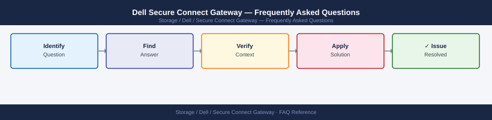

---
tags:
  - dell-scg
  - faq
  - operations
description: "Common questions about Dell Secure Connect Gateway operations, configuration, and troubleshooting. For step-by-step procedures, see the Operations section."
---
# Dell Secure Connect Gateway — Frequently Asked Questions

*Applies to: Dell EMC Storage*

Common questions about Dell Secure Connect Gateway operations, configuration, and troubleshooting. For step-by-step procedures, see the <a href="index.md">Operations</a> section.

## General

**Q: What Secure Connect Gateway version is recommended?**
A: SCG 5.24.x is the current recommendation. Check via SCG web interface → Administration → About. SCG replaces the legacy SupportAssist Enterprise and EMC Secure Remote Services (ESRS).

**Q: How do I check the current Dell Secure Connect Gateway version?**
A: `SCG UI → Administration → About`

## Configuration

**Q: What is the default connectivity mode for SCG?**
A: Direct connectivity to Dell (HTTPS outbound, port 443) is the default. Configure proxy if required: SCG → Network → Proxy Settings. Use access list to control which devices connect through SCG.

**Q: How do I enable remote diagnostics collection for a new Dell array via SCG?**
A: Register the array in SCG: Devices → Add Device. Provide the array management IP and credentials. SCG establishes connectivity and begins collecting telemetry for CloudIQ and SupportAssist.

## Operations

**Q: How do I upgrade SCG without interrupting device monitoring?**
A: Download SCG update from dell.com/support. Apply via SCG → Administration → Update. SCG restarts during upgrade (5-10 minutes). Device connections resume automatically after restart. Monitor reconnection in SCG → Devices.

**Q: What is the correct procedure to add a new server to SCG?**
A: Install the iDRAC Service Module (iSM) or SupportAssist agent on the server. In SCG, go to Devices → Add Device → Server. Provide iDRAC or agent credentials. Verify telemetry appears in CloudIQ within 24 hours.

## Troubleshooting

**Q: SCG shows 'Device Not Responding'. What does it mean?**
A: SCG cannot collect telemetry from the device. Check device management IP reachability from the SCG server. Verify credentials have not expired. Check firewall rules between SCG and the device management network.

**Q: SCG is slow to respond to the UI — where do I start?**
A: Check SCG server resources (CPU, memory, disk). SCG is Java-based — increase JVM heap if under-allocated. Review the number of registered devices — very large deployments may need a second SCG instance.

## Backup and Recovery

**Q: How often should I back up SCG configuration?**
A: Weekly via SCG → Administration → Backup. Backup includes all device registrations and settings. Store off-SCG. Restore requires matching SCG version.

**Q: Can I restore SCG device registrations after a server failure?**
A: Yes — restore from the SCG backup file via the SCG installer's restore mode. Device registrations, credentials, and network settings are all restored. Re-verify device connectivity after restore.

## See Also

- [Dell Secure Connect Gateway Operations](index.md)
- [Dell Secure Connect Gateway Troubleshooting](../../../../troubleshooting/index.md)
