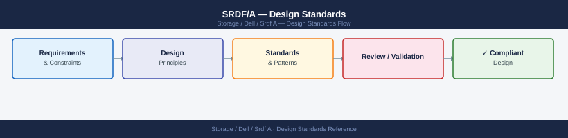

---
tags:
  - architecture
  - dell
---
# SRDF/A — Design Standards

*Applies to: Dell EMC Storage*


```bash
symrdf -g <rdfg> query -v | grep "Minimum Cycle Time"
```


```text title="Expected output"
Minimum Cycle Time (ms): 3
Minimum Cycle Time (ms): 3
Minimum Cycle Time (ms): 3
```

!!! warning "Common errors"
    | Error | Fix |
    |---|---|
    | `symrdf: Command not found` | Ensure the EMC Solutions Enabler package is installed and the symcli binaries are in your PATH. |
    | `Error: RDF group <rdfg> not found` | Replace `<rdfg>` with a valid RDF group name; verify with `symrdf list`. |
```bash
symrdf -g <rdfg> query -v | grep "MBs Written"
```

```text title="Expected output"
MBs Written:                                    1048576
MBs Written:                                    2097152
MBs Written:                                    524288
MBs Written:                                    3145728
```

!!! warning "Common errors"
    | Error | Fix |
    |---|---|
    | `symrdf: Command not found` | Ensure the EMC Solutions Enabler package is installed and the symrdf binary is in your PATH, or use the full path `/opt/emc/SYMCLI/bin/symrdf`. |
    | `SYMAPI Error: Could not connect to the Symmetrix` | Verify the Symmetrix array is reachable, check network connectivity to the array, and confirm the SYMAPI server is running with `symcfg list`. |
    | `Error: Invalid RDF group <rdfg>` | Replace `<rdfg>` with a valid RDF group number (e.g., `0`, `1`) and verify it exists with `symrdf list`. |
```bash
symdev show -sid <target_SID> <dev_id> | grep -E "Size|Track"
```
```d2
direction: right

measureWrite: "Measure Peak Write Rate\nsymrdf -g rdfg query -v | grep MBs Written" {shape: rectangle}
calcBW: "Calculate Required Bandwidth\npeak_rate x 1.20 headroom" {shape: rectangle}
checkLink: "Compare Against Current\nSRDF Link Capacity" {shape: rectangle}
sufficient: "sufficient" {shape: rectangle}
ok: "OK — proceed with\ncurrent link provisioning" {shape: rectangle}
upgrade: "Engage Network Team\nIncrease WAN Capacity\nor adjust cycle time" {shape: rectangle}
monitorCycle: "Monitor Cycle Completion Rate\nfor 30 days after change" {shape: rectangle}

measureWrite -> calcBW
calcBW -> checkLink
checkLink -> sufficient
sufficient -> ok
sufficient -> upgrade
ok -> monitorCycle
upgrade -> monitorCycle
```

---

## See also

- [Srdf A — How It Works](../how-it-works/)
- [Srdf A — Integrations](../integrations/)
- [Srdf A — Deploy](../../deploy/)
