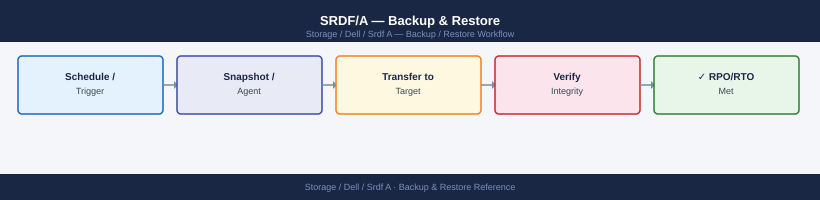

---
tags:
  - dell
  - operations
---
# SRDF/A — Backup & Restore

*Applies to: Dell EMC Storage*


```bash
# Set the Symmetrix/VMAX SID (array serial number)
export SYMCLI_SID=000123456789

# Or use -sid flag on each command
symrdf -sid 000123456789 query -g <rdf_group>
```


```text title="Expected output"
Symmetrix ID: 000123456789
Symmetrix Model: VMAX 450F
Local Director: 4e
Remote Director: 5e
RDF Group: 001
RDF Mode: Synchronous
Link Status: Ready
Pair State: Synchronized
SRDF/A Status: Active
Last Sync Time: 2024-01-15 14:32:18
```

!!! warning "Common errors"
    | Error | Fix |
    |---|---|
    | `SYMCLI_SID not set or invalid` | Export the correct Symmetrix SID with `export SYMCLI_SID=000123456789` before running symrdf commands. |
    | `RDF group <rdf_group> not found` | Verify the RDF group number exists on the array by running `symrdf -sid 000123456789 list` to display all configured groups. |
    | `Cannot connect to Symmetrix 000123456789` | Ensure the Solutions Enabler daemon is running with `sudo /opt/emc/SYMCLI/bin/stordaemon start` and the array is reachable. |
```bash
# Re-establish SRDF from R2 (current production) back to R1 (recovered site)
# This syncs changes made on R2 back to R1
symrdf -g PROD_RDF_GROUP establish -force

# Monitor sync state
symrdf query -g PROD_RDF_GROUP
# Wait until: R1 St = WD, R2 St = WD (synchronized)
```

```text title="Expected output"
Establishing SRDF link for group PROD_RDF_GROUP...
SRDF Establish operation initiated.
Job ID: 12847392
Status: In Progress

Symmetrix ID: 000296802151
Group Name: PROD_RDF_GROUP
R1 (Local) Symm ID: 000296802151
R2 (Remote) Symm ID: 000296802152

R1 State: SY
R2 State: SY
R1 Link State: OK
R2 Link State: OK
Sync Progress: 87%
Estimated Time Remaining: 2m 14s
```

!!! warning "Common errors"
    | Error | Fix |
    |---|---|
    | `SRDF group PROD_RDF_GROUP is not in a valid state for establish operation` | Verify the group is in Suspended or Failed state using `symrdf query -g PROD_RDF_GROUP` before attempting establish. |
    | `Cannot establish: R2 is currently in Write Disabled (WD) mode` | Add the `-force` flag to the establish command to override write protection, or manually enable writes on R2 first with `symrdf set -g PROD_RDF_GROUP -writeenabled`. |
```bash
# Restore re-syncs R1 from R2 in full
symrdf -g PROD_RDF_GROUP restore -force

# Monitor
symrdf query -g PROD_RDF_GROUP
```

```text title="Expected output"
Restore operation initiated for group PROD_RDF_GROUP
Restore will proceed in full mode
WARNING: This operation will overwrite all data on the R1 device
Proceeding with restore...
Restore completed successfully

PROD_RDF_GROUP                          RDF1
R1 Device                               R2 Device
000000000000000001                      000000000000000002
State                                   Synchronized
Mode                                    Synchronous
RAID Type                               RAID-1 (3+1)
Percent Complete                        100%
Last Update                             2024-01-15 14:32:18
```

!!! warning "Common errors"
    | Error | Fix |
    |---|---|
    | `symrdf: Cannot perform restore while RDF pair is in Synchronized state` | Issue a `symrdf -g PROD_RDF_GROUP query` first to verify the pair is in a restorable state (Consistent or Failed); if synchronized, break the link with `symrdf -g PROD_RDF_GROUP break -force` before restoring. |
    | `symrdf: RDF group PROD_RDF_GROUP not found` | Verify the group name matches your Symmetrix configuration by running `symrdf list` to display all available RDF groups. |
    | `symrdf: Insufficient privileges to execute restore operation` | Run the command with root privileges or ensure your user account has RDF administrative rights in the Symmetrix access control list. |
```bash
# 1. Ensure R1 site volumes are accessible and array is healthy
# 2. Perform a 'failover' back in the original direction (now R2→R1)
symrdf -g PROD_RDF_GROUP failover -force

# 3. Flip replication direction so R1 is again the source
symrdf -g PROD_RDF_GROUP establish

# 4. Monitor until synchronized
symrdf query -g PROD_RDF_GROUP
```
```d2
direction: right

B: "B" {shape: rectangle}
C: "Planned Failover\nNo -force needed" {shape: rectangle}
D: "Unplanned Failover\nRequires -force" {shape: rectangle}
E: "symrdf -g <group> failover" {shape: rectangle}
F: "symrdf -g <group> failover -force" {shape: rectangle}
G: "Verify R2 devices state = RW" {shape: rectangle}
H: "Present R2 volumes\nto DR hosts" {shape: rectangle}
I: "Start workloads on DR site" {shape: rectangle}
J: "DR Site Running — Monitor RPO/RTO" {shape: rectangle}
K: "K" {shape: rectangle}
L: "Decide failback strategy" {shape: rectangle}
M: "M" {shape: rectangle}
N: "symrdf establish -force" {shape: rectangle}
O: "symrdf restore -force" {shape: rectangle}
P: "Monitor sync progress" {shape: rectangle}
Q: "Q" {shape: rectangle}
R: "Fail workloads back\nto R1 site" {shape: rectangle}
S: "Verify SRDF replication\nresumed in normal direction" {shape: rectangle}
T: "Operations Restored" {shape: rectangle}
A: "R1 Site Incident Detected" {shape: rectangle}

B -> C
B -> D
C -> E
D -> F
E -> G
F -> G
G -> H
H -> I
I -> J
K -> J
K -> L
M -> N
M -> O
N -> P
O -> P
Q -> P
Q -> R
R -> S
S -> T
```
```bash
# Detailed query — shows RPO, link state, device state
symrdf query -g PROD_RDF_GROUP -detail

# Check RDF group information
symrdf list -rdfg <rdfg_number> -detail

# Verify RDF director status on the array
symcfg list -rdfg all

# Check RPO for async groups
symrdf -g PROD_RDF_GROUP verify -consistent

# Alert if RPO exceeds threshold
symrdf -g PROD_RDF_GROUP query | grep -E "RPO|Mode"
```


```text title="Expected output"
Symmetrix ID: 000123456789012
RDF Group Number: 1
RDF Mode: Asynchronous
Link State: Ready
Device State: Synchronized
RPO (minutes): 2.5
Pair State: Synchronized
SRDF/A Consistency Group: PROD_RDF_GROUP
Remote Symmetrix ID: 000987654321098

Symmetrix ID: 000123456789012
RDF Group: 1
RDF Mode: Asynchronous
Local Director: 4e
Remote Director: 4e
Link State: Ready
Capacity (GB): 2048.5

RDF Group: 1, Link State: Ready, Device State: Synchronized
RDF Group: 2, Link State: Ready, Device State: Synchronized

Consistency Check Completed Successfully
Devices Verified: 45
Inconsistent Devices: 0
Last Verification: 2024-01-15 14:32:18

RPO: 2.5 minutes
Mode: Asynchronous
```

!!! warning "Common errors"
    | Error | Fix |
    |---|---|
    | `symrdf: Command not found` | Ensure the EMC Solutions Enabler package is installed and the PATH includes the Symmetrix CLI bin directory. |
    | `PROD_RDF_GROUP: Invalid RDF group name` | Verify the RDF group name exists by running `symrdf list` and use the correct group identifier. |
    | `Error: Array not responding` | Check network connectivity to the Symmetrix array and confirm the SYMCLI_CONNECT environment variable is set correctly. |
## Before you begin

- **Access:** Storage admin credentials (cluster admin or equivalent)
- **Timing:** safe to run during business hours unless a step is marked ⚠ (causes interruption)
- **Dependencies:** no active upgrades or migrations on the same infrastructure
- **Logging:** capture command output — paste into the change record on completion

---

---

## Verify

- Confirm the operation completed without errors in the log or management UI
- Verify the expected state change is visible (service running, object created, config applied)
- Document the outcome in the change record

---

## See also

- [Srdf A — Procedures](../procedures/)
- [Srdf A — Health Checks](../health-checks/)
- [Srdf A — Common Issues](../../troubleshooting/common-issues/)
