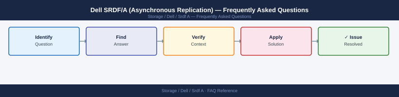

---
tags:
  - dell-srdf-a
  - faq
  - operations
description: "Common questions about Dell SRDF/A (Asynchronous Replication) operations, configuration, and troubleshooting. For step-by-step procedures, see the..."
---
# Dell SRDF/A (Asynchronous Replication) — Frequently Asked Questions

*Applies to: Dell EMC Storage*

Common questions about Dell SRDF/A (Asynchronous Replication) operations, configuration, and troubleshooting. For step-by-step procedures, see the <a href="index.md">Operations</a> section.

## General

**Q: How do I check the SRDF/A replication status on PowerMax?**
A: Via Unisphere: Storage → SRDF → SRDF Groups. Check pair state (Synchronized, SyncInProg, Suspended). Via SYMCLI: `symrdf -g <rdf_group> query`. Current lag is shown as RPO in seconds.

**Q: How do I check the current Dell SRDF/A (Asynchronous Replication) version?**
A: `symrdf -g <rdf_group> query`

## Configuration

**Q: What is the default SRDF/A cycle time and when should it change?**
A: Default cycle time is 30 seconds (minimum). Increase to 60-300 seconds for WAN links with limited bandwidth — longer cycles allow more compression before transmission. Shorter cycles reduce RPO but increase bandwidth consumption.

**Q: How do I enable SRDF/A STAR (Three-Site Replication)?**
A: Configure a three-hop SRDF group (SRDF/S from site A to site B, SRDF/A from site B to site C). Requires SRDF STAR licence. Configure via Unisphere or SYMCLI. All three arrays must be registered in Unisphere.

## Operations

**Q: How do I suspend and resume SRDF/A replication during array maintenance?**
A: Suspend: `symrdf -g <rdf_group> suspend`. Perform maintenance. Resume: `symrdf -g <rdf_group> resume`. During suspension, the journal accumulates changes. Monitor journal capacity — if full during suspend, a full copy is needed on resume.

**Q: What is the correct procedure to add a new volume to an existing SRDF/A group?**
A: Add volume to the storage group. In SYMCLI: `symrdf -g <rdf_group> addpair -dev <devid> -rdfg <rdf_group> -type async`. Initial copy begins automatically. Monitor with `symrdf -g <rdf_group> query`.

## Troubleshooting

**Q: SRDF/A shows 'R2 out of sync'. What does it mean?**
A: The replica (R2) is not receiving updates from the source (R1). Check WAN connectivity and SRDF port health with `symrdf -g <rdf_group> verify`. If the link is restored, SRDF/A will automatically re-sync within the journal window.

**Q: SRDF/A RPO is consistently above target — where do I start?**
A: Check WAN bandwidth utilisation. Enable SRDF/A compression if not already enabled. Increase cycle time to reduce overhead. Review which volumes are generating the most delta using `symrdf -g <rdf_group> list -v`.

## Backup and Recovery

**Q: How often should I back up SRDF/A configuration?**
A: Weekly SYMCLI export of RDF group configuration. Back up before any microcode upgrade or RDF group modification. Configuration restore requires both source and target arrays to be available.

**Q: Can I perform a partial failover of selected volumes in an SRDF/A group?**
A: Yes — use consistent failover per device: `symrdf -g <rdf_group> -dev <devlist> failover`. However, for transactionally consistent recovery, fail over the entire consistency group rather than individual volumes.

## See Also

- [Dell SRDF/A (Asynchronous Replication) Operations](index.md)
- [Dell SRDF/A (Asynchronous Replication) Troubleshooting](../../../../troubleshooting/index.md)
