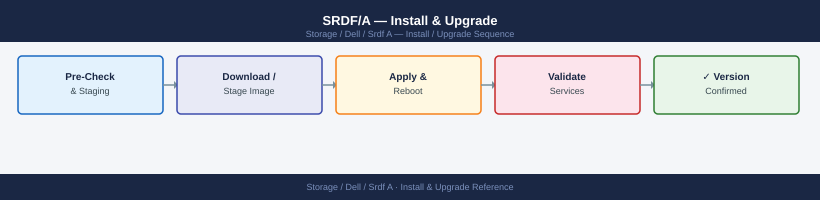

---
tags:
  - dell
  - operations
---
# SRDF/A — Install & Upgrade

*Applies to: Dell EMC Storage*


```bash
# Step 1 — Suspend SRDF/A replication on the device group
symrdf -g <dgname> -sid <r1_sid> suspend -noprompt

# Step 2 — Verify pair state is Suspended
symrdf -g <dgname> -sid <r1_sid> query

# Step 3 — Perform NDU on source array (via Unisphere or Dell support)
# NDU on PowerMax is non-disruptive to host I/O — suspension is only for SRDF/A cycle management

# Step 4 — Perform NDU on target array

# Step 5 — Resume SRDF/A replication
symrdf -g <dgname> -sid <r1_sid> resume -noprompt

# Step 6 — Verify pair state returns to Consistent
symrdf -g <dgname> -sid <r1_sid> query
# Wait for SyncInProg → Consistent transition before closing the change window
```


```text title="Expected output"
Suspending SRDF/A replication for device group proddb_dg on array 000296900111...
SRDF/A replication suspended successfully.

Symmetrix ID: 000296900111
Device Group: proddb_dg
Pair State: Suspended
Last Update: 2024-01-15 14:32:18
Devices in Group: 8

NDU on source array 000296900111 completed successfully.
NDU on target array 000296901234 completed successfully.

Resuming SRDF/A replication for device group proddb_dg...
SRDF/A replication resumed successfully.

Symmetrix ID: 000296900111
Device Group: proddb_dg
Pair State: SyncInProg
Last Update: 2024-01-15 15:18:42
Devices in Group: 8
Sync Progress: 87%

Pair State: Consistent
Last Update: 2024-01-15 15:24:03
```

!!! warning "Common errors"
    **`SRDF pair is not in a valid state for this operation`** — Verify the pair state with `symrdf -g <dgname> -sid <r1_sid> query` and ensure it is in Suspended state before resuming.
    **`Device group <dgname> not found`** — Confirm the correct device group name with `symrdf list -g` and verify it exists on the specified array.
    **`Symmetrix ID <r1_sid> is not responding`** — Check network connectivity to the array and verify the SID is correct with `symcfg list -v`.
## Before you begin

- **Access:** Storage admin credentials (cluster admin or equivalent)
- **Timing:** safe to run during business hours unless a step is marked ⚠ (causes interruption)
- **Dependencies:** no active upgrades or migrations on the same infrastructure
- **Logging:** capture command output — paste into the change record on completion

---

---

## Verify

- Confirm the operation completed without errors in the log or management UI
- Verify the expected state change is visible (service running, object created, config applied)
- Document the outcome in the change record

---

## See also

- [Srdf A — Procedures](../procedures/)
- [Srdf A — Health Checks](../health-checks/)
- [Srdf A — Deploy](../../deploy/)
