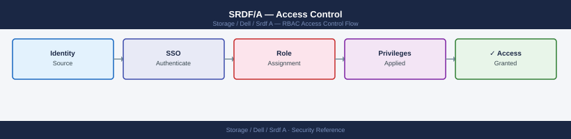

---
tags:
  - dell
  - security
---
# SRDF/A — Access Control

Access Control reference covering Solutions Enabler RBAC, Preventing Accidental Resync.

*Applies to: SRDF/A*

---

## Before you begin

- **Access:** Storage admin credentials (cluster admin or equivalent)
- **Change management:** security changes require CAB approval in most environments
- **Rollback plan:** document current state before any security control change
- **Testing:** validate in a non-production environment first where possible

---

## Preventing Accidental Resync

For async operations, accidentally re-syncing from target to source (after a failover test) destroys production data. Guard against this:

- Set SYMCLI session to confirm mode for destructive operations: `SYMCLI_CONFIRM=prompt`
- Restrict `symrdf restore` and `symrdf establish -full` to a separate break-glass account
- Implement a peer-review process for any SRDF failover in production

---

## See also

- [Srdf A — Authentication](../authentication/)
- [Srdf A — Hardening](../hardening/)
- [Srdf A — Encryption](../encryption/)
