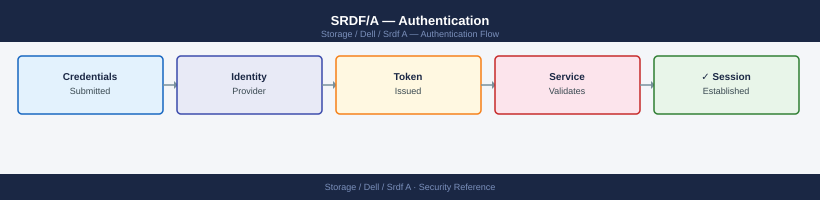

---
tags:
  - dell
  - security
description: "Authentication reference covering Credential Rotation, Service Account Policy."
---
# SRDF/A — Authentication

Authentication reference covering Credential Rotation, Service Account Policy.

*Applies to: SRDF/A*

Each automation system (monitoring, SRM, runbook scripts) should use a dedicated account scoped to the minimum required RDF groups and roles.

## Before you begin

- **Access:** Storage admin credentials (cluster admin or equivalent)
- **Change management:** security changes require CAB approval in most environments
- **Rollback plan:** document current state before any security control change
- **Testing:** validate in a non-production environment first where possible

---

---

## See also

- [Srdf A — Access Control](../access-control/)
- [Srdf A — Hardening](../hardening/)
- [Srdf A — Encryption](../encryption/)
