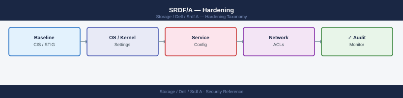

---
tags:
  - dell
  - security
---
# SRDF/A — Hardening

Hardening reference covering Network Port Requirements, Audit Logging.

*Applies to: SRDF/A*

Forward to SIEM via syslog:
- Configure Unisphere: Settings → Notifications → Syslog → add SIEM IP, port 514 (UDP) or 6514 (TLS)
- Alert on event types: `SRDF Split`, `SRDF Failover`, `SRDF Suspend`, `SRDF Establish`

## Before you begin

- **Access:** Storage admin credentials (cluster admin or equivalent)
- **Change management:** security changes require CAB approval in most environments
- **Rollback plan:** document current state before any security control change
- **Testing:** validate in a non-production environment first where possible

---

---

## See also

- [Srdf A — Authentication](../authentication/)
- [Srdf A — Access Control](../access-control/)
- [Srdf A — Encryption](../encryption/)
