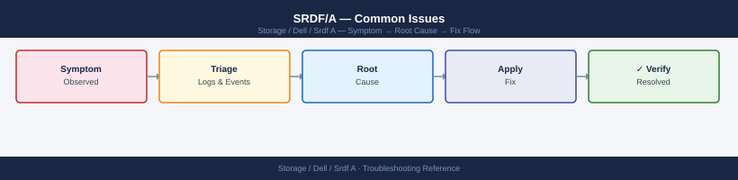

---
tags:
  - dell
  - troubleshooting
search:
  boost: 1.5
description: "SRDF/A troubleshooting: DSE overflow, cycle time violations, SRDF/A suspended due to link fault, SYMAPI errors, and escalation to Dell SRDF Engineering."
---
# SRDF/A — Common Issues

<div class="kb-summary">
SRDF/A troubleshooting: DSE overflow, cycle time violations, SRDF/A suspended due to link fault, SYMAPI errors, and escalation to Dell SRDF Engineering.

*Applies to: SRDF/A*
</div>


> Part of the [SRDF/A](../index.md) reference.

Common SRDF/A issues: link failures, increasing cycle times, suspended consistency groups, and volume capacity mismatches. Always collect `symrdf query -g <group> -v` and array event logs before engaging Dell support. Correlate with network monitoring timestamps to distinguish storage-side from WAN-side causes.

```d2
direction: down

symptom: Identify Symptom {shape: diamond}
diagnostic_flow: "Diagnostic Flow" {shape: rectangle}
lag_alert_triage_decision_tree: "Lag Alert Triage Decision Tree" {shape: rectangle}
consistency_group_suspended_automati: "Consistency Group Suspended Automatically" {shape: rectangle}
target_volume_capacity_mismatch_thin: "Target Volume Capacity Mismatch / Thin Pool Exhaustion" {shape: rectangle}
invalid_pair_state: "`Invalid` Pair State" {shape: rectangle}
verify_resolution: "Verify resolution" {shape: rectangle}
resolution: Resolve or Escalate {shape: oval}

symptom -> diagnostic_flow: investigate
symptom -> lag_alert_triage_decision_tree: investigate
symptom -> consistency_group_suspended_automati: investigate
symptom -> target_volume_capacity_mismatch_thin: investigate
symptom -> invalid_pair_state: investigate
symptom -> verify_resolution: investigate
diagnostic_flow -> resolution
lag_alert_triage_decision_tree -> resolution
consistency_group_suspended_automati -> resolution
target_volume_capacity_mismatch_thin -> resolution
invalid_pair_state -> resolution
verify_resolution -> resolution
```

## Diagnostic Flow

```d2
direction: right

D1: "D1" {shape: rectangle}
R1: "See Lag Alert Triage —\nLink saturation: check DSE and bandwidth" {shape: rectangle}
R2: "See Lag Alert Triage —\nCheck suspend reason then resume" {shape: rectangle}
D2: "D2" {shape: rectangle}
R3: "See Lag Alert Triage —\nThrottle R1 write I/O" {shape: rectangle}
R4: "See Lag Alert Triage —\nCheck network with network team" {shape: rectangle}
D3: "D3" {shape: rectangle}
R5: "See Lag Alert Triage —\nCheck FCIP tunnel and WAN QoS" {shape: rectangle}
R6: "See Root Causes —\nWrite I/O spike: schedule batch off-peak" {shape: rectangle}
D4: "D4" {shape: rectangle}
R7: "See Invalid Pair State —\nConfirm authoritative side before resync" {shape: rectangle}
R8: "See Target Volume Capacity —\nExpand thin pool on R2" {shape: rectangle}
D5: "D5" {shape: rectangle}
R9: "See Lag Alert Triage —\nDo NOT activate R2: engage Dell Support" {shape: rectangle}
R10: "See Consistency Group Suspended —\nResolve root cause before resuming" {shape: rectangle}
S: "What is the symptom?" {shape: rectangle}
B1: "B1" {shape: rectangle}
B2: "B2" {shape: rectangle}
B3: "B3" {shape: rectangle}
B4: "B4" {shape: rectangle}
B5: "B5" {shape: rectangle}

D1 -> R1
D1 -> R2
D2 -> R3
D2 -> R4
D3 -> R5
D3 -> R6
D4 -> R7
D4 -> R8
D5 -> R9
D5 -> R10
```

---

## Before you begin

- **Access:** Storage admin credentials (cluster admin or equivalent)
- **Gather first:** recent error message text, event timestamps, and affected object names
- **Scope:** confirm whether the issue affects a single object, host, cluster, or site
- **Escalation:** open a vendor support ticket before running any destructive step
- **Logging:** document each command and output — required if escalation is needed

---

## Lag Alert Triage Decision Tree

```d2
direction: right

lagAlert: "Lag Alert Fires\n(RPO threshold breached" {shape: rectangle}
checkPairState: "Check Pair State\nsymrdf -g grp -sid sid query" {shape: rectangle}
pairState: "pairState" {shape: rectangle}
transmitIdle: "Transmit Idle\n→ Link saturation" {shape: rectangle}
suspended: "Suspended\n→ Manual or auto-suspend" {shape: rectangle}
inconsistent: "Inconsistent\n→ Data consistency issue" {shape: rectangle}
transmitting: "Transmitting / Awaiting Cycle\n→ Transient or write burst" {shape: rectangle}
checkDSE: "Check DSE Utilization\nsymrdf -g 20 -type A query -detail | grep DSE" {shape: rectangle}
dseHigh: "dseHigh" {shape: rectangle}
throttleIO: "Throttle R1 Write I/O\nIdentify high-write workload" {shape: rectangle}
checkLinkBW: "Check Link Bandwidth\nsymstat -rdf -dir RF-2F -i 5 -c 3" {shape: rectangle}
linkSaturated: "linkSaturated" {shape: rectangle}
checkNetOps: "Check Network with Network Team\nFCIP tunnel state, WAN QoS" {shape: rectangle}
monitorRecovery: "Monitor Lag Recovery\nevery 5 minutes" {shape: rectangle}
checkSuspendReason: "Check Suspend Reason\nsymevent -sid sid list -last 30 | grep SRDF" {shape: rectangle}
resumeReplication: "Resume Replication\nsymrdf -g grp -sid sid resume -noprompt" {shape: rectangle}
doNotActivateR2: "Do NOT Activate R2\nEngage Dell Support" {shape: rectangle}

lagAlert -> checkPairState
checkPairState -> pairState
pairState -> transmitIdle
pairState -> suspended
pairState -> inconsistent
pairState -> transmitting
transmitIdle -> checkDSE
checkDSE -> dseHigh
dseHigh -> throttleIO
dseHigh -> checkLinkBW
checkLinkBW -> linkSaturated
linkSaturated -> checkNetOps
linkSaturated -> monitorRecovery
suspended -> checkSuspendReason
checkSuspendReason -> resumeReplication
resumeReplication -> monitorRecovery
inconsistent -> doNotActivateR2
transmitting -> monitorRecovery
```

**Root causes:**

| Cause | Indicator | Why it happens | Remediation |
|---|---|---|---|
| WAN bandwidth saturation | Delta set queue growing; utilisation at 100% | Write rate exceeds provisioned FCIP bandwidth | Contact network team to increase WAN bandwidth or implement QoS |
| Write I/O spike | Delta set size abnormally large | Batch jobs or backups generating burst writes | Identify the high-write workload; schedule heavy batch jobs for off-peak |
| Array backend congestion | R1 or R2 performance counters showing latency | Backend storage pool or disk group under pressure | Check array Unisphere performance; review storage pool or disk group health |
| FCIP GRE overhead miscalculation | MTU issues causing fragmentation | FCIP MTU not accounting for GRE/IPsec encapsulation overhead | Verify FCIP MTU settings on switches; test with `ping -M do -s 1400` |

---

## Consistency Group Suspended Automatically

**Symptom:** SRDF/A pair automatically suspends; state moves to `Suspended` without manual intervention.

This occurs when the delta set grows beyond the array's ability to manage it — the array protects itself by suspending to prevent memory exhaustion.

```bash
# Confirm the suspension and check reason
symrdf -g <dgname> -sid <r1_sid> query
symcfg -sid <r1_sid> list -rdfg <group_num> -v

# Review array events for the suspension trigger
symevent -sid <r1_sid> list -last 30 | grep -i "SRDF\|suspend"
```


```text title="Expected output"
RDF Group Information
Group Number: 0
Local RA: 0
Remote RA: 1
RDF Mode: Synchronous
Link Status: Down
Pair State: Suspended
Suspension Reason: Remote array not responding
Last State Change: 2024-01-15 14:32:18

Symmetrix ID: 000123456789
RDF Group: 0
SRDF Status: Suspended
Remote Symmetrix: 000987654321
Replication Mode: Sync
...

Event ID: 12847 | Timestamp: 2024-01-15 14:32:15 | SRDF Link Down | RA 0 to RA 1
Event ID: 12846 | Timestamp: 2024-01-15 14:32:10 | SRDF Suspend Initiated | Group 0
Event ID: 12845 | Timestamp: 2024-01-15 14:31:55 | Remote Array Timeout | RDF Link
Event ID: 12844 | Timestamp: 2024-01-15 14:31:42 | Heartbeat Lost | Remote Symmetrix
```

!!! warning "Common errors"
    | Error | Fix |
    |---|---|
    | `SYMCFG-00001: Could not connect to the Symmetrix array` | Verify the Symmetrix ID is correct and the local array is accessible via `symcfg list -v`. |
    | `SYMRDF-00456: RDF group <group_num> does not exist` | Confirm the RDF group number with `symrdf -g <dgname> list` before querying. |
    | `SYMEVENT-00234: No events found matching criteria` | Extend the time range with `-last 60` or `-last 100` to capture older suspension events. |
**Resolution:**

1. Identify and resolve the cause (WAN congestion, write storm) before resuming.
2. If the cause is resolved, resume and monitor cycle time closely:

```bash
symrdf -g <dgname> -sid <r1_sid> resume -noprompt
symrdf -g <dgname> -sid <r1_sid> query
# Watch for immediate re-suspension — if it re-suspends, the root cause is not resolved
```


```text title="Expected output"
Resuming Replication for group <dgname> on array <r1_sid>...
Resume completed successfully.

Group Name:           <dgname>
R1 SID:               <r1_sid>
R2 SID:               <r2_sid>
Replication State:    Synchronized
Link State:           OK
Last Update:          2024-01-15 14:32:18
RDF Mode:             Synchronous
Pairs:                12
Synchronized Pairs:   12
Suspended Pairs:      0
Failed Pairs:         0
```

!!! warning "Common errors"
    | Error | Fix |
    |---|---|
    | `SYMRDF ERROR: Group <dgname> not found on array <r1_sid>` | Verify the device group name and R1 array SID are correct with `symcfg list -g`. |
    | `SYMRDF ERROR: Group <dgname> is already in the Synchronized state` | The group is already active; check if it re-suspended immediately by running `symrdf -g <dgname> -sid <r1_sid> query` again within 30 seconds. |
    | `SYMRDF ERROR: Cannot resume group — link state is FAILED` | Verify network connectivity between R1 and R2 arrays and check `symrdf -g <dgname> -sid <r1_sid> query` for link errors before retrying. |
---

## Target Volume Capacity Mismatch / Thin Pool Exhaustion

**Symptom:** Replication fails with errors related to target volume space or thin pool.

```bash
# Check target array thin pool utilisation
symcfg -sid <r2_sid> list -pool -thin -v | grep -E "Pool|Used|Free"

# Check individual device capacity on R2
symdev -sid <r2_sid> show <dev_id> | grep -E "Emulation|Capacity|Pool"
```


```text title="Expected output"
Pool Name                                    Used (MB)        Free (MB)       Percent Used
SRDF_POOL_01                                 524288           1048576        33.33%
SRDF_POOL_02                                 786432           262144         75.00%
SRDF_POOL_03                                 131072           1917968        6.41%

Emulation                                    FBA
Capacity (MB)                                2097152
Pool                                         SRDF_POOL_02
```

!!! warning "Common errors"
    | Error | Fix |
    |---|---|
    | `Error: Invalid SID <r2_sid>` | Replace `<r2_sid>` with the actual R2 array SID (e.g., `symcfg -sid 000123456789 list -pool -thin -v`). |
    | `Error: Device <dev_id> not found` | Verify the device ID exists on the target array using `symdev -sid <r2_sid> list` to confirm the correct device identifier. |
    | `Error: SYMCLI server is not running` | Start the SYMCLI daemon with `symcli -start` or ensure the Symmetrix management console is accessible. |
**Remediation:**

- Expand the thin pool on the R2 array (add more capacity devices via Unisphere).
- If the R2 thin pool is shared with other workloads, review which volumes are consuming the most space.

---

## `Invalid` Pair State

**Symptom:** `symrdf query` shows one or more pairs in `Invalid` state.

This typically follows an unclean failover, a host that wrote to both R1 and R2 simultaneously (split scenario), or a prior `symrdf split` that was not properly resolved.

```bash
# Identify which pairs are in Invalid state
symrdf -g <dgname> -sid <r1_sid> query | grep Invalid

# Check which side has the authoritative data
# If R1 is authoritative (normal scenario — no actual failover occurred)
symrdf -g <dgname> -sid <r1_sid> resync -noprompt
# This pushes R1 data to R2 and re-establishes replication

# If R2 has the latest data (after a real failover — confirm with the application team)
symrdf -g <dgname> -sid <r2_sid> failback -noprompt
```


```text title="Expected output"
Pair Name                               R1 State    R2 State    RDF Mode    Consistency
PAIR_001                               Invalid     Ready       Synchronous Consistent
PAIR_002                               Invalid     Ready       Synchronous Consistent
PAIR_003                               Ready       Ready       Synchronous Consistent

Resynchronizing SRDF pair PAIR_001...
Resynchronizing SRDF pair PAIR_002...
Resynchronizing SRDF pair PAIR_003...
Resync completed successfully for group DG_PROD_01
```

!!! warning "Common errors"
    | Error | Fix |
    |---|---|
    | `SYMRDF Error (0): The specified device group <dgname> does not exist` | Verify the device group name matches exactly with `symcfg list -g` output and confirm you are on the correct Symmetrix. |
    | `SYMRDF Error (1): Not authorized to perform this operation` | Ensure your user account has SRDF administrator privileges and the Symmetrix is not in a locked state; check with `symacl show -user <username>`. |
    | `SYMRDF Error (2): Cannot resync — pair is in a transitional state` | Wait 30–60 seconds for the pair state to stabilize, then retry the resync command. |
**Do not run `resync` or `restore` without confirming which side has the correct data.** An incorrect resync will overwrite valid data on the target side.

---

## Verify resolution

- Confirm the original symptom no longer occurs
- Check logs for any residual errors related to the issue
- Monitor for 10–15 minutes to confirm the fix is stable

---

## See also

- [Srdf A — Diagnostics](../diagnostics/)
- [Srdf A — Escalation](../escalation/)
- [Srdf A — Health Checks](../../operations/health-checks/)
