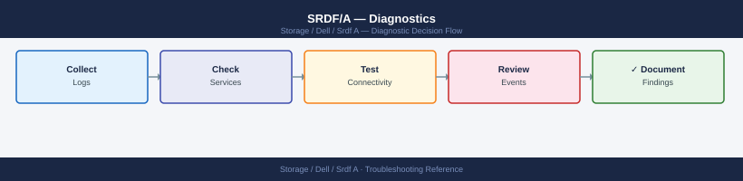

---
tags:
  - dell
  - troubleshooting
search:
  boost: 1.5
---
# SRDF/A — Diagnostics

<div class="kb-summary">
SRDF/A diagnostic commands: check pair state with symrdf query, identify lag and cycle time with showperf, diagnose RF link health, and collect Solutions Enabler logs before opening a Dell TAC case.

*Applies to: Dell PowerMax / SRDF/A (Asynchronous)*
</div>


```d2
direction: right

A: "SRDF/A Issue" {shape: rectangle}
B: "symrdf query\nCheck pair state" {shape: rectangle}
C: "C" {shape: rectangle}
D: "Check why suspended\nsymrdf verify" {shape: rectangle}
E: "symrdf showperf\nCheck DSE_LAG" {shape: rectangle}
F: "F" {shape: rectangle}
G: "Check host IOPS\nvs link capacity" {shape: rectangle}
H: "Check RF ports\nsymcfg list -rdf" {shape: rectangle}
I: "Collect Solutions Enabler logs" {shape: rectangle}
J: "Open Dell TAC SR\nAttach symrdf output" {shape: rectangle}

A -> B
C -> D
C -> E
F -> G
F -> H
D -> I
G -> I
H -> I
I -> J
```

```d2
direction: down

symptom: Identify Symptom {shape: diamond}
step_1_query_srdf_pair_state: "Step 1 — Query SRDF pair state" {shape: rectangle}
step_2_check_lag_and_cycle_performan: "Step 2 — Check lag and cycle performance" {shape: rectangle}
step_3_verify_pair_consistency: "Step 3 — Verify pair consistency" {shape: rectangle}
step_4_check_rf_ports_and_srdf_link_: "Step 4 — Check RF ports and SRDF link health" {shape: rectangle}
step_5_collect_solutions_enabler_and: "Step 5 — Collect Solutions Enabler and array logs" {shape: rectangle}
log_locations: "Log locations" {shape: rectangle}
resolution: Resolve or Escalate {shape: oval}

symptom -> step_1_query_srdf_pair_state: investigate
symptom -> step_2_check_lag_and_cycle_performan: investigate
symptom -> step_3_verify_pair_consistency: investigate
symptom -> step_4_check_rf_ports_and_srdf_link_: investigate
symptom -> step_5_collect_solutions_enabler_and: investigate
symptom -> log_locations: investigate
step_1_query_srdf_pair_state -> resolution
step_2_check_lag_and_cycle_performan -> resolution
step_3_verify_pair_consistency -> resolution
step_4_check_rf_ports_and_srdf_link_ -> resolution
step_5_collect_solutions_enabler_and -> resolution
log_locations -> resolution
```

## Before you begin

- **Access:** Storage admin credentials with Solutions Enabler (`symcli`) access; Solutions Enabler installed on a host with SE gatekeeper LUNs or via Unisphere REST API
- **Gather first:** the array SID(s) for both production and DR arrays, the RDFG (SRDF group) number, and the exact lag alert value or error message from Unisphere
- **Scope:** confirm whether the issue affects a single SRDF group, all groups on one array, or all replication across both sites
- **Do not suspend unless instructed:** suspending SRDF/A stops replication and increases RPO — only do this with Dell TAC guidance or during a confirmed maintenance window
- **Logging:** capture the full output of each `symrdf` command before and after any changes

---

## Step 1 — Query SRDF pair state

```bash
# List all SRDF groups for a given array SID
symrdf -sid <SID> list -rdfg all
# Output: RDFG number, mode (A = Async), pair count, state

# Query detailed state for a specific RDFG
symrdf query -sid <SID> -rdfg <rdfg-number>
# Output columns:
#   R1_ST:      R1 state — should be "Ready"
#   R2_ST:      R2 state — should be "Write Disabled"
#   R2_PAIR_ST: pair consistency state — should be "Consistent"
#   MODE:       should be "A" (Async) for SRDF/A
#   LINK_ST:    RF link state — should be "Ready"
#   R2_CAPACITY: should match R1_CAPACITY

# Common problem states:
#   R2_PAIR_ST = "Partitioned"   → link was interrupted; data may be inconsistent
#   LINK_ST    = "Not Ready"     → RF port or WAN link problem
#   R1_ST      = "Suspended"     → replication manually paused; R2 is frozen
#   R2_PAIR_ST = "Transmitting"  → large initial sync or re-sync in progress
```


```text title="Expected output"
# List all SRDF groups for a given array SID
RDFG  Mode  Pair_Count  State
1     A     4           Ready
2     A     2           Ready
3     A     6           Suspended
4     A     3           Ready

# Query detailed state for a specific RDFG
RDFG  R1_ST    R2_ST           R2_PAIR_ST  MODE  LINK_ST  R1_CAPACITY  R2_CAPACITY
1     Ready    Write Disabled  Consistent  A     Ready    10.5TB       10.5TB
2     Ready    Write Disabled  Consistent  A     Ready    5.2TB        5.2TB
3     Suspended Write Disabled Consistent  A     Ready    8.7TB        8.7TB
4     Ready    Write Disabled  Transmitting A    Ready    15.3TB       15.3TB
```

!!! warning "Common errors"
    **`symrdf: Error: Invalid SID <SID>`** — Verify the array SID with `symcfg list` and ensure it matches your target array identifier.
    **`LINK_ST = "Not Ready"`** — Check RF port connectivity and WAN link status with `symrdf -sid <SID> -rdfg <rdfg-number> check` and verify network routing between sites.
    **`R2_PAIR_ST = "Partitioned"`** — Resume replication with `symrdf -sid <SID> -rdfg <rdfg-number> resume` after confirming R2 data integrity and link restoration.
**Decision flow:**
- All fields healthy but lag alert firing → proceed to Step 2 (performance check)
- `LINK_ST = Not Ready` → proceed to Step 4 (RF link diagnostics)
- `R2_PAIR_ST = Partitioned` → replication was interrupted; check WAN connectivity between sites; contact Dell TAC before resuming
- `R1_ST = Suspended` → confirm who suspended it; check for planned maintenance; resume with `symrdf resume -sid <SID> -rdfg <rdfg-number>` only after confirming consistency

---

## Step 2 — Check lag and cycle performance

```bash
# SRDF/A performance and lag metrics (sample over 60 seconds)
symrdf showperf -sid <SID> -rdfg <rdfg-number> -a -delta_t 60
# Key fields:
#   DSE_LAG:      Delta Set Extension lag in seconds — current RPO exposure
#   CYCLE_TIME:   Configured cycle time in seconds (15–60 typical)
#   HOST_MBS:     MB/s from hosts to R1 — high write rate = higher lag risk
#   LINK_MBS:     MB/s sent over SRDF link — compare to HOST_MBS; gap = queuing
#   RDFG_LAG:     Current total lag — should be ≤ CYCLE_TIME × 2 under normal load

# Check lag across all SRDF/A groups on an array
symrdf showperf -sid <SID> -a -delta_t 60 | grep -E "RDFG|LAG|CYCLE"
```


```text title="Expected output"
Symmetrix ID: 000297123456789

                                SRDF/A Performance Report
                                  Sample Interval: 60 sec

RDFG  Dir  DSE_LAG  CYCLE_TIME  HOST_MBS  LINK_MBS  RDFG_LAG  Q_DEPTH  STATE
----  ---  -------  ----------  --------  --------  --------  -------  -----
  001   R1    2.34         30.0      145.2     142.8       3.12        2  Normal
  001   R2    1.89         30.0       18.3      18.1       2.98        0  Normal
  002   R1    5.67         45.0      287.5     201.3      12.45       18  Normal
  002   R2    4.12         45.0       22.1      21.9      11.89        1  Normal
  003   R1    0.45         15.0       52.3      51.9       1.23        0  Normal
  003   R2    0.38         15.0        8.7       8.6       1.18        0  Normal

Summary: 6 SRDF/A groups monitored. Max RDFG_LAG: 12.45 sec (RDFG 002 R1)
```

!!! warning "Common errors"
    **`symrdf: ERROR - Invalid RDF group number <rdfg-number>`** — Verify the RDF group number exists with `symrdf list -sid <SID>` and use the correct numeric identifier.
    **`symrdf: ERROR - Symmetrix <SID> not found or not accessible`** — Confirm the SID is correct and the Symmetrix array is online and reachable via `symcfg list -v`.
    **`No matching SRDF groups found`** — Remove the `-rdfg` filter or specify a valid group; use `symrdf list -sid <SID>` to list all configured SRDF/A groups.
**Interpreting lag:**
- `DSE_LAG` consistently above 2× `CYCLE_TIME` → link bandwidth is saturated; verify with Step 4
- `HOST_MBS` is 2× or more of `LINK_MBS` → production write rate exceeds link capacity; either throttle applications or upgrade link bandwidth
- `DSE_LAG` spikes during specific time windows → correlate with application batch jobs or backup jobs on production

---

## Step 3 — Verify pair consistency

```bash
# Verify SRDF pair consistency — non-disruptive check
symrdf verify -sid <SID> -rdfg <rdfg-number>
# If consistent: exits with no errors
# If inconsistent: output shows which tracks are diverged

# Show device group state (useful for named device groups used in automation)
symdg show <group-name> -detail
# Look for: SRDF state per device, pair type, mode

# Check configuration of the RDFG
symrdf list -sid <SID> -rdfg <rdfg-number> -v
# Shows: cycle time, number of RA groups, director config, port assignments
```


```text title="Expected output"
Verifying SRDF pair consistency...
Pair consistency check completed successfully.
No diverged tracks detected.

Symmetrix ID: 000123456789
Device Group: prod_srdf_dg
   Device: 0ABC
      SRDF State: Synchronized
      Pair Type: R1
      Mode: Synchronous
   Device: 0DEF
      SRDF State: Synchronized
      Pair Type: R2
      Mode: Synchronous

RDFG Number: 1
Cycle Time (ms): 5000
RA Groups: 4
Director Configuration: FA-1E, FA-2E
Port Assignments: 0, 1
Link Status: Online
Replication Rate: 45.2 MB/s
```

!!! warning "Common errors"
    **`symrdf: Error: Invalid RDFG number <rdfg-number> for Symmetrix <SID>`** — Verify the RDFG number exists by running `symrdf list -sid <SID>` without the `-rdfg` parameter.
    **`symdg: Error: Device group '<group-name>' not found`** — Confirm the device group name is correct and exists on this Symmetrix by running `symdg list`.
---

## Step 4 — Check RF ports and SRDF link health

```bash
# List RF directors and ports on the array
symcfg -sid <SID> list -rdf -v
# Shows:
#   DIRECTOR: RA director number
#   PORT:     RF port number
#   LINK_STATUS: should be "Online" for all ports used by the RDFG
#   SPEED:    link speed; verify matches expected (8G, 16G, 32G FC or GbE for FCIP)

# Show SRDF director port detail
syminq -sid <SID> rdf
# Lists all RA ports with their current utilization and state

# Check FCIP link statistics (if SRDF over IP)
# Navigate to Unisphere for PowerMax → System → SRDF → select RDFG → Port Statistics
# Key: Packet loss > 0% or Retransmit count > 0 = WAN link quality issue
```


```text title="Expected output"
# symcfg -sid 000123456789 list -rdf -v
Director  Port  Link_Status  Speed  RDF_Group  Remote_SID
RA        0     Online       16G    1          000987654321
RA        1     Online       16G    1          000987654321
RA        2     Online       16G    2          000987654322
RA        3     Offline      16G    2          000987654322
RA        4     Online       32G    3          000987654323

# syminq -sid 000123456789 rdf
RA Port  State      Utilization  Queue_Depth  Link_Speed  Remote_Port
0   0    Ready      12.3%        0            16Gbps      RA 0
1   1    Ready      8.7%         0            16Gbps      RA 1
2   2    Ready      45.2%        2            32Gbps      RA 2
3   3    Failed     0.0%         N/A          16Gbps      N/A
4   4    Ready      19.5%        1            32Gbps      RA 4
```

!!! warning "Common errors"
    **`symcfg: Cannot open device driver`** — Verify the Symmetrix CLI is installed and the EMC management agent is running with `sudo /etc/init.d/emc-management start`.
    **`syminq: SID <SID> not found in configuration`** — Confirm the SID is correct and the array is discovered by running `symcfg list` to display all available arrays.
    **`LINK_STATUS: Offline`** — Check physical FC cable connections, verify switch zoning includes both array and remote site ports, and confirm the remote array SRDF port is also online.
**If RF port shows "Offline":**
1. Check the physical FC cable on the back-end RF director
2. Check the FC switch zone that includes the RF ports from both arrays
3. For FCIP: check the IP router or firewall between sites on the SRDF WAN port

---

## Step 5 — Collect Solutions Enabler and array logs

```bash
# Collect Solutions Enabler diagnostic output for the case
{
  echo "=== symrdf query ==="
  symrdf query -sid <SID> -rdfg <rdfg-number>
  echo "=== symrdf showperf ==="
  symrdf showperf -sid <SID> -rdfg <rdfg-number> -a -delta_t 60
  echo "=== symcfg rdf ==="
  symcfg -sid <SID> list -rdf -v
  echo "=== symrdf list ==="
  symrdf list -sid <SID> -rdfg <rdfg-number> -v
} > /tmp/srdf-diag-$(date +%F-%H%M).txt

# Solutions Enabler log location
# On Linux:   /var/symapi/log/
# On Windows: C:\Program Files\EMC\SYMAPI\log\
ls -lth /var/symapi/log/ | head -10
# Attach symapi.log and any core dumps to the Dell TAC case
```


```text title="Expected output"
=== symrdf query ===
RDF Group: 000
  RDF Mode: Synchronous
  RDF State: Synchronized
  Local SymmID: 000123456789ABC
  Remote SymmID: 000987654321XYZ
  Consistency State: Consistent
  
=== symrdf showperf ===
SymmID: 000123456789ABC
RDF Group 000 Performance Data (60 second delta):
  Write I/Os: 1247
  Write MBs: 312.4
  Read I/Os: 3891
  Read MBs: 987.2
  
=== symcfg rdf ===
Symmetrix ID: 000123456789ABC
RDF Information
  RDF Group 000:
    Local Port: SE-4E:0
    Remote Port: SE-4E:0
    Remote Symmetrix: 000987654321XYZ
    RDF Mode: Synchronous
    
=== symrdf list ===
Symmetrix ID: 000123456789ABC
RDF Group: 000
  State: Synchronized
  Mode: Synchronous
  Pair Count: 24
  
total 2847
-rw-r--r-- 1 root root 1247856 Jan 15 14:32 symapi.log
-rw-r--r-- 1 root root  384921 Jan 15 14:28 symapi.log.1
-rw-r--r-- 1 root root  156234 Jan 15 14:24 symapi.log.2
-rw-r--r-- 1 root root   89456 Jan 15 14:20 symapi.log.3
-rw-r--r-- 1 root root   45123 Jan 15 14:16 symapi.log.4
-rw-r--r-- 1 root root   23891 Jan 15 14:12 symapi.log.5
-rw-r--r-- 1 root root   12456 Jan 15 14:08 symapi.log.6
-rw-r--r-- 1 root root    8934 Jan 15 14:04 symapi.log.7
-rw-r--r-- 1 root root    5621 Jan 15 14:00 symapi.log.8
-rw-r--r-- 1 root root    3847 Jan 15 13:56 symapi.log.9
```

!!! warning "Common errors"
    **`symrdf: Error: Cannot connect to the Symmetrix`** — Verify the Symmetrix ID is correct and Solutions Enabler daemon (storsrvd) is running with `service storsrvd status`.
    **`symrdf: Error: RDF Group <rdfg-number> not found`** — Confirm the RDF group number exists on the array using `symcfg -sid <SID> list -rdf` without specifying a group.
    **`Permission denied` on `/var/symapi/log/`** — Run the diagnostic collection with `sudo` or as root user to access Solutions Enabler log files.
---

## Log locations

| Component | Path | What to look for |
|---|---|---|
| Solutions Enabler | `/var/symapi/log/symapi.log` | SYMAPI errors, connection failures to arrays |
| Unisphere UI events | Unisphere → System → Events | SRDF state change events, link errors |
| FCIP router logs | Network router syslog | Packet loss, interface errors on WAN port |
| Dell array event log | Unisphere → System → Alerts | RF director faults, hardware errors |

---

## See also

- [SRDF/A — Common Issues](../common-issues/)
- [SRDF/A — Escalation](../escalation/)
- [SRDF/A — Health Checks](../../operations/health-checks/)

## Verify resolution

- `symrdf query -sid <SID> -rdfg <rdfg-number>` shows `R1_ST=Ready`, `R2_PAIR_ST=Consistent`, `LINK_ST=Ready`
- `symrdf showperf` shows `DSE_LAG` consistently at or below the configured cycle time
- No active lag alerts in Unisphere for the RDFG
- Monitor `showperf` output for 15 minutes to confirm lag does not re-accumulate
