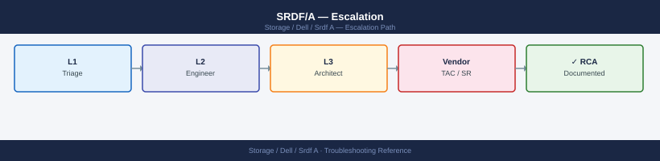
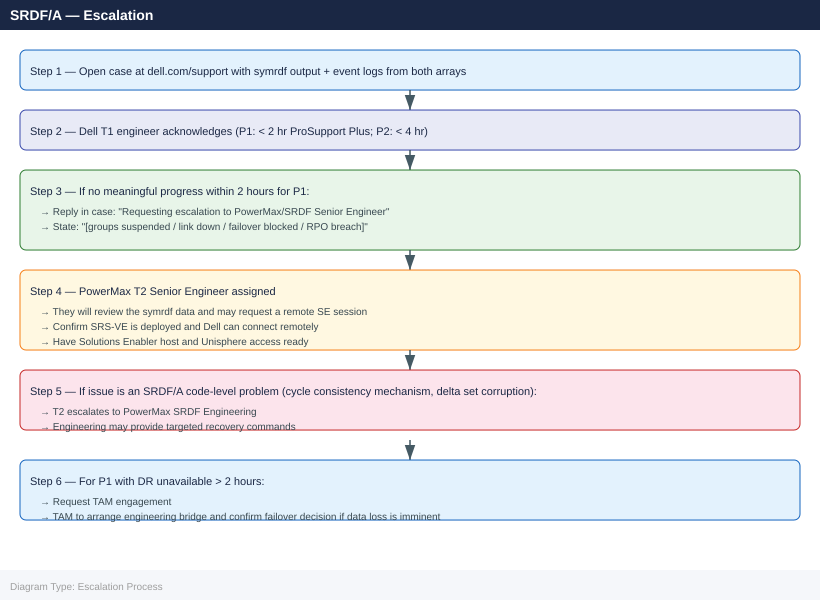

---
tags:
  - dell
  - troubleshooting
search:
  boost: 1.5
description: "How to escalate Dell SRDF/A (Symmetrix Remote Data Facility Asynchronous) replication issues to Dell Technologies support: what data to collect, how to..."
---
# SRDF/A — Escalation

<div class="kb-summary">
How to escalate Dell SRDF/A (Symmetrix Remote Data Facility Asynchronous) replication issues to Dell Technologies support: what data to collect, how to capture symrdf diagnostics, step-by-step case creation on dell.com/support, and the escalation path when progress stalls.

*Applies to: SRDF/A on PowerMax 2500 / 8500 running PowerMaxOS 10.x*
</div>



---

```d2
direction: down

symptom: Identify Symptom {shape: diamond}
preescalation_selfcheck: "Pre-Escalation Self-Check" {shape: rectangle}
stepbystep_data_collection: "Step-by-Step Data Collection" {shape: rectangle}
how_to_open_the_case_on_dellcomsuppo: "How to Open the Case on dell.com/support" {shape: rectangle}
escalation_path: "Escalation Path" {shape: rectangle}
what_not_to_do: "What NOT to Do" {shape: rectangle}
useful_commands_for_case_updates: "Useful Commands for Case Updates" {shape: rectangle}
resolution: Resolve or Escalate {shape: oval}

symptom -> preescalation_selfcheck: investigate
symptom -> stepbystep_data_collection: investigate
symptom -> how_to_open_the_case_on_dellcomsuppo: investigate
symptom -> escalation_path: investigate
symptom -> what_not_to_do: investigate
symptom -> useful_commands_for_case_updates: investigate
preescalation_selfcheck -> resolution
stepbystep_data_collection -> resolution
how_to_open_the_case_on_dellcomsuppo -> resolution
escalation_path -> resolution
what_not_to_do -> resolution
useful_commands_for_case_updates -> resolution
```

## Before you begin

- **Access required:** Solutions Enabler (symcli) on a host connected to the production PowerMax; Unisphere access (admin credentials) for both arrays; Dell support account at dell.com/support linked to both array serial numbers
- **Both arrays required:** SRDF/A issues require data from both R1 (production) and R2 (DR) arrays — capture `symrdf` output and `symevent` from both SIDs
- **Do NOT run `symrdf failover`** without Dell direction — an SRDF/A failover makes R2 read-write; in a suspended state, R2 may not have the latest write cycle; the data gap must be confirmed before any failover decision
- **Do NOT use `--force` flags** on symrdf commands without Dell guidance — force flags on SRDF bypass consistency checks and can leave SRDF groups in an unrecoverable state

---

## Pre-Escalation Self-Check

Run these before opening the case.

| Check | Command | Expected result |
|---|---|---|
| Production SID | `symcfg list` | Note 12-digit Symmetrix ID for R1 array |
| DR SID | `symcfg list` (on DR-side SE host) | Note 12-digit Symmetrix ID for R2 array |
| SRDF group states | `symdf list -sid <R1-SID>` | All groups in Synchronized or Consistent state |
| SRDF pair state detail | `symrdf query -g <group>` | Pair state: Synchronized; R1/R2 state: Ready/WriteDisabled |
| RDF director ports | `symcfg -sid <SID> list -ra all` | All RDF directors Online |
| WAN link bandwidth | Unisphere → SRDF → Performance | Replication link utilized but not saturated |
| Recent events | `symevent -sid <SID> list -last 100` | No SRDF-related FAULT or CRITICAL events |

---

## Step-by-Step Data Collection

### 1. Get array serial numbers and Solutions Enabler version

```bash
# On the production SE host

# Both registered arrays
symcfg list

# Solutions Enabler version
symcli -version

# Microcode version on R1
symcfg -sid <R1-SID> show | grep -i microcode
```


```text title="Expected output"
SE_SYMMETRIX_0001 (Symmetrix ID: 000123456789012)
SE_SYMMETRIX_0002 (Symmetrix ID: 000987654321098)

Solutions Enabler Version: 9.2.1.0 (Build 123)

Microcode Version: 5978.221.221
```

!!! warning "Common errors"
    **`symcfg: Command not found`** — Verify Solutions Enabler is installed and the symcli binary path is in your $PATH, or source the SE environment setup script.
    **`Error: Cannot connect to Symmetrix <R1-SID>`** — Confirm the array SID is correct and the SE daemon (symcfg) is running with `sudo /opt/emc/SYMCLI/bin/symcfg -daemon start`.
### 2. Capture SRDF group and pair state

```bash
# All SRDF groups on the R1 array
symdf list -sid <R1-SID> > /tmp/srdf-groups-$(date +%Y%m%d%H%M).txt

# Detailed state of all affected SRDF groups
for GROUP in $(symdf list -sid <R1-SID> | grep -v '^-' | awk '{print $1}' | grep '^[0-9]'); do
  echo "=== Group $GROUP ===" >> /tmp/srdf-detail-$(date +%Y%m%d%H%M).txt
  symrdf query -g $GROUP -v >> /tmp/srdf-detail-$(date +%Y%m%d%H%M).txt
done

# RDF director status on both arrays
symcfg -sid <R1-SID> list -ra all > /tmp/srdf-rdf-ports-$(date +%Y%m%d).txt
symcfg -sid <R2-SID> list -ra all >> /tmp/srdf-rdf-ports-$(date +%Y%m%d).txt
```


```text title="Expected output"
Symmetrix ID: 000123456789012
                                SRDF/A Groups
Group  Type  R1 Dev  R2 Dev  R1 State  R2 State  Link State  Consistency
    0  RDF1   10000   10000  Synchronized  Synchronized  OK  Consistent
    1  RDF1   20000   20000  Synchronized  Synchronized  OK  Consistent
    2  RDF1   30000   30000  Synchronized  Synchronized  OK  Consistent
    3  RDF1   40000   40000  Synchronized  Synchronized  OK  Consistent

=== Group 0 ===
Group ID: 0
R1 Symmetrix ID: 000123456789012
R2 Symmetrix ID: 000987654321098
R1 State: Synchronized
R2 State: Synchronized
Link State: OK
Consistency: Consistent
RDF Mode: Synchronous
...

RDF Director Status for Symmetrix 000123456789012:
Dir  Port  Link State  Remote Dir  Remote Port  Bandwidth
SE-1F  0  OK  SE-2F  0  8 Gbps
SE-1F  1  OK  SE-2F  1  8 Gbps
SE-1G  0  OK  SE-2G  0  8 Gbps

RDF Director Status for Symmetrix 000987654321098:
Dir  Port  Link State  Remote Dir  Remote Port  Bandwidth
SE-2F  0  OK  SE-1F  0  8 Gbps
SE-2F  1  OK  SE-1F  1  8 Gbps
SE-2G  0  OK  SE-1G  0  8 Gbps
```

!!! warning "Common errors"
    **`SYMAPI_C_PROC_FAILURE (29) : Could not connect to the Symmetrix`** — Verify the R1-SID and R2-SID values are correct and the Symmetrix arrays are reachable via the management network.
    **`No such file or directory`** — Ensure /tmp directory has write permissions and sufficient free space (check with `df -h /tmp`).
    **`symdf: Command not found`** — Confirm EMC Solutions Enabler (SE) is installed and the symcli binaries are in your PATH (add `/opt/emc/SYMCLI/bin` to PATH if needed).
### 3. Capture the event log from both arrays

```bash
# Last 500 events from the production array (R1)
symevent -sid <R1-SID> list -last 500 > /tmp/srdf-events-r1-$(date +%Y%m%d).txt

# Last 500 events from the DR array (R2)
symevent -sid <R2-SID> list -last 500 > /tmp/srdf-events-r2-$(date +%Y%m%d).txt

# Filter for SRDF-related events
grep -iE "SRDF|RDF|replication|suspend|fault" /tmp/srdf-events-r1-$(date +%Y%m%d).txt
```


```text title="Expected output"
/tmp/srdf-events-r1-20240115.txt
/tmp/srdf-events-r2-20240115.txt
01/15/2024 14:32:18 - SRDF - RDF Link Recovered - R1 (000123456789ABCD) - Severity: Warning
01/15/2024 14:28:45 - SRDF - Replication Suspended - R1 (000123456789ABCD) - Severity: Critical
01/15/2024 14:15:22 - RDF - Link Fault Detected - R1 (000123456789ABCD) - Severity: Critical
01/15/2024 13:47:09 - SRDF - Replication Resume - R1 (000123456789ABCD) - Severity: Info
01/15/2024 13:22:31 - RDF - Synchronization Complete - R1 (000123456789ABCD) - Severity: Info
01/15/2024 12:55:14 - SRDF - Suspend Initiated - R1 (000123456789ABCD) - Severity: Warning
```

!!! warning "Common errors"
    **`symevent: Error: Invalid SID <R1-SID>`** — Replace `<R1-SID>` and `<R2-SID>` with actual 12-character symmetrix IDs (e.g., `000123456789`).
    **`grep: /tmp/srdf-events-r1-20240115.txt: No such file or directory`** — Ensure the first two symevent commands complete successfully and verify the user has write permissions to `/tmp`.
### 4. Capture SRDF link performance and WAN state

```bash
# RDF group performance stats (bandwidth and latency)
symrdf -g <group-number> -sid <R1-SID> perf summary

# Check the SRDF/A cycle time and current lag
symrdf query -g <group> -v | grep -iE "cycle|lag|delta|consistent"

# FCIP link state (if SRDF uses FCIP)
symcfg -sid <R1-SID> list -ra all | grep -i "fcip\|iscsi"
```


```text title="Expected output"
Symmetrix ID: 000297123456789
                                    RDF Group 001
                                    ============
Concurrent I/O Count        :    1247
Total I/O Count             :    892156
Read I/O Count              :    445078
Write I/O Count             :    447078
Total MB Read               :    156234.5
Total MB Written            :    167891.2
Average Read Latency (ms)   :    12.34
Average Write Latency (ms)  :    14.67
Current Bandwidth (MB/s)    :    89.45

RDF Cycle Time              :    2000 ms
Current Lag                 :    1247 tracks
Delta Set Size              :    2048 MB
Consistency State           :    Consistent

RA Port  Link State  Protocol  Remote IP       Status
FA-1E   Online      FCIP      192.168.100.45  Active
FA-2E   Online      FCIP      192.168.100.46  Active
```

!!! warning "Common errors"
    **`Error: Invalid group number <group-number>`** — Replace `<group-number>` with the actual RDF group ID (e.g., `001` or `1`).
    **`Error: Symmetrix ID <R1-SID> not found`** — Verify the R1 Symmetrix SID is correct by running `symcfg list -v` to confirm the array serial number.
    **`No matching records found`** — Ensure SRDF/A is configured and the RDF group is in a valid state; check with `symrdf list -v` to confirm group existence.
### 5. Write the timeline

```text
R1 array: PowerMax 8500, SID: 000XXXXXXXXXX (production, Site A)
R2 array: PowerMax 2500, SID: 000YYYYYYYYYY (DR, Site B)
PowerMaxOS: 10.1.0.2 (both)
Solutions Enabler: 10.1.0.18
SRDF configuration: SRDF/A async; 3 RDF groups (Group 1: Oracle, Group 2: SAP, Group 3: SQL)
Cycle time: 30 seconds; expected RPO: < 60 seconds
SRDF link: FCIP 10 Gbps over MPLS between Site A and Site B
Issue first observed: 2026-06-15 11:00 UTC
Last confirmed sync cycle: 2026-06-15 10:30 UTC (30-minute gap so far)
Changes in 24h before the issue:
  - 10:30: MPLS circuit maintenance; brief interruption
  - 11:00: symdf list: all 3 SRDF groups now show "Suspended"
  - 11:05: Unisphere alert: "SRDF Group 1: link error — cycle abandoned"
  - 11:10: R2 array read-write disabled on all SRDF devices; DR inaccessible
Steps already taken:
  - Did NOT run symrdf failover
  - Did NOT run symrdf establish (resync)
  - MPLS circuit restored at 10:45 but groups remain Suspended
  - symrdf query -g 1: Pair state = Suspended; R1 state = Ready; R2 state = WriteDisabled
Blast radius: DR completely unavailable; R2 volumes not accepting writes; RPO growing (currently ~30 min)
```

---

## How to Open the Case on dell.com/support

1. Go to **dell.com/support** and sign in with your Dell account.

2. Click **My Cases** → **Create New Case**.

3. Under **Product**, enter the R1 (production) array serial number (12-digit Symmetrix ID). Select **Dell PowerMax** as the product family.

4. Under **Severity**, select:
   - **Severity 1 — Production Down**: All SRDF groups suspended and DR is completely unavailable; a failover is required but R2 volumes cannot be made read-write; replication link has been down for more than RPO; data loss has already occurred with growing gap
   - **Severity 2 — Degraded**: SRDF/A lag is growing and approaching RPO; some SRDF groups suspended but others are replicating; resync is failing after a maintenance window; workaround is partial
   - **Severity 3 — Non-Critical**: A single SRDF group is suspended; others are healthy; replication is active at reduced performance; workaround exists
   - **Severity 4 — General**: How-to, SRDF/A cycle time tuning, WAN bandwidth planning, DR test procedure

5. In the **Summary** field: symptom + scope. Example: `PowerMax 8500 SRDF/A — 3 RDF groups suspended after MPLS maintenance, DR site not receiving cycles, RPO breach growing`.

6. In the **Description** field, paste:
   - R1 and R2 SIDs and PowerMaxOS versions
   - `symdf list` output from Step 2
   - The key `symrdf query` result (pair state, R1/R2 state)
   - The event log SRDF-related entries from Step 3
   - The timeline from Step 5

7. Under **Attachments**, upload:
   - `srdf-groups-*.txt` and `srdf-detail-*.txt` from Step 2
   - `srdf-events-r1-*.txt` and `srdf-events-r2-*.txt` from Step 3

8. Click **Submit**. You receive a case number immediately.

9. **Severity 1 only:** call Dell support after submission:
    - North America: +1 800 945 3355 (24×7 for production-down)
    - State "Severity 1 — SRDF/A all groups suspended, DR not receiving cycles, RPO breach, case XXXXXXXX" at the start of the call.

---

## Escalation Path



---

## What NOT to Do

| Do NOT do this | Why | What to do instead |
|---|---|---|
| Run `symrdf failover` without Dell confirming the R2 state | An SRDF/A failover makes R2 read-write; in a suspended state, R2 may not contain the last committed write cycle; failing over prematurely locks in the data gap | Let Dell confirm the last consistent R2 cycle time and the exact data gap before any failover decision |
| Run `symrdf establish` (resync) without Dell direction | Establishing re-sends all data from R1 to R2; on large SRDF groups this can take hours and extends the DR gap during the sync; in some states it can widen the gap by overwriting R2 with an older R1 image | Let Dell assess whether an establish or an incremental resync is appropriate for the current pair state |
| Use `--force` flags on symrdf commands | Force flags bypass SRDF consistency checks; on an SRDF/A group these can destroy the cycle consistency mechanism and make the group unrecoverable | Only use --force on Dell's explicit instruction with the full command provided |
| Split an SRDF group to "free" R2 for temporary access | Splitting makes R2 read-write but permanently breaks the replication relationship; restore requires a full resync | Only split if Dell confirms that no resync from the current state is possible |
| Make any changes to R1 production volumes or masking views during a suspended state | Changes to production during an SRDF suspension affect the data that needs to be synced when replication resumes | Freeze all storage changes on R1 until SRDF resumes replication |

---

## Useful Commands for Case Updates

```bash
# Run on Solutions Enabler host with R1 connectivity — paste into every case update

# SRDF group states (all groups)
symdf list -sid <R1-SID>

# Detailed pair state for affected group
symrdf query -g <group-number> -v | head -30

# RDF director states
symcfg -sid <R1-SID> list -ra all | grep -E "ONLINE|OFFLINE"

# Recent SRDF events (last 20)
symevent -sid <R1-SID> list -last 20 | grep -iE "SRDF|RDF|suspend|fault"
```


```text title="Expected output"
Symmetrix ID: 000123456789ABC
SRDF Group 0: RDF1 <-> RDF2 (Synchronous)
  State: Synchronized
  Link State: Online
  Pair Count: 47

SRDF Group 1: RDF3 <-> RDF4 (Asynchronous)
  State: Synchronized
  Link State: Online
  Pair Count: 23

Symmetrix ID: 000987654321XYZ
SRDF Group 5: RDF1 <-> RDF2 (Synchronous)
  State: Suspended
  Link State: Offline
  Pair Count: 12

---

Pair State for Group 0:
  R1 Dev  R2 Dev  State        RDF Mode    Link State
  000001  000001  Synchronized Synchronous Online
  000002  000002  Synchronized Synchronous Online
  000003  000003  Suspended    Synchronous Offline
  000004  000004  Synchronized Synchronous Online
  ...

---

RDF Director States:
  Director 4e ONLINE
  Director 4f ONLINE
  Director 5e OFFLINE
  Director 5f ONLINE

---

Timestamp            Event Type    Symmetrix ID      Message
2024-01-15 14:32:18  SRDF_SUSPEND  000123456789ABC  SRDF pair suspended on group 0
2024-01-15 13:47:05  RDF_LINK_DOWN 000123456789ABC  RDF link offline: director 5e
2024-01-15 13:46:52  SRDF_FAULT    000123456789ABC  Pair 000003 fault detected
2024-01-15 12:15:33  RDF_LINK_UP   000123456789ABC  RDF link online: director 5f
```

!!! warning "Common errors"
    **`SYMCLI_LIB_CALL_FAILED: Cannot connect to the Solutions Enabler daemon`** — Verify the Solutions Enabler service is running with `sudo /opt/emc/SYMCLI/bin/stordaemon start` and confirm R1 connectivity.
    **`Invalid Symmetrix ID: <R1-SID>`** — Replace `<R1-SID>` with the actual R1 array SID from `symcfg list` output.
    **`SRDF group <group-number> not found`** — Confirm the group number exists by running `symdf list -sid <R1-SID>` first to list all valid groups.
---

## Support SLA Reference

| Tier | Severity | Definition | Initial Response SLA |
|---|---|---|---|
| ProSupport Plus | P1 — Production Down | All SRDF groups suspended; DR unavailable; failover blocked; data loss growing | < 2 hours (24×7) |
| ProSupport Plus | P2 — Degraded | SRDF lag growing; some groups suspended; resync failing; RPO at risk | < 4 hours (24×7) |
| ProSupport Plus | P3 — Non-Critical | Single group suspended; others healthy; workaround exists | Next business day |
| ProSupport Plus | P4 — General | How-to, cycle tuning, WAN bandwidth planning | Next business day |
| ProSupport | P1 | As above | < 4 hours (24×7) |

---

## See also

- [SRDF/A — Diagnostics](../diagnostics/)
- [SRDF/A — Common Issues](../common-issues/)

---

## Verify resolution

- Run `symdf list -sid <R1-SID>` and confirm all SRDF groups show Synchronized or Consistent state
- Run `symrdf query -g <group>` for each group and confirm R1 state = Ready, R2 state = WriteDisabled, pair state = Synchronized
- Confirm the SRDF/A cycle is completing: run `symrdf query -g <group> -v` and confirm the cycle time matches the configured interval
- Run `symevent -sid <R1-SID> list -last 50` and confirm no new SRDF FAULT or CRITICAL events
- Check the SRDF/A lag is back within the RPO target in Unisphere → SRDF → Performance
- Monitor SRDF group state for 15 minutes to confirm no groups transition to Suspended again
