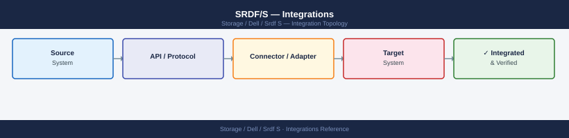
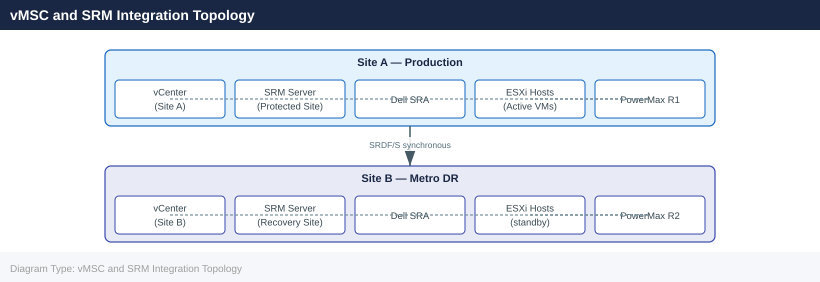

---
tags:
  - architecture
  - dell
description: "SRDF/S integrations: SRDF/Star three-site topology, Microsoft Cluster Services with SRDF/S, Oracle RAC extended cluster, and VMware Metro Storage Cluster."
---
# SRDF/S — Integrations

<div class="kb-summary">
SRDF/S integrations: SRDF/Star three-site topology, Microsoft Cluster Services with SRDF/S, Oracle RAC extended cluster, and VMware Metro Storage Cluster.

*Applies to: SRDF/S*
</div>


---

## vMSC and SRM Integration Topology



---

## Backup from R2

To offload backup I/O from production (R1), take SnapVX snapshots on the R2 side:

```bash
symsnap -sid <target_SID> -sg <sg_name> create -name BACKUP_$(date +%Y%m%d) -ttl 3
# Mount the linked copy to a backup proxy server
symsnap -sid <target_SID> -sg <sg_name> link -name BACKUP_$(date +%Y%m%d) -lnsg <proxy_sg>
```


```text title="Expected output"
Creating snapshot BACKUP_20240315...
Snapshot BACKUP_20240315 created successfully on SID 000123456789
TTL set to 3 days
Snapshot state: Established

Linking snapshot BACKUP_20240315 to proxy storage group...
Link operation initiated for storage group PROXY_SG_001
Synchronization in progress: 45%
Link completed successfully
Linked copy now available on proxy host: backup-proxy-01.corp.local
```

!!! warning "Common errors"
    | Error | Fix |
    |---|---|
    | `SYMAPI Error (18) : Could not open the Symmetrix` | Verify the target SID is correct and the Symmetrix is reachable; check `symcfg list` to confirm SID availability. |
    | `Error: Storage Group <sg_name> not found` | Confirm the storage group name matches exactly (case-sensitive) using `symsg list -sid <target_SID>`. |
    | `Error: Insufficient space in target device group` | Ensure the proxy storage group has adequate free capacity; check available space with `symcapacity -sid <target_SID> -sg <proxy_sg>`. |
Note: always snapshot the R2 while it is in `Synchronized` state to ensure consistency.

---

## See also

- [Srdf S — How It Works](../how-it-works/)
- [Srdf S — Design Standards](../design-standards/)
