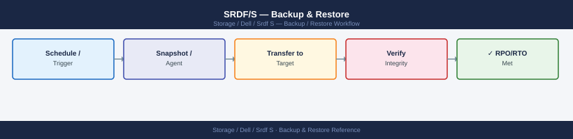

---
tags:
  - dell
  - operations
---
# SRDF/S — Backup & Restore

*Applies to: Dell EMC Storage*


```bash
# Query SRDF state for a storage group
symrdf -sg PROD_SG query

# Detailed output including track counts and sync %
symrdf -sg PROD_SG query -detail

# Query by RDF group number
symrdf list -rdfg <rdf_group_number> -detail
```


```text title="Expected output"
Symmetrix ID: 000296900001
Storage Group Name: PROD_SG
RDF Group Number: 3
Local Director: 4e
Remote Director: 5e
RDF Mode: Synchronous
SRDF State: Synchronized
Pair State: Synchronized
% Synced: 100

Symmetrix ID: 000296900001
Storage Group Name: PROD_SG
RDF Group Number: 3
Local Director: 4e
Remote Director: 5e
RDF Mode: Synchronous
SRDF State: Synchronized
Pair State: Synchronized
% Synced: 100
Track Count: 2048576
Modified Tracks: 0
Tracks to Write: 0

RDF Group: 3
Local Symmetrix: 000296900001
Remote Symmetrix: 000296900002
RDF Mode: Synchronous
Link State: Optimal
Bandwidth: 8 Gbps
Latency: 2.3 ms
```

!!! warning "Common errors"
    **`symrdf: Command not found`** — Ensure the EMC Solutions Enabler package is installed and the `symcli` environment is properly initialized with `source /opt/emc/SYMCLI/bin/setenv.sh`.
    **`SRDF State: Not Synchronized`** — Wait for synchronization to complete using `symrdf -sg PROD_SG wait -sync` or check for link failures with `symrdf list -rdfg <rdf_group_number> -detail`.
    **`Error: Invalid storage group name PROD_SG`** — Verify the storage group exists and is SRDF-enabled by running `symsg list` to confirm the correct name.
```bash
# Suspend SRDF replication (I/O continues on R1, no longer replicated)
symrdf -sg PROD_SG suspend

# Query suspended state
symrdf -sg PROD_SG query
# R1 St = WD, Link = Suspended
```

```text title="Expected output"
Suspending SRDF replication for symmetrix group PROD_SG...
Suspend completed successfully.

Symmetrix ID: 000123456789ABC
SRDF Group: PROD_SG
R1 (Local) State: WD
R2 (Remote) State: RW
Link State: Suspended
Replication Mode: Synchronous
Last Update: 2024-01-15 14:32:18
```

!!! warning "Common errors"
    **`symrdf: Could not connect to the Symmetrix`** — Verify the Symmetrix ID is correct and the SRDF daemon is running with `sudo /etc/init.d/srdf start`.
    **`symrdf: Symmetry group PROD_SG not found`** — Confirm the SRDF group name matches your configuration with `symrdf -sg list`.
    **`symrdf: Cannot suspend - group is already in Suspended state`** — The replication is already suspended; proceed directly to the next operation or resume first with `symrdf -sg PROD_SG resume`.
```bash
# Resume SRDF — re-syncs changed tracks from R1 to R2
symrdf -sg PROD_SG resume

# Monitor sync progress — watch Tracks/% fields
symrdf -sg PROD_SG query -detail
```

```text title="Expected output"
Resuming SRDF for group PROD_SG...
SRDF Resume completed successfully.

Symmetrix ID: 000296802151
SRDF Group: PROD_SG
R1 Device: dev001
R2 Device: dev002
Link: SRDF/S
State: Synchronized
Tracks to Copy: 2847
% Copied: 34.2%
Copy Rate (MB/s): 156.8
Estimated Time: 18 minutes
Last Update: 2024-01-15 14:32:17
```

!!! warning "Common errors"
    **`SRDF group PROD_SG not found`** — Verify the SRDF group name matches your configuration with `symrdf list`.
    **`Symmetrix ID not set`** — Set the Symmetrix ID environment variable with `export SYMID=000296802151` before running the command.
    **`SRDF pair is in a protected state and cannot be resumed`** — Check pair state with `symrdf -sg PROD_SG query` and resolve any consistency issues before resuming.
```bash
# 1. Verify R1 array and volumes are accessible
symdev list -sid <R1_SID> | grep <device_range>

# 2. Restore — overwrites R1 with R2 content, then flips direction
#    This is a DESTRUCTIVE operation on R1 volumes — confirm before running
symrdf -sg PROD_SG restore -force

# 3. Monitor resync from R2 to R1
symrdf -sg PROD_SG query -detail
# Watch: Sync% and Invalid Tracks decrease

# 4. Wait for full synchronization
symrdf -sg PROD_SG verify -consistent

# 5. Confirm synchronized — then fail back to R1
symrdf -sg PROD_SG failover
# Now R1 is promoted back to RW, R2 returns to WD

# 6. Start production workloads on R1
```

```text title="Expected output"
Device Name           Director  Port  Flags  Sym  Cap(MB)  RA   Attr
DEV001                FA-1D     4a    RW     Y    102400   On   TDEV
DEV002                FA-1D     4b    RW     Y    102400   On   TDEV
DEV003                FA-2D     5a    RW     Y     204800   On   TDEV
DEV004                FA-2D     5b    RW     Y     204800   On   TDEV
...

WARNING: This operation will overwrite R1 volumes with R2 content.
Proceed? (yes/no): yes
Restore operation initiated for PROD_SG
Job ID: 12345678

Sync%: 45 | Invalid Tracks: 8192 | State: Syncing
Sync%: 78 | Invalid Tracks: 2048 | State: Syncing
Sync%: 100 | Invalid Tracks: 0 | State: Synchronized

Consistency verified for PROD_SG
All volumes synchronized — safe to failover

Failover operation completed
PROD_SG: R1 promoted to RW, R2 demoted to WD
```

!!! warning "Common errors"
    **`symdev: Command not found`** — Verify Symmetrix CLI is installed and $PATH includes the Symmetrix bin directory (typically `/opt/emc/SYMCLI/bin`).
    **`PROD_SG: Invalid or inaccessible symmetrix group`** — Confirm the storage group name matches exactly and the R1 array SID is set in the SYMCLI_CONNECT environment variable.
    **`Restore operation failed: R2 array unreachable`** — Verify network connectivity and Fibre Channel links between R1 and R2 arrays, and confirm R2 array is online and in a valid SRDF state.
```bash
# establish syncs from the current "source" (post-failover this is R2) to R1
symrdf -sg PROD_SG establish -force
```


```text title="Expected output"
Establishing SRDF/S synchronization for storage group PROD_SG...
Establishing sync from array 000296900001 (R2) to array 000296900002 (R1)
Establishing sync from array 000296900001 (R2) to array 000296900003 (R1)
Synchronization established successfully.
SRDF/S links are now active and synchronizing.
Sync status: SYNCHRONIZED
```

!!! warning "Common errors"
    **`SYMRDF ERROR: Storage group PROD_SG not found`** — Verify the storage group name with `symsg list` and ensure it exists on the current array.
    **`SYMRDF ERROR: RDF link is not in a valid state for establish operation`** — Check current RDF link state with `symrdf -sg PROD_SG query` and ensure links are in SUSPENDED or FAILED state before attempting establish.
    **`SYMRDF ERROR: Insufficient privileges to perform establish operation`** — Run the command with appropriate credentials or ensure your user account has RDF administrative permissions on the Symmetrix array.
## Before you begin

- **Access:** Storage admin credentials (cluster admin or equivalent)
- **Timing:** safe to run during business hours unless a step is marked ⚠ (causes interruption)
- **Dependencies:** no active upgrades or migrations on the same infrastructure
- **Logging:** capture command output — paste into the change record on completion

---

---

## Verify

- Confirm the operation completed without errors in the log or management UI
- Verify the expected state change is visible (service running, object created, config applied)
- Document the outcome in the change record

---

## See also

- [Srdf S — Procedures](../procedures/)
- [Srdf S — Health Checks](../health-checks/)
- [Srdf S — Common Issues](../../troubleshooting/common-issues/)
