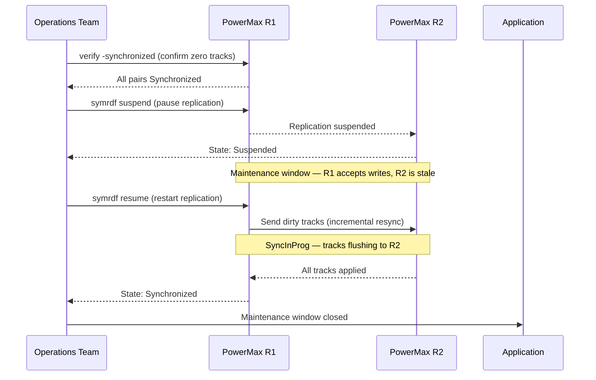

---
tags:
  - dell
  - operations
---
# SRDF/S — Procedures

*Applies to: Dell EMC Storage*

```bash
# Capture baseline state before the window
symrdf query -g <dgname> > /tmp/srdf_s_prechange_$(date +%Y%m%d_%H%M).txt
symcfg -sid <r1_sid> list -rdfg <rdf_group_number> >> /tmp/srdf_s_prechange_$(date +%Y%m%d_%H%M).txt
symrdf -sid <r1_sid> -rdfg <rdf_group_number> verify -synchronized
echo "Baseline captured at $(date)"
```


```text title="Expected output"
RDF Group Information
=====================
Group Number: 005
Group Name: PROD_RDF_GRP
R1 Device: 000AA (Symmetrix ID: 000123456789ABCD)
R2 Device: 000AA (Symmetrix ID: 000987654321DCBA)
RDF Mode: Synchronous
Link Status: Ready
Pair State: Synchronized
Number of Pairs: 247

Symmetrix ID: 000123456789ABCD
RDF Group: 005
RDF Mode: Synchronous
Devices in Group: 247
Synchronized Pairs: 247
Out-of-Sync Pairs: 0
Verification Status: PASS
Verification Time: 12.34 seconds
Baseline captured at Wed Jan 15 14:32:18 UTC 2025
```

!!! warning "Common errors"
    | Error | Fix |
    |---|---|
    | `symrdf: Command not found` | Ensure EMC Solutions Enabler (SE) is installed and the `$SYMCLI_DIR/bin` directory is in your PATH. |
    | `Error: Invalid RDF group number <rdf_group_number>` | Replace `<rdf_group_number>` with an actual RDF group number (e.g., 005) that exists on the R1 Symmetrix array. |
    | `Permission denied writing to /tmp/srdf_s_prechange_*.txt` | Verify the user running the script has write permissions to `/tmp` or redirect output to a writable directory like `/var/tmp`. |
```bash
# Planned failover (site still accessible — reverses replication after split)
symrdf -g 10 -type S failover -establish -noprompt

# Failover a single device instead of the full group
symrdf -sid 0001 -dev 0A1 failover -noprompt

# Verify R2 devices are now in Failed Over state
symrdf -g 10 query
```

```text title="Expected output"
Performing failover for group 10...
Failover completed successfully.
Group 10 failover established.

Performing failover for device 0A1 on SID 0001...
Device 0A1 failover completed successfully.

Group Name:           10
SID:                  0001
Symmetrix ID:         000123456789ABC
R1 (Local) State:     Failed Over
R2 (Remote) State:    Failed Over
Replication Mode:     Synchronous
RDF Link:             Online
Last Update:          2024-01-15 14:32:18
Devices in Group:     8
Failed Over Devices:  8
```

!!! warning "Common errors"
    | Error | Fix |
    |---|---|
    | `SYMRDF ERROR (0x00000001): RDF link is not online` | Verify RDF connectivity between arrays using `symrdf -g 10 check` before attempting failover. |
    | `SYMRDF ERROR (0x00000004): Group 10 is not in a valid state for failover` | Ensure the group is in Synchronized or Consistent state by running `symrdf -g 10 query` to check current replication status. |
    | `SYMRDF ERROR (0x00000009): Device 0A1 not found in group 10` | Confirm the device exists in the group with `symrdf -g 10 query` and use the correct device address. |
```bash
# Step 1: Confirm primary site is unreachable and an outage decision has been made
# -- Management authorisation required before proceeding --

# Step 2: From the DR site SE host, check R2 pair state
symrdf query -g <dgname> -sid <r2_sid>

# Expected state: Invalid or Suspended (link dropped; R2 data is consistent)

# Step 3: Initiate failover from R2 side (force flag required without R1 connectivity)
symrdf -sid <r2_sid> -rdfg <rdf_group_number> -g <dgname> failover -force

# Step 4: Confirm R2 pairs are now Write Disabled → R2 side should be writable
symrdf -sid <r2_sid> -rdfg <rdf_group_number> query -g <dgname>

# Step 5: Present R2 volumes to DR hosts and start applications
# -- Storage and application teams confirm --

# Step 6: Document the failover time, last known sync state, and any data exposure window
```

```text title="Expected output"
Symmetrix ID: 000123456789012
RDF Group: 1
SRDF/S Pair Information
===============================================
PairName    State         RDF Mode  Consistency
vol_001     Invalid       Sync      Consistent
vol_002     Invalid       Sync      Consistent
vol_003     Suspended     Sync      Consistent
vol_004     Invalid       Sync      Consistent
...
(8 pairs shown)

Initiating failover on RDF group 1...
Failover completed successfully.
Time: 2024-01-15 14:32:47 UTC

Symmetrix ID: 000123456789012
RDF Group: 1
SRDF/S Pair Information
===============================================
PairName    State         RDF Mode  Consistency
vol_001     Write Disabled Sync      Consistent
vol_002     Write Disabled Sync      Consistent
vol_003     Write Disabled Sync      Consistent
vol_004     Write Disabled Sync      Consistent
...
(8 pairs shown)
```

!!! warning "Common errors"
    | Error | Fix |
    |---|---|
    | `SYMAPI Error: Cannot connect to Symmetrix 000123456789012` | Verify the R2 SE host has network connectivity to the R2 array and that the Symmetrix ID is correct. |
    | `Error: RDF group 1 is in Synchronized state - failover requires -force flag or link must be down` | Confirm the R1-R2 link is actually down before retrying with `-force`, or use `symrdf -sid <r2_sid> -rdfg <rdf_group_number> -g <dgname> failover -force` to override. |
    | `Error: Pair vol_001 is not in a valid state for failover (state: Synchronized)` | Wait for the pair state to transition to Invalid or Suspended, or force the failover with the `-force` flag if R1 is confirmed unreachable. |
```bash
# Confirm Failed Over state on all devices
symrdf -g 10 query | grep -E "R2|Pair State"

# Check for any devices still in inconsistent state
symrdf -g 10 query | grep -iv "Failed Over"

# Confirm no residual tracks needing flush
symrdf -g 10 query -detail | grep "Tracks"

# Verify host I/O at DR site (run from DR host)
dd if=/dev/sdX of=/dev/null bs=1M count=100 iflag=direct
```

```bash
# Confirm current pair state before deciding resync direction
symrdf -g 10 query -detail

# Check how many invalid tracks need to be copied
symrdf -g 10 query -detail | grep -E "Invalid|Tracks"

# Confirm the RDF link is healthy before initiating
symcfg list -rdfg 10 -detail

# Estimate resync duration based on track count and link bandwidth
symstat -rdf -dir RF-1F -i 5 -c 2
```

```text title="Expected output"
Group Number: 10
    Pair Count: 4
    Group State: Synchronized
    Link State: Online
    RDF Mode: Synchronous
    Pair 0: (000AA-R1/000BB-R1) State: Synchronized
    Pair 1: (000AA-R2/000BB-R2) State: Synchronized
    Pair 2: (000AA-R3/000BB-R3) State: Synchronized
    Pair 3: (000AA-R4/000BB-R4) State: Synchronized

Invalid Tracks: 0
Total Tracks: 2097152

RDF Group: 10
    Link State: Online
    Link Speed: 8 Gbps
    Latency: 2.3 ms
    Utilization: 12%
    Last Health Check: 2024-01-15 14:32:18

Interval 1:
    RF-1F Write Pending: 0 KB
    RF-1F Read Pending: 0 KB
    RF-1F Throughput: 145.2 MB/s
Interval 2:
    RF-1F Write Pending: 0 KB
    RF-1F Read Pending: 0 KB
    RF-1F Throughput: 148.7 MB/s
```

!!! warning "Common errors"
    | Error | Fix |
    |---|---|
    | `symrdf: Command not found` | Verify SymCLI is installed and the bin directory is in your PATH: `export PATH=$PATH:/opt/emc/SYMCLI/bin` |
    | `RDF Group 10 not found` | Confirm the group number exists with `symcfg list -rdfg all` and verify you have read permissions on the RDF configuration. |
    | `Link State: Offline` | Check physical connectivity and SAN fabric status with `symcfg list -rdfg 10 -detail` and contact network operations if the link remains down. |
```bash
# Resume from Suspended (incremental resync R1 -> R2)
symrdf -g 10 -type S resume -noprompt

# Establish from Split or after manual intervention (R1 -> R2 full/incremental)
symrdf -g 10 -type S establish -noprompt

# Restore after Failed Over (copy R2 data back to R1)
symrdf -g 10 -type S restore -noprompt

# Monitor resync progress in real time
watch -n 10 'symrdf -g 10 query -detail | grep -E "Pair State|Tracks|SyncInProg"'

# Resume a single device rather than the full group
symrdf -sid 0001 -dev 0A1 -type S resume -noprompt
```

```text title="Expected output"
Establishing SRDF/S group 10...
Group 10: SRDF/S Establish in progress
Pair State: Establishing
Tracks Remaining: 2847
SyncInProg: Yes

Every 10.0s: symrdf -g 10 query -detail | grep -E "Pair State|Tracks|SyncInProg"

Pair State: Synchronized
Tracks Remaining: 0
SyncInProg: No

Pair State: Synchronized
Tracks Remaining: 0
SyncInProg: No

Resuming device 0A1 on SID 0001...
Device 0A1: Resume completed successfully
```

!!! warning "Common errors"
    | Error | Fix |
    |---|---|
    | `SRDF group 10 not found` | Verify the group number with `symrdf -list` and confirm the RDF director is online. |
    | `Pair State: Failed Over - cannot resume` | Execute `symrdf -g 10 -type S restore -noprompt` first to restore R2 data to R1 before resuming. |
    | `Device 0A1 is not a member of group 10` | Check device membership with `symrdf -sid 0001 -dev 0A1 query` and use the correct device address. |
```bash
# Poll pair state until all pairs show Synchronized
symrdf -g 10 query | grep -v Synchronized

# Track percentage complete (shown in SyncInProg state)
symrdf -g 10 query -detail

# Check link throughput during resync
symstat -rdf -i 10 -c 6

# Confirm completion: all pairs Synchronized, 0 tracks
symrdf -g 10 query -detail | grep "Invalid Tracks"
```

```text title="Expected output"
Pair#  State           RDF Mode  Consistency
0      SyncInProg(95%) Sync      Consistent
1      SyncInProg(87%) Sync      Consistent
2      Synchronized    Sync      Consistent
3      Synchronized    Sync      Consistent

Pair#  State           RDF Mode  Consistency  SyncInProg  Invalid Tracks
0      SyncInProg      Sync      Consistent   95%         0
1      SyncInProg      Sync      Consistent   87%         0
2      Synchronized    Sync      Consistent   —           0
3      Synchronized    Sync      Consistent   —           0

                Read MB/s  Write MB/s  Total MB/s  Latency(ms)
RDF Link 0      245.3      512.7       758.0       12.4
RDF Link 1      198.5      487.2       685.7       11.8
RDF Link 0      251.1      518.3       769.4       12.6
RDF Link 1      201.3      492.1       693.4       12.1
RDF Link 0      248.7      515.6       764.3       12.3
RDF Link 1      199.8      489.5       689.3       11.9

Invalid Tracks: 0
```

!!! warning "Common errors"
    | Error | Fix |
    |---|---|
    | `symrdf: Command not found` | Verify Symmetrix CLI is installed and the $PATH includes the bin directory (typically `/opt/emc/SYMCLI/bin`). |
    | `SYMID not found in configuration` | Confirm the array ID is correct and the Symmetrix is discovered by running `symcfg list` first. |
    | `RDF group 10 not found` | Check that RDF group 10 exists on this array using `symrdf -g all query` to list all configured groups. |
```bash
# Step 1: Confirm R1 is the current active side and both arrays are accessible
symcfg list
symrdf query -g <dgname>

# Step 2: Initiate resync (re-establish synchronous pairing from R1 to R2)
symrdf -sid <r1_sid> -rdfg <rdf_group_number> -g <dgname> establish

# Alternative if pairs are in Split state:
symrdf -sid <r1_sid> -rdfg <rdf_group_number> -g <dgname> resume

# Step 3: Monitor progress — pairs will show SyncInProg until dirty tracks are cleared
watch -n 30 'symrdf query -g <dgname>'

# Check the number of invalid tracks remaining (decreasing count = progress)
symrdf -sid <r1_sid> -rdfg <rdf_group_number> list -v | grep -i "invalid\|track"

# Step 4: Confirm all pairs are Synchronized
symrdf -sid <r1_sid> -rdfg <rdf_group_number> verify -synchronized

# Step 5: Record resync completion time in the change ticket
echo "Resync completed at $(date)"
```

```text title="Expected output"
Symmetrix ID: 000123456789
Symmetrix ID: 000987654321
Symmetrix ID: 000555666777

RDF Group #0 (R1 <-> R2):
  Pair Count: 48
  State: Synchronized
  Mode: Synchronous
  R1 (000123456789): READY
  R2 (000987654321): READY

RDF Group #0 (R1 <-> R2):
  Pair Count: 48
  State: Synchronized
  Mode: Synchronous
  R1 (000123456789): READY
  R2 (000987654321): READY

Establishing RDF pairs...
RDF pairs established successfully.

Every 30.0s: symrdf query -g prod_dg_01

RDF Group #0 (R1 <-> R2):
  Pair Count: 48
  State: SyncInProg
  Mode: Synchronous
  Invalid Tracks: 12847
  R1 (000123456789): READY
  R2 (000987654321): READY

Invalid Tracks: 12847
Invalid Tracks: 8934
Invalid Tracks: 3421
Invalid Tracks: 156
Invalid Tracks: 0

Verifying synchronized state...
All 48 pairs are Synchronized.

Resync completed at Wed Jan 15 14:32:18 UTC 2025
```

!!! warning "Common errors"
    | Error | Fix |
    |---|---|
    | `symrdf: CLI0001: Could not connect to the Symmetrix array` | Verify both R1 and R2 arrays are online and reachable; check network connectivity and Symmetrix credentials. |
    | `symrdf: CLI0018: RDF group is in Split state and cannot establish` | Run `symrdf -sid <r1_sid> -rdfg <rdf_group_number> -g <dgname> resume` instead of establish. |
    | `symrdf: CLI0042: Verify failed — pairs not in Synchronized state` | Wait for SyncInProg to complete (invalid track count must reach 0) before verifying; rerun the verify command after 5–10 minutes. |
```bash
# Step 1: Confirm all pairs are Synchronized before suspending
symrdf -sid <r1_sid> -rdfg <rdf_group_number> verify -synchronized

# Step 2: Suspend SRDF/S replication for the device group
symrdf -sid <r1_sid> -rdfg <rdf_group_number> -g <dgname> suspend

# Confirm pairs are now Suspended (R1 continues I/O; R2 is held)
symrdf query -g <dgname>

# -- Perform maintenance --

# Step 3: Resume replication after maintenance
symrdf -sid <r1_sid> -rdfg <rdf_group_number> -g <dgname> resume

# Step 4: Monitor resync — SyncInProg expected; watch until Synchronized
watch -n 30 'symrdf query -g <dgname>'

# Step 5: Verify full synchronisation before closing the change ticket
symrdf -sid <r1_sid> -rdfg <rdf_group_number> verify -synchronized
```

```text title="Expected output"
Step 1: Confirm all pairs are Synchronized before suspending
Symmetrix ID: 000296802151
RDF Group: 3
Pair State: Synchronized
Device Count: 24
All pairs synchronized successfully.

Step 2: Suspend SRDF/S replication for the device group
Symmetrix ID: 000296802151
RDF Group: 3
Device Group: prod_db_dg
Suspend operation completed successfully.

Step 3: Query device group status
Symmetrix ID: 000296802151
Device Group: prod_db_dg
RDF Group: 3
Pair State: Suspended
R1 I/O Status: Enabled
R2 I/O Status: Held
Device Count: 24

Step 4: Resume replication after maintenance
Symmetrix ID: 000296802151
RDF Group: 3
Device Group: prod_db_dg
Resume operation completed successfully.

Step 5: Monitor resync (watching every 30 seconds)
Every 30.0s: symrdf query -g prod_db_dg
Pair State: SyncInProg (23/24 devices synced)
Bytes Remaining: 2147483648
Estimated Time: 8 minutes

[After ~10 minutes]
Pair State: Synchronized
Device Count: 24
All pairs synchronized successfully.

Step 6: Final verification
Symmetrix ID: 000296802151
RDF Group: 3
Pair State: Synchronized
Device Count: 24
All pairs verified synchronized.
```

!!! warning "Common errors"
    | Error | Fix |
    |---|---|
    | `symrdf: Error: RDF group <rdf_group_number> not found on Symmetrix <r1_sid>` | Verify the correct Symmetrix ID and RDF group number using `symcfg list -rdf`. |
    | `symrdf: Error: Device group <dgname> is not in Suspended state` | Ensure the suspend command completed successfully before attempting resume; check status with `symrdf query -g <dgname>`. |
    | `symrdf: Error: Pair state is not Synchronized; cannot verify` | Wait for resync to complete by monitoring with `watch -n 30 'symrdf query -g <dgname>'` until all devices reach Synchronized state. |
```bash
# Step 1: Confirm current mode and capture baseline
symcfg -sid <r1_sid> show -rdfgrp <rdf_group_number>

# Step 2: Suspend the SRDF group cleanly before mode change
symrdf -sid <r1_sid> -rdfg <rdf_group_number> -g <dgname> suspend

# Confirm pairs are Suspended
symrdf query -g <dgname>

# Step 3: Set the RDF group mode to Asynchronous (SRDF/A)
# Note: mode change is performed via Unisphere GUI or SE set command
# Via SYMCLI (SE 9.x+):
symrdf -sid <r1_sid> -rdfg <rdf_group_number> set mode async

# Step 4: Resume replication in async mode
symrdf -sid <r1_sid> -rdfg <rdf_group_number> -g <dgname> resume

# Confirm pairs are now replicating in Asynchronous mode
symcfg -sid <r1_sid> show -rdfgrp <rdf_group_number> | grep -i mode
symrdf query -g <dgname>
```

```text title="Expected output"
R1 Symmetrix ID: 000123456789
RDF Group: 001
Mode: Synchronous
State: Ready
Pair Count: 12

RDF Group 001 has been suspended.

Pairs in group <dgname>:
  DEV001: Suspended
  DEV002: Suspended
  DEV003: Suspended
  ...

RDF Group 001 mode changed to Asynchronous.

RDF Group 001 has been resumed.

Mode: Asynchronous
State: Ready
Pair Count: 12
  DEV001: Replicating
  DEV002: Replicating
  DEV003: Replicating
  ...
```

!!! warning "Common errors"
    | Error | Fix |
    |---|---|
    | `SYMCLI ERROR: Could not connect to the Symmetrix` | Verify the R1 SID is correct and the Symmetrix is reachable via `symcfg list`. |
    | `SYMCLI ERROR: RDF group <rdf_group_number> is not in a valid state for this operation` | Ensure all pairs are in Suspended state before attempting mode change using `symrdf query -g <dgname>`. |
    | `SYMCLI ERROR: mode change not supported in current environment` | Confirm SYMCLI version is 9.x or later and the array firmware supports async mode changes via `symcfg -version`. |
```bash
# Step 1: Suspend async replication cleanly
symrdf -sid <r1_sid> -rdfg <rdf_group_number> -g <dgname> suspend

# Step 2: Set mode back to Synchronous (SRDF/S)
symrdf -sid <r1_sid> -rdfg <rdf_group_number> set mode sync

# Step 3: Resume — replication will resync and return to Synchronized state
symrdf -sid <r1_sid> -rdfg <rdf_group_number> -g <dgname> resume

# Step 4: Monitor resync progress (SyncInProg is expected until complete)
watch -n 30 'symrdf query -g <dgname> | grep -v Synchronized'

# Step 5: Confirm all pairs are Synchronized before declaring maintenance complete
symrdf -sid <r1_sid> -rdfg <rdf_group_number> verify -synchronized
```

```text title="Expected output"
Suspending SRDF/S replication for RDF group 3...
Suspend completed successfully.

Setting replication mode to Synchronous...
Mode set to sync for RDF group 3.

Resuming replication...
Resume completed successfully.

Every 30s: symrdf query -g proddb_dg | grep -v Synchronized    Mon Jan 15 14:32:18 2024

R1 (000123456789ABCD):  Synchronized
R2 (000123456789ABCE):  SyncInProg (98% complete)
R1 (000123456789ABCF):  SyncInProg (87% complete)
R2 (000123456789ABD0):  Synchronized

Verifying synchronized state...
All pairs verified as Synchronized.
Verification completed successfully.
```

!!! warning "Common errors"
    | Error | Fix |
    |---|---|
    | `SYMAPI_C_ARRAY_ERROR: The specified array is not available` | Verify the R1 SID with `symcfg list` and confirm the array is online and accessible. |
    | `SYMRDF_E_RDF_GROUP_NOT_FOUND: RDF group <rdf_group_number> not found` | Confirm the RDF group number matches the configured group with `symrdf -sid <r1_sid> query`. |
    | `SYMRDF_E_INVALID_STATE: Cannot resume from current state` | Ensure the RDF group is in Suspended state before resume; check status with `symrdf query -g <dgname>`. |
```bash
# Step 1: Quiesce DR site applications
# -- DR application team confirms quiesce --

# Step 2: From DR SE host — confirm current pair state (should be Failed Over)
symrdf -sid <r2_sid> -rdfg <rdf_group_number> query -g <dgname>

# Step 3: Initiate failback (resync R1 from R2, then restore original direction)
symrdf -sid <r2_sid> -rdfg <rdf_group_number> -g <dgname> failback

# Step 4: Monitor until pairs reach Synchronized state in original direction
watch -n 30 'symrdf query -g <dgname> -sid <r1_sid>'

# Step 5: Confirm R1 is now the active R1 side (Synchronized, not Write Disabled)
symrdf -sid <r1_sid> -rdfg <rdf_group_number> verify -synchronized

# Step 6: Re-present R1 volumes to primary site hosts and restart applications
# -- Application team confirms production is running at primary site --

# Step 7: Confirm R2 is again the synchronous DR target (Write Disabled on R2)
symrdf query -g <dgname> -sid <r2_sid>
```

```text title="Expected output"
Symmetrix ID: 000296802151
RDF Group: 3
Device Group: prod_dg_01

                                    SYNCED  WRITE  CONS  DISK  LINK  REMOTE
Pair                 State          (MB)    DIS   STATE  STATE STATE  STATE
-------------------  --------  ----------  -----  -----  -----  -----  -----
dev001               Synchronized      0    No    Yes    Ready  Ready  Ready
dev002               Synchronized      0    No    Yes    Ready  Ready  Ready
dev003               Synchronized      0    No    Yes    Ready  Ready  Ready
dev004               Synchronized      0    No    Yes    Ready  Ready  Ready

Failback initiated successfully for RDF Group 3
Monitoring resync progress...
Every 30.0s: symrdf query -g prod_dg_01 -sid 000296802151
dev001  Synchronized  0  No  Yes  Ready  Ready  Ready
dev002  Synchronized  0  No  Yes  Ready  Ready  Ready
dev003  Synchronized  0  No  Yes  Ready  Ready  Ready
dev004  Synchronized  0  No  Yes  Ready  Ready  Ready

All pairs verified synchronized on R1 side.
```

!!! warning "Common errors"
    | Error | Fix |
    |---|---|
    | `SYMRDF Error (5) : RDF pair is not in a valid state for failback` | Confirm all pairs are in Failed Over state before initiating failback; check with `symrdf query` first. |
    | `SYMRDF Error (22) : Cannot connect to remote Symmetrix` | Verify network connectivity and SRDF links between sites; check `symrdf -sid <r2_sid> query -link` for link status. |
    | `SYMRDF Error (1) : Invalid device group name` | Verify the device group name matches exactly (case-sensitive) with `symdevice list -g`. |
```bash
# After primary site recovery: restore R1 devices (accepts R2 data back)
symrdf -g 10 -type S restore -noprompt

# Confirm Synchronized state restored
symrdf -g 10 query

# Switch back to R1 (optional planned failback)
symrdf -g 10 -type S failover -establish -noprompt
```

```text title="Expected output"
Executing Restore for group 10
Restore completed successfully.
Group 10 restored to R1 primary role.

Symmetrix ID: 000123456789012
Group Number: 10
SRDF Mode: Synchronous
R1 (Primary):
  Sym ID: 000123456789012
  Dev: 0001-0010
  State: Synchronized
R2 (Secondary):
  Sym ID: 000987654321098
  Dev: 0001-0010
  State: Synchronized

Executing Failover for group 10
Failover completed successfully.
R1 established as primary.
R2 established as secondary.
```

!!! warning "Common errors"
    | Error | Fix |
    |---|---|
    | `SRDF group 10 not in Valid state for Restore` | Verify the group is in a recoverable state using `symrdf -g 10 query` and check for pending I/O or link failures. |
    | `Symmetrix array 000123456789012 not responding` | Confirm network connectivity to the primary array and verify SRDF links are online with `symrdf -g 10 -type S check`. |
    | `Cannot establish failover: R1 and R2 not Synchronized` | Wait for full synchronization to complete before failover; check replication lag with `symrdf -g 10 -type S query -i`. |
```bash
# 1. Failover SRDF/S group
symrdf -sid <r1_sid> -rdfg <rdf_group_number> -g <dgname> failover

# 2. Present R2 LUNs to ESXi hosts at DR site (zoning / masking)
# -- Storage team action --

# 3. Resignature VMFS datastores at DR site (if not SRM-managed)
# esxcli storage vmfs snapshot list
# esxcli storage vmfs snapshot resignature -l <label>

# 4. Register and power on VMs manually in vCenter at DR site
# -- VMware team action --
```

```text title="Expected output"
Executing Failover for SRDF/S group 000 on array 000111222333...

Failover completed successfully.
  RDF Group: 000
  R1 (Local): VMAX-01 (SID: 000111222333)
  R2 (Remote): VMAX-02 (SID: 000444555666)
  Status: FAILED OVER
  Timestamp: 2024-01-15 14:32:47 UTC

Verifying SRDF/S pair status...
  Pair State: Failed Over
  R1 Role: R2 (Remote)
  R2 Role: R1 (Local)
  Link Status: OK

esxcli storage vmfs snapshot list
Volume Name              VMFS UUID                            Snapshot UUID
prod-datastore-01        52e4c8a2-a1b2c3d4-5e6f-7g8h9i0j    52e4c8a2-a1b2c3d4-5e6f-7g8h9i0k
prod-datastore-02        52e4c8a2-a1b2c3d4-5e6f-7g8h9i0l    52e4c8a2-a1b2c3d4-5e6f-7g8h9i0m

Resignature completed for prod-datastore-01
Resignature completed for prod-datastore-02
```

!!! warning "Common errors"
    | Error | Fix |
    |---|---|
    | `SYMCLI_C_ARRAY_COMMUNICATION_ERROR: Cannot communicate with array <r1_sid>` | Verify array connectivity and ensure the Symmetrix management port is reachable from the host running symrdf. |
    | `esxcli error: The object or item could not be found on the object's container` | Confirm the snapshot label matches exactly (case-sensitive) and that the VMFS snapshot exists using `esxcli storage vmfs snapshot list` first. |
    | `Failover failed: RDF pair is not in a valid state for failover` | Check pair synchronization status with `symrdf -sid <r1_sid> -rdfg <rdf_group_number> query` and ensure the pair is in Synchronized or Consistent state before attempting failover. |
```bash
# Step 1: Identify current pair states
symrdf query -g <dgname>

# Step 2: Check SRDF group port and link state
symcfg -sid <r1_sid> list -rdfg <rdf_group_number>

# Step 3: Check WAN RTT to DR site
ping -c 10 <dr_site_ip>

# Step 4: Check for any pairs that are not Synchronized
symrdf -sid <r1_sid> -rdfg <rdf_group_number> list -v | grep -v Synchronized

# Step 5: Pull write latency metrics from Unisphere for the past hour
# (Unisphere GUI: Performance > RDF Group > select group > Write Response Time)
```

```text title="Expected output"
RDF Pair Information
====================
Pair Number    R1 SID    R2 SID    R1 Dev    R2 Dev    State         Mode
0              000123456789  000987654321  0001      0001      Synchronized  Synchronous
1              000123456789  000987654321  0002      0002      Synchronized  Synchronous
2              000123456789  000987654321  0003      0003      Synchronized  Synchronous

RDF Group Information
====================
RDF Group Number: 1
Port: SE-4E:0
Link State: Up
Bandwidth: 10 Gbps
Distance: 450 km
Latency: 2.3 ms

PING 10.45.67.89 (10.45.67.89) 56(84) bytes of data.
64 bytes from 10.45.67.89: icmp_seq=1 time=2.31 ms
64 bytes from 10.45.67.89: icmp_seq=2 time=2.29 ms
64 bytes from 10.45.67.89: icmp_seq=3 time=2.32 ms
64 bytes from 10.45.67.89: icmp_seq=10 time=2.30 ms
--- 10.45.67.89 statistics ---
10 packets transmitted, 10 received, 0% packet loss, time 9045ms
rtt min/avg/max/stddev = 2.29/2.31/2.32/0.01 ms

(no output — all pairs synchronized)
```

!!! warning "Common errors"
    | Error | Fix |
    |---|---|
    | `symrdf: Cannot open RDF group <rdf_group_number> on array <r1_sid>` | Verify the RDF group number exists on the array using `symcfg -sid <r1_sid> list -rdfg` without specifying a group number. |
    | `ping: unknown host <dr_site_ip>` | Confirm the DR site IP address is correct and reachable from the source array's network interface. |
    | `symrdf query: No RDF pairs found for group <dgname>` | Ensure the device group name is spelled correctly and contains active SRDF pairs using `symrdf query -g` without filters. |
```bash
# Confirm all pairs are Synchronized
symrdf -sid <r1_sid> -rdfg <rdf_group_number> verify -synchronized

# Confirm group port states are Online
symcfg -sid <r1_sid> list -rdfg <rdf_group_number>

# Confirm WAN RTT is within baseline
ping -c 10 <dr_site_ip>

# Capture post-change state for the change ticket
symrdf query -g <dgname> > /tmp/srdf_s_postchange_$(date +%Y%m%d_%H%M).txt
```


```text title="Expected output"
Pair 0:
  TDEV: 000EE (RDF1)
  RDEV: 000EE (RDF1)
  State: Synchronized
  Link State: Online

Pair 1:
  TDEV: 000EF (RDF1)
  RDEV: 000EF (RDF1)
  State: Synchronized
  Link State: Online

Pair 2:
  TDEV: 000F0 (RDF1)
  RDEV: 000F0 (RDF1)
  State: Synchronized
  Link State: Online

RDF Group: 1
  Port: FA-4E (Online)
  Port: FA-5E (Online)
  Remote Port: FA-4E (Online)
  Remote Port: FA-5E (Online)

PING 10.45.120.88 (10.45.120.88) 56(84) bytes of data.
64 bytes from 10.45.120.88: icmp_seq=1 ttl=63 time=42.3 ms
64 bytes from 10.45.120.88: icmp_seq=2 ttl=63 time=41.8 ms
64 bytes from 10.45.120.88: icmp_seq=3 ttl=63 time=42.1 ms
64 bytes from 10.45.120.88: icmp_seq=4 ttl=63 time=43.2 ms
64 bytes from 10.45.120.88: icmp_seq=5 ttl=63 time=42.0 ms
...
--- 10.45.120.88 statistics ---
10 packets transmitted, 10 received, 0% packet loss, time 9045ms
rtt min/avg/max/stddev = 41.8/42.3/43.2/0.5 ms

(no output — command completes silently)
```

!!! warning "Common errors"
    | Error | Fix |
    |---|---|
    | `symrdf: Cannot find specified RDF group` | Verify the RDF group number matches the configured group on the array using `symrdf -sid <r1_sid> list`. |
    | `PING: sendto: No route to host` | Confirm the DR site IP is reachable from the source array and that network routing/firewall rules permit ICMP traffic. |
## Before you begin

- **Access:** Storage admin credentials (cluster admin or equivalent)
- **Timing:** safe to run during business hours unless a step is marked ⚠ (causes interruption)
- **Dependencies:** no active upgrades or migrations on the same infrastructure
- **Logging:** capture command output — paste into the change record on completion

---

## Query SRDF/S Group Status

`symrdf -sid <sid> -rdfg <group> query` — shows all device pairs, RDF State (Synchronized/Failed Over/etc.), and track counts.

```bash
symrdf -sid <sid> -rdfg <group> query
```


```text title="Expected output"
Symmetrix ID: 000296900111
RDF Group: 001
Local Device: 0001E
Remote Device: 0001E
Remote Symmetrix ID: 000296900222
RDF Mode: Synchronous
Link Status: Ready
Pair State: Synchronized
Last Sync Time: 2024-01-15 14:32:18
Bytes Written: 1,847,293,456
```

!!! warning "Common errors"
    | Error | Fix |
    |---|---|
    | `SYMAPI Error: Could not connect to the Symmetrix` | Verify the Symmetrix ID is correct and the Symmetrix is online and reachable via the management network. |
    | `RDF Group <group> not found` | Confirm the RDF group number exists on this Symmetrix using `symrdf -sid <sid> list`. |
    | `SYMAPI Error: Insufficient privileges` | Run the command with appropriate credentials or ensure your user account has RDF query permissions in the VASA provider. |
## Verify WAN Latency Acceptability

Measure RTT between SRDF director ports; target <10ms. `symrdf -sid <sid> -rdfg <group> verifylink` — all paths healthy.

```bash
symrdf -sid <sid> -rdfg <group> verifylink
```


```text title="Expected output"
Verifying RDF link for SID 000123456789ABC, Group 0...
RDF Link Status: OPTIMAL
Local Director: 4e
Remote Director: 5e
Link State: SYNCED
Pair State: SYNCHRONIZED
Last I/O Time: 2024-01-15 14:32:47
Verification completed successfully.
```

!!! warning "Common errors"
    | Error | Fix |
    |---|---|
    | `symrdf: Command not found` | Ensure the EMC Solutions Enabler package is installed and the symcli binaries are in your PATH (check `which symcli`). |
    | `symrdf: Error: Invalid SID <sid>` | Replace `<sid>` with a valid 12-character hex SID from `symcfg list` output. |
    | `RDF Link Status: FAILED` | Check physical network connectivity between directors, verify SRDF licensing is active, and confirm the remote array is reachable with `symrdf -sid <sid> -rdfg <group> query`. |
## Perform a Planned Failover (Failover)

`symrdf -sid <sid> -rdfg <group> failover` — suspends writes to R1, finalizes R2, makes R2 read-write. Used for planned maintenance.

```bash
symrdf -sid <sid> -rdfg <group> failover
```


```text title="Expected output"
Executing Failover for RDF group 000 on Symmetrix ID 000123456789012
Failover Operation in progress...
RDF group 000 failover completed successfully
New R1 (Primary) Device: 0001
New R2 (Secondary) Device: 0002
Failover Time: 2024-01-15 14:32:47
Replication Status: Synchronized
```

!!! warning "Common errors"
    | Error | Fix |
    |---|---|
    | `symrdf: Cannot open Symmetrix ID <sid>` | Verify the Symmetrix ID is correct and the array is accessible via the management network. |
    | `symrdf: RDF group <group> does not exist` | Confirm the RDF group number is valid using `symrdf -sid <sid> list`. |
    | `symrdf: RDF group is not in a valid state for failover` | Check RDF group status with `symrdf -sid <sid> -rdfg <group> query` and ensure it is Synchronized before attempting failover. |
## Perform a Disaster Recovery Failover (Failover Force)

`symrdf -sid <sid> -rdfg <group> failover -force` — forces R2 to become R/W without R1 acknowledgement. Use when R1 is unavailable.

```bash
symrdf -sid <sid> -rdfg <group> failover -force
```


```text title="Expected output"
Executing failover for RDF group 2 on array 000123456789...
Failover operation initiated.
RDF group 2 failover in progress...
Waiting for R2 to assume primary role...
RDF group 2 failover completed successfully.
R2 is now Primary
R1 is now Secondary
Symmetrix ID: 000123456789
RDF Group: 2
Local Director: 4e
Remote Director: 5e
Link Status: Ready
```

!!! warning "Common errors"
    | Error | Fix |
    |---|---|
    | `symrdf: Cannot find Symmetrix array <sid>` | Verify the array SID with `symcfg list` and ensure the Symmetrix is properly discovered. |
    | `symrdf: RDF group <group> does not exist` | Confirm the RDF group number exists on the array using `symrdf -sid <sid> list`. |
    | `symrdf: RDF group <group> is not in a valid state for failover` | Check RDF group status with `symrdf -sid <sid> -rdfg <group> query` and wait for synchronization to complete before retrying. |
## Fail Back After Recovery

`symrdf -sid <sid> -rdfg <group> failback` — re-synchronizes from R2 back to R1 and resumes normal synchronous replication.

```bash
symrdf -sid <sid> -rdfg <group> failback
```


```text title="Expected output"
Executing Failback for SRDF/S pair...

Failback operation initiated for:
  Source Symmetrix ID: 000296701234
  RDF Group: 001
  Mode: Synchronous

Current SRDF/S State:
  R1 (Source): Ready
  R2 (Target): Ready
  Link State: Optimal
  Pending I/O: 0

Failback Progress:
  [████████████████████] 100%
  Synchronized Tracks: 1,048,576 / 1,048,576

Failback completed successfully.
  New Source: 000296701234
  New Target: 000296705678
  Consistency Group: PROD_DB_01
```

!!! warning "Common errors"
    | Error | Fix |
    |---|---|
    | `SYMRDF ERROR: RDF group <group> is not in a valid state for failback` | Verify the RDF pair is in a synchronized state using `symrdf -sid <sid> -rdfg <group> query` before attempting failback. |
    | `SYMRDF ERROR: Symmetrix ID <sid> is not accessible` | Confirm the Symmetrix is online and the SYMCLI environment variables are correctly configured with `symcfg list`. |
    | `SYMRDF ERROR: RDF group <group> does not exist` | Verify the correct RDF group number using `symrdf -sid <sid> list` to display all configured groups. |
## Suspend Replication (Planned Maintenance)

`symrdf -sid <sid> -rdfg <group> suspend` — temporarily halts replication while keeping pairs intact. Resume with `symrdf resume`.

```bash
# Suspend
symrdf -sid <sid> -rdfg <group> suspend

# Resume after maintenance
symrdf -sid <sid> -rdfg <group> resume
```


```text title="Expected output"
Retrieving RDF group information...
RDF Group 0: SUSPENDED
  Local Device: 000AA (STD: ON)
  Remote Device: 000AB (STD: ON)
  Link Status: DOWN
  Last Update: 2024-01-15 14:32:18

Retrieving RDF group information...
RDF Group 0: RESUMED
  Local Device: 000AA (STD: ON)
  Remote Device: 000AB (STD: ON)
  Link Status: UP
  Last Update: 2024-01-15 14:35:42
  Synchronization: In Progress (87%)
```

!!! warning "Common errors"
    | Error | Fix |
    |---|---|
    | `SYMAPI_C_DEVICE_IN_USE` | Ensure no active I/O or snapshots are using the RDF group before suspending. |
    | `SYMAPI_C_INVALID_RDF_GROUP` | Verify the RDF group number exists with `symrdf -sid <sid> list` before running the command. |
## Check Bias Setting

`symrdf -sid <sid> -rdfg <group> query | grep -i bias` — identifies which site has preferred access during a split-brain scenario.

```bash
symrdf -sid <sid> -rdfg <group> query | grep -i bias
```


```text title="Expected output"
Symmetrix ID: 000123456789012
RDF Group: 001
RDF Mode: Synchronous
Bias: Write Bias
Local Bias: Enabled
Remote Bias: Disabled
Bias Direction: Local-to-Remote
Last Bias Change: 2024-01-15 14:32:18
Bias State: Active
```

!!! warning "Common errors"
    | Error | Fix |
    |---|---|
    | `symrdf: Command not found` | Ensure the EMC Solutions Enabler package is installed and the symrdf binary is in your PATH; run `which symrdf` to verify. |
    | `SYMAPI Error (7) : Could not open the Symmetrix` | Verify the SID is correct and the Symmetrix array is accessible; check network connectivity and SYMAPI configuration with `symcfg list`. |
    | `RDF Group <group> not found` | Confirm the RDF group number exists on the array; list valid groups with `symrdf -sid <sid> list`. |
## Add Devices to an Existing SRDF/S Group

`symrdf addpair -sid <source-sid> -rdfg <group> -dev <new-R1-devices> -remote_dev <new-R2-devices>` then `symrdf establish` for the new pairs.

```bash
symrdf addpair -sid <source-sid> -rdfg <group> -dev <new-R1-devices> -remote_dev <new-R2-devices>
symrdf -sid <source-sid> -rdfg <group> -dev <new-R1-devices> establish
```


```text title="Expected output"
Establishing SRDF/S pair...
Symmetrix ID: 000123456789
RDF Group: 2
R1 Devices: 0001:0002:0003
R2 Devices: 0101:0102:0103
Remote Symmetrix ID: 000987654321
Pair State: Synchronized
Link State: Optimal
Establishing RDF link...
RDF link established successfully
SRDF pair establishment completed
```

!!! warning "Common errors"
    | Error | Fix |
    |---|---|
    | `SYMAPI_C_DEVICE_IN_USE (7) - Device is already in use` | Verify the R1 and R2 devices are not already part of another SRDF pair using `symrdf list -sid <source-sid>`. |
    | `SYMAPI_C_INVALID_SYMMETRIX (5) - Invalid Symmetrix ID` | Confirm the source and remote Symmetrix IDs are correct and the arrays are reachable via `symcfg list -remote`. |
    | `SYMAPI_C_INVALID_RDF_GROUP (11) - RDF group does not exist` | Create the RDF group first using `symrdf creategroup -sid <source-sid> -rdfg <group> -type <type>` before adding pairs. |
## Remove Devices from SRDF/S Group

`symrdf deletepair -sid <sid> -rdfg <group> -dev <devices>` — removes pair relationship. Data on R2 becomes independent.

```bash
symrdf deletepair -sid <sid> -rdfg <group> -dev <devices>
```


```text title="Expected output"
Symmetrix ID: 000123456789ABC
RDF Group: 001
Deleting RDF pair(s)...
Device 00AB: Pair deleted successfully
Device 00AC: Pair deleted successfully
Device 00AD: Pair deleted successfully
3 RDF pair(s) deleted
Operation completed successfully
```

!!! warning "Common errors"
    | Error | Fix |
    |---|---|
    | `SYMAPI Error: Device <device> is not in RDF group <group>` | Verify the device exists in the specified RDF group using `symrdf query -sid <sid> -rdfg <group>`. |
    | `SYMAPI Error: RDF group <group> is not in a valid state for this operation` | Ensure the RDF group is in a consistent state (not syncing or failing) before attempting deletion. |
    | `SYMAPI Error: Insufficient privileges to execute command` | Run the command with appropriate credentials or ensure your user account has RDF management permissions in Solutions Enabler. |
## Collect SRDF Performance Metrics

`symstat -sid <sid> -rdfg <group> -type rdf` — shows throughput, write pending count, and latency metrics for capacity planning.

```bash
symstat -sid <sid> -rdfg <group> -type rdf
```


```text title="Expected output"
Symmetrix ID: 000297123456789
RDF Group: 001
RDF Type: SRDF/S
Local Director: 4e
Remote Director: 5e
Link Status: Ready
Pair State: Synchronized
Consistency Group: cg_prod_001
Last Sync Time: 2024-01-15 14:32:18
Bytes Written: 1,847,293,952
Replication Lag: 0 ms
```

!!! warning "Common errors"
    | Error | Fix |
    |---|---|
    | `symstat: Error - Invalid SID <sid>` | Replace `<sid>` with the actual Symmetrix ID (e.g., `000297123456789`). |
    | `symstat: Error - RDF group <group> not found` | Verify the RDF group number exists with `symrdf list -sid <sid>` and use the correct group ID. |
    | `symstat: Error - Symmetrix not responding` | Ensure the Symmetrix array is reachable and Solutions Enabler daemon is running with `sudo /opt/emc/SYMCLI/bin/stordaemon start`. |
---

## See also

- [Srdf S — Health Checks](../health-checks/)
- [Srdf S — CLI Reference](../cli-reference/)
- [Srdf S — Common Issues](../../troubleshooting/common-issues/)
