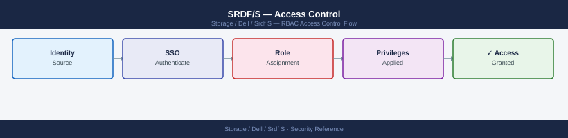

---
tags:
  - dell
  - security
---
# SRDF/S — Access Control

Access Control reference covering Preventing Accidental Failover, Audit Logging.

*Applies to: SRDF/S*

Configure Unisphere → Notifications → Syslog to forward SRDF events to SIEM. Alert on:
- `SRDF Split` outside maintenance windows
- `SRDF Failover` (any occurrence)
- `SRDF Suspend` without corresponding maintenance ticket
- `SRDF Invalid` (indicates device state inconsistency)

## Before you begin

- **Access:** Storage admin credentials (cluster admin or equivalent)
- **Change management:** security changes require CAB approval in most environments
- **Rollback plan:** document current state before any security control change
- **Testing:** validate in a non-production environment first where possible

---

---

## See also

- [Srdf S — Authentication](../authentication/)
- [Srdf S — Hardening](../hardening/)
- [Srdf S — Encryption](../encryption/)
