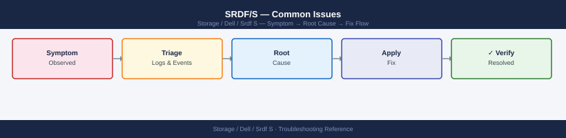

---
tags:
  - dell
  - troubleshooting
search:
  boost: 1.5
---
# SRDF/S — Common Issues

<div class="kb-summary">
SRDF/S troubleshooting: synchronous link failures, invalid track accumulation, host I/O impact during link faults, `symrdf failover` under failure, and escalation.

*Applies to: SRDF/S*
</div>


> Part of the [SRDF/S Troubleshooting](index.md) reference.

SRDF/S issues typically manifest as pair state transitions away from `Synchronized`, elevated host write latency, or unexpected failover splits. Because SRDF/S is synchronous, any WAN degradation **directly impacts production write latency** — treat RTT increases above 5ms as a storage incident, not purely a network event.

Always collect `symrdf query -g <group> -v` and array event logs before engaging Dell support.

```d2
direction: down

symptom: Identify Symptom {shape: diamond}
diagnostic_flow: "Diagnostic Flow" {shape: rectangle}
linkdown_recovery_decision_tree: "Link-Down Recovery Decision Tree" {shape: rectangle}
pair_in_invalid_state: "Pair in `Invalid` State" {shape: rectangle}
pair_in_split_state: "Pair in `Split` State" {shape: rectangle}
isl_fcip_link_failure: "ISL / FCIP Link Failure" {shape: rectangle}
unintended_failover_during_maintenan: "Unintended Failover During Maintenance" {shape: rectangle}
resolution: Resolve or Escalate {shape: oval}

symptom -> diagnostic_flow: investigate
symptom -> linkdown_recovery_decision_tree: investigate
symptom -> pair_in_invalid_state: investigate
symptom -> pair_in_split_state: investigate
symptom -> isl_fcip_link_failure: investigate
symptom -> unintended_failover_during_maintenan: investigate
diagnostic_flow -> resolution
linkdown_recovery_decision_tree -> resolution
pair_in_invalid_state -> resolution
pair_in_split_state -> resolution
isl_fcip_link_failure -> resolution
unintended_failover_during_maintenan -> resolution
```

## Diagnostic Flow

```d2
direction: right

D1: "D1" {shape: rectangle}
R1: "See Link-Down Recovery —\nCheck physical link then resume" {shape: rectangle}
R2: "See Link-Down Recovery —\nResume pair after link restored" {shape: rectangle}
D2: "D2" {shape: rectangle}
R3: "See Link-Down Recovery —\nEscalate to network team" {shape: rectangle}
R4: "See Common Issues —\nPair in Consistent state: monitor" {shape: rectangle}
D3: "D3" {shape: rectangle}
R5: "See ISL / FCIP Link Failure —\nRestore link then resync pair" {shape: rectangle}
R6: "See Root Causes —\nFCIP MTU mismatch or GRE overhead" {shape: rectangle}
D4: "D4" {shape: rectangle}
R7: "See Pair in Split State —\nConfirm authoritative side" {shape: rectangle}
R8: "See Unintended Failover —\nSuspend before maintenance" {shape: rectangle}
D5: "D5" {shape: rectangle}
R9: "See Invalid State —\nResync R1 to R2" {shape: rectangle}
R10: "See Invalid State —\nFailback from R2: engage Dell Support" {shape: rectangle}
S: "What is the symptom?" {shape: rectangle}
B1: "B1" {shape: rectangle}
B2: "B2" {shape: rectangle}
B3: "B3" {shape: rectangle}
B4: "B4" {shape: rectangle}
B5: "B5" {shape: rectangle}

D1 -> R1
D1 -> R2
D2 -> R3
D2 -> R4
D3 -> R5
D3 -> R6
D4 -> R7
D4 -> R8
D5 -> R9
D5 -> R10
```

---

## Before you begin

- **Access:** Storage admin credentials (cluster admin or equivalent)
- **Gather first:** recent error message text, event timestamps, and affected object names
- **Scope:** confirm whether the issue affects a single object, host, cluster, or site
- **Escalation:** open a vendor support ticket before running any destructive step
- **Logging:** document each command and output — required if escalation is needed

---

## Link-Down Recovery Decision Tree

```d2
direction: right

linkAlert: "Alert: SRDF/S Link Down\nor Pairs not Synchronized" {shape: rectangle}
checkPairState: "Check Pair State\nsymrdf -g dgname -sid sid query" {shape: rectangle}
pairStateVal: "pairStateVal" {shape: rectangle}
writeDisabled: "Write Disabled\n→ Array stopped writes\nto protect consistency" {shape: rectangle}
invalidState: "Invalid State\n→ Possible data divergence" {shape: rectangle}
suspended: "Suspended\n→ Link dropped or manual suspend" {shape: rectangle}
partitioned: "Partitioned\n→ Link interrupted mid-transfer" {shape: rectangle}
checkPhysLink: "Check Physical Link\nFCIP tunnel / dark fibre state" {shape: rectangle}
linkUp: "linkUp" {shape: rectangle}
checkRTT: "Check RTT\nping -c 20 dr-site-ip" {shape: rectangle}
escalateNet: "Escalate to Network Team\nRTT still elevated" {shape: rectangle}
rttNormal: "rttNormal" {shape: rectangle}
resyncPair: "Resync Pair\nsymrdf -g dgname -sid sid resync -noprompt" {shape: rectangle}
resumePair: "Resume Pair\nsymrdf -g dgname -sid sid resume -noprompt" {shape: rectangle}
monitorSync: "Monitor SyncInProg\nuntil Synchronized" {shape: rectangle}
checkDataAuth: "Identify Authoritative Side\nDo NOT resync without confirming" {shape: rectangle}
engageSupport: "Engage Dell Support\nData consistency risk" {shape: rectangle}

linkAlert -> checkPairState
checkPairState -> pairStateVal
pairStateVal -> writeDisabled
pairStateVal -> invalidState
pairStateVal -> suspended
pairStateVal -> partitioned
writeDisabled -> checkPhysLink
suspended -> checkPhysLink
partitioned -> checkPhysLink
checkPhysLink -> linkUp
linkUp -> checkRTT
linkUp -> escalateNet
checkRTT -> rttNormal
rttNormal -> resyncPair
rttNormal -> resumePair
rttNormal -> escalateNet
resyncPair -> monitorSync
resumePair -> monitorSync
invalidState -> checkDataAuth
checkDataAuth -> engageSupport
```

---

## Pair in `Invalid` State

**Symptom:** Pair state shows `Invalid` — typically after an unresolved split or an earlier failover that was not cleanly restored.

```bash
# Check the event log for the event that caused the Invalid state
symevent -sid <r1_sid> list -last 30 | grep -i "SRDF\|Invalid\|failover"
```


```text title="Expected output"
Event ID    Timestamp            Severity  Message
12847       2024-01-15 14:32:18  WARNING   SRDF link down on director 4e
12851       2024-01-15 14:32:45  CRITICAL  Invalid state detected on RDF pair
12856       2024-01-15 14:33:02  ERROR     SRDF failover initiated for device 0ABC
12860       2024-01-15 14:33:15  WARNING   SRDF link recovery in progress
12865       2024-01-15 14:34:22  CRITICAL  Invalid state cleared after failover
```

!!! warning "Common errors"
    **`symevent: command not found`** — Ensure the Symmetrix management tools are installed and the PATH includes the bin directory (typically `/opt/emc/SYMCLI/bin`).
    **`SYMCLI_CONNECT error: Could not connect to the Symmetrix`** — Verify the R1 SID is correct and the Symmetrix engine is reachable via the management network.
    **`grep: (standard input) is empty`** — Run `symevent -sid <r1_sid> list -last 100` without grep first to confirm events exist in the log.
**Resolution (R1 is authoritative — no real failover occurred):**

```bash
symrdf -g <dgname> -sid <r1_sid> resync -noprompt
# Pushes R1 data to R2 and re-establishes sync
```


```text title="Expected output"
Symmetrix ID: 000123456789012
Director: 4e
RDF Group: 001
Local RA Port: 4e.0
Remote RA Port: 5e.0
RDF Mode: Synchronous
Resync Operation: STARTED
Resync Progress: 100%
Resync Status: COMPLETED
Consistency State: Synchronized
Last Update Time: 2024-01-15 14:32:47
```

!!! warning "Common errors"
    **`SYMRDF ERROR: RDF group <dgname> not found`** — Verify the RDF group name matches the output of `symrdf list -g all` and check spelling.
    **`SYMRDF ERROR: Symmetrix <r1_sid> is not available`** — Confirm the R1 Symmetrix ID is correct and the array is online with `symcfg list -v`.
    **`SYMRDF ERROR: RDF link is not in a valid state for resync`** — Check RDF link status with `symrdf -g <dgname> -sid <r1_sid> query` and resolve any link failures before retrying.
**Resolution (R2 has the latest data — a real failover occurred):**

```bash
# Confirm with application team that R2 has the correct data
# Then fail back to R1
symrdf -g <dgname> -sid <r2_sid> failback -noprompt
```


```text title="Expected output"
Symmetrix ID: 000123456789012
Director: 4e
Initiator: 4e:0
Target: 5e:0
RA port: SE-4E:0
Symmetrix ID: 000198765432109
Director: 4e
Initiator: 4e:0
Target: 5e:0
RA port: SE-4E:0

Failback operation initiated.
Failback completed successfully.
RDF group 0 is now in Synchronized state.
```

!!! warning "Common errors"
    **`SYMRDF Error (4) : RDF group is not in a valid state for failback`** — Verify the RDF group is in Consistent or Synchronized state using `symrdf -g <dgname> query` before attempting failback.
    **`SYMRDF Error (2) : Invalid Symmetrix ID <r2_sid>`** — Confirm the R2 Symmetrix ID is correct and matches the remote array in the RDF pair using `symcfg list -v`.
    **`SYMRDF Error (6) : RDF link is not ready`** — Check RDF link connectivity and ensure both arrays are online using `symrdf -g <dgname> query` and verify network paths are active.
**Do not resync or restore without first confirming which side has the authoritative data.** An incorrect resync will permanently overwrite data.

---

## Pair in `Split` State

A `Split` state means both R1 and R2 are R/W and data is diverging. This is normal during a planned failover but is an incident if unexpected.

```bash
# Check when the split occurred
symevent -sid <r1_sid> list -last 24h | grep -i "split\|SRDF"

# Identify which side has writes since the split
symdev -sid <r1_sid> show <dev_id> | grep "Modified"
symdev -sid <r2_sid> show <dev_id> | grep "Modified"
```


```text title="Expected output"
Timestamp                Event                                    Severity
07/15/2024 14:32:18 UTC  SRDF/S Split initiated on device 0001    Warning
07/15/2024 14:32:45 UTC  SRDF/S Split completed on device 0001    Info
07/15/2024 14:33:02 UTC  SRDF link established R1->R2             Info
07/15/2024 15:47:19 UTC  SRDF/S Resync started on device 0001     Info

                                    Device 0001
Modified                            07/15/2024 15:48:33 UTC (R1 Side)

                                    Device 0001
Modified                            07/15/2024 14:31:55 UTC (R2 Side)
```

!!! warning "Common errors"
    **`Error: Invalid SID <r1_sid>`** — Replace `<r1_sid>` with the actual R1 array SID (e.g., `000123456789`).
    **`Error: Device <dev_id> not found in this array`** — Verify the device ID exists on the specified array using `symdev -sid <r1_sid> list`.
**Never re-establish a split pair without application team sign-off.** Restoring R1 overwrites any R2 writes made during the split period and vice versa.

---

## ISL / FCIP Link Failure

**Symptom:** SRDF link is down; pairs move to `Suspended` or `Write Disabled`.

```bash
# Check SRDF director port state
symcfg -sid <r1_sid> list -dir all -v | grep -E "RDF|Port|State"

# From SAN switch (Cisco MDS)
show fcip session
show port-channel summary  # if using port-channel
show interface gigabitEthernet X/X

# From Brocade
portshow <port>
portcfgshow  # check FCIP port config
```


```text title="Expected output"
Director ID: 4a                    State: Online
Port 0: RDF1                       State: Online
Port 1: RDF2                       State: Online
Port 2: RDF3                       State: Online
Port 3: RDF4                       State: Online

FCIP Session Information:
Session ID: 1              Status: Up              Remote IP: 192.168.50.10
Session ID: 2              Status: Up              Remote IP: 192.168.50.11
Packets Sent: 4521847     Packets Received: 4521802     Errors: 0

Port-Channel 10 is up
  Members in this channel: Gi1/1, Gi1/2, Gi1/3, Gi1/4
  Port-channel is in Layer 3 mode

GigabitEthernet1/1 is up, line protocol is up
  MTU 1500 bytes, BW 1000000 Kbit/sec
  Encapsulation ARPA, loopback not set
  Last input 00:00:02, output 00:00:01

portName=4,0  portState=Online  portSpeed=16Gb
portName=4,1  portState=Online  portSpeed=16Gb
portName=4,2  portState=Offline portSpeed=16Gb
```

!!! warning "Common errors"
    **`symcfg: Command not found`** — Verify Symmetrix CLI is installed and $PATH includes the SymCLI bin directory (typically `/opt/emc/SYMCLI/bin`).
    **`FCIP Session Information: No entries found`** — Confirm FCIP tunnels are configured on the switch and check that remote director IP is reachable via `ping` from the switch management interface.
    **`portState=Offline`** — Verify the physical cable is connected, the remote director port is online, and check for link errors with `portcfgshow` to identify speed/duplex mismatches.
**Recovery after link restoration:**

```bash
# Pair should auto-resume once link is restored (depending on configuration)
# If pairs remain Suspended, manually resume:
symrdf -g <dgname> -sid <r1_sid> resume -noprompt

# Verify Synchronized state is reached (may take time to fully sync)
symrdf -g <dgname> -sid <r1_sid> query
```


```text title="Expected output"
Resuming SRDF pair for group PROD_DG on SID 000123456789...
SRDF pair resumed successfully.

Symmetrix ID: 000123456789
Group Name: PROD_DG
Local RA Port: SE-4E
Remote RA Port: SE-4E
SRDF Mode: Synchronous
Pair State: Synchronized
Link State: Online
RDF Group Number: 1
Hop ID: 1
Consistency State: Consistent
```

!!! warning "Common errors"
    **`SRDF pair is not in a valid state for resume operation`** — Verify the pair is in Suspended state using `symrdf -g <dgname> -sid <r1_sid> query` before attempting resume.
    **`RDF link is offline or unavailable`** — Check physical RDF link connectivity and confirm remote array is reachable with `symrdf -g <dgname> -sid <r1_sid> query`.
    **`Invalid device group name or SID`** — Confirm the device group exists and SID is correct by running `symcfg list -g` to list all configured groups.
---

## Unintended Failover During Maintenance

**Cause:** Maintenance was performed without declaring a maintenance window; SRDF monitors triggered automatic protection responses.

**Prevention:**

```bash
# Before any maintenance that touches SRDF links, directors, or the arrays:
# Step 1 — Suspend SRDF/S pair (converts to async temporarily)
symrdf -g <dgname> -sid <r1_sid> suspend -noprompt

# Step 2 — Disable SRDF health monitoring alerts in the monitoring platform for the duration

# Step 3 — Perform maintenance

# Step 4 — Resume and verify Synchronized state before re-enabling monitoring
symrdf -g <dgname> -sid <r1_sid> resume -noprompt
symrdf -g <dgname> -sid <r1_sid> query
```


```text title="Expected output"
Symmetrix ID: 000123456789012
Director: SE-4E
Group Name: prod_srdf_grp
SRDF/S Pair Information
=======================
R1 (Local):  000123456789012
R2 (Remote): 000987654321098
Link: SE-4E <-> RF-5F
State: Suspended
Mode: Asynchronous
(no output — command completes silently)
(maintenance steps performed)
Symmetrix ID: 000123456789012
Director: SE-4E
Group Name: prod_srdf_grp
SRDF/S Pair Information
=======================
R1 (Local):  000123456789012
R2 (Remote): 000987654321098
Link: SE-4E <-> RF-5F
State: Synchronized
Mode: Synchronous
RDF Health: Optimal
```

!!! warning "Common errors"
    **`SRDF pair is not in a valid state for this operation`** — Verify the pair is not already in a transitional state by running `symrdf -g <dgname> -sid <r1_sid> query` and wait for any pending operations to complete.
    **`Cannot connect to remote array <r2_sid>`** — Confirm network connectivity between the SRDF directors and that the remote array is online using `symcfg -sid <r2_sid> list -v`.
---

## Verify resolution

- Confirm the original symptom no longer occurs
- Check logs for any residual errors related to the issue
- Monitor for 10–15 minutes to confirm the fix is stable

---

## See also

- [Srdf S — Diagnostics](../diagnostics/)
- [Srdf S — Escalation](../escalation/)
- [Srdf S — Health Checks](../../operations/health-checks/)
