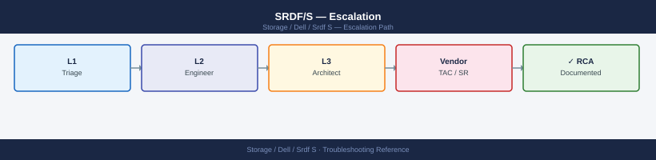
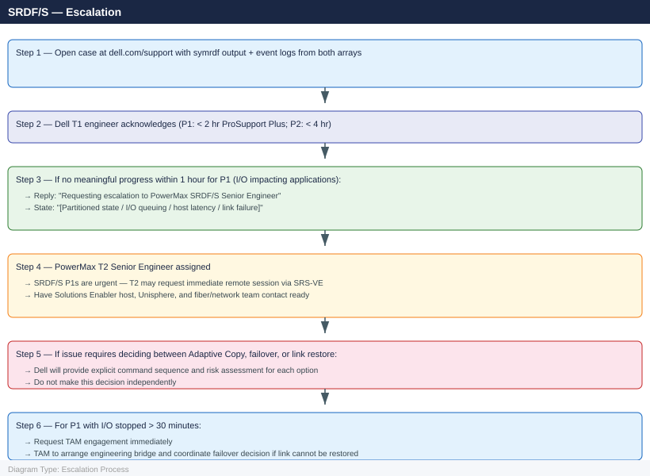

---
tags:
  - dell
  - troubleshooting
search:
  boost: 1.5
description: "How to escalate Dell SRDF/S (Symmetrix Remote Data Facility Synchronous) replication issues to Dell Technologies support: what data to collect, how to..."
---
# SRDF/S — Escalation

<div class="kb-summary">
How to escalate Dell SRDF/S (Symmetrix Remote Data Facility Synchronous) replication issues to Dell Technologies support: what data to collect, how to capture symrdf diagnostics, step-by-step case creation on dell.com/support, and the escalation path when progress stalls.

*Applies to: SRDF/S (Metro) on PowerMax 2500 / 8500 running PowerMaxOS 10.x*
</div>



---

```d2
direction: down

symptom: Identify Symptom {shape: diamond}
preescalation_selfcheck: "Pre-Escalation Self-Check" {shape: rectangle}
stepbystep_data_collection: "Step-by-Step Data Collection" {shape: rectangle}
how_to_open_the_case_on_dellcomsuppo: "How to Open the Case on dell.com/support" {shape: rectangle}
escalation_path: "Escalation Path" {shape: rectangle}
what_not_to_do: "What NOT to Do" {shape: rectangle}
useful_commands_for_case_updates: "Useful Commands for Case Updates" {shape: rectangle}
resolution: Resolve or Escalate {shape: oval}

symptom -> preescalation_selfcheck: investigate
symptom -> stepbystep_data_collection: investigate
symptom -> how_to_open_the_case_on_dellcomsuppo: investigate
symptom -> escalation_path: investigate
symptom -> what_not_to_do: investigate
symptom -> useful_commands_for_case_updates: investigate
preescalation_selfcheck -> resolution
stepbystep_data_collection -> resolution
how_to_open_the_case_on_dellcomsuppo -> resolution
escalation_path -> resolution
what_not_to_do -> resolution
useful_commands_for_case_updates -> resolution
```

## Before you begin

- **Access required:** Solutions Enabler (symcli) on a host with connectivity to both the R1 (production) and R2 (DR) PowerMax arrays; Unisphere access for both arrays; Dell support account at dell.com/support linked to both array serial numbers
- **Both arrays required:** SRDF/S issues always require data from both R1 and R2 — `symrdf` output and `symevent` must be captured from both SIDs
- **Do NOT run `symrdf failover`** without Dell direction — SRDF/S failover makes R2 read-write; the critical question is whether R1 and R2 were in sync at the moment of failure; this must be confirmed before any failover
- **Do NOT use `--force` flags** on symrdf commands — force flags on SRDF/S bypass synchronization checks and can leave the pair in an inconsistent state that cannot be restored without a full resync

---

## Pre-Escalation Self-Check

Run these before opening the case.

| Check | Command | Expected result |
|---|---|---|
| Production SID | `symcfg list` | Note 12-digit Symmetrix ID for R1 array |
| DR SID | `symcfg list` (on DR-side SE host or same host if registered) | Note 12-digit Symmetrix ID for R2 array |
| SRDF group states | `symdf list -sid <R1-SID>` | All groups in Synchronized state |
| SRDF pair state | `symrdf query -g <group>` | Pair state: Synchronized; R1: Ready; R2: WriteDisabled |
| RDF director ports | `symcfg -sid <SID> list -ra all` | All RDF directors Online |
| Host I/O state | Application and OS I/O error logs | No SCSI or FC errors on production hosts |
| Link latency | Unisphere → SRDF → Performance | Link latency within expected range (typically < 1 ms) |
| Recent events | `symevent -sid <SID> list -last 100` | No SRDF FAULT or CRITICAL events |

---

## Step-by-Step Data Collection

### 1. Get array serial numbers and Solutions Enabler version

```bash
# On the Solutions Enabler host

# All registered arrays (should show both R1 and R2 SIDs)
symcfg list

# Solutions Enabler version
symcli -version

# Microcode version on R1 and R2
symcfg -sid <R1-SID> show | grep -i microcode
symcfg -sid <R2-SID> show | grep -i microcode
```


```text title="Expected output"
Symmetrix ID               Microcode Version
000123456789012           5978.669.669
000198765432109           5978.669.669

Solutions Enabler Version: 9.2.1.0 (Build 123)

Microcode Version: 5978.669.669
Microcode Version: 5978.669.669
```

!!! warning "Common errors"
    | Error | Fix |
    |---|---|
    | `symcfg: Cannot find a Symmetrix` | Verify the R1-SID and R2-SID values are correct and the arrays are online and discoverable via `symcfg discover`. |
    | `symcli: command not found` | Ensure Solutions Enabler is installed and the bin directory is in your PATH, or use the full path `/opt/emc/SYMCLI/bin/symcli -version`. |
### 2. Capture SRDF group and pair state from both arrays

```bash
# All SRDF groups on R1
symdf list -sid <R1-SID> > /tmp/srdf-s-groups-$(date +%Y%m%d%H%M).txt

# All SRDF groups on R2 (should mirror R1)
symdf list -sid <R2-SID> >> /tmp/srdf-s-groups-$(date +%Y%m%d%H%M).txt

# Detailed pair state for each affected SRDF group
symrdf query -g <group-number> -v > /tmp/srdf-s-detail-$(date +%Y%m%d%H%M).txt

# Check for Partitioned state specifically
symrdf query -g <group-number> -v | grep -iE "Synchronized|Partitioned|Consistent|Invalid|pair state"
```


```text title="Expected output"
Symmetrix ID: 000123456789012
                                SRDF/S Group Information
Group #  Type  R1 Dev Count  R2 Dev Count  R1 SID         R2 SID         State
1        RDF   100           100           000123456789012 000987654321098 Synchronized
2        RDF   50            50            000123456789012 000987654321098 Synchronized
3        RDF   75            75            000123456789012 000987654321098 Partitioned
Symmetrix ID: 000987654321098
                                SRDF/S Group Information
Group #  Type  R1 Dev Count  R2 Dev Count  R1 SID         R2 SID         State
1        RDF   100           100           000123456789012 000987654321098 Synchronized
2        RDF   50            50            000123456789012 000987654321098 Synchronized
3        RDF   75            75            000123456789012 000987654321098 Partitioned

Pair State for Group 3:
  Pair State: Partitioned
  Last Synchronized: 2024-01-15 14:32:18
  Consistency State: Inconsistent
  RDF Link State: Down

Synchronized
Partitioned
Inconsistent
pair state: Partitioned
```

!!! warning "Common errors"
    | Error | Fix |
    |---|---|
    | `SRDF group <group-number> not found` | Verify the group number exists on the specified array using `symdf list -sid <SID>` first. |
    | `Symmetrix ID <R1-SID> does not exist or is not accessible` | Confirm the SID is correct and the array is reachable via `symcfg list -v`. |
    | `RDF Link Down - Cannot query pair state` | Check physical RDF link connectivity and restart the RDF daemon with `symrdf start -g <group-number>` after verifying cable connections. |
### 3. Capture RDF director and link state

```bash
# RDF directors on R1
symcfg -sid <R1-SID> list -ra all > /tmp/srdf-s-rdf-$(date +%Y%m%d).txt

# RDF directors on R2
symcfg -sid <R2-SID> list -ra all >> /tmp/srdf-s-rdf-$(date +%Y%m%d).txt

# RDF port-level details
symcfg -sid <R1-SID> list -ra all -v | grep -iE "port|status|online|offline"

# SRDF link bandwidth and latency (Unisphere alternative)
symrdf -sid <R1-SID> -g <group-number> perf summary
```


```text title="Expected output"
Symmetrix ID: 000123456789012
Director Information:
  Director 4a (RDF): Online, Port 0: Online, Port 1: Online
  Director 4b (RDF): Online, Port 0: Online, Port 1: Offline
  Director 5a (RDF): Online, Port 0: Online, Port 1: Online
  Director 5b (RDF): Online, Port 0: Online, Port 1: Online

Symmetrix ID: 000198765432109
Director Information:
  Director 3a (RDF): Online, Port 0: Online, Port 1: Online
  Director 3b (RDF): Online, Port 0: Online, Port 1: Online

Director 4a, Port 0: Online, Status: Ready
Director 4a, Port 1: Online, Status: Ready
Director 4b, Port 0: Online, Status: Ready
Director 4b, Port 1: Offline, Status: Link Down
Director 5a, Port 0: Online, Status: Ready
Director 5a, Port 1: Online, Status: Ready

SRDF Group 1 Performance Summary:
  Write Pending: 2048 tracks
  Average Latency: 12.3 ms
  Bandwidth: 487.5 MB/s
  RDF Link Status: Synchronized
```

!!! warning "Common errors"
    | Error | Fix |
    |---|---|
    | `Error: Could not connect to the Symmetrix array <R1-SID>` | Verify the SID is correct and the Symmetrix management port is reachable via `symcfg -sid <R1-SID> list -v`. |
    | `Error: RDF group <group-number> not found` | Confirm the group number exists with `symrdf -sid <R1-SID> list -g all` and use the correct group identifier. |
    | `Error: Permission denied` | Run the command with appropriate privileges using `sudo` or ensure your user is in the `symaccess` group. |
### 4. Capture event log from both arrays

```bash
# Last 500 events from R1 (production)
symevent -sid <R1-SID> list -last 500 > /tmp/srdf-s-events-r1-$(date +%Y%m%d).txt

# Last 500 events from R2 (DR)
symevent -sid <R2-SID> list -last 500 > /tmp/srdf-s-events-r2-$(date +%Y%m%d).txt

# Filter for SRDF events
grep -iE "SRDF|RDF|partition|fault|link" /tmp/srdf-s-events-r1-$(date +%Y%m%d).txt | head -50
```


```text title="Expected output"
/tmp/srdf-s-events-r1-20240115.txt
/tmp/srdf-s-events-r2-20240115.txt
01/15/2024 14:32:18 - SRDF Link State Change: R1 to R2 - Status: Synchronized
01/15/2024 14:28:45 - RDF Port 4 Link Up - Speed: 8Gbps
01/15/2024 14:15:22 - SRDF Partition Detected on R1 - Recovery in progress
01/15/2024 13:52:10 - RDF Link Fault: Transient error on Port 3 - Auto-recovery enabled
01/15/2024 13:45:33 - SRDF Replication Resumed - 2.3 TB synchronized
01/15/2024 13:22:17 - RDF Port 2 Link Down - Failover to alternate path
01/15/2024 12:58:04 - SRDF Consistency Group Update - 156 devices in sync
01/15/2024 12:34:51 - RDF Link State Change: R2 to R1 - Status: Synchronized
01/15/2024 12:10:19 - SRDF Partition Fault: Network isolation detected
01/15/2024 11:47:33 - RDF Port 1 Link Up - Replication resumed
```

!!! warning "Common errors"
    | Error | Fix |
    |---|---|
    | `symevent: command not found` | Ensure Symmetrix CLI tools are installed and the PATH includes the Symmetrix bin directory (typically `/opt/emc/SYMCLI/bin`). |
    | `grep: /tmp/srdf-s-events-r1-20240115.txt: No such file or directory` | Verify the symevent commands completed successfully and check that `/tmp` has write permissions. |
    | `ERROR: Invalid SID <R1-SID>` | Replace `<R1-SID>` and `<R2-SID>` with actual Symmetrix array serial numbers (e.g., `000123456789`). |
### 5. Write the timeline

```text
R1 array: PowerMax 8500, SID: 000XXXXXXXXXX (production, Site A — primary data center)
R2 array: PowerMax 2500, SID: 000YYYYYYYYYY (DR, Site B — DR site; 50 km apart)
PowerMaxOS: 10.1.0.2 (both)
Solutions Enabler: 10.1.0.18
SRDF configuration: SRDF/S synchronous (zero RPO); 1 RDF group (Group 5: 400 devices)
Link: Dark fiber 10 Gbps; normal latency 0.3 ms round-trip
Host connectivity: 48 production hosts connected to R1 via FC
Issue first observed: 2026-06-15 11:30 UTC
Last confirmed Synchronized state: 2026-06-15 11:25 UTC
Changes in 24h before the issue:
  - 11:25: Network team patched fiber amplifier on the dark fiber link
  - 11:30: symdf list: Group 5 transitions to "Partitioned" state
  - 11:32: Production hosts: SCSI I/O latency increase from 0.4 ms to 45 ms (SRDF/S holding writes)
  - 11:35: SRDF Adaptive Copy NOT enabled; hosts now queueing I/O; some applications timing out
Steps already taken:
  - Did NOT run symrdf failover
  - Did NOT enable Adaptive Copy
  - Fiber team: investigating if amplifier patch caused link instability
  - symrdf query -g 5: Pair state = Partitioned; R1 = Ready; R2 = WriteDisabled
Blast radius: 48 production hosts experiencing I/O delays (holding writes pending R2 ACK); applications queuing
```

---

## How to Open the Case on dell.com/support

1. Go to **dell.com/support** and sign in with your Dell account.

2. Click **My Cases** → **Create New Case**.

3. Under **Product**, enter the R1 (production) array serial number. Select **Dell PowerMax** as the product family.

4. Under **Severity**, select:
   - **Severity 1 — Production Down**: SRDF/S link failure has stopped host I/O (writes queueing indefinitely); Partitioned state with no automatic recovery; I/O timeouts causing application outages; failover required but blocked
   - **Severity 2 — Degraded**: SRDF/S in Partitioned state but Adaptive Copy is buffering writes; link is intermittent; latency has increased but I/O has not stopped; failover not yet required
   - **Severity 3 — Non-Critical**: SRDF/S degraded to a lower performance mode but synchronized; specific device group has a pair state warning; workaround available
   - **Severity 4 — General**: How-to, link sizing, Metro architecture planning, cycle time tuning

5. In the **Summary** field: symptom + impact. Example: `PowerMax 8500 SRDF/S Metro — Group 5 Partitioned since 11:30 UTC, 48 production hosts experiencing I/O latency, applications queuing`.

6. In the **Description** field, paste:
   - R1 and R2 SIDs and PowerMaxOS versions from Step 1
   - `symdf list` output from Step 2
   - `symrdf query` pair state detail from Step 2
   - RDF director states from Step 3
   - The event log SRDF entries from Step 4
   - The timeline from Step 5

7. Under **Attachments**, upload:
   - `srdf-s-groups-*.txt` and `srdf-s-detail-*.txt` from Steps 1 and 2
   - `srdf-s-rdf-*.txt` from Step 3
   - `srdf-s-events-r1-*.txt` and `srdf-s-events-r2-*.txt` from Step 4

8. Click **Submit**. You receive a case number immediately.

9. **Severity 1 only:** call Dell support after submission:
    - North America: +1 800 945 3355 (24×7 for production-down)
    - State "Severity 1 — SRDF/S Partitioned, host I/O queuing, applications timing out, case XXXXXXXX" at the start of the call.

---

## Escalation Path



---

## What NOT to Do

| Do NOT do this | Why | What to do instead |
|---|---|---|
| Run `symrdf failover` without Dell confirming R2 pair consistency | SRDF/S failover makes R2 read-write; if the link failed mid-write, R2 may have inconsistent data from the last write that was not fully committed | Let Dell confirm whether the last write cycle at the moment of failure was complete before any failover |
| Enable Adaptive Copy without Dell direction | Adaptive Copy allows writes to continue to R1 without waiting for R2; this extends the data gap and changes the RPO exposure; the correct response depends on the business decision | Confirm with Dell and the business whether extending the data gap is acceptable before enabling Adaptive Copy |
| Use `--force` on symrdf commands | Force flags bypass SRDF/S write-ordering and consistency checks; on a Partitioned group, a forced operation can permanently diverge R1 and R2 | Only use force on Dell's explicit instruction |
| Modify host masking views or disconnect hosts during the incident | Changing host access during an SRDF/S Partitioned state changes the I/O state Dell is trying to diagnose | Freeze all host-side changes until Dell confirms the SRDF state is understood |
| Pull or replace the RDF director HBA before Dell confirms it as the faulty component | Pulling the wrong component can extend the outage | Let Dell review the RDF director logs before any hardware change |
| Start a PowerMax microcode upgrade during the incident | Microcode upgrades on a PowerMax with a Partitioned SRDF/S group are blocked and will fail; attempting an upgrade will add a new error state | Wait for SRDF/S to return to Synchronized before any upgrade |

---

## Useful Commands for Case Updates

```bash
# Run on Solutions Enabler host — paste into every case update

# SRDF group states
symdf list -sid <R1-SID>

# Pair state detail for affected group
symrdf query -g <group-number> -v | grep -iE "pair state|R1 state|R2 state|synchronized|partitioned"

# RDF director states
symcfg -sid <R1-SID> list -ra all | grep -E "ONLINE|OFFLINE"
symcfg -sid <R2-SID> list -ra all | grep -E "ONLINE|OFFLINE"

# Recent SRDF events (last 20)
symevent -sid <R1-SID> list -last 20 | grep -iE "SRDF|RDF|partition|fault"
```


```text title="Expected output"
Symmetrix ID: 000123456789012
                                SRDF/S Group Information
Group  Pair  R1 State  R2 State  Synchronized  Mode      BW(MB/s)  Latency(ms)
1      1     Ready     Ready     Yes           Sync      850       12.3
1      2     Ready     Ready     Yes           Sync      850       12.1

Pair State Detail for Group 1:
Pair State: Synchronized
R1 State: Ready
R2 State: Ready
Synchronized: Yes
Partitioned: No

RDF Director States (R1 - SID 000123456789012):
Dir  Port  Status    Link State  Frames In   Frames Out
4a   0     ONLINE    Up          1847293     1847291
4a   1     ONLINE    Up          1847293     1847291
4b   0     ONLINE    Up          1847294     1847292

RDF Director States (R2 - SID 000198765432109):
Dir  Port  Status    Link State  Frames In   Frames Out
5a   0     ONLINE    Up          1847291     1847293
5a   1     ONLINE    Up          1847291     1847293

Recent SRDF Events (Last 20):
Timestamp             Severity  Event Type        Message
2024-01-15 14:32:18   INFO      SRDF              Group 1 synchronized
2024-01-15 13:47:02   WARNING   RDF Link Fault    Port 4b:1 link recovered
2024-01-15 13:46:58   CRITICAL  RDF Partition     R1-R2 link down, failover initiated
2024-01-15 13:46:45   INFO      SRDF              Replication resumed
```

!!! warning "Common errors"
    | Error | Fix |
    |---|---|
    | `symdf: Command not found` | Install EMC Solutions Enabler package or verify PATH includes /opt/emc/SYMCLI/bin. |
    | `Error: Invalid SID <R1-SID>` | Replace `<R1-SID>` with actual 12-digit Symmetrix ID (e.g., `000123456789012`). |
    | `symrdf query: Group <group-number> not found` | Verify the group number exists with `symrdf list` and confirm R1 and R2 arrays are both accessible. |
---

## Support SLA Reference

| Tier | Severity | Definition | Initial Response SLA |
|---|---|---|---|
| ProSupport Plus | P1 — Production Down | SRDF/S Partitioned; I/O stopped or queuing; host application outage | < 2 hours (24×7) |
| ProSupport Plus | P2 — Degraded | Partitioned with Adaptive Copy; latency elevated; RPO exposure growing | < 4 hours (24×7) |
| ProSupport Plus | P3 — Non-Critical | Performance degraded but synchronized; pair state warning on subset | Next business day |
| ProSupport Plus | P4 — General | How-to, link sizing, Metro architecture planning | Next business day |
| ProSupport | P1 | As above | < 4 hours (24×7) |

---

## See also

- [SRDF/S — Diagnostics](../diagnostics/)
- [SRDF/S — Common Issues](../common-issues/)

---

## Verify resolution

- Run `symdf list -sid <R1-SID>` and confirm all SRDF groups show Synchronized state
- Run `symrdf query -g <group>` for each group and confirm R1 = Ready, R2 = WriteDisabled, pair state = Synchronized
- Confirm host I/O latency has returned to baseline: check application logs and Unisphere performance metrics
- Run `symcfg -sid <SID> list -ra all` on both arrays and confirm all RDF directors are Online
- Run `symevent -sid <R1-SID> list -last 50` and confirm no new SRDF FAULT or CRITICAL events
- Monitor SRDF/S pair state for 15 minutes to confirm the groups remain in Synchronized state and do not transition to Partitioned again
