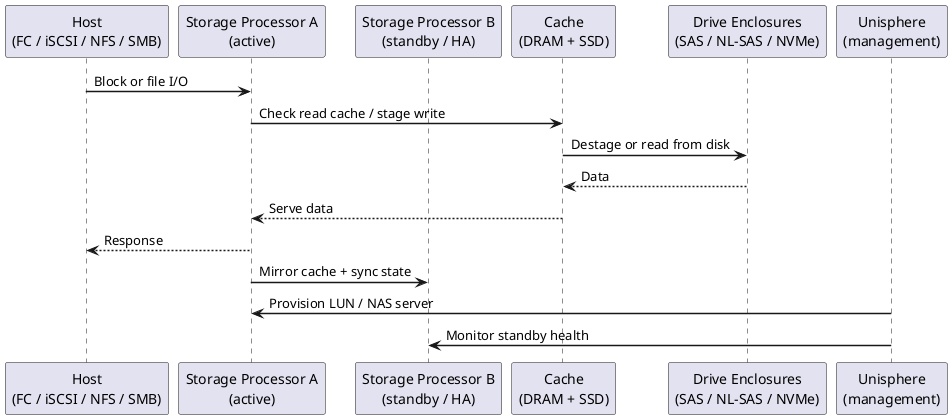
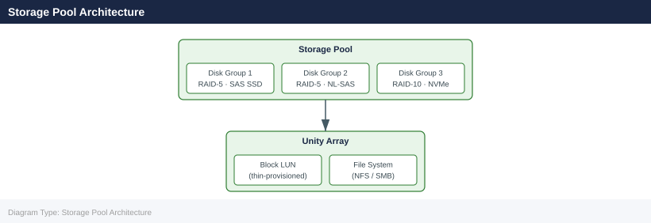

---
tags:
  - architecture
  - dell
---
# Unity — How It Works

<div class="kb-summary">
How It Works reference covering Overview, Architecture, HA and Write Cache Mirroring, Hardware Models, Storage Pool Architecture and 3 more sections.

*Applies to: Unity XT*
</div>




## Overview

Dell Unity XT is a mid-range unified storage platform delivering block (FC, iSCSI) and file (NFS, SMB) from a single system. It uses a dual storage processor (SP A / SP B) active-active architecture with write-cache mirroring. Administration is via Unisphere for Unity (GUI) or `uemcli` (CLI).

## Architecture

```d2
direction: right

SPA: "Storage Processor A\n(active for owned LUNs/NAS" {shape: rectangle}
SPB: "Storage Processor B" {shape: rectangle}
POOL: "Drive Pool\nRAID-5 / RAID-10 / NL-SAS" {shape: rectangle}
NAS: "NFS · SMB · FTP\nData Mover" {shape: rectangle}
SAN: "iSCSI · FC\nBlock LUNs" {shape: rectangle}
NH: "NAS Clients" {shape: rectangle}
SH: "SAN Hosts" {shape: rectangle}

SPA -> SPB
SPB -> POOL
SPA -> NAS
SPA -> SAN
SPB -> NAS
NAS -> SAN
NAS -> NH
SAN -> SH
```

## HA and Write Cache Mirroring

Unity XT uses an active-active dual-SP model:

- LUN and NAS server ownership is distributed across SP A and SP B
- Each resource is owned by exactly one SP at a time; resources can be rebalanced or fail over automatically
- Write cache is **continuously mirrored** between SPs over a dedicated internal interconnect — no acknowledged write is lost on SP failure
- Battery-backed units (BBUs) on each SP protect write cache during power loss
- On SP failure, the surviving SP takes ownership of all resources within ~30 seconds; host multipath drivers (PowerPath, MPIO) redirect automatically

## Hardware Models

| Model | Max Raw Capacity | Notes |
|---|---|---|
| Unity XT 380 | ~2 PB | Entry mid-range; hybrid or all-flash |
| Unity XT 480 | ~4 PB | Mid-range; higher SP performance |
| Unity XT 680 | ~8 PB | High-end mid-range |
| Unity XT 880 | ~12 PB | Maximum scale for mid-range |
| Unity All-Flash (F-series) | Varies | No spinning disk; optimised for low latency |
| UnityVSA | Software-defined | ESXi-hosted; dev/test and small environments only |

## Storage Pool Architecture



| Drive Type | Tier | Use |
|---|---|---|
| NVMe SSD | Tier 0 | Ultra-low latency; FAST VP performance tier |
| SAS SSD | Tier 1 | High IOPS; performance tier in hybrid pools |
| NL-SAS | Tier 3 | High capacity; archive and backup targets |

## Data Services

| Service | Description |
|---|---|
| Inline deduplication + compression | All-flash pools only; reduces effective capacity consumption |
| FAST VP | Automated sub-LUN tiering between drive tiers in a pool |
| FAST Cache | Dedicated SAS Flash drives as read/write cache for hybrid pools |
| Snapshots | Space-efficient redirect-on-write at LUN and filesystem level |
| Thin provisioning | Pool space consumed only as data is written |
| Consistency groups | Group LUNs for crash-consistent snapshots |
| Replication | Async or sync to a remote Unity or PowerStore |

## Networking

| Network | Protocol | Interface |
|---|---|---|
| Host block (FC) | Fibre Channel | 8/16/32 Gb FC HBAs |
| Host block (iSCSI) | iSCSI | 10/25 GbE Ethernet |
| Host file (NAS) | NFS / SMB | 10/25 GbE Ethernet |
| Management | HTTPS / SSH | Dedicated 1 GbE port per SP |

## Key CLI Commands

```bash
uemcli /env/health show -filter "health.value ne OK"  # health check
uemcli /stor/pool show -detail                         # pool capacity + FAST Cache
uemcli /sys/alert show                                 # active alerts
uemcli /rep/session show                               # replication session state
uemcli /sys/sw show                                    # installed OE version
uemcli /stor/snap show                                 # snapshot inventory
```


```text title="Expected output"
Health Status (Non-OK Items):
  ID                          Health          Severity
  spa_dae_0_disk_0            DEGRADED        WARNING
  spa_dae_1_disk_3            DEGRADED        WARNING

Pool Capacity and FAST Cache:
  Pool ID  Pool Name        Total Capacity  Used Capacity   FAST Cache
  pool_0   SAS_RAID5        10.7 TB         7.2 TB          256 GB
  pool_1   NL_SAS_RAID6     21.4 TB         18.9 TB         512 GB

Active Alerts:
  Alert ID  Severity  Component              Message
  12847     WARNING   spa_dae_0_disk_0       Disk predictive failure
  12851     CRITICAL  spa_spa_0_fc_port_0    FC port link down

Replication Session State:
  Session ID  Source Pool  Destination  Status      Last Sync
  rep_001     pool_0       10.20.1.45    ACTIVE      2024-01-15 14:32:18
  rep_002     pool_1       10.20.1.46    IDLE        2024-01-14 09:15:42

Installed OE Version:
  Version: 5.2.0.0 (Build 1234.567)
  Release Date: 2023-11-20

Snapshot Inventory:
  Snapshot ID      LUN ID  Pool ID  Size      Created
  snap_lun_001_1   lun_1   pool_0   512 GB    2024-01-15 10:22:00
  snap_lun_002_1   lun_2   pool_0   768 GB    2024-01-15 08:45:30
  snap_lun_003_1   lun_3   pool_1   1.2 TB    2024-01-14 22:10:15
```

!!! warning "Common errors"
    **`Error: Connection refused (10.20.1.10:443)`** — Verify the Unity array IP address is reachable and the management port is accessible; check firewall rules and array network configuration.
    **`Error: Authentication failed - Invalid credentials`** — Ensure the uemcli user account has appropriate permissions and the password is correct; verify credentials in the uemcli login session.
    **`Error: Command not found: uemcli`** — Install the EMC Unity CLI package or add the uemcli binary path to your system PATH environment variable.
---

## See also

- [Unity — Design Standards](../design-standards/)
- [Unity — Integrations](../integrations/)
- [Unity — Deploy](../../deploy/)
