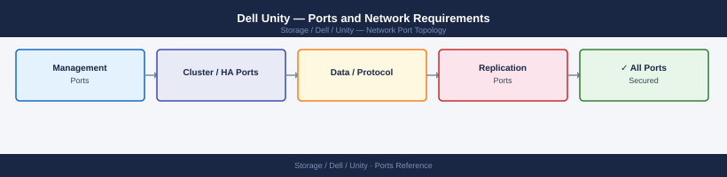

---
tags:
  - dell-unity
  - dell
  - networking
  - firewall
  - ports
  - storage
description: "Firewall port reference for Dell Unity XT storage arrays. Covers Unisphere management, NFS, SMB, iSCSI, and Unity native replication."
---
# Dell Unity — Ports and Network Requirements

<div class="kb-summary">
Firewall port reference for Dell Unity XT storage arrays. Covers Unisphere management, NFS, SMB, iSCSI, and Unity native replication.

*Applies to: Dell Unity XT / Unity 500 / UnityOS 5.x*
</div>


## Inbound — Management

| Port | Protocol | Source | Purpose |
|---|---|---|---|
| 443 | TCP | Admin workstations | Unisphere for Unity web UI and REST API |
| 22 | TCP | Jump hosts | SSH — Unity Unisphere CLI (uemcli) |
| 80 | TCP | Clients | HTTP — redirects to 443 |
| 161 | UDP | Monitoring | SNMP polling |

## Outbound

| Port | Protocol | Destination | Purpose |
|---|---|---|---|
| 162 | UDP | SNMP receiver | SNMP traps |
| 514 | UDP | Syslog server | Syslog forwarding |
| 123 | UDP | NTP | Time sync |
| 25 | TCP | SMTP relay | Alert email |
| 443 | TCP | esrs.dell.com, cloudiq.dell.com | ESRS / CloudIQ |

## Data Protocols

| Port | Protocol | Source | Purpose |
|---|---|---|---|
| 2049 | TCP/UDP | NFS clients | NFS file access |
| 111 | TCP/UDP | NFS v3 clients | rpcbind |
| 445 | TCP | SMB clients | SMB file access |
| 3260 | TCP | iSCSI initiators | iSCSI block storage |

## Replication

| Port | Protocol | Between | Purpose |
|---|---|---|---|
| 443 | TCP | Unity A mgmt IP ↔ Unity B mgmt IP | Unity native replication control and data |
| 8888 | TCP | Unity A ↔ Unity B | Unity replication data channel (some versions) |

## Firewall Zone Summary

| From | To | Ports | Notes |
|---|---|---|---|
| Admin clients | Unity mgmt IP | 443, 22 | Unisphere UI and CLI |
| NFS clients | Unity NFS data IPs | 2049, 111 | NFS |
| SMB clients | Unity SMB data IPs | 445 | SMB |
| iSCSI hosts | Unity iSCSI ports | 3260 | Block |
| Unity A mgmt | Unity B mgmt | 443 | Replication |

## Verify

```bash
# From admin workstation — test Unisphere
curl -sk -o /dev/null -w "%{http_code}" https://<unity-mgmt-ip>/api/types/basicSystemInfo/instances

# From NFS client
showmount -e <unity-nfs-ip>

# From iSCSI host
iscsiadm -m discovery -t sendtargets -p <unity-iscsi-ip>:3260
```


```text title="Expected output"
200
Export list for 192.168.1.50:
/export/nfs_pool_01       192.168.0.0/16
/export/nfs_pool_02       192.168.0.0/16
/export/nfs_backup        10.0.0.0/8
/export/nfs_archive       192.168.0.0/16

Discovering SCSI targets for 192.168.1.51:3260
192.168.1.51:3260,-1 iqn.1991-05.com.dell:storage.unity520.a1b2c3d4
192.168.1.51:3260,-1 iqn.1991-05.com.dell:storage.unity520.a1b2c3d5
```

!!! warning "Common errors"
    | Error | Fix |
    |---|---|
    | `curl: (7) Failed to connect to 192.168.1.50 port 443: Connection refused` | Verify the Unity management IP is correct and Unisphere service is running with `systemctl status unisphere` on the array. |
    | `clnt_create: RPC: Port mapper failure - Unable to receive: errno 111 (Connection refused)` | Confirm NFS service is enabled on the Unity array and the NFS IP is routable from the client. |
    | `iscsiadm: No records found` | Ensure iSCSI target portal is configured and active on the Unity array, and verify network connectivity to the iSCSI IP on port 3260. |
## See also

- [Dell Unity — Architecture](../how-it-works/)
- [Dell PowerStore — Ports](../../powerstore/architecture/ports.md)
