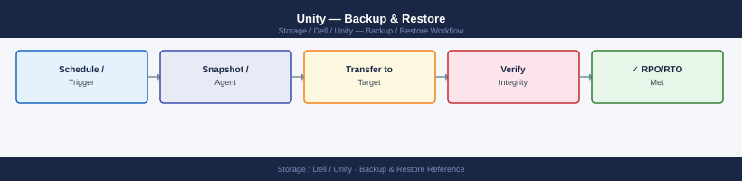
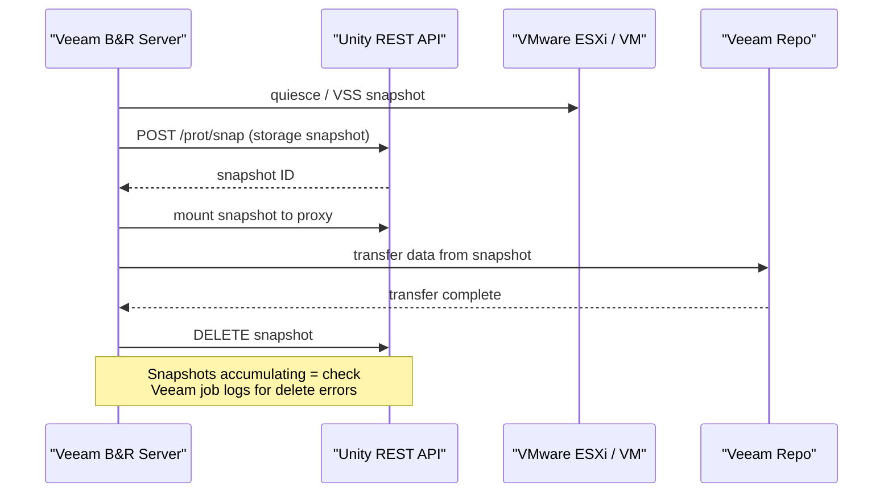
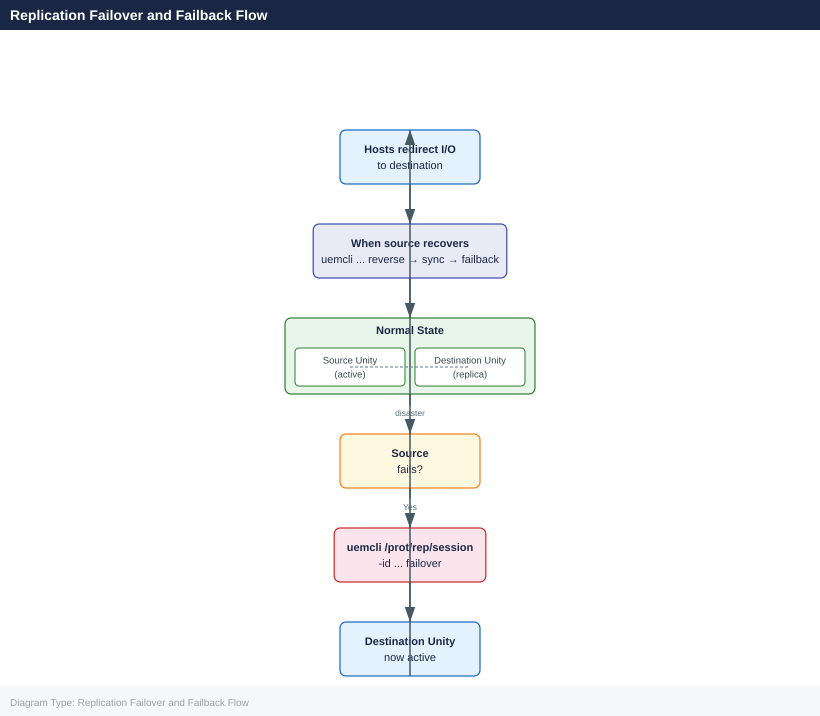

---
tags:
  - dell
  - operations
---
# Unity — Backup & Restore

<div class="kb-summary">
Backup & Restore reference covering Overview, Protection Method Selection, Native Snapshots, Snapshot Schedules, Veeam Backup & Replication Integration and 6 more sections.

*Applies to: Unity XT*
</div>


## Before you begin

- **Access:** Storage admin credentials (cluster admin or equivalent)
- **Timing:** safe to run during business hours unless a step is marked ⚠ (causes interruption)
- **Dependencies:** no active upgrades or migrations on the same infrastructure
- **Logging:** capture command output — paste into the change record on completion

---

## Overview

Dell Unity provides multiple data protection mechanisms that can be used independently or in combination. Match the protection method to the recovery objective:

| Method | RPO | RTO | Use Case |
|---|---|---|---|
| Native snapshots | Near-zero (last snapshot) | Minutes (attach and read) | Operational recovery — file deletion, LUN corruption |
| Replication (async) | Minutes to hours (configurable) | 30–60 minutes (failover) | Disaster recovery to secondary site |
| Replication (sync) | Zero (synchronous) | Minutes | DR for zero data loss requirements |
| Veeam Storage Snapshots | Last Veeam job run | Hours (restore from Veeam) | VM-level backup with Unity snapshot integration |
| NDMP backup | Last backup job | Hours (restore from tape/object) | NAS file system backup to external media |
| Clone (thin clone) | Point-in-time | Seconds (clone attach) | Dev/test environment refresh from production |

## Protection Method Selection

```d2
direction: right

TYPE: "TYPE" {shape: rectangle}
SNAP: "Native Snapshot\nRPO = last snap · RTO minutes" {shape: rectangle}
VBR: "Veeam Storage Snapshot\nintegration" {shape: rectangle}
NDMP: "NDMP to tape / object" {shape: rectangle}
REP: "REP" {shape: rectangle}
SYNC: "Synchronous Replication\nRPO = 0" {shape: rectangle}
ASYNC: "Asynchronous Replication\nRPO = configurable" {shape: rectangle}
DONE: "Recovery complete" {shape: rectangle}
FAULT: "Recovery scenario" {shape: rectangle}

TYPE -> SNAP
TYPE -> VBR
TYPE -> NDMP
REP -> SYNC
REP -> ASYNC
SNAP -> SYNC
SYNC -> ASYNC
ASYNC -> VBR
VBR -> NDMP
NDMP -> DONE
```

## Native Snapshots

Unity snapshots are space-efficient redirect-on-write copies stored within the same storage pool as the source resource. They consume space only for changed blocks after the snapshot is taken.

### Snapshot Basics

```bash
# List all snapshots (all resources)
uemcli -d <ip> -u admin /prot/snap show

# List snapshots for a specific LUN
uemcli -d <ip> -u admin /prot/snap show -res <lun_id>

# List snapshots for a specific file system
uemcli -d <ip> -u admin /prot/snap show -res <fs_id>

# Detailed snapshot view — creation time, expiry, size, state
uemcli -d <ip> -u admin /prot/snap show -detail
```


```text title="Expected output"
You are not logged in
Please enter your password:
Snapshot ID: snap_123456789
Resource ID: sv_1
Resource Type: LUN
Creation Time: 2024-01-15 14:32:18
Expiry Time: 2024-02-15 14:32:18
Size: 107374182400
State: Ready

Snapshot ID: snap_987654321
Resource ID: sv_1
Resource Type: LUN
Creation Time: 2024-01-10 09:15:42
Expiry Time: 2024-02-10 09:15:42
Size: 53687091200
State: Ready

Snapshot ID: snap_456789012
Resource ID: fs_42
Resource Type: FileSystem
Creation Time: 2024-01-12 11:47:05
Expiry Time: 2024-01-19 11:47:05
Size: 21474836480
State: Ready
...
```

!!! warning "Common errors"
    **`Error: Invalid resource ID <lun_id>`** — Verify the LUN ID exists using `uemcli -d <ip> -u admin /stor/lun show` and use the correct resource identifier format.
    **`Error: Connection refused to <ip>:443`** — Confirm the Unity array IP address is correct, reachable on the network, and the management interface is responding.
    **`Error: Authentication failed for user admin`** — Ensure the password is correct and the admin account has not been locked due to failed login attempts.
### Creating Snapshots

```bash
# Create a LUN snapshot
uemcli -d <ip> -u admin /prot/snap create \
    -name prod-oracle-lun01.20260507 \
    -res <lun_id>

# Create a file system snapshot
uemcli -d <ip> -u admin /prot/snap create \
    -name fs-oracle-prod.20260507 \
    -res <fs_id>

# Create a snapshot with an expiry time (auto-delete after 7 days)
uemcli -d <ip> -u admin /prot/snap create \
    -name prod-oracle-lun01.20260507 \
    -res <lun_id> \
    -retentionDuration 7d

# Create a consistency group snapshot (multiple LUNs, crash-consistent)
uemcli -d <ip> -u admin /prot/snap create \
    -name cg-oracle-prod.20260507 \
    -res <consistency_group_id>
```


```text title="Expected output"
Create snapshot 'prod-oracle-lun01.20260507' for LUN 'lun_123456'? (yes/no): yes
Snapshot created successfully. ID: snap_987654321
Create snapshot 'fs-oracle-prod.20260507' for filesystem 'fs_789012'? (yes/no): yes
Snapshot created successfully. ID: snap_987654322
Create snapshot 'prod-oracle-lun01.20260507' with 7-day retention for LUN 'lun_123456'? (yes/no): yes
Snapshot created successfully. ID: snap_987654323
Retention policy set: auto-delete after 7 days
Create snapshot 'cg-oracle-prod.20260507' for consistency group 'cg_345678'? (yes/no): yes
Snapshot created successfully. ID: snap_987654324
Consistency group snapshot created (4 LUNs included, crash-consistent)
```

!!! warning "Common errors"
    **`Error: Invalid resource ID <lun_id>`** — Verify the LUN ID exists by running `uemcli -d <ip> -u admin /stor/lun list` and use the correct ID from the output.
    **`Error: Authentication failed for user 'admin'`** — Ensure the password is correct and the admin user has snapshot creation privileges; use `-p` flag to provide password interactively if needed.
    **`Error: Snapshot name 'prod-oracle-lun01.20260507' already exists`** — Change the snapshot name to be unique or delete the existing snapshot with `uemcli -d <ip> -u admin /prot/snap delete -id <snap_id>` before retrying.
### Restoring from Snapshot

**LUN restore — full restore to point-in-time state:**

```bash
# Quiesce host I/O to the LUN before restoring
# (application-level quiesce or I/O pause on the host side)

# Restore a LUN from a snapshot (in-place — overwrites current LUN data)
uemcli -d <ip> -u admin /prot/snap -id <snap_id> restore

# Restore with backup of current state (creates a snap of current state before restoring)
uemcli -d <ip> -u admin /prot/snap -id <snap_id> restore -backupSnap
```


```text title="Expected output"
You are about to restore LUN from snapshot. This operation will overwrite the current LUN data.
Do you want to continue? (yes/no): yes
Restore operation initiated.
Snapshot ID: snap_20240115_prod_lun_001
Source LUN: lun_prod_db_01
Target LUN: lun_prod_db_01
Backup snapshot created: snap_20240115_prod_lun_001_backup_pre_restore
Restore in progress... 45%
Restore in progress... 90%
Restore completed successfully.
Operation ID: OP-2847-5f3a-9c2e
Duration: 2m 34s
```

!!! warning "Common errors"
    **`Error: Invalid snapshot ID <snap_id>`** — Verify the snapshot ID exists using `uemcli -d <ip> -u admin /prot/snap list` and replace `<snap_id>` with the correct identifier.
    **`Error: LUN is in use or I/O is still active`** — Ensure the host application is quiesced and all I/O to the LUN has stopped before initiating the restore operation.
    **`Error: Insufficient space for backup snapshot`** — Free up storage pool capacity or use the restore command without `-backupSnap` if a pre-restore backup is not required.
**LUN restore — attach snapshot for partial recovery:**

```bash
# Attach a snapshot as a separate LUN (read-only by default)
uemcli -d <ip> -u admin /prot/snap -id <snap_id> attach \
    -host <host_id> \
    -accessType readOnly

# After recovering files, detach the snapshot
uemcli -d <ip> -u admin /prot/snap -id <snap_id> detach
```


```text title="Expected output"
You are required to enter a password for admin:
Password: 
Attaching snapshot snap_12345678 to host esx-prod-01...
Snapshot snap_12345678 successfully attached as LUN 5 (read-only) on host esx-prod-01
LUN is accessible at /dev/sdq on the initiator

Detaching snapshot snap_12345678 from host esx-prod-01...
Snapshot snap_12345678 successfully detached from host esx-prod-01
```

!!! warning "Common errors"
    **`Error: Snapshot snap_12345678 is already attached to host esx-prod-01`** — Detach the snapshot from the host first using the detach command before attempting to re-attach it.
    **`Error: Host esx-prod-01 not found or not configured`** — Verify the host ID exists in the Unity array and is properly registered using `uemcli -d <ip> -u admin /host list`.
    **`Error: Access denied for user admin on array 192.168.1.100`** — Confirm the admin credentials are correct and the user has sufficient permissions to manage snapshots on the array.
**File system snapshot — recover individual files:**

```bash
# Access snapshot content via the .ckpt directory on the NAS server
# On a Linux NFS client, the snapshot appears under:
ls /mnt/nfs-mount/.ckpt/<snapshot_name>/

# For SMB clients, access via Previous Versions (right-click > Restore previous versions)
# or browse to \\<nas-ip>\<share>\.snapshot\<snapshot_name>\
```


```text title="Expected output"
total 48
drwxr-xr-x  12 root root  4096 Nov 15 10:23 .
drwxr-xr-x   3 root root  4096 Nov 15 10:23 ..
-rw-r--r--   1 user1 group1 2048576 Nov 15 09:45 database_backup.sql
-rw-r--r--   1 user1 group1 1024000 Nov 15 09:47 config_archive.tar.gz
drwxr-xr-x   5 user1 group1  4096 Nov 15 09:50 application_data/
-rw-r--r--   1 user1 group1 512000 Nov 15 09:52 logs_2024-11-15.zip
drwxr-xr-x   3 user1 group1  4096 Nov 15 09:55 reports/
```

!!! warning "Common errors"
    **`ls: cannot access '/mnt/nfs-mount/.ckpt/<snapshot_name>/': No such file or directory`** — Verify the NFS mount point is active with `mount | grep nfs` and confirm the snapshot name is correct and exists on the Unity array.
    **`Permission denied`** — Ensure your user has read permissions on the snapshot directory; check with `getfacl /mnt/nfs-mount/.ckpt/<snapshot_name>/` and request access from the storage administrator if needed.
**File system restore — full restore:**

```bash
# Full file system restore from snapshot
uemcli -d <ip> -u admin /prot/snap -id <snap_id> restore
```


```text title="Expected output"
The system is processing your request.
Restore operation initiated for snapshot ID: snap_12345678-abcd-ef01-2345-6789abcdef01
Restore job ID: restore_job_987654321
Status: IN_PROGRESS
Estimated time remaining: 12 minutes
Current progress: 23%
```

!!! warning "Common errors"
    **`Error: Invalid snapshot ID format`** — Verify the snapshot ID exists by running `uemcli -d <ip> -u admin /prot/snap list` and use the exact ID from the output.
    **`Error: Authentication failed for user admin`** — Confirm the Unity array IP is reachable, credentials are correct, and the admin user has restore permissions on the array.
    **`Error: Snapshot not found or already deleted`** — Check that the snapshot still exists and has not expired; restore operations cannot proceed on deleted or purged snapshots.
### Deleting Snapshots

```bash
# Delete a specific snapshot
uemcli -d <ip> -u admin /prot/snap -id <snap_id> delete

# List all expired snapshots (past retention date)
uemcli -d <ip> -u admin /prot/snap show | grep -i expired

# Bulk delete — delete all snapshots for a resource (use with caution)
for snap_id in $(uemcli -d <ip> -u admin /prot/snap show -res <lun_id> | awk '/^ID/ {print $3}'); do
    uemcli -d <ip> -u admin /prot/snap -id "$snap_id" delete
done
```


```text title="Expected output"
You are about to delete the snapshot. Do you want to continue? (yes/no): yes
The operation completed successfully.

ID                                     Name                 Resource    Expiration Time      Status
snap_20240115_prod_db_001              prod_db_backup       lun_5       2024-01-10 14:32:00  Expired
snap_20240112_prod_db_002              prod_db_backup       lun_5       2024-01-09 09:15:00  Expired
snap_20240108_archive_001              archive_data         lun_12      2024-01-07 23:45:00  Expired

Processing bulk delete for lun_5...
Deleting snap_20240115_prod_db_001... The operation completed successfully.
Deleting snap_20240112_prod_db_002... The operation completed successfully.
Deleting snap_20240108_archive_001... The operation completed successfully.
Bulk delete completed: 3 snapshots removed.
```

!!! warning "Common errors"
    **`Error: The snapshot ID <snap_id> does not exist or is invalid`** — Verify the snapshot ID exists by running `uemcli -d <ip> -u admin /prot/snap show` and confirm the exact ID format.
    **`Error: Authentication failed for user admin`** — Ensure the admin credentials are correct and the user has delete permissions on the storage array.
    **`Error: The snapshot cannot be deleted because it is locked by a clone or replication session`** — Check for dependent clones or active replication with `uemcli -d <ip> -u admin /prot/snap -id <snap_id> show` and remove dependencies before deletion.
## Snapshot Schedules

Automate snapshot creation with schedules. Unity supports daily, weekly, and interval-based schedules with configurable retention.

```bash
# List existing snapshot schedules
uemcli -d <ip> -u admin /prot/snapSchedule show
uemcli -d <ip> -u admin /prot/snapSchedule show -detail

# Create a daily schedule — runs at 02:00, keeps 7 copies
uemcli -d <ip> -u admin /prot/snapSchedule create \
    -name sched-daily-0200 \
    -type daily \
    -hour 2 \
    -minute 0 \
    -keepFor 7d

# Create an hourly schedule — keeps 24 copies (rolling 24 hours)
uemcli -d <ip> -u admin /prot/snapSchedule create \
    -name sched-hourly \
    -type hourlyClock \
    -interval 1 \
    -keepFor 24h

# Create a weekly schedule — runs every Sunday at 00:00, keeps 4 copies
uemcli -d <ip> -u admin /prot/snapSchedule create \
    -name sched-weekly-sunday \
    -type weekly \
    -daysOfWeek Sunday \
    -hour 0 \
    -minute 0 \
    -keepFor 28d

# Assign a schedule to a LUN
uemcli -d <ip> -u admin /stor/config/lun -id <lun_id> set \
    -snapSchedule <schedule_id>

# Assign a schedule to a file system
uemcli -d <ip> -u admin /stor/config/fs -id <fs_id> set \
    -snapSchedule <schedule_id>

# Remove a schedule assignment from a LUN
uemcli -d <ip> -u admin /stor/config/lun -id <lun_id> set \
    -snapSchedule ""

# Delete a schedule (only if no resources are currently assigned to it)
uemcli -d <ip> -u admin /prot/snapSchedule -id <schedule_id> delete
```


```text title="Expected output"
ID    | Name                  | Type         | Interval | Hour | Minute | DaysOfWeek | KeepFor
------|--------------------|----|----------|------|--------|------------|----------
1     | sched-daily-0200      | daily        | —        | 2    | 0      | —          | 7d
2     | sched-hourly          | hourlyClock  | 1        | —    | —      | —          | 24h
3     | sched-weekly-sunday   | weekly       | —        | 0    | 0      | Sunday     | 28d

Schedule "sched-daily-0200" created successfully.
ID: 1

Schedule "sched-hourly" created successfully.
ID: 2

Schedule "sched-weekly-sunday" created successfully.
ID: 3

Snapshot schedule assigned to LUN id_0x123abc.

Snapshot schedule assigned to filesystem fs_0x456def.

Snapshot schedule assignment removed from LUN id_0x123abc.

Schedule id_0x789ghi deleted successfully.
```

!!! warning "Common errors"
    **`Error: Cannot delete schedule. Schedule is currently assigned to 1 resource(s).`** — Remove all resource assignments using `set -snapSchedule ""` before deleting the schedule.
    **`Error: Invalid hour value '25'. Hour must be between 0 and 23.`** — Correct the `-hour` parameter to a value between 0 and 23.
    **`Error: Connection failed to <ip>. Check credentials and network connectivity.`** — Verify the IP address is reachable, admin credentials are correct, and the Unity array is online.
### Recommended Snapshot Schedule

| Protection Tier | Schedule | Retention | Use Case |
|---|---|---|---|
| Hourly | Every 1 hour | 24 copies (24 hours) | Active databases, high-churn workloads |
| Daily | 02:00 daily | 7 copies (1 week) | All production LUNs and file systems |
| Weekly | 00:00 Sunday | 4 copies (4 weeks) | Monthly point-in-time access for compliance |
| Monthly | 00:00 1st of month | 12 copies (1 year) | Long-term retention for regulated data |

Stack schedules on critical resources — assign both an hourly and a daily schedule to the same LUN or file system.

## Veeam Backup & Replication Integration

Veeam integrates with Unity via the Dell Unity Storage Plugin for Veeam. When configured, Veeam triggers Unity snapshots as part of its backup job, enabling:



- Crash-consistent Unity-level snapshots for VMs on Unity-backed datastores.
- Near-instant VM restore from Unity snapshots without reading backup media.
- SureBackup verification using snapshot-mounted VMs.

### Requirements

- Veeam Backup & Replication Enterprise or Enterprise Plus license.
- Dell Unity Storage Plugin for Veeam (download from Dell support portal).
- Unity credentials with **Storage Administrator** role for Veeam's service account.
- Unity array reachable from the Veeam Backup Server on port 443 (HTTPS/REST API).

### Configuration Steps

1. Install the Dell Unity Storage Plugin on the Veeam Backup Server.
2. In Veeam: **Storage Infrastructure > Add Storage > Dell EMC > Unity**.
3. Enter the Unity management IP, credentials, and click **Connect**.
4. Veeam discovers Unity volumes and can now trigger snapshots during backup jobs.
5. In the Veeam backup job settings: **Storage > Guest processing > Application-aware processing** — enable for VSS-consistent snapshots of VMs.

### Verifying Veeam Snapshot Integration

After the first backup job:

```bash
# Confirm Veeam-triggered snapshots appear in Unity
uemcli -d <ip> -u admin /prot/snap show | grep -i veeam

# Check snapshot consumption — Veeam snapshots should be cleaned up after backup
uemcli -d <ip> -u admin /prot/snap show -detail | grep -E "Name|Size|State"
```


```text title="Expected output"
Name: veeam_backup_vm01_20240115_0200
Size: 47.5 GB
State: Ready

Name: veeam_backup_vm02_20240115_0200
Size: 52.3 GB
State: Ready

Name: veeam_backup_vm03_20240115_0145
Size: 38.9 GB
State: Ready

Name: veeam_backup_db_prod_20240114_2300
Size: 156.7 GB
State: Ready
```

!!! warning "Common errors"
    **`Authentication failed`** — Verify the Unity array IP is reachable and credentials are correct with `uemcli -d <ip> -u admin /sys show`.
    **`Command: show not found`** — Ensure you are using the correct uemcli syntax; try `/prot/snap show` without additional flags first to confirm the command structure.
    **`No snapshots found`** — Confirm that Veeam backup jobs have completed and snapshots were created by checking Veeam job logs and Unity array event logs.
Veeam should delete its Unity snapshots after transferring the data to the backup repository. If Veeam snapshots accumulate, investigate the Veeam job logs for errors during snapshot deletion.

## CommVault IntelliSnap Integration

CommVault integrates with Unity using the IntelliSnap module. Configure Unity as a snap array in CommVault:

1. In CommVault, navigate to **Storage Resources > Arrays > Add Array**.
2. Select **Dell EMC Unity** as the array type.
3. Enter the Unity management IP, credentials, and configure the snap engine.
4. Test the array connection.
5. Assign Unity snap policies to subclient configurations.

CommVault triggers Unity snapshots at backup time, mounts them to a proxy server for data transfer, and then deletes the snap after the backup completes. Retain at least one IntelliSnap per backup cycle in the Unity snap pool as a fast-recovery option.

## NDMP Backup (NAS File Systems)

Unity NAS servers support NDMP (Network Data Management Protocol) for direct backup of NAS file systems to tape or object storage media without routing data through an application server.

```bash
# Enable NDMP on a NAS server
uemcli -d <ip> -u admin /net/nas/ndmp create \
    -server <nas_id> \
    -user ndmp_backup \
    -passwd "NdmpPassword1!" \
    -port 10000

# List NDMP configurations
uemcli -d <ip> -u admin /net/nas/ndmp show

# Disable NDMP on a NAS server
uemcli -d <ip> -u admin /net/nas/ndmp -id <ndmp_id> delete
```


```text title="Expected output"
NDMP created successfully.
ID: ndmp_1
Server: nas_server_01
User: ndmp_backup
Port: 10000
Status: Enabled

ID    | Server         | User          | Port  | Status
------|----------------|---------------|-------|--------
ndmp_1| nas_server_01  | ndmp_backup   | 10000 | Enabled
ndmp_2| nas_server_02  | ndmp_backup   | 10000 | Enabled

NDMP deleted successfully.
ID: ndmp_1
```

!!! warning "Common errors"
    **`Error: Invalid credentials for admin user`** — Verify the admin password is correct and the user account has not been locked after failed login attempts.
    **`Error: NAS server <nas_id> not found`** — Confirm the NAS server ID exists by running `uemcli -d <ip> -u admin /net/nas show` and use the correct server identifier.
    **`Error: Port 10000 is already in use`** — Change the NDMP port to an available port number (e.g., 10001) or verify no other NDMP instance is using that port.
Point the NDMP backup application to the NAS server IP and port 10000. Supported NDMP backup applications include Veritas NetBackup, IBM Tivoli Storage Manager, and Commvault (NDMP mode).

## Replication Failover and Failback Flow



## Replication as DR Protection

Unity asynchronous replication provides RPO-based protection to a secondary Unity or PowerStore array. See the [CLI Reference — Replication](cli-reference.md#replication) section for full replication commands.

```bash
# Show replication sessions with last sync time
uemcli -d <ip> -u admin /prot/rep/session show -detail

# Trigger an immediate sync before maintenance (reduce RPO to near-zero)
uemcli -d <ip> -u admin /prot/rep/session -id <session_id> sync

# Verify sync completed and note the current lag
uemcli -d <ip> -u admin /prot/rep/session -id <session_id> show -detail | \
    grep -E "State|Current Lag|Last Sync"
```


```text title="Expected output"
Session ID: rep_session_001
  Name: prod-db-to-dr
  Source Resource: lun_prod_db_001
  Destination Resource: lun_dr_db_001
  State: Synchronized
  Current Lag: 0 seconds
  Last Sync Time: 2024-01-15 14:32:18
  RPO: 3600 seconds
  Replication Type: Synchronous

Session ID: rep_session_002
  Name: fileserver-backup
  Source Resource: lun_fileserver_001
  Destination Resource: lun_dr_fileserver_001
  State: Synchronized
  Current Lag: 45 seconds
  Last Sync Time: 2024-01-15 14:31:52
  RPO: 300 seconds
  Replication Type: Asynchronous

Synchronizing session rep_session_001...
Sync operation initiated successfully. Session ID: rep_session_001

State: Synchronized
Current Lag: 2 seconds
Last Sync Time: 2024-01-15 14:35:47
```

!!! warning "Common errors"
    **`Error: Session <session_id> not found`** — Verify the session ID exists by running the show command without filters and confirm the exact session identifier.
    **`Error: Authentication failed for user admin`** — Ensure the admin credentials are correct and the user has replication management privileges on the Unity array.
    **`Error: Replication session is in Failed state and cannot sync`** — Check array event logs for the failure cause and resolve the underlying issue (network connectivity, storage capacity, or licensing) before retrying the sync.
For DR procedures including planned failover, failback, and reverse replication, see the [Procedures](procedures.md) page.

## Restore Validation

After any restore operation, run this validation sequence before declaring recovery complete:

### Post-Snapshot Restore Checklist

- [ ] `uemcli /env/health show -filter "health.value ne OK"` returns no output — no new faults introduced by the restore
- [ ] `uemcli /stor/config/pool show -detail` — pool capacity within acceptable range after restore; snapshot space has not caused pool to exceed 85% used
- [ ] LUN or file system is accessible from the target host (rescan SCSI bus on Linux, refresh disk on Windows)
- [ ] Application can read and write data from the restored volume — run application-level validation (database consistency check, application startup, file access test)
- [ ] Snapshot schedule remains active after restore — confirm the schedule still shows as assigned on the resource
- [ ] Document the restore: time, snapshot used, resource name, engineer, and application owner sign-off

### Backup Testing Schedule

| Activity | Frequency |
|---|---|
| Snapshot restore test (LUN) | Monthly — restore to a test host and validate data integrity |
| Snapshot restore test (NAS) | Monthly — restore a file system to a test NAS server and verify file access |
| Replication failover test | Quarterly — planned failover to DR site, confirm host connectivity, fail back |
| Veeam instant VM recovery test | Quarterly — power on a recovered VM from snapshot, confirm application starts |
| Full DR exercise | Annually — complete production-equivalent failover and failback with application owners |

Document all test outcomes including test date, resource tested, snapshot age, recovery time, and any issues encountered.

## Snapshot Capacity Management

Snapshots consume pool space for changed blocks. Uncontrolled snapshot growth can fill the pool and cause Unity to automatically invalidate older snapshots, which results in data loss.

```bash
# Show total snapshot space consumption per pool
uemcli -d <ip> -u admin /stor/config/pool show -detail | grep -E "Snap|Subscribed"

# Show space used by individual snapshots
uemcli -d <ip> -u admin /prot/snap show -detail | grep -E "Name|Size"

# Find the largest snapshots
uemcli -d <ip> -u admin /prot/snap show -detail | grep -E "Name|Size" | sort -k3 -rh | head -20
```


```text title="Expected output"
Pool Name: pool_sas_01
Snap Space Subscribed: 2.3 TB
Snap Space Used: 1.8 TB

Pool Name: pool_sas_02
Snap Space Subscribed: 5.7 TB
Snap Space Used: 4.2 TB

Name: backup_db_prod_20240115
Size: 847.5 GB

Name: backup_db_prod_20240114
Size: 623.2 GB

Name: backup_vm_cluster_20240115
Size: 512.8 GB

Name: backup_db_prod_20240113
Size: 489.1 GB

Name: archive_monthly_jan2024
Size: 356.4 GB
...
```

!!! warning "Common errors"
    **`uemcli: command not found`** — Install the Dell EMC CLI package or add its installation directory to your PATH environment variable.
    **`Authentication failed for user 'admin'`** — Verify the IP address is correct and the admin credentials are valid; use `-u <username> -p` to provide a password interactively if needed.
    **`Connection timeout to <ip>:443`** — Confirm the Unity array is reachable on the network and that port 443 is not blocked by a firewall.
### Pool Capacity Alerts for Snapshots

| Pool Free Space | Action |
|---|---|
| > 25% | Healthy — snapshots accumulating normally |
| 15–25% | Review and delete expired or unneeded snapshots |
| 10–15% | Delete snapshots aggressively; expand pool or add drives |
| < 10% | Emergency — Unity will begin auto-deleting oldest snapshots; immediate capacity action required |
| < 5% | Unity may invalidate snapshots and replication sessions to protect primary I/O — data loss risk |

Set capacity alerts in Unisphere at 70% and 80% consumed to get early warning before snapshot auto-deletion begins.

---

## Verify

- Confirm the operation completed without errors in the log or management UI
- Verify the expected state change is visible (service running, object created, config applied)
- Document the outcome in the change record

---

## See also

- [Unity — Procedures](../procedures/)
- [Unity — Health Checks](../health-checks/)
- [Unity — Common Issues](../../troubleshooting/common-issues/)
