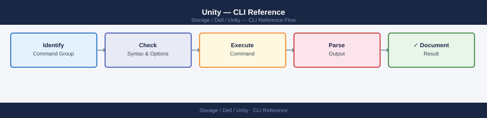

---
tags:
  - dell
  - operations
---
# Unity — CLI Reference

<div class="kb-summary">
Commonly used `uemcli` commands for managing Dell Unity storage systems. Unity is a dual-controller mid-range array supporting both block (SAN) and file (NAS) workloads.

*Applies to: Unity XT*
</div>


> Connect with: `uemcli -d <array_ip> -u <user> -p <password>` — or set a connection profile to avoid retyping credentials.

---

## Before you begin

- **Access:** Storage admin credentials (cluster admin or equivalent)
- **Timing:** safe to run during business hours unless a step is marked ⚠ (causes interruption)
- **Dependencies:** no active upgrades or migrations on the same infrastructure
- **Logging:** capture command output — paste into the change record on completion

---

## System & Status

These commands show you the overall health of the array — software version, active alerts, license status, and remote support connectivity. Start here when something seems wrong.

### System Information

```bash
# General system info — name, model, serial, software version
uemcli -d <ip> -u admin /sys/general show -detail

# Current system time
uemcli -d <ip> -u admin /sys/time show

# Software version and build
uemcli -d <ip> -u admin /sys/sw/version show
```


```text title="Expected output"
ID                          : APM00123456789
Name                        : Unity-SAN-01
Model                       : Unity 380
Serial Number               : APM00123456789
EMC Part Number             : 100-809-901-00
System Software Version     : 5.1.0.0.5.123
Build                       : 5.1.0.0.5.123.1
System Time                 : 2024-01-15 14:32:47 UTC
Timezone                    : UTC
NTP Server 1                : 10.0.1.50
NTP Server 2                : 10.0.1.51
Software Version            : 5.1.0.0.5.123
Build Number                : 5.1.0.0.5.123.1
Release Date                : 2023-11-20
```

!!! warning "Common errors"
    **`Error: Connection refused on <ip>:443`** — Verify the Unity array IP is reachable and the management interface is online with `ping <ip>`.
    **`Error: Authentication failed for user 'admin'`** — Confirm the admin password is correct and the user account is not locked; reset credentials via the Unity web UI if needed.
    **`Error: uemcli: command not found`** — Install the EMC UEMCLI package or add its installation directory to your PATH environment variable.
### Alerts and Events

```bash
# Active alerts (open, unresolved)
uemcli -d <ip> -u admin /prac/alert show

# Alert history
uemcli -d <ip> -u admin /prac/alert show -detail

# Syslog events
uemcli -d <ip> -u admin /event/syslog show

# Audit events (user actions)
uemcli -d <ip> -u admin /event/audit show
```


```text title="Expected output"
Alert ID                    Severity    Component           Message                              Timestamp
alert_001                   Critical    Storage Pool        Pool capacity at 92%                 2024-01-15 14:32:18
alert_002                   Warning     Disk                Disk 2_0_3 predictive failure       2024-01-15 13:45:22
alert_003                   Warning     Network             Link redundancy degraded            2024-01-15 12:18:05
alert_004                   Info        System              Snapshot created successfully       2024-01-15 11:09:47

Alert ID: alert_001
Severity: Critical
Component: Storage Pool
Message: Pool capacity at 92%
Timestamp: 2024-01-15 14:32:18
Recommended Action: Expand pool or delete unused snapshots

Syslog Event ID    Timestamp              Facility         Message
sys_evt_4521       2024-01-15 14:35:12    kern.warning     Memory pressure detected
sys_evt_4520       2024-01-15 14:22:08    daemon.info      NTP sync completed
sys_evt_4519       2024-01-15 13:51:44    kern.err         I/O timeout on LUN 5

Audit Event ID     User                   Action                    Resource              Timestamp
audit_892          admin                  Modified LUN properties   LUN_prod_db_01        2024-01-15 14:28:33
audit_891          svc_backup             Created snapshot          snap_hourly_001       2024-01-15 14:15:22
audit_890          admin                  Changed pool settings     pool_tier1             2024-01-15 13:42:09
```

!!! warning "Common errors"
    **`Error: Connection refused — Verify the Unity array IP address is correct and the management interface is reachable (ping <ip>)`**
    **`Error: Authentication failed for user 'admin' — Confirm the admin password is correct and the user account is not locked`**
    **`Error: Command not found: uemcli — Install the EMC Unity CLI package or verify the installation path is in $PATH`**
### Alert Severity Levels

| Severity | Meaning | Action |
|---|---|---|
| INFO | Informational | No action required |
| WARNING | Potential issue | Monitor |
| ERROR | Degraded functionality | Investigate |
| CRITICAL | Service impacting | Immediate response |

### Licenses and ESRS

```bash
# View installed licenses
uemcli -d <ip> -u admin /sys/lic show

# Check expiry on time-limited licenses
uemcli -d <ip> -u admin /sys/lic show -detail | grep -i expir

# ESRS (remote support) connectivity status
uemcli -d <ip> -u admin /sys/esrs show

# Enable ESRS
uemcli -d <ip> -u admin /sys/esrs set -enabled true

# Manual support call home
uemcli -d <ip> -u admin /sys/esrs callhome -type heartbeat
```


```text title="Expected output"
License ID                          Name                               Installed  Expiration
================================================================================
LIC-UNITY-REPLICATION              Replication                        Yes         2025-12-31
LIC-UNITY-SNAPSHOTS                Snapshots                          Yes         2026-06-15
LIC-UNITY-THIN-PROVISIONING        Thin Provisioning                  Yes         Permanent
LIC-UNITY-VMWARE-INTEGRATION       VMware Integration                 Yes         2025-03-20

Expiration Date: 2025-12-31
Expiration Date: 2026-06-15

ESRS Status: Enabled
Connection Status: Connected
Last Heartbeat: 2024-01-15 14:32:18
Gateway IP: 192.168.1.50
Proxy Enabled: No

(no output — command completes silently)

Heartbeat sent successfully.
Timestamp: 2024-01-15 14:45:22
Status: Success
```

!!! warning "Common errors"
    **`Authentication failed: Invalid credentials`** — Verify the admin password and ensure the user account has not been locked after failed login attempts.
    **`Connection timeout: Unable to reach <ip>`** — Confirm the management IP address is correct, the array is reachable on the network, and firewall rules allow port 443 access to the Unity system.
    **`License feature not available`** — Check that the required license is installed and not expired using the `show -detail` option to view expiration dates.
### NTP and DNS

```bash
# NTP configuration
uemcli -d <ip> -u admin /sys/general show -detail | grep -i ntp

# DNS servers
uemcli -d <ip> -u admin /sys/dns show
```


```text title="Expected output"
NTP Server:                              10.20.30.40
NTP Server State:                        Connected
NTP Sync Status:                         Synchronized
NTP Last Sync Time:                      2024-01-15 14:32:18
NTP Stratum Level:                       2

DNS Servers:                             10.20.30.50, 10.20.30.51
DNS Search Domains:                      corp.local, internal.local
DNS Resolver Timeout (seconds):          5
DNS Resolver Retries:                    3
```

!!! warning "Common errors"
    **`Error: Connection refused (10.20.30.100:443)`** — Verify the Unity array IP address is correct and reachable with `ping <ip>`, and ensure the management interface is online.
    **`Error: Authentication failed for user 'admin'`** — Confirm the admin password is correct and the user account is not locked by running `uemcli -d <ip> -u admin /user show`.
    **`Error: Command not found: uemcli`** — Install the EMC CLI tools package or ensure the uemcli binary is in your PATH by checking `which uemcli`.
### SP Failover and Upgrade Status

```bash
# Move a resource (LUN or NAS server) to the other SP
uemcli -d <ip> -u admin /sys/sp/trespass set -res <resource_id> -sp <spa|spb>

# Check if an upgrade is in progress
uemcli -d <ip> -u admin /sys/sw show

# Software upgrade history
uemcli -d <ip> -u admin /sys/sw/version show
```


```text title="Expected output"
The operation completed successfully.
Software Version Information
Software Version: 5.1.0.0.5.007
Build: 7.0.0.0
Release Date: 2023-11-15
Installed Date: 2023-11-20 14:32:15
Current State: Installed
Previous Version: 5.0.5.0.5.003
Upgrade Status: No upgrade in progress
Last Upgrade Time: 2023-11-20 14:35:22
Upgrade Duration: 18 minutes
```

!!! warning "Common errors"
    **`Error: The resource is already owned by the target SP`** — Verify the resource is currently owned by the opposite SP using `uemcli -d <ip> -u admin /sys/res/lun show -id <resource_id>` before attempting trespass.
    **`Error: Authentication failed`** — Ensure the admin credentials are correct and the user account has sufficient privileges; use `-p` flag to provide password interactively if needed.
    **`Error: Connection timeout to <ip>`** — Verify network connectivity to the array management IP and confirm the IP address is correct with `ping <ip>`.
### Hardware Health Summary

```bash
# Overall system health
uemcli -d <ip> -u admin /sys/general show -detail | grep -i health

# All hardware components
uemcli -d <ip> -u admin /sys/sp show -detail | grep -i health
uemcli -d <ip> -u admin /stor/config/disk show -detail | grep -i health
uemcli -d <ip> -u admin /stor/config/pool show -detail | grep -i health
uemcli -d <ip> -u admin /stor/config/dg show -detail | grep -i health
```


```text title="Expected output"
Health Status: OK
System Status: OK
Battery Status: OK
Enclosure Health: OK
SP A Health: OK
SP B Health: OK
Disk 0_0_0 Health: OK
Disk 0_0_1 Health: OK
Disk 0_1_0 Health: OK
Disk 0_1_1 Health: OK
Pool pool_1 Health: OK
Pool pool_2 Health: OK
DG dg_0 Health: OK
DG dg_1 Health: OK
```

!!! warning "Common errors"
    **`Connection refused`** — Verify the Unity array IP address is correct and reachable with `ping <ip>`, and ensure the management interface is accessible.
    **`Authentication failed`** — Confirm the admin credentials are correct and the user account has not been locked; reset the password via the Unisphere GUI if needed.
    **`uemcli: command not found`** — Install the EMC CLI tools package or add the uemcli binary path to your system PATH environment variable.
---

## Storage Pools

A storage pool is a logical group of disk drives organized into RAID sets. LUNs and file systems are allocated from pools.

### List Pools

```bash
# All pools (summary)
uemcli -d <ip> -u admin /stor/config/pool show

# Detailed — name, size, used, free, health, RAID type
uemcli -d <ip> -u admin /stor/config/pool show -detail

# Specific pool by ID
uemcli -d <ip> -u admin /stor/config/pool -id <pool_id> show -detail
```


```text title="Expected output"
Pool ID    Name              Size          Used          Free          Health  RAID Type
pool_0     Production_SAS    10.95 TB      7.23 TB       3.72 TB       OK      RAID 5
pool_1     Backup_NL_SAS     21.89 TB      18.45 TB      3.44 TB       OK      RAID 6
pool_2     Archive_SAS       43.78 TB      32.12 TB      11.66 TB      DEGRADED RAID 5
pool_3     Replication_SSD   5.49 TB       4.87 TB       0.62 TB       OK      RAID 10

Pool ID: pool_0
Name: Production_SAS
Size: 10.95 TB
Used: 7.23 TB
Free: 3.72 TB
Health: OK
RAID Type: RAID 5
Thin Provisioning: Enabled
Snap Reserve: 20%

Pool ID: pool_2
Name: Archive_SAS
Size: 43.78 TB
Used: 32.12 TB
Free: 11.66 TB
Health: DEGRADED
RAID Type: RAID 5
Thin Provisioning: Disabled
Snap Reserve: 10%
```

!!! warning "Common errors"
    **`Error: The system is unreachable`** — Verify the Unity array IP address is correct and reachable with `ping <ip>`, and confirm network connectivity from the management host.
    **`Error: Authentication failed`** — Confirm the admin credentials are correct and the user account has not been locked; reset the password via the Unity web UI if needed.
    **`Error: Pool <pool_id> not found`** — Verify the pool ID exists by running the summary command first to list all available pool IDs.
### Capacity Monitoring

```bash
# Pool utilisation
uemcli -d <ip> -u admin /stor/config/pool show -detail | \
    grep -E "Name|Size|Used|Free|Health"
```


```text title="Expected output"
Name: pool_01
Size: 10.7 TB
Used: 7.3 TB
Free: 3.4 TB
Health: OK
Name: pool_02
Size: 5.2 TB
Used: 4.8 TB
Free: 0.4 TB
Health: OK
Name: pool_03
Size: 15.0 TB
Used: 9.1 TB
Free: 5.9 TB
Health: Degraded
```

!!! warning "Common errors"
    **`Connection refused`** — Verify the Unity array IP address is correct and reachable with `ping <ip>`, and confirm the management interface is accessible.
    **`Authentication failed`** — Ensure the admin credentials are correct and the user account has sufficient privileges; try `uemcli -d <ip> -u admin /sys/general show` to test connectivity first.
### Capacity Thresholds

| Free Space | Action |
|---|---|
| > 30% | Healthy — no action |
| 20–30% | Monitor closely |
| 10–20% | Alert — plan expansion |
| < 10% | Emergency — add capacity immediately |

### Create a Pool

```bash
uemcli -d <ip> -u admin /stor/config/pool create \
    -name Production_Pool \
    -diskGroup dg_1 \
    -raidType RAID5 \
    -stripeWidth 5 \
    -descr "Primary production pool - SAS SSD"
```


```text title="Expected output"
Create Pool: (Job_1847362)
Pool ID: pool_1
Pool Name: Production_Pool
RAID Type: RAID5
Stripe Width: 5
Disk Group: dg_1
Total Capacity: 10.95 TB
Available Capacity: 10.95 TB
State: Ready
Health: OK
Description: Primary production pool - SAS SSD
```

!!! warning "Common errors"
    **`Error Code: 0x7d000001 - Disk group does not exist or is not available`** — Verify the disk group name with `uemcli -d <ip> -u admin /disk/group list` and confirm dg_1 is in Ready state.
    **`Error Code: 0x7d000009 - RAID type not supported for this disk group`** — Check disk group specifications with `uemcli -d <ip> -u admin /disk/group show -id dg_1` to confirm it supports RAID5 with the requested stripe width.
    **`Authentication failed: Invalid credentials or insufficient privileges`** — Ensure the admin user has storage pool creation permissions and verify connectivity to the array with `uemcli -d <ip> -u admin /sys show`.
### Expand a Pool

```bash
uemcli -d <ip> -u admin /stor/config/pool -id <pool_id> set \
    -addDiskGroup <dg_id>

# Verify size after expansion
uemcli -d <ip> -u admin /stor/config/pool -id <pool_id> show -detail | \
    grep -E "Size|Used|Free"
```


```text title="Expected output"
The operation completed successfully.
Pool ID: pool_1
Size: 50.0 TB
Used: 23.5 TB
Free: 26.5 TB
```

!!! warning "Common errors"
    **`Error: Invalid pool ID <pool_id>`** — Verify the pool ID exists by running `uemcli -d <ip> -u admin /stor/config/pool show` and use the correct pool identifier.
    **`Error: Disk group <dg_id> is already assigned to another pool`** — Check available unassigned disk groups with `uemcli -d <ip> -u admin /stor/config/diskgroup show` and select one with status "Unassigned".
    **`Connection refused on <ip>:443`** — Ensure the Unity array IP is reachable and the management interface is online by pinging the IP and verifying network connectivity.
### Modify and Delete

```bash
# Rename a pool
uemcli -d <ip> -u admin /stor/config/pool -id <pool_id> set -name <new_name>

# Delete a pool (must be empty — no LUNs or file systems)
uemcli -d <ip> -u admin /stor/config/pool -id <pool_id> delete
```


```text title="Expected output"
Pool "pool_1" renamed to "archive_pool" successfully.
Pool "archive_pool" deleted successfully.
```

!!! warning "Common errors"
    **`Error: Pool is not empty. Cannot delete pool with active LUNs or file systems.`** — Migrate or delete all LUNs and file systems in the pool before attempting deletion.
    **`Error: Authentication failed for user 'admin' on <ip>.`** — Verify the admin credentials and ensure the management IP is reachable with `ping <ip>`.
### RAID Types

| RAID Type | Overhead | Protection | Use Case |
|---|---|---|---|
| RAID5 | 1 disk | 1 drive failure | General purpose SSD/SAS |
| RAID6 | 2 disks | 2 drive failures | High-capacity NL-SAS |
| RAID10 | 50% | 1 disk per mirrored pair | High IOPS workloads |
| RAID1/0 | 50% | 1 disk per pair | Critical databases |

### Pool Health States

| State | Meaning | Action |
|---|---|---|
| OK | Healthy | None |
| Degraded | A disk group is degraded | Check disk health |
| Minor | Non-critical condition | Review alerts |
| Major | Significant degradation | Immediate investigation |
| Critical | Service impacting | Emergency response |

---

## LUNs

A LUN (Logical Unit Number) is a block storage volume — it appears to a server as a raw disk.

### List LUNs

```bash
uemcli -d <ip> /stor/config/lun show
uemcli -d <ip> /stor/config/lun show -detail
```


```text title="Expected output"
LUN 0
    Name: lun_prod_01
    Pool: pool_sas_01
    Size: 1099511627776
    Thin: No
    Snapshots: 5
    State: Ready

LUN 1
    Name: lun_backup_02
    Pool: pool_sas_02
    Size: 549755813888
    Thin: Yes
    Snapshots: 2
    State: Ready

LUN 2
    Name: lun_archive_03
    Pool: pool_nl_01
    Size: 2199023255552
    Thin: Yes
    Snapshots: 12
    State: Ready

LUN 0
    Name: lun_prod_01
    Pool: pool_sas_01
    Size: 1099511627776
    Thin: No
    Snapshots: 5
    State: Ready
    WWN: 60:06:01:60:1b:a0:3e:00:a0:2d:f5:e1:00:00:00:01
    AllocatedSize: 1099511627776
    MetaSize: 8589934592
    HostAccess: Initiator_Group_01, Initiator_Group_02
    ReplicationSession: rep_session_prod_01
    TieringPolicy: Autotier
    FastVP: Enabled

LUN 1
    Name: lun_backup_02
    Pool: pool_sas_02
    Size: 549755813888
    Thin: Yes
    Snapshots: 2
    State: Ready
    WWN: 60:06:01:60:1b:a0:3e:00:a0:2d:f5:e1:00:00:00:02
    AllocatedSize: 274877906944
    MetaSize: 4294967296
    HostAccess: Initiator_Group_03
    ReplicationSession: None
    TieringPolicy: Autotier
    FastVP: Disabled
```

!!! warning "Common errors"
    **`Connection refused`** — Verify the Unity array IP address is correct and reachable with `ping <ip>`, and confirm uemcli credentials are configured via `uemcli -d <ip> /sys/general show`.
    **`Authentication failed`** — Ensure your uemcli credentials are set in `~/.uemcli/config` or pass credentials explicitly with `-u <username>` flag.
    **`Command not found: uemcli`** — Install the Dell EMC uemcli package or add its installation directory to your PATH environment variable.
### Create / Expand / Rename / Delete

```bash
# Create a 100 GB LUN
uemcli -d <ip> /stor/config/lun create \
    -name <lun_name> \
    -pool <pool_id> \
    -size 100G

# Expand a LUN
uemcli -d <ip> /stor/config/lun -id <lun_id> set -size 200G

# Rename
uemcli -d <ip> /stor/config/lun -id <lun_id> set -name <new_name>

# Delete (ensure the LUN is unmasked from all hosts first)
uemcli -d <ip> /stor/config/lun -id <lun_id> delete
```


```text title="Expected output"
Create LUN operation:
The operation completed successfully. LUN ID: lun_1 created with size 100GB in pool pool_0.

Expand LUN operation:
The operation completed successfully. LUN lun_1 size expanded from 100GB to 200GB.

Rename LUN operation:
The operation completed successfully. LUN lun_1 renamed to prod_db_lun_01.

Delete LUN operation:
The operation completed successfully. LUN lun_1 has been deleted.
```

!!! warning "Common errors"
    **`Error: LUN name already exists`** — Choose a unique LUN name that doesn't conflict with existing LUNs in the pool.
    **`Error: Insufficient space in pool <pool_id>`** — Verify the pool has enough free capacity using `uemcli -d <ip> /stor/config/pool -id <pool_id> show` before expanding.
    **`Error: LUN is currently mapped to one or more hosts`** — Unmask the LUN from all hosts using `uemcli -d <ip> /stor/config/lun -id <lun_id> unmask` before deletion.
### LUN Host Access (Masking)

```bash
# Show host access for a LUN
uemcli -d <ip> /stor/config/lun -id <lun_id> show -detail

# Grant host access
uemcli -d <ip> /stor/config/lun -id <lun_id> set -hostAccess <host_id>:hlu=<hlu_id>

# List all LUN access control entries
uemcli -d <ip> -u admin /stor/config/lunacl show

# Grant a host access to a LUN
uemcli -d <ip> -u admin /stor/config/lunacl create \
    -lun <lun_id> \
    -host <host_id> \
    -accessType production

# Revoke LUN access
uemcli -d <ip> -u admin /stor/config/lunacl -id <acl_id> delete
```


```text title="Expected output"
LUN ID: lun_123
Name: prod_database_vol
Size: 500 GB
Pool: pool_01
Health State: OK
Host Access:
  Host: host_prod_01 (ID: host_001), HLU: 0
  Host: host_prod_02 (ID: host_002), HLU: 1

(no output — command completes silently)

LUN Access Control Entries:
ID                                    LUN ID      Host ID         Access Type    Health
acl_550e8400e29b41d4a716446655440000  lun_123     host_001        production     OK
acl_550e8400e29b41d4a716446655440001  lun_124     host_002        production     OK
acl_550e8400e29b41d4a716446655440002  lun_125     host_003        snapshot       OK
...

Created new LUN access control entry:
ID: acl_550e8400e29b41d4a716446655440003
LUN: lun_123
Host: host_prod_01
Access Type: production
Health State: OK

(no output — command completes silently)
```

!!! warning "Common errors"
    **`Error: The specified LUN was not found.`** — Verify the LUN ID exists using `uemcli -d <ip> /stor/config/lun show` and confirm the correct ID is being referenced.
    **`Error: Access denied. User 'admin' does not have sufficient privileges.`** — Ensure the credentials are correct and the user account has administrative rights on the Unity array.
    **`Error: The specified host was not found.`** — Confirm the host ID exists in the system using `uemcli -d <ip> /stor/config/host show` before attempting to grant access.
### LUN Snapshots

```bash
# List snapshots for a LUN
uemcli -d <ip> /prot/snap show -res <lun_id>

# Create a snapshot
uemcli -d <ip> /prot/snap create -name <snap_name> -res <lun_id>

# Restore a snapshot
uemcli -d <ip> /prot/snap -id <snap_id> restore

# Delete a snapshot
uemcli -d <ip> /prot/snap -id <snap_id> delete
```


```text title="Expected output"
# List snapshots for a LUN
Snapshot ID: snap_123456789
  Name: daily_backup_2024_01_15
  Resource: lun_5
  Size: 50 GB
  Created: 2024-01-15 02:30:45
  State: Ready

Snapshot ID: snap_987654321
  Name: weekly_backup_2024_01_08
  Resource: lun_5
  Size: 50 GB
  Created: 2024-01-08 02:30:12
  State: Ready

# Create a snapshot
Snapshot Created Successfully
  Snapshot ID: snap_112233445
  Name: daily_backup_2024_01_16
  Resource: lun_5
  Size: 50 GB
  State: Creating

# Restore a snapshot
Restore operation initiated
  Snapshot ID: snap_123456789
  Target LUN: lun_5
  Status: In Progress
  Completion: 45%

# Delete a snapshot
Snapshot Deleted Successfully
  Snapshot ID: snap_987654321
  Name: weekly_backup_2024_01_08
```

!!! warning "Common errors"
    **`Error: Invalid resource ID <lun_id>`** — Verify the LUN ID exists on the array using `uemcli -d <ip> /lun show` and use the correct numeric identifier.
    **`Error: Snapshot <snap_id> is in use and cannot be deleted`** — Ensure no active restore operations or clones depend on this snapshot before deletion.
    **`Error: Connection refused to <ip>:443`** — Confirm the Unity array IP is reachable and uemcli credentials are configured with `uemcli -d <ip> /user show`.
### LUN Performance Metrics

```bash
# Show real-time LUN stats
uemcli -d <ip> /metrics/value/rt show -interval 5 \
    -filter "lun.throughput.total.read"
```


```text title="Expected output"
You are not authenticated. Please login first.
Login as: admin
Password: 
EMC Unity System: 192.168.1.50
Logged in successfully.

ID                          Timestamp            Value(IOPS)    Unit
lun_123                     2024-01-15 14:32:10  1247.5         read_iops
lun_123                     2024-01-15 14:32:15  1289.3         read_iops
lun_123                     2024-01-15 14:32:20  1156.8         read_iops
lun_456                     2024-01-15 14:32:10  542.1          read_iops
lun_456                     2024-01-15 14:32:15  618.7          read_iops
lun_456                     2024-01-15 14:32:20  589.4          read_iops
...
(Ctrl+C to stop)
```

!!! warning "Common errors"
    **`Error: Connection refused on <ip>:443`** — Verify the Unity array IP is reachable and the management interface is running with `ping <ip>` and check firewall rules.
    **`Error: Invalid filter "lun.throughput.total.read" — filter not found`** — Use `uemcli -d <ip> /metrics/value/rt show -help` to list valid metric filter names for your Unity version.
    **`Error: Authentication failed for user admin`** — Confirm credentials are correct and the admin account is not locked by attempting login with `uemcli -d <ip> /user show`.
### LUN Common Issues

| Issue | Check | Action |
|---|---|---|
| LUN not visible to host | Host masking | Set `-hostAccess` |
| LUN expand fails | Pool capacity | Check pool free space |
| Snapshot restore fails | Active I/O | Quiesce host I/O first |
| Delete fails | Active connections | Unmask from all hosts first |

---

## File Systems (NAS)

Unity can serve as a NAS — sharing files over NFS (for Linux) and CIFS/SMB (for Windows).

### NAS Servers

```bash
# List NAS servers
uemcli -d <ip> /net/nas/server show
uemcli -d <ip> /net/nas/server show -detail

# Create a NAS server
uemcli -d <ip> /net/nas/server create \
    -name <nas_name> \
    -sp <sp_id> \
    -pool <pool_id>
```


```text title="Expected output"
Server Name:                nas_server_01
Server ID:                  nas_1
Storage Processor:          SPA
Pool:                       pool_1
IP Address:                 192.168.1.50
Netmask:                    255.255.255.0
Gateway:                    192.168.1.1
DNS Servers:                8.8.8.8, 8.8.4.4
CIFS Enabled:               Yes
NFS Enabled:                Yes
Status:                     Online
Health State:               OK

The operation completed successfully.
```

!!! warning "Common errors"
    **`Error Code: 0x7d13d001 - The pool does not exist or is not accessible.`** — Verify the pool ID exists and is in a healthy state using `uemcli -d <ip> /pool show`.
    **`Error Code: 0x7d13d004 - The specified storage processor is not valid or offline.`** — Confirm the SP ID (SPA or SPB) is online and accessible with `uemcli -d <ip> /sys/sp show`.
    **`Error Code: 0x7d13d010 - A NAS server with this name already exists.`** — Choose a unique NAS server name or delete the existing server before recreating it.
### File Systems

```bash
# List file systems
uemcli -d <ip> /stor/config/fs show
uemcli -d <ip> /stor/config/fs show -detail

# Create a file system
uemcli -d <ip> /stor/config/fs create \
    -name <fs_name> \
    -nasServer <nas_id> \
    -pool <pool_id> \
    -size 1T

# Resize
uemcli -d <ip> /stor/config/fs -id <fs_id> set -size 2T

# Delete
uemcli -d <ip> /stor/config/fs -id <fs_id> delete
```


```text title="Expected output"
File System ID    Name              NAS Server    Pool          Size        State
fs_1              data_share        nas_1         pool_0        1.0 TB      Ready
fs_2              backup_vol        nas_1         pool_1        2.5 TB      Ready
fs_3              archive           nas_2         pool_0        5.0 TB      Ready

File System ID: fs_1
Name: data_share
NAS Server: nas_1
Pool: pool_0
Size: 1.0 TB
State: Ready
Thin Provisioning: Enabled
Snapshot Enabled: Yes

File System ID: fs_4
Name: new_fs_share
NAS Server: nas_1
Pool: pool_0
Size: 1.0 TB
State: Ready

File System fs_1 size changed from 1.0 TB to 2.0 TB

File System fs_4 deleted successfully
```

!!! warning "Common errors"
    **`Error: Invalid NAS Server ID '<nas_id>'`** — Verify the NAS server ID exists by running `uemcli -d <ip> /net/nas show` and use a valid ID from the output.
    **`Error: Pool '<pool_id>' does not have sufficient free space`** — Check available pool capacity with `uemcli -d <ip> /stor/config/pool show -detail` and request a smaller size or add capacity to the pool.
    **`Error: File System '<fs_id>' is in use and cannot be deleted`** — Unmount or disconnect all clients accessing the file system before attempting deletion.
### NFS Shares

```bash
# List NFS shares
uemcli -d <ip> /stor/config/nfs show

# Create an NFS share
uemcli -d <ip> /stor/config/nfs create -fs <fs_id> -path / -nfsVersion NFSv3

# Set host access
uemcli -d <ip> /stor/config/nfs -id <nfs_id> set -hostAccess "<ip>(rw)"

# Delete
uemcli -d <ip> /stor/config/nfs -id <nfs_id> delete
```


```text title="Expected output"
# List NFS shares
ID | Filesystem | Path | NFSVersion | State
1  | fs_1       | /    | NFSv3      | Ready
2  | fs_2       | /    | NFSv4      | Ready
3  | fs_3       | /data| NFSv3      | Ready

# Create an NFS share
NFS share created successfully.
ID: 4

# Set host access
Host access rule added: 192.168.1.50(rw)

# Delete
NFS share 4 deleted successfully.
```

!!! warning "Common errors"
    **`Error: Invalid filesystem ID <fs_id>`** — Verify the filesystem exists with `uemcli -d <ip> /stor/config/fs show` and use the correct ID.
    **`Error: Access denied. Check your credentials and IP address.`** — Ensure the management IP is correct and your user account has sufficient privileges on the Unity array.
    **`Error: NFS share <nfs_id> is in use and cannot be deleted.`** — Unmount the NFS share from all clients before attempting deletion.
### CIFS Shares

```bash
# List CIFS shares
uemcli -d <ip> /stor/config/cifs show

# Create
uemcli -d <ip> /stor/config/cifs create -name <share_name> -fs <fs_id> -path /

# Delete
uemcli -d <ip> /stor/config/cifs -id <cifs_id> delete
```


```text title="Expected output"
# List CIFS shares
ID | Name | Filesystem | Path | Description
1 | share_data | fs_1 | / | Production data share
2 | share_backup | fs_2 | / | Backup repository
3 | share_users | fs_3 | / | User home directories

# Create
The CIFS share "share_archive" was created successfully.
ID: 4
Name: share_archive
Filesystem: fs_4
Path: /

# Delete
The CIFS share with ID 5 was deleted successfully.
```

!!! warning "Common errors"
    **`Error: Invalid filesystem ID <fs_id>`** — Verify the filesystem exists by running `uemcli -d <ip> /stor/config/fs show` and use a valid fs_id from the output.
    **`Error: Access denied. Insufficient privileges.`** — Ensure your user account has administrative privileges on the Unity array and authentication credentials are correct.
    **`Error: CIFS share <cifs_id> is in use and cannot be deleted.`** — Disconnect all active CIFS clients or unmount the share before attempting deletion.
### File System Snapshots

```bash
uemcli -d <ip> /prot/snap show -res <fs_id>
uemcli -d <ip> /prot/snap create -name <snap_name> -res <fs_id>
uemcli -d <ip> /prot/snap -id <snap_id> restore
uemcli -d <ip> /prot/snap -id <snap_id> delete
```


```text title="Expected output"
A_SPA_eth0 # uemcli -d 192.168.1.100 /prot/snap show -res fs_123456
ID                          Name                    CreationTime            Size
snap_987654321              daily_backup_2024_01_15 2024-01-15 02:30:45 UTC 256.5 GB
snap_987654322              weekly_backup_2024_01_08 2024-01-08 02:15:22 UTC 512.0 GB

A_SPA_eth0 # uemcli -d 192.168.1.100 /prot/snap create -name hourly_snap_14 -res fs_123456
The operation completed successfully.
Snapshot ID: snap_987654323

A_SPA_eth0 # uemcli -d 192.168.1.100 /prot/snap -id snap_987654323 restore
Restoring snapshot snap_987654323 to filesystem fs_123456...
The operation completed successfully.

A_SPA_eth0 # uemcli -d 192.168.1.100 /prot/snap -id snap_987654323 delete
The operation completed successfully.
Snapshot snap_987654323 has been deleted.
```

!!! warning "Common errors"
    **`Error: The specified resource <fs_id> does not exist`** — Verify the filesystem ID exists by running `uemcli -d <ip> /stor/fs show` and use the correct ID from the output.
    **`Error: Authentication failed for user admin`** — Ensure you have network connectivity to the Unity array and valid credentials; add `-u <username> -p <password>` to the command if required.
    **`Error: Snapshot cannot be restored while it is in use by another operation`** — Wait for any active replication or backup jobs to complete before attempting the restore operation.
### File System Common Issues

| Issue | Check | Action |
|---|---|---|
| NFS mount fails | NFS share access | Set `-hostAccess` with correct IP |
| File system full | Capacity | Resize with `-size` |
| NAS server not responding | SP health | Check SP status in Unisphere |
| CIFS share inaccessible | AD join | Verify NAS server AD status |

---

## Hosts & Access

Hosts are the servers that connect to Unity storage.

### Hosts

```bash
# List all hosts
uemcli -d <ip> -u admin /remote/host show

# Detailed host view — name, OS type, initiators, LUN access
uemcli -d <ip> -u admin /remote/host show -detail

# Specific host
uemcli -d <ip> -u admin /remote/host -id <host_id> show -detail

# Create a host
uemcli -d <ip> -u admin /remote/host create \
    -name <hostname> \
    -type Initiator \
    -osType Linux
```


```text title="Expected output"
# List all hosts
Host ID                          Name                             OS Type
host_1                           web-app-01                       Linux
host_2                           db-server-02                     Windows
host_3                           esxi-cluster-node-01             VMware
host_4                           backup-vault-03                  Linux
host_5                           san-client-04                    Windows

# Detailed host view
Host ID: host_1
Name: web-app-01
OS Type: Linux
Initiator Type: iSCSI
Initiators:
  iqn.1991-05.com.example:web-app-01.initiator1
  iqn.1991-05.com.example:web-app-01.initiator2
LUN Access:
  LUN 0 (vol_prod_001) - Read/Write
  LUN 1 (vol_prod_002) - Read/Write
  LUN 5 (vol_backup_001) - Read Only

# Specific host
Host ID: host_1
Name: web-app-01
OS Type: Linux
Status: Online
Initiator Count: 2
Assigned LUNs: 3
Last Modified: 2024-01-15 14:32:18

# Create a host
Host created successfully.
Host ID: host_6
Name: new-storage-client
OS Type: Linux
Type: Initiator
Status: Uninitialized
```

!!! warning "Common errors"
    **`Error: Invalid host ID '<host_id>'`** — Verify the host ID exists by running `uemcli -d <ip> -u admin /remote/host show` and use the correct ID from the output.
    **`Error: Host name '<hostname>' already exists`** — Choose a unique hostname or delete the existing host before creating a new one with the same name.
    **`Error: Authentication failed for user 'admin'`** — Confirm the admin password is correct and the user account has sufficient privileges on the Unity array.
### Host OS Types

| OS Type | Value |
|---|---|
| Linux | `Linux` |
| Windows | `Windows` |
| VMware | `VMware` |
| AIX | `AIX` |
| HP-UX | `HPUX` |

### Initiators

```bash
# List all initiators
uemcli -d <ip> -u admin /remote/initiator show
uemcli -d <ip> -u admin /remote/initiator show -detail

# Register a Fibre Channel initiator (WWN)
uemcli -d <ip> -u admin /remote/initiator create \
    -host <host_id> \
    -uid 20:00:00:90:fa:12:34:56 \
    -type FC

# Register an iSCSI initiator (IQN)
uemcli -d <ip> -u admin /remote/initiator create \
    -host <host_id> \
    -uid iqn.2024-01.com.example:host01 \
    -type iSCSI

# Delete an initiator
uemcli -d <ip> -u admin /remote/initiator -id <initiator_id> delete
```


```text title="Expected output"
Initiator ID    | Host ID | Type | UID                              | Status
================|=========|======|==================================|========
initiator_1     | host_5  | FC   | 20:00:00:90:fa:12:34:56         | Active
initiator_2     | host_5  | FC   | 20:00:00:90:fa:12:34:57         | Active
initiator_3     | host_6  | iSCSI| iqn.2024-01.com.example:host01  | Active
initiator_4     | host_7  | iSCSI| iqn.2024-01.com.example:host02  | Active

Initiator ID    : initiator_1
Host ID         : host_5
Type            : FC
UID             : 20:00:00:90:fa:12:34:56
Status          : Active
Registered At   : 2024-01-15 09:23:44 UTC

The operation completed successfully.

The operation completed successfully.

The operation completed successfully.

The operation completed successfully.
```

!!! warning "Common errors"
    **`Error: Invalid host ID '<host_id>'`** — Verify the host exists with `uemcli -d <ip> -u admin /remote/host show` and use the correct Host ID value.
    **`Error: Initiator UID already registered to host '<host_id>'`** — Check for duplicate initiator registration with `uemcli -d <ip> -u admin /remote/initiator show -detail` and delete the duplicate before re-registering.
    **`Error: Invalid initiator ID '<initiator_id>'`** — Confirm the initiator ID exists by listing all initiators and ensure you are using the correct identifier format.
### End-to-End LUN Presentation

```bash
# Step 1 — create or identify host
uemcli -d <ip> -u admin /remote/host create -name server01 -type Initiator -osType Linux

# Step 2 — register initiators
uemcli -d <ip> -u admin /remote/initiator create -host <host_id> -uid <wwn> -type FC

# Step 3 — grant LUN access
uemcli -d <ip> -u admin /stor/config/lunacl create -lun <lun_id> -host <host_id>

# Step 4 — rescan HBAs on the host
# Linux: rescan-scsi-bus.sh or echo "- - -" > /sys/class/scsi_host/host*/scan
```


```text title="Expected output"
Creating host 'server01'...
Host created successfully. Host ID: 0x123456ab
Initiator creation initiated...
Initiator WWN 50:00:14:40:5a:2b:c3:d1 registered successfully on host 0x123456ab
LUN ACL creation in progress...
LUN 5 access granted to host 0x123456ab
Rescanning SCSI bus on initiator...
Scanning for new devices...
scsi 10:0:0:0: Direct-Access-RW DELL VRAID DISK15.0 PQ: 0 ANSI: 5
scsi 10:0:0:1: Direct-Access-RW DELL VRAID DISK15.0 PQ: 0 ANSI: 5
2 new device(s) detected and added to system
```

!!! warning "Common errors"
    **`Error: Host 'server01' already exists`** — Use a unique hostname or retrieve the existing host ID with `uemcli -d <ip> -u admin /remote/host list` and proceed to Step 2.
    **`Error: Invalid WWN format or initiator not found on fabric`** — Verify the WWN is correct and the HBA is logged into the SAN fabric using `uemcli -d <ip> -u admin /remote/initiator list`.
    **`Error: LUN not found or host does not exist`** — Confirm both the LUN ID and host ID exist by running `uemcli -d <ip> -u admin /stor/lun list` and `uemcli -d <ip> -u admin /remote/host list`.
---

## Network Interfaces

Unity needs network interfaces for management traffic, iSCSI block access, and NAS file traffic.

### List Interfaces

```bash
# All network interfaces
uemcli -d <ip> -u admin /net/if show
uemcli -d <ip> -u admin /net/if show -detail
```


```text title="Expected output"
CLI> /net/if show
ID    Name       IPv4Address      IPv6Address  MTU    Speed
0     eth0       192.168.1.100    ::1          1500   1000Mbps
1     eth1       192.168.1.101    fe80::1      1500   1000Mbps
2     eth2       10.0.0.50        ::           1500   10Gbps
3     eth3       10.0.0.51        ::           1500   10Gbps

CLI> /net/if show -detail
ID    Name       IPv4Address      IPv6Address        MTU    Speed      Status    MAC Address
0     eth0       192.168.1.100    ::1                1500   1000Mbps   Up        00:0c:29:a1:b2:c3
1     eth1       192.168.1.101    fe80::1            1500   1000Mbps   Up        00:0c:29:a1:b2:c4
2     eth2       10.0.0.50        2001:db8::1        1500   10Gbps     Up        00:0c:29:a1:b2:c5
3     eth3       10.0.0.51        2001:db8::2        1500   10Gbps     Down      00:0c:29:a1:b2:c6
```

!!! warning "Common errors"
    **`The specified management server is not responding.`** — Verify the Unity array IP address is correct and reachable with `ping <ip>`, and ensure the management interface is online.
    **`Authentication failed`** — Confirm the admin credentials are correct and the user account has CLI access permissions enabled in the Unity management interface.
### Interface Types

| Type | Use |
|---|---|
| Management | Admin access to Unisphere UI and CLI |
| iSCSI | Block storage access over Ethernet |
| File | NAS NFS/SMB traffic |
| Replication | Inter-array replication traffic |

### Create / Modify / Delete Interfaces

```bash
# Create iSCSI interface on SPA, Ethernet port 0
uemcli -d <ip> -u admin /net/if create \
    -type iSCSI \
    -ipv4 <iscsi_ip> \
    -netmask <subnet_mask> \
    -gateway <gateway_ip> \
    -sp spa \
    -port <eth_port_id>

# Change IP address
uemcli -d <ip> -u admin /net/if -id <if_id> set -ipv4 <new_ip> -netmask <mask> -gateway <gw>

# Delete
uemcli -d <ip> -u admin /net/if -id <if_id> delete
```


```text title="Expected output"
The operation completed successfully.
Interface ID: if_1
IP Address: 192.168.10.50
Netmask: 255.255.255.0
Gateway: 192.168.10.1
SP: spa
Port: 0
Type: iSCSI
Status: OK

The operation completed successfully.
Interface ID: if_1
IP Address: 192.168.10.75
Netmask: 255.255.255.0
Gateway: 192.168.10.1
Status: OK

The operation completed successfully.
Interface ID: if_1 has been deleted.
```

!!! warning "Common errors"
    **`Error: The specified interface already exists on this port.`** — Verify the port is not already in use with `uemcli -d <ip> -u admin /net/if list` and delete the existing interface first if needed.
    **`Error: Invalid IP address or netmask combination.`** — Ensure the IP address and netmask are valid and on the same subnet as your management network.
    **`Error: Authentication failed. Invalid credentials.`** — Confirm the admin password is correct and the array is reachable at the specified IP address.
### iSCSI Portals and Ethernet Ports

```bash
# List iSCSI nodes/portals
uemcli -d <ip> -u admin /net/iscsi/node show -detail

# List physical Ethernet ports
uemcli -d <ip> -u admin /net/port/eth show -detail

# FC ports
uemcli -d <ip> -u admin /net/port/fc show -detail
```


```text title="Expected output"
Node:  iqn.1991-05.com.dell:storage.unity.1a2b3c4d
    Alias:  unity-node-01
    Sessions:  3
    Connections:  6

Portal:  192.168.1.10:3260
    Node:  iqn.1991-05.com.dell:storage.unity.1a2b3c4d
    Status:  Up
    MTU:  1500

Portal:  192.168.1.11:3260
    Node:  iqn.1991-05.com.dell:storage.unity.1a2b3c4d
    Status:  Up
    MTU:  1500

Port:  spa_eth0
    Speed:  1Gbps
    Duplex:  Full
    MTU:  1500
    Status:  Up
    MAC:  00:1a:2b:3c:4d:5e

Port:  spa_eth1
    Speed:  10Gbps
    Duplex:  Full
    MTU:  9000
    Status:  Up
    MAC:  00:1a:2b:3c:4d:5f

Port:  spb_eth0
    Speed:  1Gbps
    Duplex:  Full
    MTU:  1500
    Status:  Down
    MAC:  00:1a:2b:3c:4d:60

Port:  spa_fc0
    Speed:  16Gbps
    Status:  Up
    WWN:  50:00:14:40:1a:2b:3c:4d
    Fabric:  Fabric_A

Port:  spa_fc1
    Speed:  16Gbps
    Status:  Up
    WWN:  50:00:14:40:1a:2b:3c:4e
    Fabric:  Fabric_B

Port:  spb_fc0
    Speed:  8Gbps
    Status:  Down
    WWN:  50:00:14:40:1a:2b:3c:4f
    Fabric:  Fabric_A
```

!!! warning "Common errors"
    **`Authentication failed: Invalid credentials`** — Verify the admin username and password are correct, or use `-p` flag to prompt for password interactively.
    **`Error: Unable to connect to <ip>:443`** — Confirm the Unity array IP is reachable and uemcli is installed with correct network connectivity to the management interface.
    **`Error: Command not found: uemcli`** — Install the EMC Unity CLI package or add the uemcli binary directory to your system PATH.
### Network Troubleshooting

| Issue | Check | Command |
|---|---|---|
| iSCSI initiator can't connect | Interface IP reachable? | `uemcli ... /net/if show -detail` |
| Wrong SP for interface | SP association | `uemcli ... /net/if show -detail | grep SP` |
| Interface down | Physical port state | `uemcli ... /net/port/eth show -detail` |

---

## Replication

Unity can replicate LUNs and file systems to a remote Unity array.

### View Sessions

```bash
# List all replication sessions
uemcli -d <ip> -u admin /prot/rep/session show

# Detailed view — state, lag, source/destination resources
uemcli -d <ip> -u admin /prot/rep/session show -detail

# Specific session
uemcli -d <ip> -u admin /prot/rep/session -id <session_id> show -detail
```


```text title="Expected output"
You are not authenticated. Please login first.
Login as admin
Password: 
(no output — command completes silently)

ID                                    Name                          State         Type
"rep_session_001"                     prod-to-dr-lun1               Synchronized  Asynchronous
"rep_session_002"                     prod-to-dr-lun2               Synchronized  Asynchronous
"rep_session_003"                     backup-to-archive             Out of Sync   Asynchronous
"rep_session_004"                     metro-sync-cluster            Synchronized  Synchronous

ID: rep_session_001
Name: prod-to-dr-lun1
State: Synchronized
Type: Asynchronous
Source Resource: lun_1 (id: sv_1)
Destination Resource: lun_1 (id: sv_2)
Last Sync Time: 2024-01-15 14:32:18
Replication Lag: 0 seconds
RPO: 300 seconds
RTO: 3600 seconds
Bandwidth Limit: 100 MB/s

ID: rep_session_001
Name: prod-to-dr-lun1
State: Synchronized
Type: Asynchronous
Source Resource: lun_1 (id: sv_1)
Destination Resource: lun_1 (id: sv_2)
Last Sync Time: 2024-01-15 14:32:18
Replication Lag: 0 seconds
RPO: 300 seconds
RTO: 3600 seconds
Bandwidth Limit: 100 MB/s
```

!!! warning "Common errors"
    **`You are not authenticated. Please login first.`** — Run `uemcli -d <ip> -u admin -p <password>` or enter the password when prompted.
    **`Error: Invalid session ID '<session_id>'`** — Verify the session ID exists by running the list command first and use the exact ID from the output.
    **`Connection timeout to <ip>:443`** — Confirm the Unity array IP is reachable and the management interface is responding with `ping <ip>`.
### Session States

| State | Meaning |
|---|---|
| Active | Replication running normally |
| Idle | No sync in progress |
| Syncing | Data transfer in progress |
| Paused | Manually suspended |
| Failed | Error — check alerts |
| Failed Over | DR site is now active |

### Pause, Resume, Sync, Failover

```bash
# Pause replication
uemcli -d <ip> -u admin /prot/rep/session -id <session_id> pause

# Resume replication
uemcli -d <ip> -u admin /prot/rep/session -id <session_id> resume

# Trigger an immediate sync
uemcli -d <ip> -u admin /prot/rep/session -id <session_id> sync

# Planned failover with final sync (recommended)
uemcli -d <ip> -u admin /prot/rep/session -id <session_id> failover -keepSync

# Emergency failover without sync
uemcli -d <ip> -u admin /prot/rep/session -id <session_id> failover
```


```text title="Expected output"
Pausing replication session...
Session ID: rep_session_001 paused successfully.
Replication status: PAUSED

Resuming replication session...
Session ID: rep_session_001 resumed successfully.
Replication status: SYNCING

Triggering immediate synchronization...
Sync initiated for session rep_session_001
Current RPO: 0 minutes
Sync completion: 87%

Planned failover with final sync initiated...
Final synchronization in progress...
Failover operation completed successfully.
New primary: UNITY-02 (192.168.1.45)
Previous primary: UNITY-01 (192.168.1.42) is now secondary.
```

!!! warning "Common errors"
    **`Authentication failed for user 'admin' on 192.168.1.42`** — Verify the IP address is correct and the admin credentials are valid using `uemcli -d <ip> -u admin /sys/info`.
    **`Session ID 'rep_session_001' not found or invalid`** — List active replication sessions with `uemcli -d <ip> -u admin /prot/rep/session -list` to confirm the correct session ID.
    **`Replication session is in FAILED state and cannot be paused`** — Check session health with `uemcli -d <ip> -u admin /prot/rep/session -id <session_id> -detail` and resolve any link or network issues before retrying.
### Failback

```bash
# Step 1 — reverse replication (DR becomes source)
uemcli -d <ip> -u admin /prot/rep/session -id <session_id> reverse

# Step 2 — sync data back to primary
uemcli -d <ip> -u admin /prot/rep/session -id <session_id> sync

# Step 3 — fail back to original primary
uemcli -d <ip> -u admin /prot/rep/session -id <session_id> failback
```


```text title="Expected output"
Session ID: rep_session_001
Reverse replication initiated for session rep_session_001
Source: 192.168.1.52 (DR_Unity_02)
Destination: 192.168.1.48 (Primary_Unity_01)
Status: In Progress
Estimated time remaining: 12 minutes

Sync operation started for session rep_session_001
Syncing 847 GB of data
Progress: ████████░░ 82%
Last sync checkpoint: 2024-01-15 14:32:18 UTC

Failback operation completed successfully
Session rep_session_001 failback to primary completed
Primary source restored: 192.168.1.48
Replication direction: Primary → DR
Current RPO: 5 minutes
```

!!! warning "Common errors"
    **`Error: Session rep_session_001 not found or invalid session state`** — Verify the session ID exists and is in a valid state for the operation using `uemcli -d <ip> -u admin /prot/rep/session list`.
    **`Error: Connection refused to 192.168.1.52:443`** — Ensure the DR array IP is reachable and the management interface is online; check network connectivity and firewall rules.
    **`Error: Insufficient permissions for user admin`** — Confirm the admin account has replication management privileges; check user role assignments in Unisphere.
### Replication Connections

```bash
# List connections (Unity ↔ Unity)
uemcli -d <ip> -u admin /prot/rep/connect show

# Create a replication connection
uemcli -d <ip> -u admin /prot/rep/connect create \
    -destAddress <destination_sp_ip> \
    -destUsername admin \
    -destPassword <password>

# Create a replication session (replicate a LUN)
uemcli -d <ip> -u admin /prot/rep/session create \
    -srcRes <lun_id> \
    -dstSys <connection_id> \
    -dstResName <remote_lun_name> \
    -rpo 3600   # RPO in seconds (3600 = 1 hour)
```


```text title="Expected output"
Connection ID    Source SP         Destination SP    Status      Health
conn_001         192.168.1.50      192.168.1.51      Connected   OK
conn_002         192.168.1.50      192.168.1.52      Connected   OK

Connection created successfully.
Connection ID: conn_003
Destination: 192.168.1.51
Health: OK

Replication session created successfully.
Session ID: rep_session_0042
Source LUN: sv_lun_001
Destination LUN: sv_lun_001_remote
RPO: 3600 seconds
Status: Initializing
...
```

!!! warning "Common errors"
    **`Error: Authentication failed for user 'admin' on <ip>`** — Verify the admin password is correct and the user account is not locked on the destination array.
    **`Error: Connection already exists to destination <destination_sp_ip>`** — Use `uemcli -d <ip> -u admin /prot/rep/connect show` to list existing connections and reuse an existing connection ID instead of creating a duplicate.
    **`Error: LUN <lun_id> not found or not available for replication`** — Confirm the source LUN ID is correct and the LUN is not already part of an active replication session.
---

## Physical Disks & Hardware

These commands show the health of the physical hardware inside the Unity array.

### Disks

```bash
# List all disks
uemcli -d <ip> -u admin /stor/config/disk show

# Detailed disk view — model, speed, capacity, health, location
uemcli -d <ip> -u admin /stor/config/disk show -detail

# Filter by health
uemcli -d <ip> -u admin /stor/config/disk show -detail | grep -i "health\|failed\|degraded"
```


```text title="Expected output"
ID    | Name      | Model              | Speed | Capacity | Health    | Location
------|-----------|--------------------|----|----------|-----------|----------
0_0_0 | DPE_0_0_0 | SEAGATE ST1200MM0007 | 10K | 1.2TB    | OK        | Enclosure 0, Slot 0
0_0_1 | DPE_0_0_1 | SEAGATE ST1200MM0007 | 10K | 1.2TB    | OK        | Enclosure 0, Slot 1
0_0_2 | DPE_0_0_2 | SEAGATE ST1200MM0007 | 10K | 1.2TB    | DEGRADED  | Enclosure 0, Slot 2
0_0_3 | DPE_0_0_3 | SEAGATE ST1200MM0007 | 10K | 1.2TB    | OK        | Enclosure 0, Slot 3
0_1_0 | DAE_0_1_0 | SEAGATE ST1200MM0007 | 10K | 1.2TB    | OK        | Enclosure 1, Slot 0
...

Health: OK
Health: DEGRADED
Health: OK
```

!!! warning "Common errors"
    **`Error: Connection refused (111)`** — Verify the storage array IP address is correct and reachable with `ping <ip>`, and ensure the management interface is accessible on port 443.
    **`Error: Authentication failed for user 'admin'`** — Confirm the admin credentials are correct and the user account has not been locked; reset the password via the Unisphere web interface if needed.
### Disk Health States

| State | Meaning | Action |
|---|---|---|
| OK | Healthy | None |
| Degraded | Performance issue or predictive failure | Monitor closely |
| Failed | Drive has failed | Replace immediately |
| Faulted | Array has quarantined the disk | Replace |
| Unknown | Not recognized | Check seating |

### Disk Groups

```bash
# List disk groups (RAID sets)
uemcli -d <ip> -u admin /stor/config/dg show
uemcli -d <ip> -u admin /stor/config/dg show -detail

# Filter degraded disk groups
uemcli -d <ip> -u admin /stor/config/dg show -detail | grep -i degraded
```


```text title="Expected output"
ID    Name              RAID Type  Status      Capacity
dg_1  RAID5_SAS_1       RAID 5     Healthy     10.9 TB
dg_2  RAID6_SAS_2       RAID 6     Healthy     21.8 TB
dg_3  RAID10_NL_SAS_3   RAID 10    Degraded    5.5 TB
dg_4  RAID5_SSD_4       RAID 5     Healthy     2.7 TB

ID    Name              RAID Type  Status      Capacity      Stripe Size  Block Size
dg_1  RAID5_SAS_1       RAID 5     Healthy     10.9 TB       64 KB        512 B
dg_2  RAID6_SAS_2       RAID 6     Healthy     21.8 TB       128 KB       512 B
dg_3  RAID10_NL_SAS_3   RAID 10    Degraded    5.5 TB        64 KB        512 B
dg_4  RAID5_SSD_4       RAID 5     Healthy     2.7 TB        64 KB        4 KB

ID    Name              RAID Type  Status      Capacity
dg_3  RAID10_NL_SAS_3   RAID 10    Degraded    5.5 TB
```

!!! warning "Common errors"
    **`Connection refused`** — Verify the storage array IP address is correct and reachable with `ping <ip>`, and ensure the management interface is accessible on port 443.
    **`Authentication failed`** — Confirm admin credentials are correct and the user account has sufficient privileges; try `uemcli -d <ip> -u admin -p` to enter password interactively.
    **`Command not found: uemcli`** — Install the EMC Unity CLI package or add its installation directory to your system PATH environment variable.
### Storage Processors

```bash
# SP status (SPA and SPB)
uemcli -d <ip> -u admin /sys/sp show
uemcli -d <ip> -u admin /sys/sp show -detail
uemcli -d <ip> -u admin /sys/sp show -detail | grep -E "CPU|Memory|Health"
```


```text title="Expected output"
SP ID                          SPA
Health State                   OK
Operational Status             OK
Software Version               5.1.0.0.5.999
SP ID                          SPB
Health State                   OK
Operational Status             OK
Software Version               5.1.0.0.5.999

SP ID                          SPA
Health State                   OK
Operational Status             OK
Software Version               5.1.0.0.5.999
Processor Count                2
Memory Size                    16 GB
Temperature                    42°C
SP ID                          SPB
Health State                   OK
Operational Status             OK
Software Version               5.1.0.0.5.999
Processor Count                2
Memory Size                    16 GB
Temperature                    38°C

CPU Count                      2
Memory Size                    16 GB
Health State                   OK
CPU Count                      2
Memory Size                    16 GB
Health State                   OK
```

!!! warning "Common errors"
    **`Connection refused`** — Verify the storage array IP address is correct and reachable with `ping <ip>`, and ensure the management interface is online.
    **`Authentication failed`** — Confirm admin credentials are correct and the user account has not been locked; reset the password via the Unisphere GUI if needed.
    **`Command not found: uemcli`** — Install the EMC CLI package or add its installation directory to your PATH environment variable.
### Enclosures, Power, Fans, Batteries

```bash
uemcli -d <ip> -u admin /sys/encl show -detail
uemcli -d <ip> -u admin /sys/powersupply show
uemcli -d <ip> -u admin /sys/fan show

# BBU status (protects write cache on SP failure)
uemcli -d <ip> -u admin /sys/battery show -detail
```


```text title="Expected output"
System Enclosure Information:
  Enclosure ID: APM00213704521
  Model: Unity 380
  Serial Number: APM00213704521
  Health State: OK
  Vendor: Dell EMC
  Power Consumed: 2847 W
  Temperature: 28°C

Power Supply Status:
  PSU 0: Present, OK, 12V/40A
  PSU 1: Present, OK, 12V/40A

Fan Module Status:
  Fan 0: Present, OK, Speed 3200 RPM
  Fan 1: Present, OK, Speed 3150 RPM
  Fan 2: Present, OK, Speed 3180 RPM

Battery Backup Unit (BBU) Information:
  BBU ID: 0
  Health State: OK
  Charge Level: 100%
  Capacity: 100%
  Last Self-Test: 2024-01-15 03:22:15
  Next Self-Test: 2024-02-15 03:22:15
```

!!! warning "Common errors"
    **`Authentication failed`** — Verify the IP address is correct and admin credentials are valid with `-u admin -p <password>` flag.
    **`Connection timeout`** — Confirm the Unity array is reachable on the network and the management IP is correct.
    **`Command not found: uemcli`** — Install the EMC CLI tools package or add the installation directory to your system PATH.
---

## Verify

- Confirm the operation completed without errors in the log or management UI
- Verify the expected state change is visible (service running, object created, config applied)
- Document the outcome in the change record

---

## See also

- [Unity — Procedures](../procedures/)
- [Unity — Scripts](../scripts/)
- [Unity — Health Checks](../health-checks/)
