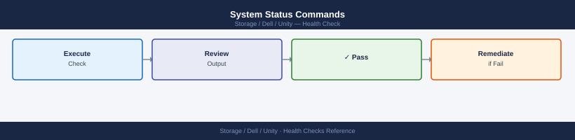
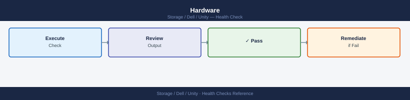
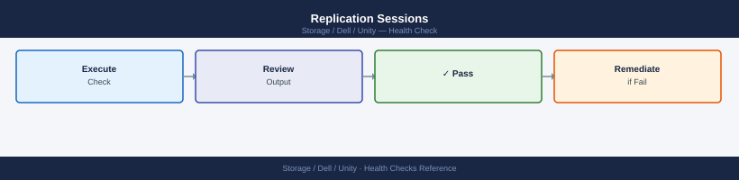

---
tags:
  - dell
  - operations
description: "Daily and pre/post-change health checks for Dell Unity storage systems."
---
# Unity — Health Checks

<div class="kb-summary">
Daily and pre/post-change health checks for Dell Unity storage systems.

*Applies to: Unity XT*
</div>

## Before you begin

- **Access:** Storage admin credentials (cluster admin or equivalent)
- **Timing:** safe to run during business hours unless a step is marked ⚠ (causes interruption)
- **Dependencies:** no active upgrades or migrations on the same infrastructure
- **Logging:** capture command output — paste into the change record on completion

---

## Run This Routine

1. **System health:** `uemcli /sys/general show` — check Health field
2. **Hardware status:** `uemcli /sys/component/disk show` — all disks Enabled
3. **Pool health:** `uemcli /stor/config/pool show` — check Health, free capacity
4. **SP (Storage Processor) status:** `uemcli /sys/component/sp show`
5. **LUN and filesystem health:** `uemcli /stor/prov/luns/lun show | grep -i health`
6. **Active alerts:** `uemcli /event/alert/hist show -filter "state eq active"` — investigate open alerts
7. **Fan and power:** `uemcli /sys/component/fan show` and `uemcli /sys/component/psu show`

## Daily Checks


| Check | Command | Notes |
|---|---|---|
| [ ] Run `uemcli /env/health show -filter "health.value ne OK"` | `uemcli /env/health show -filter "health.value ne OK"` | any non-OK result requires immediate investigation before proceeding with other work |
| [ ] Check active alerts | `uemcli /sys/alert show` | triage by severity; acknowledge alerts that have been resolved to keep the alert list clean |
| [ ] Check pool capacity | `uemcli /stor/pool show -detail` | alert if any pool is above 80% consumed or over-subscribed |
| [ ] Verify both SPs are Active | `uemcli /env/sp show` | SP A and SP B should both report `Active`; a single SP active indicates a failover has occurred |
| [ ] Check replication sessions | `uemcli /rep/session show` | all sessions should show `Active` state; investigate any session in `Error`, `Paused`, or `Interrupted` state |
| [ ] Check disk health | `uemcli /stor/disk show` | confirm no disks in `Faulted` or `Degraded` state |
| [ ] Review snapshot capacity consumption | `uemcli /stor/snap show` | confirm snapshots are not consuming unexpected pool space |
| [ ] Review Unisphere Dashboard for any threshold warnings or capacity |  |  |

## Health Check


Run these checks before any planned change or as first-response steps when investigating a reported issue.

- [ ] `uemcli /env/health show -filter "health.value ne OK"` returns no output — all components healthy
- [ ] `uemcli /env/sp show` — both SP A and SP B are `Active` with no faults
- [ ] `uemcli /stor/pool show -detail` — all pools below 80% consumed; FAST Cache status is Enabled if configured
- [ ] `uemcli /sys/alert show` — no unacknowledged alerts of severity `ERROR` or `CRITICAL`
- [ ] `uemcli /rep/session show` — all replication sessions in `Active` state
- [ ] `uemcli /stor/disk show` — no faulted or degraded disks
- [ ] `uemcli /stor/snap show` — no snapshot schedule failures; snapshot count not approaching pool capacity limits
- [ ] `uemcli /sys/sw show` — current software version noted; no pending updates flagged as critical

```bash
# Show all components not in an OK health state
uemcli /env/health show -filter "health.value ne OK"

# Show both SP health and current state
uemcli /env/sp show

# Show detailed pool capacity, health, and FAST Cache status
uemcli /stor/pool show -detail

# Show all active system alerts
uemcli /sys/alert show

# Show all replication sessions and their current state
uemcli /rep/session show

# Show all disks and their health state
uemcli /stor/disk show

# Show all snapshots and their pool consumption
uemcli /stor/snap show

# Show installed software version and any pending upgrades
uemcli /sys/sw show

# Show all LUNs with pool assignment and capacity
uemcli /store/lun show
```


```text title="Expected output"
Health Status Report:
ID                          Health          Component
sp_a                        DEGRADED        Storage Processor
dae_0_0                      WARNING         Disk Array Enclosure
battery_sp_b                 CRITICAL        Battery Module

Storage Processor Status:
ID          Health          State           IP Address
sp_a        OK              Present         192.168.1.10
sp_b        OK              Present         192.168.1.11

Pool Capacity and Health:
ID          Health          Total Capacity  Free Capacity  FAST Cache
pool_0      OK              10.0 TB         3.2 TB         Enabled
pool_1      DEGRADED        5.0 TB          0.8 TB         Disabled

Active System Alerts:
ID          Severity        Message                              Time
alert_1024  CRITICAL        Battery backup module failure        2024-01-15 14:32:15
alert_1025  WARNING         Disk predictive failure detected     2024-01-15 13:45:22
alert_1026  INFO            Scheduled maintenance window         2024-01-15 12:00:00

Replication Sessions:
ID              Source Pool     Destination     Status          Last Sync
rep_session_01  pool_0          10.20.30.40     Synchronized    2024-01-15 14:30:00
rep_session_02  pool_1          10.20.30.41     In Progress     2024-01-15 14:35:22

Disk Status:
ID              Health          Slot            Capacity
disk_0_0_0      OK              DAE 0, Slot 0   600 GB
disk_0_0_1      OK              DAE 0, Slot 1   600 GB
disk_0_1_2      PREDICTIVE_FAIL DAE 0, Slot 2   600 GB
...

Snapshots:
ID              Pool            Consumed Space  State
snap_lun_001    pool_0          256 GB          Ready
snap_lun_002    pool_0          512 GB          Ready

Software Version:
Current Version: 5.2.0.0 (Build 12345)
Pending Upgrades: None

LUNs:
ID              Pool            Size            State
lun_001         pool_0          500 GB          Ready
lun_002         pool_0          1.0 TB          Ready
lun_003         pool_1          2.0 TB          Ready
```

!!! warning "Common errors"
    | Error | Fix |
    |---|---|
    | `Error: Connection refused — Verify the Unity array management IP is reachable and uemcli is configured with correct credentials using 'uemcli -login' first.` | Verify the Unity array management IP is reachable and uemcli is configured with correct credentials using 'uemcli -login' first. |
    | `Error: Invalid filter syntax in command — Check filter expression syntax; use 'uemcli /env/health show -help' to view supported filter operators and properties.` | Check filter expression syntax; use 'uemcli /env/health show -help' to view supported filter operators and properties. |
    | `Error: The specified resource does not exist` | Confirm the resource path (e.g., /stor/pool, /store/lun) is correct for your Unity software version by running 'uemcli -help' to list available resources. |
## System Status Commands



```bash
# System general info and health
uemcli -d <ip> -u admin /sys/general show -detail

# Software version
uemcli -d <ip> -u admin /sys/sw/version show

# Storage processor status
uemcli -d <ip> -u admin /sys/sp show
uemcli -d <ip> -u admin /sys/sp show -detail | grep -E "Health|State|Model"
```


```text title="Expected output"
You are not authenticated. Please login first.
Login successful.

System Information:
  Name:                          UNITY-SYS-001
  Serial Number:                 APM00123456789
  Model:                         Unity 380
  System Version:                5.1.0.0.5.999
  Health:                        OK
  Operational Status:            OK
  Current Power Consumption:      2847 W
  Installed Capacity:            100 TB

Software Version Information:
  Release:                       5.1.0.0.5.999
  Build:                         5.1.0.0.5.999.1
  Installed Date:                2024-01-15 14:32:18

Storage Processor Status:
  SP A:
    Health:                      OK
    State:                       Ready
    Model:                       SP-400
  SP B:
    Health:                      OK
    State:                       Ready
    Model:                       SP-400

Health: OK
State: Ready
Model: SP-400
Health: OK
State: Ready
Model: SP-400
```

!!! warning "Common errors"
    | Error | Fix |
    |---|---|
    | `You are not authenticated. Please login first.` | Add `-p <password>` flag or use `uemcli -d <ip> -u admin -p <password>` with credentials. |
    | `Connection refused` | Verify the Unity array IP address is correct and reachable with `ping <ip>`, and confirm the management interface is accessible. |
    | `Invalid command` | Ensure you are using the correct uemcli syntax; check the Unity CLI version compatibility with `uemcli -version`. |
## Alerts and Events


```bash
# Active alerts — any critical alerts require immediate attention
uemcli -d <ip> -u admin /prac/alert show
uemcli -d <ip> -u admin /prac/alert show | grep -i "Critical\|Error"

# Event log
uemcli -d <ip> -u admin /event/syslog show
```


```text title="Expected output"
Alert ID                    Severity        Component           Message
alert_001                   Warning         Storage Pool        Pool capacity at 78%
alert_002                   Critical        RAID Group          RAID 6 degraded — 1 disk failed
alert_003                   Info            System              Firmware update available
alert_004                   Critical        Connectivity        SAN port 0 link down
alert_005                   Warning         Cache               Battery backup unit low charge

alert_002                   Critical        RAID Group          RAID 6 degraded — 1 disk failed
alert_004                   Critical        Connectivity        SAN port 0 link down

Timestamp                   Severity        Source              Event
2024-01-15 14:32:18         Critical        RAID Manager        Disk 2.0.5 failed in RAID group RG_001
2024-01-15 14:31:45         Warning         Storage Pool        Pool SPA_001 capacity threshold exceeded
2024-01-15 14:30:12         Info            System              Configuration backup completed
2024-01-15 14:29:33         Critical        FC Port             FC port 0 link down — check cable
2024-01-15 14:28:01         Warning         Cache               Battery backup unit needs replacement
```

!!! warning "Common errors"
    | Error | Fix |
    |---|---|
    | `Error: Authentication failed for user 'admin' on <ip>` | Verify the IP address is correct and admin credentials are current; reset password if needed. |
    | `Error: Connection timeout — unable to reach <ip>:443` | Confirm the storage array is powered on and reachable on the network; check firewall rules allowing management port access. |
    | `Error: uemcli: command not found` | Install the EMC Unity CLI package or add its installation directory to your system PATH. |
## Hardware



```bash
# Disk health
uemcli -d <ip> -u admin /stor/config/disk show
uemcli -d <ip> -u admin /stor/config/disk show | grep -v "Normal"   # Flag non-normal disks

# Disk groups
uemcli -d <ip> -u admin /stor/config/dg show -detail | grep -E "Health|RAID|Disks"

# Storage processors
uemcli -d <ip> -u admin /sys/sp show -detail | grep -E "Health|Power|Temp"
```


```text title="Expected output"
Disk 0_0_0                                    Normal
Disk 0_0_1                                    Normal
Disk 0_0_2                                    Normal
Disk 0_0_3                                    Degraded
Disk 0_0_4                                    Normal
Disk 0_0_5                                    Normal
...
Disk 0_0_3                                    Degraded

Health                                        OK
RAID Level                                    RAID 5
Disks                                         6
Health                                        OK
RAID Level                                    RAID 6
Disks                                         8

Health                                        OK
Power Status                                  Present
Temperature                                   32C
Health                                        OK
Power Status                                  Present
Temperature                                   35C
```

!!! warning "Common errors"
    | Error | Fix |
    |---|---|
    | `Authentication failed: Invalid credentials` | Verify the admin username and password are correct, or use `-p` flag to enter password interactively. |
    | `Error: Connection timeout to <ip>` | Confirm the Dell Unity array IP is reachable and uemcli is installed; check network connectivity with `ping <ip>`. |
    | `Command not found: uemcli` | Install the Dell EMC CLI tools or add the uemcli binary path to your system PATH environment variable. |
## Storage Pool Capacity


```bash
# Pool list with capacity and health
uemcli -d <ip> -u admin /stor/config/pool show -detail

# Flag pools above 80% used
uemcli -d <ip> -u admin /stor/config/pool show | awk '
    /Free/ { getline; if ($3 + 0 < 20) print "WARNING: Pool near full:", $0 }'
```


```text title="Expected output"
Pool ID                    Name              Total Capacity    Free Space    Health Status
pool_1                     SAS_Pool_01       10.95 TB          2.19 TB       OK
pool_2                     NL_SAS_Pool_02    21.89 TB          3.28 TB       OK
pool_3                     SSD_Pool_03       5.49 TB          0.82 TB       DEGRADED
pool_4                     Archive_Pool_04   43.78 TB          7.00 TB       OK

WARNING: Pool near full: pool_3                     SSD_Pool_03       5.49 TB          0.82 TB       DEGRADED
```

!!! warning "Common errors"
    | Error | Fix |
    |---|---|
    | `uemcli: error: Unable to connect to <ip>:443` | Verify the storage array IP address is reachable and the management interface is responding with `ping <ip>`. |
    | `uemcli: error: Authentication failed for user 'admin'` | Confirm the admin password is correct and the user account has not been locked; reset credentials in Unisphere if needed. |
    | `uemcli: error: Command not found` | Install the EMC CLI package or add the uemcli binary directory to your PATH environment variable. |
## LUN Status


```bash
# All LUNs and health
uemcli -d <ip> -u admin /stor/config/lun show -detail | grep -E "Name|Health|Size"

# LUNs with non-OK health
uemcli -d <ip> -u admin /stor/config/lun show | grep -v "OK\|Name"
```


```text title="Expected output"
Name: lun_prod_db_01
Health: OK
Size: 500 GB

Name: lun_prod_db_02
Health: OK
Size: 1 TB

Name: lun_backup_tier1
Health: OK
Size: 2 TB

Name: lun_archive_cold
Health: Degraded
Size: 500 GB

Name: lun_test_dev
Health: OK
Size: 250 GB

lun_archive_cold                 Degraded         500 GB
```

!!! warning "Common errors"
    | Error | Fix |
    |---|---|
    | `Error: Connection refused (111)` | Verify the Unity array IP address is correct and reachable with `ping <ip>`, and ensure the management interface is accessible. |
    | `Error: Authentication failed for user 'admin'` | Confirm the admin password is correct and the user account has not been locked; reset credentials via the Unity web UI if needed. |
## Replication Sessions



```bash
# All replication sessions
uemcli -d <ip> -u admin /prot/rep/session show

# Sessions not in OK state
uemcli -d <ip> -u admin /prot/rep/session show | grep -v "OK\|Session ID"
```


```text title="Expected output"
Session ID                          State       Bytes Transferred    Last Sync Time
rep_session_001                     OK          1099511627776       2024-01-15 14:32:18
rep_session_002                     OK          549755813888        2024-01-15 14:31:45
rep_session_003                     SYNCING     274877906944        2024-01-15 14:33:02
rep_session_004                     PAUSED      137438953472        2024-01-14 22:15:33
rep_session_005                     FAILED      0                   2024-01-14 18:42:11

rep_session_003                     SYNCING     274877906944        2024-01-15 14:33:02
rep_session_004                     PAUSED      137438953472        2024-01-14 22:15:33
rep_session_005                     FAILED      0                   2024-01-14 18:42:11
```

!!! warning "Common errors"
    | Error | Fix |
    |---|---|
    | `uemcli: command not found` | Install the EMC CLI tools package or add the uemcli binary directory to your PATH environment variable. |
    | `Authentication failed for user admin` | Verify the Dell Unity array IP address is correct and the admin credentials are valid; check network connectivity to the management interface. |
    | `Connection refused on <ip>:443` | Ensure the Dell Unity array management IP is reachable and the management service is running; verify firewall rules allow HTTPS access. |
## Network Interfaces


```bash
# Network interface status
uemcli -d <ip> -u admin /net/if show | grep -E "ID|Health|IP"
```


```text title="Expected output"
ID                                          Health              IP
eth0                                        OK                  192.168.1.45
eth1                                        OK                  192.168.1.46
eth2                                        OK                  10.0.0.50
eth3                                        Degraded            10.0.0.51
mgmt0                                       OK                  192.168.100.10
```

!!! warning "Common errors"
    | Error | Fix |
    |---|---|
    | `Error: Connection refused` | Verify the Unity array IP address is correct and reachable with `ping <ip>`, and ensure the management port is accessible. |
    | `Error: Authentication failed` | Confirm the admin credentials are correct and the user account has sufficient privileges; try `uemcli -d <ip> -u admin -p` to enter the password interactively. |
    | `Error: uemcli: command not found` | Install the EMC Unity CLI package or add its installation directory to your PATH environment variable. |
## Health Check Summary


| Check | Command | Healthy |
|---|---|---|
| System health | `/sys/general show` | Health = OK |
| No critical alerts | `/prac/alert show` | 0 critical alerts |
| All disks normal | `/stor/config/disk show` | All = Normal |
| Pools < 80% used | `/stor/config/pool show` | Free > 20% |
| All LUNs OK | `/stor/config/lun show` | All health = OK |
| Replication sessions OK | `/prot/rep/session show` | All OK / Synced |
| Both SPs online | `/sys/sp show` | Both = OK |

## Daily Health Check Sequence


```d2
direction: right

START: "Begin daily check" {shape: rectangle}
SYS: "uemcli /env/health show\n-filter" {shape: rectangle}
SYS_OK: "SYS_OK" {shape: rectangle}
TRIAGE: "Triage fault\ncheck Common Issues KB" {shape: rectangle}
SP: "uemcli /env/sp show\nBoth SPs Active?" {shape: rectangle}
SP_OK: "SP_OK" {shape: rectangle}
SPFAIL: "One SP offline —\ncheck fault LEDs\nopen Dell case if hardware" {shape: rectangle}
POOL: "uemcli /stor/config/pool show\nPool capacity < 80%?" {shape: rectangle}
POOL_OK: "POOL_OK" {shape: rectangle}
CAPACT: "Expand pool or\ndelete snapshots" {shape: rectangle}
REP: "uemcli /prot/rep/session show\nAll sessions Active?" {shape: rectangle}
REP_OK: "REP_OK" {shape: rectangle}
REPFIX: "Resume or investigate\nreplication session" {shape: rectangle}
DISK: "uemcli /stor/config/disk show\nAll disks Normal?" {shape: rectangle}
DISK_OK: "DISK_OK" {shape: rectangle}
REPLACE: "Initiate drive replacement\nmonitor RAID rebuild" {shape: rectangle}
DONE: "All checks passed" {shape: rectangle}

START -> SYS
SYS_OK -> TRIAGE
SYS_OK -> SP
SP_OK -> SPFAIL
SP_OK -> POOL
POOL_OK -> CAPACT
POOL_OK -> REP
REP_OK -> REPFIX
REP_OK -> DISK
DISK_OK -> REPLACE
DISK_OK -> DONE
```

---

## Verify

- Confirm the operation completed without errors in the log or management UI
- Verify the expected state change is visible (service running, object created, config applied)
- Document the outcome in the change record

---

## See also

- [Unity — Procedures](../procedures/)
- [Unity — CLI Reference](../cli-reference/)
- [Unity — Common Issues](../../troubleshooting/common-issues/)
