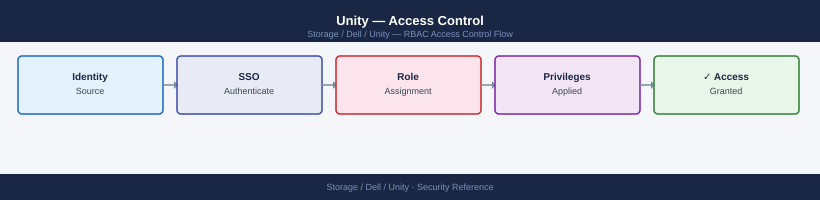
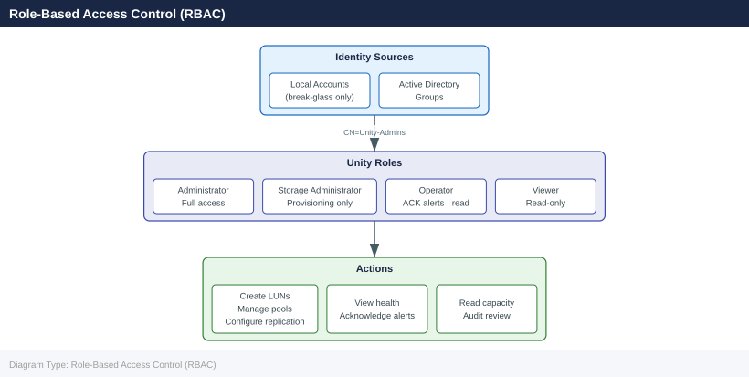
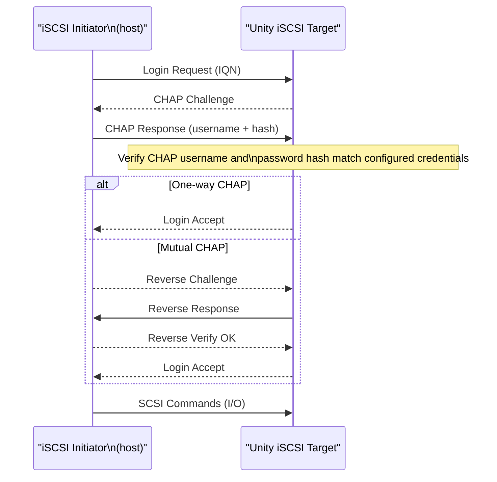

---
tags:
  - dell
  - security
---
# Unity — Access Control

<div class="kb-summary">
Access Control reference covering Role-Based Access Control (RBAC), Local User Management, LDAP and Active Directory Group Mapping, iSCSI CHAP Authentication, NFS Export Access Control and 4 more sections.

*Applies to: Unity XT*
</div>


## Before you begin

- **Access:** Storage admin credentials (cluster admin or equivalent)
- **Change management:** security changes require CAB approval in most environments
- **Rollback plan:** document current state before any security control change
- **Testing:** validate in a non-production environment first where possible

---

## Role-Based Access Control (RBAC)

Unisphere for Unity implements role-based access control for all administrative operations. Every Unisphere user — whether a local account or an LDAP/AD-mapped user — is assigned one of four built-in roles. There are no custom roles; access is controlled entirely by role assignment.



| Role | Permissions | Typical Assignment |
|---|---|---|
| Administrator | Full system access: storage provisioning, system configuration, user management, upgrades, and security settings | Storage team lead or senior engineer |
| Storage Administrator | Storage provisioning operations: create and manage pools, LUNs, file systems, snapshots, and replication; cannot modify system-level settings or manage users | Storage engineer |
| Operator | Read access plus limited operational actions: acknowledge alerts, collect service bundles, view health and capacity; cannot make configuration changes | NOC analyst, on-call operator |
| Viewer | Read-only access to all health, capacity, and configuration data; cannot make any changes | Capacity planning team, auditors |

Configure users and role assignments in Unisphere under **Settings > Access > Users and Roles**.

## Local User Management

Unity supports local accounts stored on the array. Local accounts are independent of LDAP or Active Directory and are always available — including when directory services are unavailable.

```bash
# List all local users
uemcli -d <ip> -u admin /user show

# Create a local user with Storage Administrator role
uemcli -d <ip> -u admin /user create \
    -name storageadmin01 \
    -role storageadmin \
    -passwd "InitialPassword1!"

# Modify a user's role
uemcli -d <ip> -u admin /user -name storageadmin01 set -role operator

# Change a user's password
uemcli -d <ip> -u admin /user -name storageadmin01 set -passwd "NewPassword1!"

# Delete a local user (cannot delete the last Administrator account)
uemcli -d <ip> -u admin /user -name storageadmin01 delete
```


```text title="Expected output"
User Name                Role                 Enabled  Locked
admin                    Administrator        Yes      No
guest                    Guest                Yes      No
storageadmin01           Storage Administrator Yes      No

User storageadmin01 created successfully.

User storageadmin01 role changed to operator.

User storageadmin01 password changed successfully.

User storageadmin01 deleted successfully.
```

!!! warning "Common errors"
    **`Error: User admin does not exist or access denied`** — Verify the management IP address with `-d` flag and ensure the admin account credentials are correct.
    **`Error: Cannot delete user admin - last Administrator account cannot be removed`** — Create an additional Administrator account before deleting the current one, or delete a non-Administrator user instead.
    **`Error: Password does not meet complexity requirements`** — Use a password with at least 8 characters including uppercase, lowercase, numbers, and special characters.
### Local Account Best Practices

- Keep the number of local Administrator accounts to a minimum — ideally one break-glass account.
- Assign all regular operational access through LDAP/AD group mappings, not local accounts.
- Store the break-glass `admin` credentials in your secrets manager and rotate the password after any use.
- The built-in `admin` account cannot be deleted. Rename it to a non-obvious name if supported by your OE version, or use a strong, unique password.

## LDAP and Active Directory Group Mapping

Unity can authenticate Unisphere users via LDAP or Active Directory and map LDAP groups to Unity roles. This eliminates the need to manage local accounts for each operator.

### Configuring Directory Services

In Unisphere: **Settings > Access > Directory Services**

```bash
# View directory service configuration
uemcli -d <ip> -u admin /user/ldap show

# Create an LDAP directory service configuration
uemcli -d <ip> -u admin /user/ldap create \
    -addr <ldap_server_ip> \
    -protocol ldap \
    -port 389 \
    -baseDN "DC=corp,DC=local" \
    -bindDN "CN=unity-svc,OU=Service Accounts,DC=corp,DC=local" \
    -bindPasswd "ServiceAccountPassword"

# Modify an existing LDAP configuration
uemcli -d <ip> -u admin /user/ldap -id <ldap_id> set \
    -addr <new_ldap_server_ip>

# Test LDAP connectivity
uemcli -d <ip> -u admin /user/ldap -id <ldap_id> verify
```


```text title="Expected output"
ID: ldap_1
Addr: 192.168.10.50
Protocol: ldap
Port: 389
BaseDN: DC=corp,DC=local
BindDN: CN=unity-svc,OU=Service Accounts,DC=corp,DC=local
Status: Connected
Last Verified: 2024-01-15 14:32:18

The operation completed successfully.

ID: ldap_1
Addr: 192.168.10.51
Protocol: ldap
Port: 389
BaseDN: DC=corp,DC=local
BindDN: CN=unity-svc,OU=Service Accounts,DC=corp,DC=local
Status: Connected
Last Verified: 2024-01-15 14:35:42

LDAP connectivity test passed.
```

!!! warning "Common errors"
    **`Error: Authentication failed for user admin`** — Verify the admin credentials and ensure the user has sufficient privileges to manage LDAP configurations.
    **`Error: Unable to connect to LDAP server at <ldap_server_ip>:389`** — Confirm the LDAP server IP address is correct, the server is online, and network connectivity exists from the Unity array to the LDAP server.
    **`Error: Invalid bindDN or bindPasswd`** — Verify the service account credentials are correct and the account has permission to bind to the LDAP directory.
### Mapping LDAP Groups to Unity Roles

Once directory services are configured, map LDAP/AD security groups to Unity roles:

```bash
# List existing role mappings
uemcli -d <ip> -u admin /user/role show

# Map an AD group to the Storage Administrator role
uemcli -d <ip> -u admin /user/role create \
    -name "CN=Unity-StorageAdmins,OU=Groups,DC=corp,DC=local" \
    -role storageadmin

# Map an AD group to Operator role (for NOC teams)
uemcli -d <ip> -u admin /user/role create \
    -name "CN=Unity-Operators,OU=Groups,DC=corp,DC=local" \
    -role operator

# Map an AD group to Viewer role (for read-only access)
uemcli -d <ip> -u admin /user/role create \
    -name "CN=Unity-Viewers,OU=Groups,DC=corp,DC=local" \
    -role viewer

# Delete a role mapping
uemcli -d <ip> -u admin /user/role -id <mapping_id> delete
```


```text title="Expected output"
ID  Name                                              Role              Domain
1   CN=Unity-StorageAdmins,OU=Groups,DC=corp,DC=local  storageadmin      corp.local
2   CN=Unity-Operators,OU=Groups,DC=corp,DC=local      operator          corp.local
3   CN=Unity-Viewers,OU=Groups,DC=corp,DC=local        viewer            corp.local

Role mapping created successfully.
ID: 4

Role mapping created successfully.
ID: 5

Role mapping created successfully.
ID: 6

Role mapping with ID 4 deleted successfully.
```

!!! warning "Common errors"
    **`Error: The specified user/role does not exist`** — Verify the AD group DN is correct and the group exists in Active Directory with `ldapsearch` or Active Directory Users and Computers.
    **`Error: Connection failed to <ip>. Check IP address and network connectivity`** — Confirm the Unity array IP is reachable with `ping <ip>` and that admin credentials are correct.
    **`Error: Insufficient privileges to perform this operation`** — Ensure the admin account used has Storage Administrator role assigned on the Unity array.
## iSCSI CHAP Authentication

For iSCSI host access, Unity supports CHAP (Challenge Handshake Authentication Protocol) to authenticate initiators. This prevents unauthorised hosts from connecting to Unity iSCSI targets.



| CHAP Mode | Description | Recommendation |
|---|---|---|
| None | No authentication; all initiators accepted | Not recommended for production |
| One-way CHAP | Unity authenticates the host initiator; host does not authenticate Unity | Minimum for production iSCSI environments |
| Mutual CHAP | Both Unity and the host initiator authenticate each other | Recommended; prevents man-in-the-middle |

```bash
# Configure CHAP on a host object in Unity
uemcli -d <ip> -u admin /remote/host -id <host_id> set \
    -chapUser <chap_username> \
    -chapPassword <chap_secret>

# For mutual CHAP, also configure the reverse CHAP credentials
# (Unity as initiator authenticating to host)
uemcli -d <ip> -u admin /remote/host -id <host_id> set \
    -reverseChapUser <reverse_username> \
    -reverseChapPassword <reverse_secret>
```


```text title="Expected output"
The operation completed successfully.
The operation completed successfully.
```

!!! warning "Common errors"
    **`Error: The host object with id '<host_id>' was not found.`** — Verify the host ID exists on the array using `uemcli -d <ip> -u admin /remote/host list` and use the correct ID from the output.
    **`Error: Authentication failed for user 'admin'.`** — Confirm the admin credentials are correct and the user has sufficient privileges; try `uemcli -d <ip> -u admin /remote/system get` to test connectivity first.
    **`Error: CHAP password does not meet minimum complexity requirements (minimum 12 characters).`** — Use a CHAP secret that is at least 12 characters long and includes uppercase, lowercase, numbers, and special characters.
On the Linux host side, configure `/etc/iscsi/iscsid.conf`:

```ini
node.session.auth.authmethod = CHAP
node.session.auth.username = <chap_username>
node.session.auth.password = <chap_secret>
# For mutual CHAP:
node.session.auth.username_in = <reverse_username>
node.session.auth.password_in = <reverse_secret>
```

## NFS Export Access Control

NFS access to Unity file systems is controlled at the export level. Each NFS export has an access control list that specifies which hosts or subnets can mount the export and with what permissions.

```bash
# List NFS exports and their access controls
uemcli -d <ip> -u admin /prot/nfs show -detail

# Create an NFS export with restricted read-write access to a subnet
uemcli -d <ip> -u admin /prot/nfs create \
    -server <nas_id> \
    -path / \
    -fs <fs_id> \
    -rwHosts 10.10.10.0/24 \
    -rootHosts 10.10.10.0/24 \
    -noAccessHosts 0.0.0.0/0

# Modify NFS export access — add a read-only host
uemcli -d <ip> -u admin /prot/nfs -id <nfs_id> set \
    -roHosts 10.10.20.0/24

# NFS access levels
# -rwHosts   : read-write access
# -roHosts   : read-only access
# -rootHosts : root squash disabled for these hosts (root on client = root on share)
# -noAccessHosts : explicitly deny access
```


```text title="Expected output"
ID                                    Server    Path  Filesystem  RW Hosts        RO Hosts        Root Hosts      No Access Hosts
nfs_1                                 nas_1     /     fs_1        10.10.10.0/24   —               10.10.10.0/24   0.0.0.0/0
nfs_2                                 nas_1     /data fs_2        192.168.1.0/24  192.168.2.0/24  192.168.1.0/24  —

NFS Export created successfully.
ID: nfs_3
Server: nas_1
Path: /
Filesystem: fs_1
RW Hosts: 10.10.10.0/24
Root Hosts: 10.10.10.0/24
No Access Hosts: 0.0.0.0/0

NFS Export modified successfully.
ID: nfs_1
RO Hosts: 10.10.20.0/24
```

!!! warning "Common errors"
    **`Error: Invalid filesystem ID '<fs_id>'`** — Verify the filesystem exists with `uemcli -d <ip> -u admin /stor/fs show` and use the correct ID.
    **`Error: Access denied — insufficient privileges`** — Ensure the admin user has NFS management permissions or use an account with higher privileges.
    **`Error: Subnet mask format invalid for '-rwHosts 10.10.10.0'`** — Specify hosts in CIDR notation (e.g., `10.10.10.0/24`) or as individual IPs separated by commas.
**Root squash:** By default, Unity maps the root user from NFS clients to a non-privileged `nobody` account (root squash enabled). To allow root access from specific trusted hosts (such as backup servers), add those hosts to `-rootHosts`.

## SMB Share Permissions

SMB share permissions on Unity work in conjunction with NTFS file permissions. Unity applies two permission layers:

1. **Share-level permissions** — set in Unity; control who can connect to the share at all.
2. **NTFS permissions** — set on directories within the share; control file and directory access.

```bash
# List SMB shares and their current configuration
uemcli -d <ip> -u admin /prot/smb show -detail

# Create an SMB share with the default share permissions (Everyone: Full Control)
uemcli -d <ip> -u admin /prot/smb create \
    -name OracleBackups \
    -server <nas_id> \
    -path / \
    -fs <fs_id>

# Restrict share to a specific AD user or group (via Unisphere GUI)
# GUI path: Storage > File > File Systems > [filesystem] > SMB Shares > [share] > Permissions
```


```text title="Expected output"
SMB Protocol Configuration:
  ID                          | Name              | Server    | Path     | State
  ============================================================================
  SMB_1                       | OracleBackups     | nas-unity-01 | /        | Enabled
  SMB_2                       | ComplianceArchive | nas-unity-02 | /archive | Enabled
  SMB_3                       | UserProfiles      | nas-unity-01 | /home    | Enabled

Share Permissions (Default):
  Share Name: OracleBackups
  Everyone: Full Control (Read, Write, Modify, Delete)
  Inheritance: Enabled

Created SMB share 'OracleBackups' successfully.
  Share ID: SMB_4
  Server: nas-unity-01
  File System: fs_oracle_001
  Path: /
  State: Online
```

!!! warning "Common errors"
    **`Error: Invalid server ID '<nas_id>'`** — Verify the NAS server ID exists by running `uemcli -d <ip> -u admin /prot/smb/server show` and use the correct ID from the output.
    **`Error: File system '<fs_id>' not found`** — Confirm the filesystem ID with `uemcli -d <ip> -u admin /stor/fs show` and substitute the correct filesystem identifier.
    **`Error: Access denied: insufficient privileges`** — Ensure the admin user account has SMB management permissions or use a service account with appropriate UEMCLI roles assigned.
For production environments, restrict share-level permissions to the AD groups that require access, then use NTFS permissions for fine-grained control within the share. Do not leave the default "Everyone: Full Control" share permission in place.

## Management Interface Restrictions

Restrict which IP ranges can access the Unity management interfaces to reduce the attack surface:

In Unisphere: **Settings > Security > Management Interfaces**

Best practice configuration:
- Allow management access only from the storage management VLAN or jump host subnet.
- Block management access from production workload VLANs.
- If SSH access to the SP CLI is required, restrict it to the management subnet only.

## Session and Password Policy

| Setting | Recommendation |
|---|---|
| Session timeout | 15–30 minutes of inactivity |
| Password minimum length | 12 characters |
| Password complexity | Uppercase, lowercase, digit, special character |
| Password history | Prevent reuse of the last 10 passwords |
| Account lockout | Lock after 5 failed attempts; unlock after 15 minutes |

Configure session timeout in Unisphere under **Settings > Access > Session Management**. Password and lockout policy is enforced on local accounts; for LDAP/AD accounts, the policy is inherited from Active Directory.

## Audit Log Review

All Unisphere administrative actions are recorded in the Unity audit log:

```bash
# View recent audit events (administrative actions)
uemcli -d <ip> -u admin /event/audit show

# View system events (including security-related events)
uemcli -d <ip> -u admin /event/syslog show
```


```text title="Expected output"
ID              Timestamp                    User      Action                          Resource                Status
1847            2024-01-15 14:32:18 UTC      admin     Modify User Account             user_operator1          Success
1846            2024-01-15 14:28:45 UTC      admin     Change Password Policy          Security Settings       Success
1845            2024-01-15 13:55:12 UTC      svc_backup Login                         System Access           Success
1844            2024-01-15 13:22:33 UTC      admin     Modify NTP Server               ntp.corp.local          Success
1843            2024-01-15 12:18:07 UTC      admin     Export Configuration            unity-backup-20240115   Success
...

Timestamp                    Severity  Component        Message
2024-01-15 14:35:22 UTC      INFO      SecurityManager  User admin logged in from 192.168.1.105
2024-01-15 14:32:18 UTC      WARNING   UserManagement   Password policy updated: min length 12
2024-01-15 14:28:45 UTC      INFO      Authentication   Failed login attempt from 192.168.1.200
2024-01-15 13:55:12 UTC      INFO      SystemHealth     Certificate expiration warning: 45 days remaining
2024-01-15 13:22:33 UTC      INFO      TimeSync         NTP synchronization successful with ntp.corp.local
```

!!! warning "Common errors"
    **`Authentication failed: Invalid credentials`** — Verify the admin user password and ensure the management IP address is correct and reachable.
    **`Connection timeout: Unable to reach <ip>`** — Confirm the storage array IP is accessible from your management station and that firewall rules permit UEMCLI traffic on port 443.
    **`Permission denied: User 'admin' does not have audit view privileges`** — Ensure the admin account has the required audit log read permissions assigned in the Unity security role configuration.
Review the audit log regularly for:
- Logins from unexpected IP addresses or user accounts.
- Configuration changes made outside of approved change windows.
- Multiple failed login attempts (potential credential stuffing).
- Privilege use — Administrator-role actions performed by accounts that should have Operator-level access.

Forward audit events to a SIEM via syslog for long-term retention and alerting. See the [Authentication](authentication.md) page for syslog configuration.

---

## See also

- [Unity — Authentication](../authentication/)
- [Unity — Hardening](../hardening/)
- [Unity — Encryption](../encryption/)
