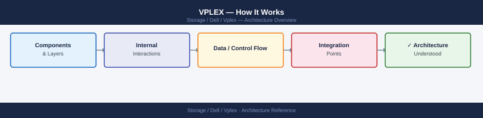
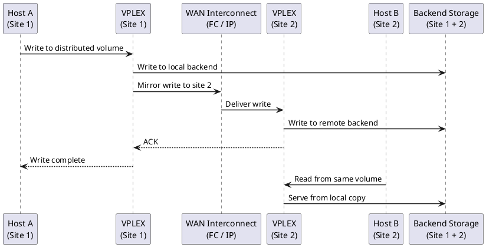
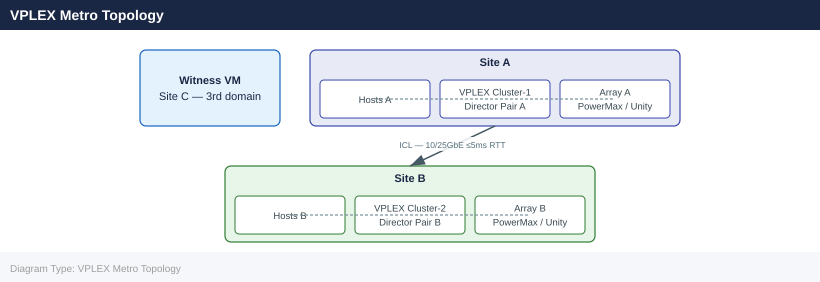

---
tags:
  - architecture
  - dell
---
# VPLEX — How It Works

<div class="kb-summary">
How It Works reference covering Overview, Deployment Models, Storage Object Hierarchy, VPLEX Metro Topology, Director Architecture and 5 more sections.

*Applies to: VPLEX*
</div>




## Overview

Dell VPLEX is a storage federation and virtualisation platform that decouples physical storage from the host view, presenting virtual volumes to hosts regardless of which back-end array holds the data. VPLEX Local, Metro, and Geo represent progressively wider federation scopes.

## Deployment Models

| Model | Sites | Replication | RTT Limit | Active-Active | Use Case |
|---|---|---|---|---|---|
| VPLEX Local | 1 | Synchronous (within engine) | N/A | Yes (within site) | LUN virtualisation, data mobility |
| VPLEX Metro | 2 | Synchronous (ICL) | ≤5ms | Yes (both sites) | Zero-RPO stretched cluster for VMware HA |
| VPLEX Geo | 2+ | Asynchronous (RecoverPoint) | Any | No | Long-distance DR beyond Metro RTT limits |

## Storage Object Hierarchy

VPLEX builds virtual volumes from back-end storage through a layered hierarchy:

```d2
direction: right

arrayLUN: "Back-end Array LUN\n(PowerMax / Unity" {shape: rectangle}
storageVol: "Storage Volume\n(VPLEX claims LUN" {shape: rectangle}
extent: "Extent\n(VPLEX claim on storage volume" {shape: rectangle}
localDev: "Local Device\n(RAID-0 or RAID-1 within cluster" {shape: rectangle}
distDev: "Distributed Device\n(RAID-1 across two clusters — Metro only" {shape: rectangle}
virtVol: "Virtual Volume\n(presented to hosts" {shape: rectangle}
storageView: "Storage View\n(Host HBA → FE port → virtual volume" {shape: rectangle}

arrayLUN -> storageVol
storageVol -> extent
extent -> localDev
localDev -> distDev
distDev -> virtVol
virtVol -> storageView
```

## VPLEX Metro Topology



## Director Architecture

Each VPLEX director contains:

- **Front-end FC ports** — present virtual volumes to hosts via storage views
- **Back-end FC ports** — connect to back-end arrays; discover and claim storage volumes
- **NVRAM write cache** — mirrored between both directors in a pair
- **High-speed interconnect** — connects both directors in a pair for cache mirroring

| Unit | Description |
|---|---|
| Director | Single processing node with FE + BE FC ports and NVRAM write cache |
| Director pair | Two directors in one engine; cache-mirrored; minimum HA unit |
| Engine | Physical chassis housing one or two director pairs |
| Cluster | One or more engines at a single site |

## Metro Write Path

1. Host submits write to VPLEX Cluster-1 FE FC port
2. Director writes to local NVRAM write cache
3. VPLEX synchronously replicates to Cluster-2 over ICL
4. Cluster-2 director acknowledges into its write cache
5. Cluster-1 director acknowledges write completion to host
6. Both clusters destage independently to their local arrays

Host write latency = local VPLEX cache latency + ICL round-trip latency.

## Witness (Quorum Arbitrator)

The Witness VM (deployed at a third site) grants quorum on ICL failure:

- Without Witness: ICL failure suspends I/O on all distributed devices (both clusters go into lock-out to prevent split-brain)
- With Witness: the first cluster to contact the Witness is granted quorum and continues serving I/O; the other is suspended

Requirements: 2 vCPU / 4 GB RAM VM at a third failure domain; reachable from both clusters via management network.

## ICL Requirements

| Parameter | Requirement |
|---|---|
| RTT budget | ≤5ms |
| Minimum paths | 2 independent physical paths |
| Interface | 10GbE or 25GbE |
| Bandwidth | ≥2× peak write throughput at either site |

## Connectivity

| Layer | Protocol | Details |
|---|---|---|
| Host → VPLEX | FC 8/16 Gb | Hosts zone to VPLEX front-end FC ports only |
| VPLEX → Array | FC 8/16 Gb | VPLEX back-end ports zone to array target ports |
| Metro ICL | 10/25 GbE | Synchronous write replication between clusters |
| VPLEX → Witness | IP (management) | Quorum heartbeat |
| Management | SSH / HTTPS | vplexcli over SSH; Unisphere over HTTPS |

## Key CLI Commands

```bash
# Health and device status
ll /clusters/*/health-indications/
ll /engines/*/directors/*/hardware/
ll /distributed-storage/distributed-devices/*/health-indications/
health-check --full

# Storage views and objects
ll /clusters/*/exports/storage-views/
ll /distributed-storage/consistency-groups/

# Witness connectivity
ll /clusters/cluster-1/cluster-witness/
```


```text title="Expected output"
/clusters/cluster-1/health-indications/:
total 48
drwxr-xr-x  4 root root  4096 Nov 14 09:23 .
drwxr-xr-x 12 root root  4096 Nov 14 09:15 ..
-rw-r--r--  1 root root  2847 Nov 14 09:23 health-status.xml
-rw-r--r--  1 root root  1256 Nov 14 09:22 alerts.log

/clusters/cluster-2/health-indications/:
total 44
drwxr-xr-x  4 root root  4096 Nov 14 09:24 .
drwxr-xr-x 12 root root  4096 Nov 14 09:16 ..
-rw-r--r--  1 root root  3102 Nov 14 09:24 health-status.xml

/engines/engine-1/directors/director-1/hardware/:
total 52
drwxr-xr-x  3 root root  4096 Nov 14 09:21 .
drwxr-xr-x  5 root root  4096 Nov 14 09:18 ..
-rw-r--r--  1 root root  4521 Nov 14 09:21 pcie-cards.xml
-rw-r--r--  1 root root  2198 Nov 14 09:20 memory-modules.xml
-rw-r--r--  1 root root  1847 Nov 14 09:19 cpu-status.xml

/distributed-storage/distributed-devices/device-001/health-indications/:
total 40
drwxr-xr-x  2 root root  4096 Nov 14 09:25 .
drwxr-xr-x  2 root root  4096 Nov 14 09:25 ..
-rw-r--r--  1 root root  1923 Nov 14 09:25 device-health.xml

Health Check Report - Full Diagnostic
======================================
Cluster Status: HEALTHY
Engine Status: HEALTHY (2/2 engines online)
Director Status: HEALTHY (4/4 directors online)
Storage Device Status: HEALTHY (24/24 devices operational)
Witness Connectivity: CONNECTED
Last Check: 2024-11-14T09:25:47Z

/clusters/cluster-1/exports/storage-views/:
total 56
drwxr-xr-x  6 root root  4096 Nov 14 09:26 .
drwxr-xr-x  6 root root  4096 Nov 14 09:18 ..
drwxr-xr-x  3 root root  4096 Nov 14 09:26 view-prod-01
drwxr-xr-x  3 root root  4096 Nov 14 09:26 view-prod-02
drwxr-xr-x  3 root root  4096 Nov 14 09:25 view-dev-01

/distributed-storage/consistency-groups/:
total 64
drwxr-xr-
```
---

## See also

- [Vplex — Design Standards](../design-standards/)
- [Vplex — Integrations](../integrations/)
- [Vplex — Deploy](../../deploy/)
