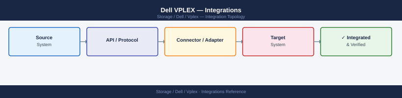
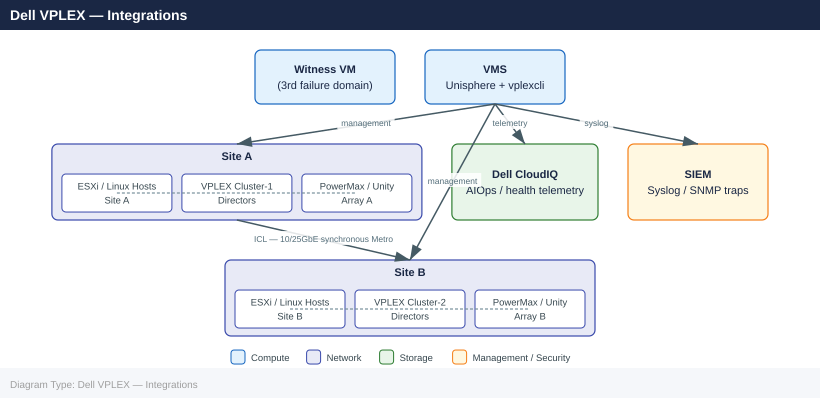
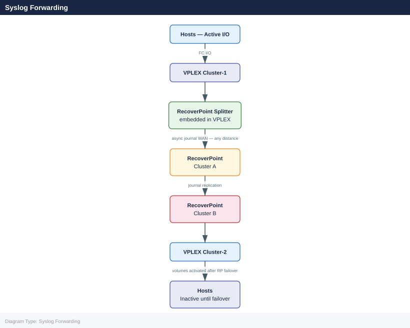

---
tags:
  - architecture
  - dell
description: "Integration with back-end storage arrays, hypervisors, replication systems, and monitoring platforms."
---
# Dell VPLEX — Integrations

<div class="kb-summary">
Integration with back-end storage arrays, hypervisors, replication systems, and monitoring platforms.

*Applies to: VPLEX*
</div>




## Back-End Storage Arrays

VPLEX presents a virtualisation layer over heterogeneous back-end arrays. The back-end ports on each VPLEX director zone to the target ports on the back-end array, then VPLEX discovers and claims the LUNs exposed to those ports.

### Supported Back-End Arrays

| Array Platform | Notes |
|---|---|
| Dell PowerMax / VMAX | Primary production integration; PowerMax SRDF can coexist with VPLEX back-end masking |
| Dell Unity XT | Supported; verify per-version compatibility in the Dell VPLEX Compatibility Matrix |
| Dell PowerStore | Supported; confirm GeoSynchrony version compatibility |
| Dell XtremIO | Supported on compatible GeoSynchrony versions |
| Third-party arrays | EMC/Symmetrix legacy, NetApp, Hitachi VSP — check the compatibility matrix; not all models supported |

### Back-End Configuration Steps

1. **Zone**: Create SAN fabric zones between VPLEX back-end ports and array target ports. Use single-initiator (VPLEX BE port) to multiple-target (array ports) zoning.
2. **Mask**: On the back-end array, create a host/initiator group presenting the LUN to the VPLEX back-end port WWNs.
3. **Discover**: From vplexcli, rediscover the back-end array.
4. **Claim**: Claim the storage volume.

```bash
# List discovered back-end arrays
vplexcli -q -e "ls /storage-elements/storage-arrays"

# Show a specific array and its visible storage volumes
vplexcli -q -e "ll /storage-elements/storage-arrays/array-A/"
vplexcli -q -e "ls /storage-elements/storage-arrays/array-A/storage-volumes"

# Rediscover storage volumes on a back-end array (after adding new LUNs)
vplexcli -q -e "storage-volume rediscover \
  --storage-volume /storage-elements/storage-arrays/array-A/storage-volumes/sv_001"

# Claim a discovered storage volume for use in VPLEX provisioning
vplexcli -q -e "storage-volume claim \
  --storage-volume /storage-elements/storage-arrays/array-A/storage-volumes/sv_001"
```


```text title="Expected output"
array-A
array-B
array-C

Name:                 array-A
Storage-Array-Type:   EMC-VMAX
Serial-Number:       000296802521
Vendor:               EMC
Model:                VMAX 450F
Firmware-Version:     5978.221.221
Health-State:         Optimal

sv_001
sv_002
sv_003
sv_004
sv_005
...

Rediscovering storage volumes on array-A...
Storage volume sv_001 rediscovered successfully.
Rediscovery completed in 12 seconds.

Claiming storage volume sv_001...
Storage volume sv_001 claimed successfully for VPLEX provisioning.
```

!!! warning "Common errors"
    | Error | Fix |
    |---|---|
    | `Error: Unable to connect to VPLEX management server at localhost:443` | Verify the VPLEX cluster is reachable and vplexcli credentials are configured via `vplexcli --setup`. |
    | `Error: Storage volume /storage-elements/storage-arrays/array-A/storage-volumes/sv_001 not found` | Run `vplexcli -q -e "ls /storage-elements/storage-arrays/array-A/storage-volumes"` to confirm the volume exists before attempting rediscovery. |
    | `Error: Storage volume sv_001 is already claimed` | Check if the volume is already in use with `vplexcli -q -e "ll /storage-elements/storage-arrays/array-A/storage-volumes/sv_001"` before claiming. |
### PowerMax Integration Notes

- PowerMax SRDF and VPLEX back-end masking can coexist on the same array; ensure SRDF R1/R2 pairs are not also claimed as VPLEX back-end volumes unless that is the intended Geo configuration.
- Use PowerMax Service Levels to assign appropriate performance tiers to LUNs before presenting them to VPLEX.
- When expanding a PowerMax LUN, expand on the array first, then rediscover and expand the extent and virtual volume in VPLEX.

```bash
# After expanding a back-end LUN on PowerMax, rediscover and expand in VPLEX:
vplexcli -q -e "storage-volume rediscover \
  --storage-volume /storage-elements/storage-arrays/array-A/storage-volumes/sv_001"
vplexcli -q -e "extent expand \
  --extent /clusters/cluster-1/storage-elements/extents/ext_app_001"
vplexcli -q -e "virtual-volume expand \
  --virtual-volume /virtual-volumes/my_app_vol_1"
```


```text title="Expected output"
Rediscovering storage volume sv_001...
Storage volume sv_001 rediscovered successfully.
Current capacity: 500 GB
New capacity: 1000 GB

Expanding extent ext_app_001...
Extent ext_app_001 expanded successfully.
Previous extent size: 500 GB
New extent size: 1000 GB

Expanding virtual volume my_app_vol_1...
Virtual volume my_app_vol_1 expanded successfully.
Previous virtual volume size: 500 GB
New virtual volume size: 1000 GB
```

!!! warning "Common errors"
    | Error | Fix |
    |---|---|
    | `Error: Storage volume sv_001 not found or not accessible` | Verify the storage array is online and the LUN path is correct using `vplexcli -e "storage-volume list"`. |
    | `Error: Extent ext_app_001 is in use and cannot be expanded at this time` | Ensure all I/O to the virtual volume is quiesced and no snapshots are being created before retrying the expand operation. |
    | `Error: New capacity (1000 GB) is smaller than current capacity (1000 GB)` | Confirm the back-end LUN was actually expanded on the PowerMax array before attempting the VPLEX rediscovery and expansion. |
## VMware vSphere

VPLEX is deeply integrated with VMware vSphere environments, particularly for Metro stretched-cluster configurations.

### ESXi Host Connectivity

- ESXi hosts connect to VPLEX front-end FC ports via the SAN fabric.
- Each ESXi host requires a storage view on each VPLEX cluster (for Metro); each view contains the front-end ports on that cluster and the distributed virtual volume(s) the host needs.
- ESXi multipathing: configure VMware NMP with the Round Robin policy or use the VPLEX-specific SATP rule. Verify that all expected paths are active in `esxcli storage nmp path list`.

```bash
# From ESXi host: list active paths to a VPLEX volume
esxcli storage nmp path list -d <naa_id>

# Rescan HBAs after storage view changes
esxcli storage core adapter rescan --adapter vmhba<n>
```


```text title="Expected output"
Name: naa.60060e80057d2700028d2700000012a4
Device: naa.60060e80057d2700028d2700000012a4
Runtime Name: vmhba4:C0:T0:L0
Driver: NMP
State: active
Adapter: vmhba4 Paths: 4
   vmhba4:C0:T0:L0 LIO,ALUA: active ready
   vmhba5:C0:T0:L0 LIO,ALUA: active ready
   vmhba4:C0:T1:L0 LIO,ALUA: standby ready
   vmhba5:C0:T1:L0 LIO,ALUA: standby ready

Rescanning adapter vmhba4...
Rescan complete.
```

!!! warning "Common errors"
    | Error | Fix |
    |---|---|
    | `Could not find device naa.60060e80057d2700028d2700000012a4` | Verify the NAA ID is correct by running `esxcli storage core device list` and copy the exact device identifier. |
    | `Unknown option --adapter vmhba<n>` | Replace the literal `<n>` placeholder with the actual HBA number (e.g., `vmhba4`), not the angle brackets. |
### VPLEX Metro + vSphere HA / vMotion

VPLEX Metro is the prerequisite for vSphere Metro Storage Cluster (vMSC) configurations:

| vSphere Feature | VPLEX Metro Behaviour |
|---|---|
| vSphere HA | VM restarts on the surviving site automatically after a site failure; Witness-arbitrated quorum allows surviving cluster to continue serving I/O |
| vMotion across sites | VM migrates between ESXi hosts at Site A and Site B using the same distributed virtual volume; I/O follows the VM transparently |
| Datastore accessibility | Both ESXi clusters see the same distributed volume from their respective VPLEX clusters; no storage path changes needed during vMotion |

**vMSC design requirements:**

- All VM datastore volumes must be distributed virtual volumes in a consistency group.
- Both vSphere clusters must be in separate failure domains corresponding to VPLEX Cluster-1 (Site A) and Cluster-2 (Site B).
- The vSphere Heartbeat Datastore (for HA) should be a VPLEX distributed volume accessible from both sites.
- Test planned site-switch failover before production go-live and document the procedure.

### VASA Provider

VPLEX supports VMware vSphere APIs for Storage Awareness (VASA) on compatible GeoSynchrony versions, enabling vVols and storage-policy-based management. Verify VASA provider support against the Dell VPLEX Compatibility Matrix before enabling.

## Dell RecoverPoint (VPLEX Geo)

VPLEX Geo uses RecoverPoint to extend the VPLEX federation beyond the ≤5ms Metro RTT limit with asynchronous replication.

### Architecture

```text
Site A (Active)
  VPLEX Cluster-1
  RecoverPoint Splitter (integrated with VPLEX directors)
  RecoverPoint Cluster A
      |
      | Async replication (WAN journal)
      |
Site B (DR)
  VPLEX Cluster-2
  RecoverPoint Cluster B (receives journal)
  Volumes active only after failover
```

The RecoverPoint splitter is embedded within VPLEX and intercepts writes to copy them asynchronously to the remote RecoverPoint cluster. RPO is configurable based on journal settings.

### Key Points

- Volumes in VPLEX Geo are active on one site at a time (not active-active like Metro).
- Failover is an orchestrated process through RecoverPoint (not automatic via Witness).
- RecoverPoint bookmarks enable point-in-time consistency for crash-consistent or application-consistent recovery.
- VPLEX Geo is typically used when Site A and Site B are separated by >5ms RTT (city-to-city, region-to-region).



### Failover Procedure (Geo)

1. Initiate RecoverPoint failover for the target consistency group (from RecoverPoint management interface).
2. RecoverPoint applies the journal to bring Site B up to the latest consistent image.
3. VPLEX Cluster-2 at Site B activates the volumes for host access.
4. Update host storage views at Site B if required (for pre-staged DR configurations, views already exist).
5. Re-protect by reversing RecoverPoint replication direction once Site A is restored.

## Unisphere for VPLEX (Web GUI)

Unisphere for VPLEX is the browser-based management interface hosted on the VMS. It provides a graphical alternative to `vplexcli` for common operations.

| Capability | Location in Unisphere |
|---|---|
| Cluster and director health | Dashboard → System Health |
| Virtual volume provisioning | Storage → Virtual Volumes |
| Storage view management | Storage → Storage Views |
| Consistency group management | Storage → Consistency Groups |
| Distributed device status | Metro → Distributed Devices |
| Alert configuration (SMTP, SNMP) | Settings → Alerts |
| LDAP/AD authentication | Settings → Authentication |
| Support bundle collection | System → Support |

Access: `https://<VMS_IP>/` — authenticate with local VMS credentials or LDAP-integrated credentials if configured.

**Recommendation**: Use `vplexcli` for scripted operations and automation; use Unisphere for visual health checks and initial investigation. All configuration changes performed through Unisphere are executed as vplexcli commands internally and are logged identically.

## Dell CloudIQ / APEX AIOps

VPLEX can be integrated with Dell CloudIQ (now APEX AIOps) for proactive health monitoring, capacity analytics, and predictive failure detection.

### Enabling CloudIQ Integration

1. Log in to Unisphere for VPLEX.
2. Navigate to **Settings → CloudIQ** (or equivalent in the installed GeoSynchrony version).
3. Enter the CloudIQ connectivity token provided from the CloudIQ portal.
4. Confirm that VMS has outbound HTTPS connectivity to `cloudiq.dell.com`.
5. Verify telemetry upload status in CloudIQ within 24 hours.

CloudIQ provides:

- System health trending and anomaly detection
- Capacity forecasting per virtual volume and storage pool
- Proactive advisories when VPLEX components approach risk thresholds
- Integration with Dell support case creation from CloudIQ alerts

## SNMP and Syslog Alerting

VPLEX can send SNMP traps and forward syslog events to external monitoring platforms (Nagios, Zabbix, Splunk, Elastic, etc.).

### SNMP Configuration

Configure SNMP trap recipients in Unisphere → Settings → SNMP:

- VPLEX supports SNMP v2c and v3.
- Import the VPLEX MIB into your NMS (available from Dell Support portal under VPLEX downloads).
- Test trap delivery after configuration by forcing a minor health check warning.

### Syslog Forwarding

Forward VMS syslog to the centralised SIEM or log aggregator:

```bash
# On VMS (as root or admin), add a syslog forward rule:
# /etc/rsyslog.d/vplex-siem.conf  (example for rsyslog)
*.* @<SIEM_IP>:514

# Restart rsyslog to apply
systemctl restart rsyslog
```


```text title="Expected output"
(no output — command completes silently)
```

!!! warning "Common errors"
    | Error | Fix |
    |---|---|
    | `Job for rsyslog.service failed because the control process exited with error code.` | Check the rsyslog configuration syntax with `rsyslog -N1` and verify the SIEM_IP is reachable via `telnet <SIEM_IP> 514`. |
    | `Failed to restart rsyslog.service: Unit rsyslog.service not found.` | Confirm rsyslog is installed with `systemctl list-unit-files | grep rsyslog` or install it with `apt-get install rsyslog` (Debian/Ubuntu) or `yum install rsyslog` (RHEL/CentOS). |
Key log sources to forward:

| Log | Path on VMS | Content |
|---|---|---|
| vplexcli command history | `/var/log/VPlex/cli/vplexcli.log` | All CLI commands; critical for audit trail |
| Management events | `/var/log/VPlex/vplexmanagement.log` | Configuration changes, director events |
| Unisphere web UI | `/var/log/VPlex/` | Web authentication and API events |

---

## See also

- [Vplex — How It Works](../how-it-works/)
- [Vplex — Design Standards](../design-standards/)
