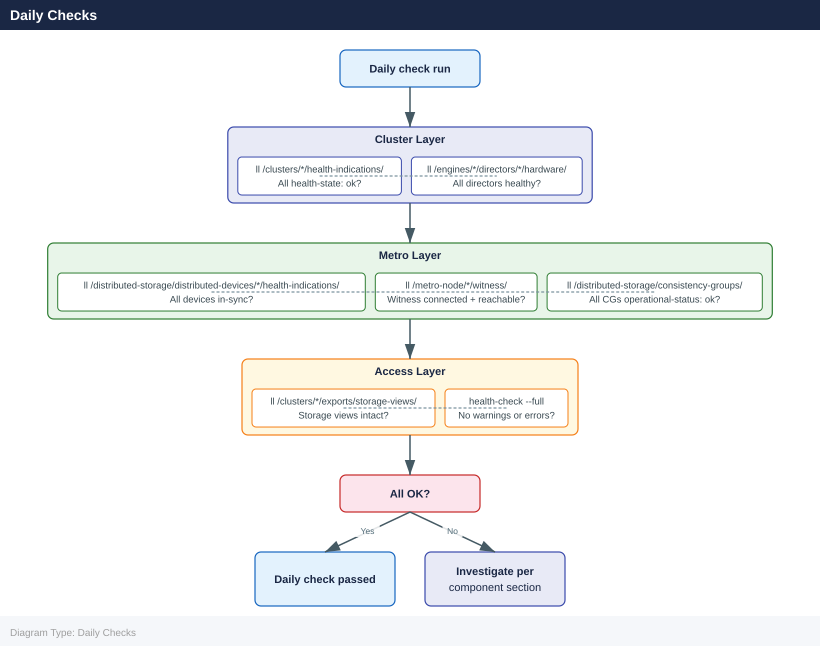
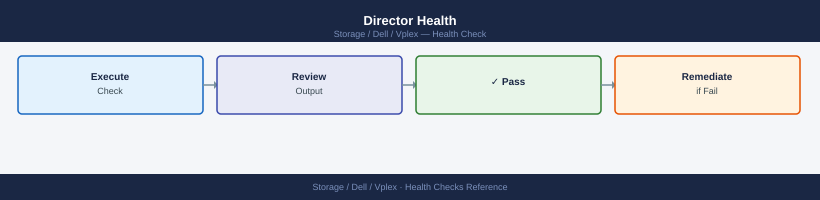

---
tags:
  - dell
  - operations
description: "Health Checks reference covering Daily Checks, Health Check, Cluster Status, Director Health, Pre-Change Checklist and 1 more sections."
---
# Dell VPLEX — Health Checks

<div class="kb-summary">
Health Checks reference covering Daily Checks, Health Check, Cluster Status, Director Health, Pre-Change Checklist and 1 more sections.

*Applies to: VPLEX*
</div>

## Before you begin

- **Access:** Storage admin credentials (cluster admin or equivalent)
- **Timing:** safe to run during business hours unless a step is marked ⚠ (causes interruption)
- **Dependencies:** no active upgrades or migrations on the same infrastructure
- **Logging:** capture command output — paste into the change record on completion

---

## Run This Routine

1. **Cluster health:** `ll /clusters/` — all clusters Healthy
2. **Director status:** `ll /engines/*/directors/*` — all directors Healthy
3. **Distributed device health:** `ll /clusters/*/distributed-devices/*` — check operational status
4. **Port health:** `ll /engines/*/directors/*/ports/*` — all ports Logged-In
5. **Consistency group health:** `ll /clusters/*/consistency-groups/*` — all CGs Healthy
6. **Witness health (Metro):** `ll /clusters/*/witness/*` — witness Connected
7. **Backend volume status:** `ll /clusters/*/storage-volumes/*` — check for degraded volumes

## Daily Checks




| Check | Command | Notes |
|---|---|---|
| Check cluster health indications | `ll /clusters/*/health-indications/` | All health-indications should show `health-state: ok`; investigate any cluster showing a non-ok state |
| Check distributed device health | `ll /distributed-storage/distributed-devices/*/health-indications/` | All distributed devices should show `health-state: ok` and `rebuild-allowed: true`; an `out-of-sync` device requires immediate attention |
| Check director hardware health | `ll /engines/*/directors/*/hardware/` | All directors should show healthy component states; a faulted director reduces redundancy and must be escalated |
| Verify Witness connectivity for Metro deployments | `ll /metro-node/*/witness/` | Witness should show `connected: true` and `reachable: true`; loss of Witness connectivity risks I/O suspension on a subsequent site failure |
| Check consistency group state | `ll /distributed-storage/consistency-groups/` | All groups should show `operational-status: ok` |
| Verify storage views are intact for all hosts | `ll /clusters/*/exports/storage-views/` | Confirm the expected number of storage views and initiator-to-port mappings |
| Review any active alerts in Unisphere for VPLEX or from email/SNMP | | |

## Health Check


Run these checks before any VPLEX maintenance or as first-response steps when a host reports I/O issues.

- [ ] `ll /clusters/*/health-indications/` — all clusters show `health-state: ok`
- [ ] `ll /distributed-storage/distributed-devices/*/health-indications/` — all distributed devices show `health-state: ok`; no devices in `out-of-sync` or `rebuilding` state
- [ ] `ll /engines/*/directors/*/hardware/` — all directors across all engines are healthy; no director components in a faulted state
- [ ] `ll /metro-node/*/witness/` — Witness is `connected` and `reachable` from both clusters (Metro deployments)
- [ ] `ll /distributed-storage/consistency-groups/` — all consistency groups show `operational-status: ok`
- [ ] `ll /clusters/*/exports/storage-views/` — storage views are present with the expected initiator and port bindings
- [ ] `health-check --full` — system-level health check returns no warnings or errors
- [ ] ICL (inter-cluster link) latency between Metro sites is within the expected sub-10ms threshold

```bash
# Check cluster-level health indications
ll /clusters/*/health-indications/

# Check all distributed device health states
ll /distributed-storage/distributed-devices/*/health-indications/

# Check director hardware health across all engines
ll /engines/*/directors/*/hardware/

# Check Witness connectivity (Metro deployments)
ll /metro-node/*/witness/

# Check consistency group operational status
ll /distributed-storage/consistency-groups/

# List all storage views and their initiator-to-port bindings
ll /clusters/*/exports/storage-views/

# Run a full system health check
health-check --full

# Show cluster hardware inventory
ll /clusters/*/hardware/
```


```text title="Expected output"
total 48
drwxr-xr-x 3 root root 4096 Jan 15 10:23 cluster-1/
drwxr-xr-x 3 root root 4096 Jan 15 10:23 cluster-2/

total 156
drwxr-xr-x 2 root root 4096 Jan 15 10:22 dev-0/
drwxr-xr-x 2 root root 4096 Jan 15 10:22 dev-1/
drwxr-xr-x 2 root root 4096 Jan 15 10:22 dev-2/
drwxr-xr-x 2 root root 4096 Jan 15 10:22 dev-3/

total 92
drwxr-xr-x 4 root root 4096 Jan 15 10:21 engine-1-director-1/
drwxr-xr-x 4 root root 4096 Jan 15 10:21 engine-2-director-1/

total 28
drwxr-xr-x 2 root root 4096 Jan 15 10:20 witness-node-a/
drwxr-xr-x 2 root root 4096 Jan 15 10:20 witness-node-b/

total 64
drwxr-xr-x 3 root root 4096 Jan 15 10:19 cg-prod-01/
drwxr-xr-x 3 root root 4096 Jan 15 10:19 cg-prod-02/
drwxr-xr-x 3 root root 4096 Jan 15 10:19 cg-dr-01/

total 112
drwxr-xr-x 5 root root 4096 Jan 15 10:18 sv-esx-cluster-01/
drwxr-xr-x 5 root root 4096 Jan 15 10:18 sv-database-tier/
drwxr-xr-x 5 root root 4096 Jan 15 10:18 sv-backup-01/

System Health Check Results:
  Cluster Status: HEALTHY
  Distributed Devices: 4/4 ONLINE
  Director Hardware: 2/2 OPERATIONAL
  Witness Connectivity: CONNECTED
  Consistency Groups: 3/3 SYNCHRONIZED
  Overall System Status: OPTIMAL

total 204
drwxr-xr-x 3 root root 4096 Jan 15 10:17 cluster-1/
drwxr-xr-x 3 root root 4096 Jan 15 10:17 cluster-2/
```

!!! warning "Common errors"
    **`ls: cannot access '/clusters/*/health-indications/': No such file or directory`** — Verify the VPLEX management console is running and the cluster paths are correctly mounted with `mount | grep clusters`.
    **`health-check: command not found`** — Ensure you are logged into the VPLEX management CLI with proper credentials and the health-check utility is in your PATH.
    **`Permission denied`** — Run the commands with appropriate VPLEX administrative privileges
## Cluster Status


```bash
VPlexcli:/> ll /clusters/
VPlexcli:/> ll /clusters/cluster-1/
VPlexcli:/> ll /clusters/cluster-2/
```


```text title="Expected output"
VPlexcli:/> ll /clusters/
    cluster-1
    cluster-2

VPlexcli:/> ll /clusters/cluster-1/
    director-1
    director-2
    storage-array-1
    storage-array-2

VPlexcli:/> ll /clusters/cluster-2/
    director-1
    director-2
    storage-array-3
    storage-array-4
```

!!! warning "Common errors"
    **`Error: path does not exist`** — Verify the cluster name is correct and the cluster is online using `ll /clusters/` first.
    **`Error: insufficient privileges`** — Ensure your VPlexcli user account has read permissions; contact your VPLEX administrator to grant access.
All clusters should show `operational-status: ok`.

## Director Health



```bash
VPlexcli:/> ll /engines/*/directors/
VPlexcli:/> ll /engines/engine-1-1/directors/
```


```text title="Expected output"
/engines/engine-1-1/directors/:
  director-1-1-a
  director-1-1-b
  director-1-2-a
  director-1-2-b

/engines/engine-1-2/directors/:
  director-1-2-a
  director-1-2-b
  director-1-3-a
  director-1-3-b

/engines/engine-2-1/directors/:
  director-2-1-a
  director-2-1-b
  director-2-2-a
  director-2-2-b

/engines/engine-1-1/directors/:
  director-1-1-a
  director-1-1-b
  director-1-2-a
  director-1-2-b
```

!!! warning "Common errors"
    **`Invalid path /engines/*/directors/`** — Use the full engine name (e.g., `/engines/engine-1-1/directors/`) as wildcard expansion is not supported in VPlexcli.
    **`No such object: /engines/engine-1-1/directors/`** — Verify the engine is online and the director objects exist by running `ll /engines/engine-1-1/` first to confirm the engine name.
All directors should be `operational-status: ok` and `health-state: ok`.

## Pre-Change Checklist

- [ ] All directors `operational-status: ok`
- [ ] All storage volumes `operational-status: ok`
- [ ] Distributed devices `service-status: running`
- [ ] No active critical alerts
- [ ] Inter-cluster connectivity healthy

## Health Summary Table

| Component | Check | Expected |
|---|---|---|
| Cluster | `ll /clusters/` | operational-status: ok |
| Directors | `ll /engines/*/directors/` | health-state: ok |
| Storage volumes | `ll .../storage-volumes/` | operational-status: ok |
| Virtual volumes | `ll .../virtual-volumes/` | operational-status: ok |
| WAN COM | `ll .../connectivity/` | operational-status: ok |
| Alerts | `ll /alerts/` | No critical alerts |

---

## Verify

- Confirm the operation completed without errors in the log or management UI
- Verify the expected state change is visible (service running, object created, config applied)
- Document the outcome in the change record

---

## See also

- [Vplex — Procedures](../procedures/)
- [Vplex — CLI Reference](../cli-reference/)
- [Vplex — Common Issues](../../troubleshooting/common-issues/)
