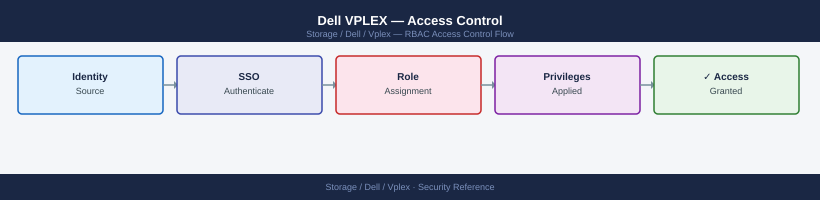
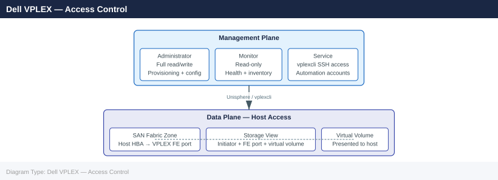

---
tags:
  - dell
  - security
description: "VPLEX access control operates at two layers: management plane access (who can change configuration) and data plane access (which hosts can access which..."
---
# Dell VPLEX — Access Control

<div class="kb-summary">
VPLEX access control operates at two layers: management plane access (who can change configuration) and data plane access (which hosts can access which volumes).

*Applies to: VPLEX*
</div>




## Before you begin

- **Access:** Storage admin credentials (cluster admin or equivalent)
- **Change management:** security changes require CAB approval in most environments
- **Rollback plan:** document current state before any security control change
- **Testing:** validate in a non-production environment first where possible

---

## Management Plane Roles

VPLEX management roles govern what operations each user can perform through Unisphere for VPLEX and `vplexcli`.

| Role | Access Level | Typical Assignee |
|---|---|---|
| Administrator | Full read/write access to all VPLEX configuration, provisioning, and lifecycle operations | Storage administrators |
| Monitor | Read-only access to cluster health, volumes, storage views, and configuration | Operations teams, NOC, monitoring |
| Service | SSH-based `vplexcli` access for CLI management; used for automation and scripted operations | Automation service accounts |

**Least-privilege principle**: assign Monitor role to any account that does not need to make configuration changes. Reserve Administrator role for accounts that actively provision or modify VPLEX objects.

### Role Assignment in Unisphere

1. Log in to Unisphere as an Administrator.
2. Navigate to **Settings → Users and Roles**.
3. Create a new local user or map an LDAP group to a role.
4. Verify the assigned role by logging in as the new account and confirming expected access.

```bash
# From vplexcli, list management users (if supported by the GeoSynchrony version)
vplexcli -q -e "ls /management/accounts"
vplexcli -q -e "ll /management/accounts/<username>/"
```


```text title="Expected output"
User: admin
User: monitor
User: backup_svc
User: readonly_ops

Name: admin
Type: local
Role: administrator
Created: 2024-01-15T09:23:47Z
Last-Modified: 2024-03-22T14:51:32Z
Password-Expiry: never
Account-Status: active
```

!!! warning "Common errors"
    | Error | Fix |
    |---|---|
    | `Error: /management/accounts: No such file or directory` | Verify the GeoSynchrony version supports management account queries; older versions may require alternative authentication inspection methods. |
    | `Error: Authentication failed for user vplexcli` | Ensure the vplexcli user has sufficient privileges; run the command with appropriate credentials or use `sudo vplexcli` if permitted. |
## Data Plane Access Control — Storage Views

Host access to VPLEX virtual volumes is exclusively controlled via storage views. A host can only see volumes that are:

1. Present in a storage view the host's HBA WWN is registered in, **and**
2. Presented through a VPLEX front-end port that is also in that storage view, **and**
3. Zoned (at the SAN fabric level) between the host HBA and the VPLEX front-end port.

### Storage View Access Model

```text
Host HBA (WWN)
    → FC Zone (SAN fabric)
        → VPLEX Front-End Port
            → Storage View
                → Virtual Volume(s) presented to this host
```

```d2
direction: right

hostHBA: "Host HBA\n10:00:00:00:c9:ab:cd:ef" {shape: rectangle}
fcZone: "FC Zone\nSAN fabric switch" {shape: rectangle}
vplexFE: "VPLEX Front-End Port\nA0-FC00 / B0-FC00" {shape: rectangle}
storageView: "Storage View\nsv-db-prod-01" {shape: rectangle}
virtualVol1: "Virtual Volume\nvv-oracle-prod-01" {shape: rectangle}
virtualVol2: "Virtual Volume\nvv-oracle-prod-02" {shape: rectangle}

hostHBA -> fcZone
fcZone -> vplexFE
vplexFE -> storageView
storageView -> virtualVol1
storageView -> virtualVol2
```

All three layers must be aligned for a host to access a volume. Missing any layer results in the host not seeing the volume.

### Creating a Storage View (Step-by-Step)

```bash
# Step 1: Confirm the host HBA WWN
# (Obtain from host: cat /sys/class/fc_host/host*/port_name  or  systool -c fc_host -v)

# Step 2: Register the host initiator port with VPLEX
vplexcli -q -e "initiator-port register \
  --cluster /clusters/cluster-1 \
  --port-wwn 10:00:00:00:c9:ab:cd:ef \
  --name db_prod_01_hba0"

# Step 3: Create the storage view
vplexcli -q -e "storage-view create \
  --name sv_db_prod_01 \
  --cluster /clusters/cluster-1"

# Step 4: Add VPLEX front-end ports to the view
# Identify available front-end ports:
vplexcli -q -e "ls /clusters/cluster-1/exports/ports"

vplexcli -q -e "storage-view add-ports \
  --storage-view /clusters/cluster-1/exports/storage-views/sv_db_prod_01 \
  --ports /clusters/cluster-1/exports/ports/A0-FC00,/clusters/cluster-1/exports/ports/B0-FC00"

# Step 5: Add the host initiator port to the view
vplexcli -q -e "storage-view add-initiator-ports \
  --storage-view /clusters/cluster-1/exports/storage-views/sv_db_prod_01 \
  --initiator-ports /clusters/cluster-1/exports/initiator-ports/db_prod_01_hba0"

# Step 6: Add virtual volumes to the view
vplexcli -q -e "storage-view add-virtual-volumes \
  --storage-view /clusters/cluster-1/exports/storage-views/sv_db_prod_01 \
  --virtual-volumes /virtual-volumes/vv_oracle_prod_01,/virtual-volumes/vv_oracle_prod_02"

# Verify the completed storage view
vplexcli -q -e "ll /clusters/cluster-1/exports/storage-views/sv_db_prod_01/"
```


```text title="Expected output"
/clusters/cluster-1/exports/ports/A0-FC00
/clusters/cluster-1/exports/ports/A0-FC01
/clusters/cluster-1/exports/ports/B0-FC00
/clusters/cluster-1/exports/ports/B0-FC01
/clusters/cluster-1/exports/ports/B0-FC02

Name                 sv_db_prod_01
Cluster              /clusters/cluster-1
Front-end Ports      A0-FC00, B0-FC00
Initiator Ports      db_prod_01_hba0 (10:00:00:00:c9:ab:cd:ef)
Virtual Volumes      vv_oracle_prod_01, vv_oracle_prod_02
LUN Assignments      0, 1
View State           Active
```

!!! warning "Common errors"
    | Error | Fix |
    |---|---|
    | `Error: Initiator port 10:00:00:00:c9:ab:cd:ef not found` | Verify the WWN is correctly obtained from the host and registered before adding it to the storage view. |
    | `Error: Virtual volume /virtual-volumes/vv_oracle_prod_01 does not exist` | Confirm the virtual volume names exist in VPLEX using `vplexcli -q -e "ls /virtual-volumes"` before adding them to the view. |
    | `Error: Port /clusters/cluster-1/exports/ports/A0-FC00 is already in use by another storage view` | Use different front-end ports or remove the port from the conflicting storage view first. |
### Storage View Design Principles

| Principle | Detail |
|---|---|
| One storage view per host | Create individual storage views per host rather than shared views; this prevents one host from accessing another's volumes |
| Minimum volume membership | Only include volumes that the host actually needs; do not add spare or shared volumes speculatively |
| Port balance | Assign front-end ports from both directors in the pair to each storage view; ensures path redundancy if one director fails |
| Document immediately | Record storage view name, initiator WWNs, front-end ports, and virtual volumes in the CMDB after every change |
| Review on host decommission | Remove the host's storage view and unregister its initiators when the host is decommissioned; orphaned initiators consume VPLEX resources |

### Storage View Audit and Cleanup

```bash
# List all storage views on all clusters
vplexcli -q -e "ll /clusters/*/exports/storage-views/"

# List all registered initiator ports (check for orphaned/unrecognised WWNs)
vplexcli -q -e "ls /clusters/cluster-1/exports/initiator-ports"
vplexcli -q -e "ll /clusters/cluster-1/exports/initiator-ports/<initiator_name>/"

# Unregister an orphaned initiator port
vplexcli -q -e "initiator-port unregister \
  --cluster /clusters/cluster-1 \
  --initiator-port /clusters/cluster-1/exports/initiator-ports/<initiator_name>"

# Remove a virtual volume from a storage view (before decommissioning the volume)
vplexcli -q -e "storage-view remove-virtual-volumes \
  --storage-view /clusters/cluster-1/exports/storage-views/sv_db_prod_01 \
  --virtual-volumes /virtual-volumes/vv_oracle_prod_01"

# Destroy a storage view when a host is decommissioned
vplexcli -q -e "storage-view destroy \
  --storage-view /clusters/cluster-1/exports/storage-views/sv_db_prod_01 --force"
```


```text title="Expected output"
/clusters/cluster-1/exports/storage-views/sv_db_prod_01
/clusters/cluster-1/exports/storage-views/sv_db_prod_02
/clusters/cluster-2/exports/storage-views/sv_app_tier_01
/clusters/cluster-2/exports/storage-views/sv_app_tier_02

iqn.1991-05.com.example:host-db-01
iqn.1991-05.com.example:host-db-02
wwn.500143800000a1b2:500143800000a1b3
wwn.500143800000c4d5:500143800000c4d6

Initiator Port: wwn.500143800000a1b2:500143800000a1b3
  Cluster: /clusters/cluster-1
  Port WWN: 50:01:43:80:00:00:a1:b2
  Node WWN: 50:01:43:80:00:00:a1:b3
  Status: Registered
  Storage Views: sv_db_prod_01

Virtual volume vv_oracle_prod_01 removed from storage view sv_db_prod_01

Storage view sv_db_prod_01 destroyed successfully
```

!!! warning "Common errors"
    | Error | Fix |
    |---|---|
    | `Error: Storage view /clusters/cluster-1/exports/storage-views/sv_db_prod_01 not found` | Verify the storage view path exists using `vplexcli -q -e "ll /clusters/cluster-1/exports/storage-views/"` and correct the name. |
    | `Error: Virtual volume /virtual-volumes/vv_oracle_prod_01 is still mapped to initiators` | Remove all initiator mappings from the virtual volume before removal using `storage-view remove-virtual-volumes` or unregister initiators first. |
    | `Error: Cannot destroy storage view: active I/O detected` | Ensure all host I/O is quiesced and the storage view has no active connections before retrying with `--force`. |
**Quarterly review task**: list all storage views and cross-reference initiator WWNs against the CMDB. Remove any views for decommissioned hosts and unregister their initiators.

## SAN Fabric Zoning

SAN fabric zoning is the enforcement layer at the fibre channel switch level, separate from VPLEX storage views. Both layers must be correctly configured for host-to-volume access.

### Zoning Design Rules

| Rule | Rationale |
|---|---|
| Single-initiator zoning | Zone each host HBA to target ports individually; prevents one host's HBA from seeing another host's target ports |
| Zone hosts to VPLEX front-end ports only | Hosts must never be zoned directly to back-end array ports; all host access must go through VPLEX |
| Zone VPLEX back-end ports to array ports separately | Back-end zones (VPLEX → array) should be entirely separate from front-end zones (host → VPLEX) |
| Dual-fabric redundancy | Each host HBA should be zoned on a separate fabric to a separate VPLEX director for full redundancy |
| Do not over-zone | Only include the VPLEX front-end ports relevant to the host's storage view; no catch-all zones |

### Verifying Zoning

```bash
# On the SAN switch (Brocade example): show active zone configuration
zoneshow --active

# On the SAN switch: show zones containing a specific WWN
zoneshow --name <zone_name>

# On a Linux host: verify visible VPLEX paths
multipath -ll

# On a Linux host (Device Mapper): check path count and status
multipathd show paths

# On VMware ESXi: list storage adapters and paths
esxcli storage nmp path list -d <naa_id>

# On a host using EMC PowerPath: list all paths
powermt display dev=all
```


```text title="Expected output"
# zoneshow --active
Defined configuration:
 cfg: PROD_SAN_CFG
  zone: PROD_ZONE_01
    member: 50:00:14:40:5d:2a:b1:c3
    member: 50:00:09:73:48:1f:a2:e7
  zone: PROD_ZONE_02
    member: 50:00:14:40:5d:2a:b1:c4
    member: 50:00:14:40:5d:2a:b1:c5

# zoneshow --name PROD_ZONE_01
zone: PROD_ZONE_01
  member: 50:00:14:40:5d:2a:b1:c3
  member: 50:00:09:73:48:1f:a2:e7

# multipath -ll
mpatha (360001405d2ab1c3a1b2c3d4e5f6g7h8) dm-0 EMC,VPLEX
size=500G features='1 queue_if_no_path' hwhandler='1 alua' wp=rw
|-+- policy='service-time 0' prio=50 status=active
| |- 2:0:0:0 sda 8:0  active ready running
| `- 3:0:0:0 sdb 8:16 active ready running
`-+- policy='service-time 0' prio=10 status=enabled
  |- 4:0:0:0 sdc 8:32 active ready running
  `- 5:0:0:0 sdd 8:48 active ready running

# multipathd show paths
hcil    dev dev_t pri dm_st chk_st next_check
2:0:0:0 sda 8:0   50  active ready  /dev/sda
3:0:0:0 sdb 8:16  50  active ready  /dev/sdb
4:0:0:0 sdc 8:32  10  active ready  /dev/sdc
5:0:0:0 sdd 8:48  10  active ready  /dev/sdd

# esxcli storage nmp path list -d naa.60001405d2ab1c3a1b2c3d4e5f6g7h8
naa.60001405d2ab1c3a1b2c3d4e5f6g7h8
   vmhba2:C0:T0:L0 fc.500014405d2ab1c3:50000940735d2ab1c naa.60001405d2ab1c3a1b2c3d4e5f6g7h8 active ready
   vmhba3:C0:T0:L0 fc.500014405d2ab1c4:50000940735d2ab1d naa.60001405d2ab1c3a1b2c3d4e5f6g7h8 active ready

# powermt display dev=all
Symmetrix ID: 000297900123
Logical Device ID: 0ABC
state=alive; policy=SymmO
```
## Privileged Access Management

For production environments handling sensitive workloads:

| Control | Implementation |
|---|---|
| PAM vault for VMS credentials | Store the `service` account credentials in a PAM vault (e.g., CyberArk, HashiCorp Vault); require checkout before use |
| Just-in-time access | Grant elevated VMS access only during active maintenance windows; revoke automatically after the window closes |
| Session recording | Record interactive vplexcli sessions using a session recording proxy or PAM session recording capability |
| Dual approval for destructive operations | Require a second administrator to approve storage-view deletions or virtual-volume destruction in production |
| Change management integration | Require a change record number before granting VMS access for non-routine operations |

---

## See also

- [Vplex — Authentication](../authentication/)
- [Vplex — Hardening](../hardening/)
- [Vplex — Encryption](../encryption/)
