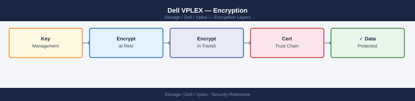

---
tags:
  - dell
  - security
---
# Dell VPLEX — Encryption

<div class="kb-summary">
VPLEX itself is a virtualisation and federation layer and does not natively encrypt data in transit between hosts and the directors (Fibre Channel does not provide encryption at the SAN layer). Encryption at rest is delegated to the back-end arrays.

*Applies to: VPLEX*
</div>


 Management traffic encryption is handled via TLS and SSH on the management plane.

```d2
direction: right

host: "Host\nESXi / Linux" {shape: rectangle}
vplex: "VPLEX Directors" {shape: rectangle}
arrays: "Back-end Arrays\nPowerMax D@RE\nUnity Encryption" {shape: rectangle}
vms: "VMS\nUnisphere / vplexcli" {shape: rectangle}
iclLink: "ICL\nMetro cluster-to-cluster" {shape: rectangle}

host -> vplex
vplex -> arrays
arrays -> arrays
vms -> vplex
host -> vms
```

## Before you begin

- **Access:** Storage admin credentials (cluster admin or equivalent)
- **Change management:** security changes require CAB approval in most environments
- **Rollback plan:** document current state before any security control change
- **Testing:** validate in a non-production environment first where possible

---

## Encryption Scope Summary

| Data Path | Encryption | Responsibility |
|---|---|---|
| Host → VPLEX front-end ports (FC) | Not encrypted (standard FC) | SAN encryption switch if required |
| VPLEX → back-end array (FC) | Not encrypted (standard FC) | SAN encryption switch if required |
| VPLEX ICL (Metro cluster-to-cluster) | Not encrypted at the VPLEX layer | WAN encryption (MACsec, IPsec at the network layer) |
| Data at rest on back-end arrays | Yes (array-managed) | Back-end array (PowerMax DAR, Unity encryption) |
| Management: vplexcli (SSH) | Yes (SSH TLS) | VMS — enforce key-only auth |
| Management: Unisphere web GUI | Yes (HTTPS/TLS) | VMS — replace self-signed cert |
| Management: VPLEX director ↔ VMS | Encrypted | GeoSynchrony internal |

## Data at Rest

VPLEX is transparent to back-end array encryption. Volumes encrypted at the array level are presented through VPLEX and to hosts without any modification — hosts and VPLEX see encrypted blocks, but the encryption key management and AES operations happen entirely within the array.

### Enabling Encryption on Back-End Arrays

**Dell PowerMax (D@RE — Data at Rest Encryption):**

PowerMax D@RE encrypts all data on the array using AES-256 with FIPS 140-2 validated key management. Encryption is enabled at the array level and covers all storage groups, LUNs, and system metadata.

- Verify D@RE status before claiming volumes into VPLEX: confirm with PowerMax management that the array is encryption-enabled.
- No VPLEX configuration changes are required to use an encrypted back-end volume.

**Dell Unity XT (Encryption):**

Unity supports drive-level encryption (D@RE) using self-encrypting drives (SED) or software encryption depending on the model.

- Confirm encryption is enabled in Unisphere for Unity before presenting LUNs to VPLEX.

**Verification before claiming volumes:**

Before claiming a new storage volume into VPLEX, confirm with the array administrator that:

1. The back-end array has encryption enabled (D@RE or equivalent).
2. The specific LUN being claimed is covered by the encryption policy.
3. Key management (local or external KMIP key manager) is configured and the keys are being backed up.

## Management Traffic Encryption

### SSH (vplexcli)

All `vplexcli` access is via SSH to the VMS. SSH provides strong encryption for the management session.

**SSH hardening for VMS:**

```bash
# Recommended settings in /etc/ssh/sshd_config on VMS:

# Disable weak authentication methods
PasswordAuthentication no
ChallengeResponseAuthentication no
PermitRootLogin no
PermitEmptyPasswords no

# Restrict to strong key exchange algorithms
KexAlgorithms curve25519-sha256,diffie-hellman-group-exchange-sha256
Ciphers aes256-gcm@openssh.com,chacha20-poly1305@openssh.com,aes128-gcm@openssh.com
MACs hmac-sha2-256-etm@openssh.com,hmac-sha2-512-etm@openssh.com

# Restrict to specific management hosts (if IP range is known)
AllowUsers service@<MGMT_SUBNET>

# Session timeout
ClientAliveInterval 300
ClientAliveCountMax 3

# Restart sshd after changes
systemctl restart sshd
```


```text title="Expected output"
(no output — command completes silently)
```

!!! warning "Common errors"
    **`sshd: no hostkeys available -- exiting.`** — Ensure SSH host keys exist in /etc/ssh/ (ssh-keygen -A) before restarting sshd.
    **`Invalid user service from 192.168.1.50 port 54321`** — Replace `<MGMT_SUBNET>` with actual CIDR notation (e.g., `AllowUsers service@192.168.0.0/24`) or use specific usernames without IP restrictions.
    **`Job for sshd.service failed because the control process exited with error code.`** — Run `sshd -t` to validate syntax errors in sshd_config before restarting the service.
Verify the active SSH configuration:

```bash
sshd -T | grep -E 'passwordauthentication|permitempty|ciphers|kexalgorithms'
```


```text title="Expected output"
passwordauthentication yes
permitemptypassword no
ciphers aes128-ctr,aes192-ctr,aes256-ctr,aes128-gcm@openssh.com,aes256-gcm@openssh.com
kexalgorithms curve25519-sha256,curve25519-sha256@libssh.org,ecdh-sha2-nistp256,ecdh-sha2-nistp384,ecdh-sha2-nistp521,diffie-hellman-group-exchange-sha256
```

!!! warning "Common errors"
    **`sshd: command not found`** — Ensure OpenSSH server is installed with `apt-get install openssh-server` or equivalent for your distro.
    **`error: Could not load host key`** — Run the command with sudo or as root, since sshd configuration requires elevated privileges to read.
### HTTPS / TLS (Unisphere for VPLEX)

Unisphere for VPLEX ships with a self-signed TLS certificate. Replace this with a certificate signed by the corporate CA before production use.

#### Replacing the Unisphere TLS Certificate

**Step 1: Generate a CSR on the VMS**

```bash
# SSH to VMS as admin
ssh admin@<VMS_IP>

# Generate a private key and CSR
openssl req -new -newkey rsa:4096 -nodes \
  -keyout /opt/vplex/certs/vplex_mgmt.key \
  -out /opt/vplex/certs/vplex_mgmt.csr \
  -subj "/CN=vplex-mgmt.example.com/O=Example Corp/C=US"

# Review the CSR to confirm the subject
openssl req -text -noout -in /opt/vplex/certs/vplex_mgmt.csr
```


```text title="Expected output"
admin@vplex-mgmt-01:~$ ssh admin@192.168.100.45
Last login: Wed Jan 15 14:22:33 2025 from 10.50.12.8
admin@vplex-mgmt-01:~$ openssl req -new -newkey rsa:4096 -nodes \
>   -keyout /opt/vplex/certs/vplex_mgmt.key \
>   -out /opt/vplex/certs/vplex_mgmt.csr \
>   -subj "/CN=vplex-mgmt.example.com/O=Example Corp/C=US"
Generating a RSA private key
.......................................................................................++++
writing new private key to '/opt/vplex/certs/vplex_mgmt.key'
-----
admin@vplex-mgmt-01:~$ openssl req -text -noout -in /opt/vplex/certs/vplex_mgmt.csr
Certificate Request:
    Data:
        Version: 1 (0x0)
        Subject: CN = vplex-mgmt.example.com, O = Example Corp, C = US
        Public Key Info:
            Public Key Algorithm: rsaEncryption
                RSA Public-Key: (4096 bit)
    Signature ok
    subject=CN = vplex-mgmt.example.com, O = Example Corp, C = US
```

!!! warning "Common errors"
    **`openssl: /opt/vplex/certs: No such file or directory`** — Create the directory with `mkdir -p /opt/vplex/certs` before running the openssl command.
    **`Permission denied`** — Ensure the admin user has write permissions to `/opt/vplex/certs` or run the command with appropriate sudo privileges.
**Step 2: Submit the CSR to the corporate CA**

Submit `vplex_mgmt.csr` to the corporate certificate authority. Request a certificate with:

- Subject Alternative Name (SAN): include the VMS FQDN and IP address
- Key usage: Digital Signature, Key Encipherment
- Extended key usage: Server Authentication (1.3.6.1.5.5.7.3.1)
- Validity: 1–2 years (align with the organisation's certificate renewal cycle)

**Step 3: Install the signed certificate**

```bash
# Copy the signed cert chain to VMS
scp vplex_mgmt.crt admin@<VMS_IP>:/opt/vplex/certs/
scp corporate_ca_chain.crt admin@<VMS_IP>:/opt/vplex/certs/

# Import the certificate into the VPLEX keystore via Unisphere:
# Settings → Security → Certificate → Import Certificate
# Upload the .key file and the signed .crt chain
```


```text title="Expected output"
vplex_mgmt.crt                                    100% 2847     1.2MB/s   00:00
corporate_ca_chain.crt                            100% 5634     2.1MB/s   00:00
```

!!! warning "Common errors"
    **`Permission denied (publickey,password).`** — Verify the VMS_IP is correct and the admin user has SSH access enabled; check that your SSH key is loaded or use password authentication with the `-o PubkeyAuthentication=no` flag.
    **`scp: /opt/vplex/certs/: No such file or directory`** — Create the target directory on the VMS first with `ssh admin@<VMS_IP> 'mkdir -p /opt/vplex/certs/'` before copying files.
Alternatively, import through Unisphere → Settings → Security → Certificates if a GUI-based import is supported on the installed GeoSynchrony version.

**Step 4: Verify the certificate**

```bash
# From an external host, verify the presented certificate
openssl s_client -connect <VMS_IP>:443 -showcerts </dev/null 2>/dev/null \
  | openssl x509 -noout -text | grep -A 5 "Subject\|Validity\|SAN"
```


```text title="Expected output"
Subject: CN=vplex-cluster-01.storage.local, O=Dell Inc., C=US
Validity
    Not Before: Jan 15 10:23:45 2023 GMT
    Not After : Jan 15 10:23:45 2026 GMT
X509v3 Subject Alternative Name: 
    DNS:vplex-cluster-01.storage.local, DNS:vplex-cluster-01, IP Address:192.168.100.45
```

!!! warning "Common errors"
    **`connect: Connection refused`** — Verify the VMS_IP is correct and the VPLEX management interface is listening on port 443 with `telnet <VMS_IP> 443`.
    **`unable to load certificate`** — The certificate chain was not properly returned; try removing the pipe to `openssl x509` and run `openssl s_client -connect <VMS_IP>:443 -showcerts </dev/null 2>&1 | head -50` to inspect the raw output.
    **`grep: (standard input) is empty`** — The certificate output format differs; run the command without grep first to see the actual certificate structure, then adjust the grep patterns accordingly.
#### Certificate Lifecycle Management

| Activity | Timing | Owner |
|---|---|---|
| Certificate renewal request | 30 days before expiry | Storage team |
| CSR generation and CA submission | 21 days before expiry | Storage team |
| Certificate installation | Within maintenance window | Storage team |
| Certificate expiry monitoring | Automated (SIEM/monitoring alert) | Operations |

Configure an automated certificate expiry alert in the monitoring platform targeting the VMS HTTPS endpoint:

```bash
# Check certificate expiry from a monitoring host
echo | openssl s_client -connect <VMS_IP>:443 2>/dev/null \
  | openssl x509 -noout -enddate
```


```text title="Expected output"
notAfter=Dec 15 09:47:32 2025 GMT
```

!!! warning "Common errors"
    **`connect: Connection refused`** — Verify the VPLEX management IP is correct and port 443 is accessible from your monitoring host (check firewall rules and network connectivity).
    **`unable to load certificate`** — The server is not responding with a valid SSL certificate; confirm the VPLEX cluster is running and the management interface is online.
Alert when fewer than 30 days remain before expiry.

## Fibre Channel Layer Encryption

VPLEX Fibre Channel data paths (host-to-VPLEX and VPLEX-to-array) are not encrypted at the VPLEX layer. If FC encryption is required (e.g., for compliance with PCI DSS on shared fabric segments), implement it at the SAN switch level using:

- **Brocade Encryption Switch** or **Brocade FS8-18 blade** — blade-level FC encryption for in-flight data
- **Cisco MDS 9000 Storage Media Encryption (SME)** — port-based FC encryption

FC layer encryption is transparent to VPLEX and requires no VPLEX configuration changes.

## ICL Encryption (Metro)

The Inter-Cluster Link between Metro clusters carries synchronous write data. If the ICL traverses untrusted WAN infrastructure, encrypt at the network layer:

- **MACsec (IEEE 802.1AE)** — Layer 2 encryption; appropriate for dark fibre or carrier Ethernet ICL
- **IPsec** — Layer 3 encryption; appropriate for IP-based WAN ICL
- Implement WAN encryption on the routing/switching equipment at each site; VPLEX requires no reconfiguration

Confirm ICL encryption does not add RTT that would push the cluster-to-cluster latency above the 5ms Metro requirement. Measure RTT before and after enabling WAN encryption.

---

## See also

- [Vplex — Hardening](../hardening/)
- [Vplex — Authentication](../authentication/)
- [Vplex — Access Control](../access-control/)
