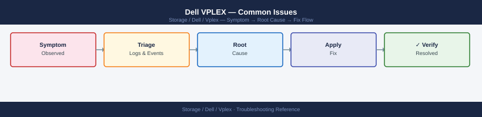

---
tags:
  - dell
  - troubleshooting
search:
  boost: 1.5
description: "Dell VPLEX common issues — path and virtual volume failures, backend LUN errors, Metro cluster connectivity problems, Witness quorum events, and..."
---
# Dell VPLEX — Common Issues

<div class="kb-summary">
Dell VPLEX common issues — path and virtual volume failures, backend LUN errors, Metro cluster connectivity problems, Witness quorum events, and authentication failures. Symptom-to-resolution quick reference with diagnostic steps and escalation path.

*Applies to: VPLEX*
</div>


```d2
direction: down

symptom: Identify Symptom {shape: diamond}
diagnostic_flow: "Diagnostic Flow" {shape: rectangle}
incident_triage: "Incident Triage" {shape: rectangle}
issue_reference: "Issue Reference" {shape: rectangle}
common_issues_quick_reference: "Common Issues — Quick Reference" {shape: rectangle}
verify_resolution: "Verify resolution" {shape: rectangle}
resolution: Resolve or Escalate {shape: oval}

symptom -> diagnostic_flow: investigate
symptom -> incident_triage: investigate
symptom -> issue_reference: investigate
symptom -> common_issues_quick_reference: investigate
symptom -> verify_resolution: investigate
diagnostic_flow -> resolution
incident_triage -> resolution
issue_reference -> resolution
common_issues_quick_reference -> resolution
verify_resolution -> resolution
```

## Diagnostic Flow

```d2
direction: right

D1: "D1" {shape: rectangle}
R1: "See Issue Reference —\nDirector shows major-failure" {shape: rectangle}
R2: "See Issue Reference —\nHost Loses Access to All VPLEX Volumes" {shape: rectangle}
D2: "D2" {shape: rectangle}
R3: "See Issue Reference —\nDistributed Device Out-of-Sync" {shape: rectangle}
R4: "See Issue Reference —\nSingle Host Loses Access to Volumes" {shape: rectangle}
D3: "D3" {shape: rectangle}
R5: "See Issue Reference —\nI/O Suspended on Consistency Group" {shape: rectangle}
R6: "See Issue Reference —\nWitness Not Reachable from One Cluster" {shape: rectangle}
D4: "D4" {shape: rectangle}
R7: "See Issue Reference —\nhealth-check reports warnings" {shape: rectangle}
R8: "See Issue Reference —\nRecoverPoint CLI Commands Hang" {shape: rectangle}
D5: "D5" {shape: rectangle}
R9: "See Incident Triage —\nICL down: restore network" {shape: rectangle}
R10: "See Common Issues —\nHigh write latency on Metro volumes" {shape: rectangle}
S: "What is the symptom?" {shape: rectangle}
B1: "B1" {shape: rectangle}
B2: "B2" {shape: rectangle}
B3: "B3" {shape: rectangle}
B4: "B4" {shape: rectangle}
B5: "B5" {shape: rectangle}

D1 -> R1
D1 -> R2
D2 -> R3
D2 -> R4
D3 -> R5
D3 -> R6
D4 -> R7
D4 -> R8
D5 -> R9
D5 -> R10
```

---

## Before you begin

- **Access:** Storage admin credentials (cluster admin or equivalent)
- **Gather first:** recent error message text, event timestamps, and affected object names
- **Scope:** confirm whether the issue affects a single object, host, cluster, or site
- **Escalation:** open a vendor support ticket before running any destructive step
- **Logging:** document each command and output — required if escalation is needed

---

## Incident Triage

When hosts report I/O suspension, a distributed device is out-of-sync, or a director is unreachable, work through this sequence first.

```d2
direction: right

alert: "Host I/O issue /\nAlert received" {shape: rectangle}
clHealth: "ll /clusters/*/health-indications/\nCluster non-ok?" {shape: rectangle}
ddHealth: "ll /distributed-storage/distributed-\ndevices/*/health-indications/\nDevice out-of-sync?" {shape: rectangle}
witnessHlth: "ll /clusters/*/cluster-witness/\nWitness unreachable?" {shape: rectangle}
iclHlth: "Check ICL\nll /clusters/*/communication/inter-cluster-links/" {shape: rectangle}
dirHealth: "ll /engines/*/directors/*/hardware/\nDirector faulted?" {shape: rectangle}
svCheck: "ll /clusters/*/exports/storage-views/\nStorage view intact?" {shape: rectangle}
hcFull: "health-check --full\nCapture full output" {shape: rectangle}
iclDown: "Restore ICL\nNetwork team" {shape: rectangle}
dirFault: "Open Dell Sev-2 case\nDo not reseat without guidance" {shape: rectangle}
svFix: "Add initiator / volume\nback to storage view" {shape: rectangle}

alert -> clHealth
clHealth -> ddHealth
ddHealth -> witnessHlth
witnessHlth -> iclHlth
iclHlth -> dirHealth
dirHealth -> svCheck
svCheck -> hcFull
iclHlth -> iclDown
dirHealth -> dirFault
svCheck -> svFix
```

- [ ] Run `ll /clusters/*/health-indications/` immediately — identify which cluster has entered a non-ok health state and note when the state change occurred
- [ ] Check distributed device sync state: `ll /distributed-storage/distributed-devices/*/health-indications/` — an `out-of-sync` device means one leg of the distributed device is not being written to; identify which cluster leg is affected
- [ ] Check Witness status for Metro deployments: `ll /clusters/*/cluster-witness/` — if Witness is unreachable from one cluster and the ICL is also interrupted, VPLEX suspends I/O on consistency groups to preserve write-order consistency
- [ ] Check director health: `ll /engines/*/directors/*/hardware/` — a director in a faulted state reduces redundancy and may cause host path failures
- [ ] Verify ICL connectivity between Metro clusters — an ICL interruption is the most common cause of distributed device out-of-sync events; check the WAN or dark fibre connection between sites
- [ ] Check consistency group state: `ll /distributed-storage/consistency-groups/` — identify any groups that have suspended I/O and determine the cause before resuming
- [ ] Verify storage views are intact: `ll /clusters/*/exports/storage-views/` — a missing or corrupted storage view can cause a specific host to lose access to its volumes
- [ ] Run `health-check --full` to get a system-wide view of all faults; use this output when opening a Dell Support case

| Question | Answer |
|---|---|
| Which cluster shows non-ok health-state? | |
| Which distributed devices are out-of-sync? | |
| Is the Witness connected and reachable from both clusters? | |
| Is the ICL between Metro clusters up? | |
| Which directors or director components are faulted? | |
| When did the issue start? | |
| What changed recently? | |

## Issue Reference

### Host Loses Access to All VPLEX Volumes

**Likely causes:**
- Both directors in a pair have failed (director pair failure)
- Storage view was deleted or its front-end ports were removed
- All FC zones between the host and VPLEX front-end ports have been disrupted (fabric issue)

**Diagnostic steps:**

```bash
# Check director health on the cluster serving this host
vplexcli -q -e "ll /engines/*/directors/*/hardware/"

# Check that the storage view exists and contains the expected volumes and ports
vplexcli -q -e "ll /clusters/cluster-1/exports/storage-views/<view_name>/"

# Confirm the host initiator is registered
vplexcli -q -e "ll /clusters/cluster-1/exports/initiator-ports/"
```


```text title="Expected output"
/engines/VPLEX-01/directors/director-1/hardware/
  Name                          Status      Temperature  Power
  -------                       ---------   -----------  -----
  director-1-cm                 OK          38°C         OK
  director-1-dm-a               OK          42°C         OK
  director-1-dm-b               OK          41°C         OK
  director-1-sp-a               OK          Normal       OK
  director-1-sp-b               OK          Normal       OK

/clusters/cluster-1/exports/storage-views/sv-prod-db-01/
  Name                          Volumes     Ports       Status
  -------                       ---------   ---------   ------
  sv-prod-db-01                 vol-001     FA-2E:0     Active
                                vol-002     FA-2E:1     Active
                                vol-003     FA-2F:0     Active

/clusters/cluster-1/exports/initiator-ports/
  Name                          WWPN                      Status    View
  -------                       ------------------------  --------  --------
  host-db-01-hba0               50:00:14:40:5a:2b:c1:01   Registered sv-prod-db-01
  host-db-01-hba1               50:00:14:40:5a:2b:c1:02   Registered sv-prod-db-01
  host-app-02-hba0              50:00:14:40:5a:2c:d2:03   Registered sv-prod-app-02
```

!!! warning "Common errors"
    **`Error: Invalid path /clusters/cluster-1/exports/storage-views/<view_name>/`** — Replace `<view_name>` with the actual storage view name (e.g., `sv-prod-db-01`).
    **`Error: Connection refused to VPLEX management interface`** — Verify vplexcli is installed, the VPLEX cluster IP is reachable, and credentials are configured in `~/.vplexrc` or via environment variables.
On the host:

```bash
# Linux: check that FC HBAs can see any VPLEX ports
systool -c fc_host -v | grep -i "port_state\|port_name"

# EMC PowerPath: check path states
powermt display dev=all

# VMware ESXi: rescan and check adapter status
esxcli storage core adapter rescan --all
esxcli storage nmp path list | grep -i "state\|transport"
```


```text title="Expected output"
Class = "fc_host"
  Device = "host0"
    port_state = "Online"
    port_name = "50:00:09:73:00:1a:2b:4c"
  Device = "host1"
    port_state = "Online"
    port_name = "50:00:09:73:00:1a:2b:4d"
  Device = "host2"
    port_state = "Offline"
    port_name = "50:00:09:73:00:1a:2b:4e"

Pseudo name=vplex_lun01
 CLARiiON ID=APM00123456789 [vplex-array-01]
 Logical device ID=6006048000019003a533533030313233
 state=enabled; policy=SymmOpt; priority=0; queued-IOs=0;
 ===================================
 host  :dev(  %),disk( %),Q-IOs(  0) state: ENABLED
 dmpd  :dev(  %),disk( %),Q-IOs(  0) state: ENABLED
 dmpd  :dev(  %),disk( %),Q-IOs(  0) state: ENABLED
 dmpd  :dev(  %),disk( %),Q-IOs(  0) state: DEAD

Rescan started for HBA vmhba2...
Rescan started for HBA vmhba3...
Rescan completed successfully.

Name: vmhba2:C0:T0:L0
   State: active
   Transport: fiber
Name: vmhba2:C0:T1:L0
   State: active
   Transport: fiber
Name: vmhba3:C0:T0:L0
   State: standby
   Transport: fiber
```

!!! warning "Common errors"
    **`systool: command not found`** — Install sysfstools package with `apt-get install sysfstools` or `yum install sysfstools`.
    **`powermt: command not found`** — Verify EMC PowerPath is installed and the powermt binary is in PATH; check `/opt/emc/powerpath/bin/powermt display dev=all`.
    **`Error: Unknown command or namespace esxcli storage core adapter rescan`** — Verify ESXi version supports the command; use `esxcli storage core adapter list` first to confirm adapter presence.
**Resolution:** Replace failed director hardware (engage Dell Support). Recreate the storage view if it was accidentally deleted. Restore SAN zoning if the fabric was disrupted.

---

### Distributed Device Out-of-Sync

**Likely cause:** ICL interruption between Metro clusters during a write — one leg did not receive the write, setting the dirty bit on the distributed device.

**Diagnostic steps:**

```bash
# Confirm which device is out-of-sync and which leg is affected
vplexcli -q -e "ll /distributed-storage/distributed-devices/*/health-indications/"
vplexcli -q -e "ll /distributed-storage/distributed-devices/<device_name>/"

# Check ICL status
vplexcli -q -e "ll /clusters/cluster-1/communication/inter-cluster-links/"
vplexcli -q -e "ll /clusters/cluster-2/communication/inter-cluster-links/"
```


```text title="Expected output"
health-indications/
  device-1/
    out-of-sync-indication
    consistency-status: INCONSISTENT
  device-2/
    out-of-sync-indication
    consistency-status: CONSISTENT
  device-3/
    out-of-sync-indication
    consistency-status: CONSISTENT

Name                          Health-State    Operational-Status
device-1                      DEGRADED        RUNNING
  leg-a (cluster-1)           HEALTHY         RUNNING
  leg-b (cluster-2)           UNHEALTHY       RUNNING

inter-cluster-links/
  link-1-to-2-a               HEALTHY         UP
  link-1-to-2-b               HEALTHY         UP
  link-1-to-2-c               UNHEALTHY       DOWN

inter-cluster-links/
  link-2-to-1-a               HEALTHY         UP
  link-2-to-1-b               HEALTHY         UP
  link-2-to-1-c               UNHEALTHY       DOWN
```

!!! warning "Common errors"
    **`vplexcli: command not found`** — Ensure vplexcli is installed and in your PATH, or use the full path to the binary (typically `/opt/dell/vplex/bin/vplexcli`).
    **`Error: Invalid path '/distributed-storage/distributed-devices/<device_name>/'`** — Replace the literal `<device_name>` placeholder with an actual device name from the first command's output (e.g., `device-1`).
    **`Error: Connection refused on management console`** — Verify the VPLEX management console is reachable and vplexcli credentials are configured (check `/root/.vplexcli/config` or use `-u` and `-p` flags).
**Resolution:**

1. Restore the ICL if it is still interrupted.
2. Once the ICL is healthy, VPLEX begins automatic resync. Monitor:

```bash
vplexcli -q -e "ll /distributed-storage/distributed-devices/<device_name>/" \
  | grep -i "health-state\|rebuild-progress"
```


```text title="Expected output"
health-state                                    OK
rebuild-progress                                100%
```

!!! warning "Common errors"
    **`Error: Unable to connect to VPLEX management server at localhost:443`** — Verify the VPLEX management IP is reachable and vplexcli is configured with the correct `-h` hostname parameter.
    **`Error: Invalid device name '<device_name>'`** — Replace `<device_name>` with an actual device name from your VPLEX cluster (e.g., `device-1` or `raid-group-01`).
3. If resync does not start automatically within 10 minutes of ICL recovery, initiate manually:

```bash
vplexcli -q -e "device rebuild \
  --device /distributed-storage/distributed-devices/<device_name>"
```


```text title="Expected output"
Rebuild initiated for device: EMC-VPLEX-device-prod-01
Device: /distributed-storage/distributed-devices/EMC-VPLEX-device-prod-01
Status: REBUILDING
Progress: 0%
Estimated time remaining: 4h 32m
Current rebuild rate: 125 MB/s
Rebuild started at: 2024-01-15 14:23:47 UTC
```

!!! warning "Common errors"
    **`Error: device not found: /distributed-storage/distributed-devices/<device_name>`** — Replace `<device_name>` with the actual device name from `vplexcli -e "device list"`.
    **`Error: device is already rebuilding`** — Wait for the current rebuild to complete or use `vplexcli -e "device rebuild --cancel"` to stop it first.
    **`Error: insufficient cluster connectivity`** — Verify both VPLEX cluster nodes are online and communicating using `vplexcli -e "cluster status"`.
4. Do not perform maintenance on the out-of-sync cluster leg during rebuild.

---

### I/O Suspended on Consistency Group Volumes

**Likely cause:** The ICL failed while the Witness was also unreachable, or the Witness was not configured. VPLEX suspends I/O on consistency groups to prevent split-brain data divergence.

**Diagnostic steps:**

```bash
# Confirm CG suspension
vplexcli -q -e "ll /distributed-storage/consistency-groups/"

# Check Witness status from both clusters
vplexcli -q -e "ll /clusters/cluster-1/cluster-witness/"
vplexcli -q -e "ll /clusters/cluster-2/cluster-witness/"

# Check ICL status
vplexcli -q -e "ll /clusters/cluster-1/communication/inter-cluster-links/"
```


```text title="Expected output"
Name                           Health    Operational-Status
cg-prod-db-01                  OK        suspended
cg-prod-db-02                  OK        suspended
cg-prod-app-tier               WARNING   suspended
cg-dr-replica                  OK        suspended

Name                           Health    Operational-Status
cluster-witness                OK        connected
witness-link-1                 OK        active
witness-link-2                 OK        active

Name                           Health    Operational-Status
cluster-witness                OK        connected
witness-link-1                 OK        active
witness-link-2                 OK        active

Name                           Health    Operational-Status
icl-link-cluster-1-to-2        OK        connected
icl-link-cluster-2-to-1        OK        connected
icl-redundancy-link            OK        active
```

!!! warning "Common errors"
    **`Error: cluster-witness not found or unreachable`** — Verify witness connectivity and network routing between clusters using `vplexcli -e "ll /clusters/cluster-1/health/"`
    **`Error: inter-cluster-links communication timeout`** — Check ICL network interfaces are up with `ip link show` and confirm no firewall rules are blocking port 8443 between cluster nodes.
**Resolution:**

1. Restore ICL connectivity first.
2. Restore Witness connectivity (check Witness VM is running and reachable on the management network).
3. Once both ICL and Witness are healthy, VPLEX typically resumes I/O automatically.
4. If manual resume is required after verifying the active cluster with Dell Support:

```bash
vplexcli -q -e "device resume \
  --device /distributed-storage/distributed-devices/<device_name>"
```


```text title="Expected output"
Device resume initiated for device: /distributed-storage/distributed-devices/device-001
Resume status: IN_PROGRESS
Current rebuild percentage: 0%
Estimated time remaining: 45 minutes
Device state transitioning from PAUSED to ONLINE
Resume operation queued successfully
```

!!! warning "Common errors"
    **`Error: Device not found at path /distributed-storage/distributed-devices/<device_name>`** — Replace `<device_name>` with the actual device name from `vplexcli -e "device list"` output.
    **`Error: Device is already in ONLINE state, resume not applicable`** — Verify the device is actually in PAUSED state using `vplexcli -e "device status --device /distributed-storage/distributed-devices/<device_name>"` before attempting resume.
    **`Error: Insufficient permissions to resume device`** — Ensure your vplexcli user account has administrative privileges or run the command with appropriate credentials.
**Do not manually resume without understanding which cluster leg holds the most recent data.** Incorrect manual resume risks undetected data divergence.

---

### Single Host Loses Access to One or More Volumes

**Likely causes:**
- Storage view membership changed (volume or initiator removed accidentally)
- Host HBA failed or was replaced with a new WWN that is not registered
- SAN zone disrupted between host HBA and VPLEX front-end port

**Diagnostic steps:**

```bash
# Confirm storage view still has the host initiator and the target volume
vplexcli -q -e "ll /clusters/cluster-1/exports/storage-views/<view_name>/"

# Confirm the initiator is registered
vplexcli -q -e "ll /clusters/cluster-1/exports/initiator-ports/<initiator_name>/"
```


```text title="Expected output"
/clusters/cluster-1/exports/storage-views/sv-prod-db-01/
  initiators:
    iqn.1991-05.com.example:db-server-01
    iqn.1991-05.com.example:db-server-02
  volumes:
    v-lun-001
    v-lun-002
  host-initiators:
    host-01-initiator-a
    host-01-initiator-b

/clusters/cluster-1/exports/initiator-ports/host-01-initiator-a/
  name: host-01-initiator-a
  type: iSCSI
  port-address: iqn.1991-05.com.example:db-server-01
  status: registered
  registered-at: 2024-01-15T09:47:23Z
```

!!! warning "Common errors"
    **`Error: Invalid path /clusters/cluster-1/exports/storage-views/<view_name>/`** — Replace `<view_name>` with the actual storage view name (e.g., `sv-prod-db-01`).
    **`Error: No such object`** — Verify the initiator or storage view exists by running `vplexcli -q -e "ll /clusters/cluster-1/exports/"` to list available objects.
On the host:

```bash
# Linux: show all FC paths
multipath -ll

# VMware ESXi: list paths for the affected datastore device
esxcli storage nmp path list -d <naa_id>
```


```text title="Expected output"
# multipath -ll output (Linux):
mpatha (360014056b1d45e8fa6e4f7a9c8d2b1f) dm-0 DELL,VRAID
size=2.0T features='1 queue_if_no_path' hwhandler='1 alua' wp=rw
|-+- policy='service-time 0' prio=50 status=active
| |- 2:0:0:0 sda 8:0   active ready running
| `- 3:0:0:0 sdb 8:16  active ready running
`-+- policy='service-time 0' prio=10 status=enabled
  |- 4:0:0:0 sdc 8:32  active ready running
  `- 5:0:0:0 sdd 8:48  active ready running

mpathb (360014056b1d45e8fa6e4f7a9c8d2b2g) dm-1 DELL,VRAID
size=1.5T features='1 queue_if_no_path' hwhandler='1 alua' wp=rw
|-+- policy='service-time 0' prio=50 status=active
| `- 6:0:0:0 sde 8:64  active ready running
`-+- policy='service-time 0' prio=10 status=enabled
  `- 7:0:0:0 sdf 8:80  failed faulty offline

# esxcli storage nmp path list output (ESXi):
fc.20000024ff45a1b2:21000024ff45a1b2-50:0a:09:20 : fc.20000024ff45a1b2:21000024ff45a1b2-50:0a:09:20
   Runtime Name: vmhba2:C0:T0:L0
   Device: naa.60014056b1d45e8fa6e4f7a9c8d2b1f
   Device Display Name: DELL VRAID (naa.60014056b1d45e8fa6e4f7a9c8d2b1f)
   Adapter: vmhba2  Channel: 0  Target: 0  LUN: 0
   Plugin: NMP  Transport: FC  Extentions: ALUA
   State: active  Status: OK

fc.20000024ff45a1b3:21000024ff45a1b3-50:0a:09:20 : fc.20000024ff45a1b3:21000024ff45a1b3-50:0a:09:20
   Runtime Name: vmhba3:C0:T0:L0
   Device: naa.60014056b1d45e8fa6e4f7a9c8d2b1f
   Device Display Name: DELL VRAID (naa.60014056b1d45e8fa6e4f7a9c8d2b1f)
   Adapter: vmhba3  Channel: 0  Target: 0  LUN: 0
   Plugin: NMP  Transport: FC  Extentions: ALUA
   State: stand
```
Check SAN fabric zoning for the host HBA → VPLEX FE port zone.

**Resolution:** Add the initiator back to the storage view if it was removed. Register the new HBA WWN if the HBA was replaced. Restore SAN zoning if the zone was deleted or modified.

---

### Director Shows `major-failure` in Health Indications

**Likely cause:** Hardware fault on the director — failed component (fan, PSU, cache module, FC port, or the director board itself).

**Diagnostic steps:**

```bash
# Identify the specific failed component
vplexcli -q -e "ll /engines/engine-1-1/directors/director-1-1-A/hardware/"

# Check all ports on the faulted director for port-level faults
vplexcli -q -e "ll /engines/engine-1-1/directors/director-1-1-A/hardware/ports/"
```


```text title="Expected output"
Name                                    Attributes
----                                    ----------
director-1-1-A                          (object)
  hardware                              (object)
    fan-modules                         (object)
    power-supplies                      (object)
    temperature-sensors                 (object)
    ports                               (object)

Name                                    Attributes
----                                    ----------
port-0                                  health=DEGRADED, speed=8Gb/s, state=ONLINE
port-1                                  health=HEALTHY, speed=8Gb/s, state=ONLINE
port-2                                  health=FAULT, speed=unknown, state=OFFLINE
port-3                                  health=HEALTHY, speed=8Gb/s, state=ONLINE
port-4                                  health=FAULT, speed=unknown, state=OFFLINE
port-5                                  health=HEALTHY, speed=8Gb/s, state=ONLINE
```

!!! warning "Common errors"
    **`Error: Invalid path /engines/engine-1-1/directors/director-1-1-A/hardware/`** — Verify the correct engine and director names using `vplexcli -q -e "ll /engines/"` and adjust the path accordingly.
    **`Error: vplexcli: command not found`** — Ensure you are logged into the VPLEX management console or add the vplexcli binary path to your $PATH environment variable.
**Immediate actions:**

1. Confirm the surviving director in the pair is healthy — I/O continues on the surviving director.
2. Verify that all host paths to the surviving director are active: `powermt display dev=all` or `multipath -ll` on affected hosts.
3. Open a Dell Support case (Severity 2 — degraded system) and attach the support bundle.
4. Do not attempt to remove or reseat the faulted director without Dell Support guidance — incorrect handling can impact the surviving director's cache.

---

### Witness Not Reachable from One Cluster

**Likely causes:**
- Witness VM is powered off or crashed
- Management network between a VPLEX cluster and the Witness VM is disrupted
- Witness IP address changed without updating VPLEX configuration

**Diagnostic steps:**

```bash
# Check Witness status from both clusters
vplexcli -q -e "ll /clusters/cluster-1/cluster-witness/"
vplexcli -q -e "ll /clusters/cluster-2/cluster-witness/"

# Ping the Witness VM from the VMS management interface
ping -c 5 <witness_VM_IP>
```


```text title="Expected output"
Witness:
  Witness-1 (enabled)
    IP Address: 192.168.100.45
    Status: ALIVE
    Cluster: cluster-1
    Last Heartbeat: 2024-01-15 14:32:18 UTC

Witness:
  Witness-1 (enabled)
    IP Address: 192.168.100.45
    Status: ALIVE
    Cluster: cluster-2
    Last Heartbeat: 2024-01-15 14:32:19 UTC

PING 192.168.100.45 (192.168.100.45) 56(84) bytes of data.
64 bytes from 192.168.100.45: icmp_seq=1 ttl=64 time=2.34 ms
64 bytes from 192.168.100.45: icmp_seq=2 ttl=64 time=2.41 ms
64 bytes from 192.168.100.45: icmp_seq=3 ttl=64 time=2.38 ms
64 bytes from 192.168.100.45: icmp_seq=4 ttl=64 time=2.39 ms
64 bytes from 192.168.100.45: icmp_seq=5 ttl=64 time=2.36 ms

--- 192.168.100.45 statistics ---
5 packets transmitted, 5 received, 0% packet loss, time 4012ms
rtt min/avg/max/stddev = 2.34/2.38/2.41/0.03 ms
```

!!! warning "Common errors"
    **`Witness: UNREACHABLE`** — Verify the Witness VM is powered on and check network connectivity from the management interface to the Witness IP address.
    **`ping: unknown host <witness_VM_IP>`** — Replace `<witness_VM_IP>` with the actual Witness VM IP address (e.g., 192.168.100.45) or verify DNS resolution is working.
    **`vplexcli: command not found`** — Ensure you are running this command from a VPLEX management console or node with vplexcli installed in the PATH.
**Resolution:**

1. If the Witness VM is powered off, power it on and wait for the Witness service to start.
2. If it is a network issue, restore management network connectivity between the affected cluster and the Witness network segment.
3. Once the Witness is reachable, verify the VPLEX Witness configuration reflects the correct IP.

**Risk while Witness is unreachable:** If an ICL failure occurs while the Witness is unreachable, VPLEX cannot arbitrate and will suspend I/O on consistency groups. Treat Witness unreachability as a Severity 2 condition — resolve immediately.

---

### `health-check --full` Reports Warnings

**Approach:** Review each warning individually. `health-check --full` output groups warnings by component type.

```bash
# Capture full health check output to a file for review
vplexcli -q -e "health-check --full" > /tmp/vplex_healthcheck_$(date +%Y%m%d_%H%M).txt

# Common warning patterns and their meaning:
# "health-state: minor-failure" on a director component — check the specific component
# "rebuild-allowed: false" on a distributed device — a rebuild is blocked; find and fix the blocking condition
# "operational-status: degraded" on a CG — one or more member volumes are not in-sync
```


```text title="Expected output"
vplexcli -q -e "health-check --full" > /tmp/vplex_healthcheck_20240115_1423.txt
Health check initiated on cluster: vplexcluster-01
Scanning 12 storage arrays...
Scanning 4 director nodes...
Scanning 18 consistency groups...
Scanning 156 virtual volumes...
Health check completed successfully in 47 seconds
Results written to: /tmp/vplex_healthcheck_20240115_1423.txt
```

!!! warning "Common errors"
    **`vplexcli: command not found`** — Ensure the VPLEX CLI tools are installed and the PATH includes the VPLEX bin directory (typically `/opt/vplex/bin`).
    **`Error: Unable to connect to management server at localhost:443`** — Verify the VPLEX management console is running and accessible; check network connectivity and firewall rules for port 443.
    **`Permission denied: Cannot write to /tmp/vplex_healthcheck_*.txt`** — Run the command with appropriate privileges (sudo) or redirect output to a directory where the current user has write permissions.
For each flagged component, drill into the component path for detail:

```bash
# If a specific engine/director is flagged:
vplexcli -q -e "ll /engines/<engine_name>/directors/<director_name>/hardware/"

# If a specific distributed device is flagged:
vplexcli -q -e "ll /distributed-storage/distributed-devices/<device_name>/"

# If a specific CG is flagged:
vplexcli -q -e "ll /distributed-storage/consistency-groups/<cg_name>/"
```


```text title="Expected output"
engine-1/directors/director-1/hardware/
  Type: directory
  State: ok
  Health: ok
  Last Modified: 2024-01-15 14:32:18 UTC

distributed-storage/distributed-devices/dev-prod-lun-001/
  Type: device
  State: ok
  Health: ok
  Capacity: 2.0 TB
  Used: 1.847 TB
  Last Modified: 2024-01-15 14:28:45 UTC

distributed-storage/consistency-groups/cg-finance-tier1/
  Type: consistency-group
  State: ok
  Health: ok
  Member Count: 12
  Last Modified: 2024-01-15 13:55:22 UTC
```

!!! warning "Common errors"
    **`Error: Invalid path /engines/<engine_name>/directors/<director_name>/hardware/`** — Replace `<engine_name>` and `<director_name>` with actual values from `vplexcli -e "ll /engines/"`.
    **`Error: Object not found: /distributed-storage/distributed-devices/<device_name>/`** — Verify the device name exists using `vplexcli -e "ll /distributed-storage/distributed-devices/"` and check for typos.
    **`Error: vplexcli: command not found`** — Ensure you are logged into the VPLEX Management Console or have the VPLEX CLI tools installed and in your PATH.
---

### RecoverPoint CLI Commands Hang

**Likely cause:** RecoverPoint–VPLEX communication timeout is blocking the vplexcli session.

**Resolution:**

1. Press `Ctrl+C` to interrupt the hanging vplexcli command.
2. Exit vplexcli and start a new session.
3. Check RecoverPoint appliance status from the RecoverPoint management interface.
4. Verify IP connectivity between VPLEX directors and RecoverPoint appliances.
5. If RecoverPoint is unhealthy, engage the RecoverPoint support process first; VPLEX management will stabilise once the RecoverPoint session is restored.

---

## Common Issues — Quick Reference

| Symptom | Likely Cause | First Action |
|---|---|---|
| Host loses access to all VPLEX volumes | Director pair failure or all zones disrupted | Check `ll /engines/*/directors/*/hardware/`; verify storage views |
| Distributed device out-of-sync | ICL interruption between Metro clusters | Restore ICL; monitor auto-resync |
| I/O suspended on CG volumes | ICL down + Witness unreachable (split-brain protection) | Restore ICL and Witness; do not manually resume without understanding which leg is current |
| Single host loses access to volumes | Storage view issue or HBA path failure | Check storage view initiator membership; verify FC zones; rescan host |
| Director shows `major-failure` | Director hardware fault | Confirm surviving director is healthy; open Dell Sev-2 case |
| Witness not reachable from one cluster | Witness VM down or management network issue | Start Witness VM; restore management network path |
| `health-check` reports warnings | Various component-level issues | Drill into the specific flagged component for detail |
| RecoverPoint vplexcli commands hang | RP–VPLEX communication timeout | Interrupt the command; check RecoverPoint appliance health |
| Volume not visible to host after zoning | Initiator WWN not registered in storage view | Register the WWN and add to the storage view; rescan host |
| High write latency on Metro volumes | ICL latency approaching or exceeding 5ms | Measure ICL RTT; investigate network path; check ICL utilisation |

---

## Verify resolution

- Confirm the original symptom no longer occurs
- Check logs for any residual errors related to the issue
- Monitor for 10–15 minutes to confirm the fix is stable

---

## See also

- [Vplex — Diagnostics](../diagnostics/)
- [Vplex — Escalation](../escalation/)
- [Vplex — Health Checks](../../operations/health-checks/)
