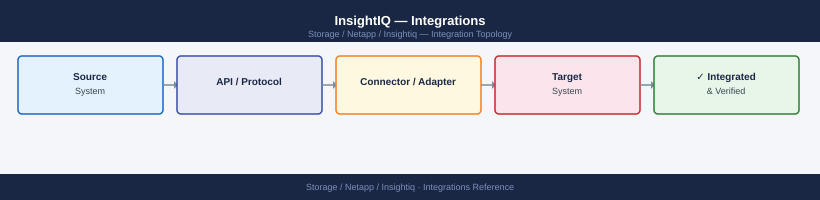

---
tags:
  - architecture
  - netapp
description: "InsightIQ integrates exclusively with PowerScale (Isilon) clusters via the OneFS REST API. External integrations are limited to email alerting, syslog..."
---
# InsightIQ — Integrations

InsightIQ integrates exclusively with PowerScale (Isilon) clusters via the OneFS REST API. External integrations are limited to email alerting, syslog forwarding, and the InsightIQ REST API for report automation.

*Applies to: InsightIQ*

## Scope Limitation

- InsightIQ monitors **PowerScale only** — it does not support PowerStore, Unity, or PowerMax
- For multi-vendor monitoring, use CloudIQ (Dell) or Aria Operations with storage Management Packs
- No native CMDB connector — update CMDB entries manually or via API scripting

---

## See also

- [Insightiq — How It Works](../how-it-works/)
- [Insightiq — Design Standards](../design-standards/)
