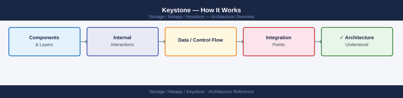
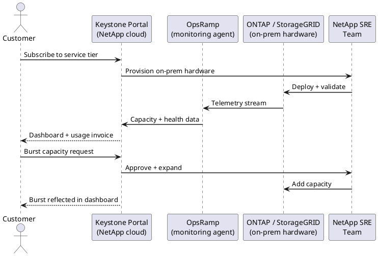
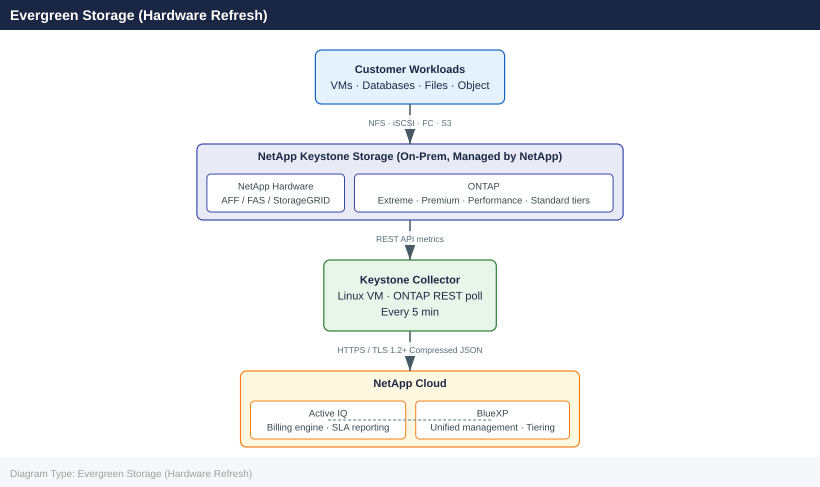

---
tags:
  - architecture
  - netapp
---
# Keystone — How It Works

<div class="kb-summary">
How It Works reference covering Overview, STaaS Consumption Model, Capacity Management Thresholds.

*Applies to: Keystone STaaS*
</div>




## Overview

NetApp Keystone is a Storage as a Service (STaaS) subscription that delivers on-premises NetApp hardware — AFF/FAS for block and file, StorageGRID for object — on an OpEx consumption model. NetApp installs, owns, and manages the hardware at the customer's data center or colocation facility. The customer commits to a minimum capacity per service tier and pays for committed capacity plus burst usage above the commitment. A Keystone Collector agent reports consumption telemetry to NetApp for billing.

## STaaS Consumption Model

```d2
direction: right

ONTAP: "NetApp ONTAP\n(on-premises / colocation" {shape: rectangle}
KS: "NetApp Keystone\n(STaaS portal" {shape: rectangle}
COMMIT: "Committed Capacity Tier" {shape: rectangle}
BURST: "Burst Capacity\n(on-demand" {shape: rectangle}
BILL: "Monthly Billing" {shape: rectangle}
ADMIN: "Customer Admin" {shape: rectangle}

ONTAP -> KS
KS -> COMMIT
KS -> BURST
KS -> BILL
ADMIN -> KS
```

## Service Tiers and Performance SLAs

Keystone offers four named service tiers, each with a committed latency SLA and a minimum IOPS/TB guarantee. The tier is selected per volume at provisioning time.

| Tier | Media | Latency SLA | Committed IOPS/TB | Burst Allowance |
|---|---|---|---|---|
| Extreme | NVMe (all-flash AFF A-series / C-series) | &lt;1 ms average | 12,288 | Up to 2× committed |
| Premium | SSD (AFF A-series) | &lt;2 ms average | 4,096 | Up to 2× committed |
| Performance | SSD (AFF C-series / FAS hybrid) | &lt;4 ms average | 2,048 | Up to 2× committed |
| Standard | HDD / hybrid (FAS) | No strict latency SLA | 512 | Up to 2× committed |

SLA metrics are monitored continuously by the Keystone Collector. If a committed SLA is breached for a sustained period, NetApp issues a service credit under the subscription agreement. Burst IOPS above the committed level are subject to availability and are not under SLA.

## Consumption and Billing Model

Keystone billing is capacity-based, not IOPS-based. The customer commits to a minimum capacity (TiB) per tier for the subscription term.

- **Committed capacity** — the contracted baseline. Billed at a flat monthly rate per TiB regardless of actual usage. If usage falls below committed, the committed charge still applies.
- **Burst capacity** — usage above the committed threshold within any calendar month. Billed at a higher per-TiB rate, calculated from the high-water mark of burst consumption recorded during the month.
- **No upfront CapEx** — NetApp owns the hardware. The customer pays a predictable monthly subscription fee, converting storage from a capital expenditure to an operating expenditure.
- **Flex scaling** — committed capacity can be adjusted (usually up) at a subscription renewal or via a contract amendment; scale-down is subject to contract terms.

## Keystone Collector and Telemetry

The **Keystone Collector** is a lightweight Linux VM deployed in the customer's environment (typically on an existing VMware cluster). It has no direct control over ONTAP configuration — it is read-only for billing purposes.

**Sizing:** 2 vCPU, 8 GB RAM, 200 GB disk. Requires outbound TCP 443 to ONTAP management LIFs and to the NetApp cloud endpoint.

**Telemetry collection cycle:**

1. Collector queries the ONTAP REST API every 5 minutes per SVM — volume capacity, efficiency savings, and performance counters.
2. Raw metrics are aggregated into a compressed JSON bundle.
3. The bundle is uploaded via HTTPS/TLS 1.2+ to the Active IQ cloud endpoint.
4. Active IQ processes the bundle, updates usage dashboards, and feeds the billing engine.
5. At month-end, the billing engine calculates committed + burst; an invoice PDF is generated.

The Collector queues failed uploads and retries for up to 24 hours, ensuring no billing data is lost during transient network outages.

## Data Management with BlueXP

**NetApp BlueXP** (formerly Cloud Manager) is NetApp's unified control plane that spans on-premises and cloud storage. Within a Keystone deployment, BlueXP provides:

- **Single management interface** — view Keystone on-prem hardware alongside Cloud Volumes ONTAP (AWS, Azure, GCP) and FSx for ONTAP in one dashboard.
- **Data tiering** — configure FabricPool to tier cold data from Keystone on-prem volumes to object storage (StorageGRID or public cloud) automatically.
- **SnapMirror orchestration** — replicate data between Keystone on-prem and cloud-based ONTAP instances for hybrid DR or cloud bursting.
- **Capacity visibility** — BlueXP shows committed vs consumed across all Keystone SVMs and correlates with cloud usage for unified chargeback reporting.

BlueXP requires a Connector (VM) deployed in the environment and connectivity to the ONTAP cluster management interface.

## Evergreen Storage (Hardware Refresh)

Keystone includes **Evergreen Storage**, NetApp's proactive hardware refresh programme bundled into the subscription. The principle is that the customer never operates on unsupported or end-of-support hardware during the subscription term.

**Refresh cadence:** NetApp refreshes controllers every 3–5 years (driven by NetApp's platform lifecycle, not the customer's request). The process:

1. NetApp engineers plan and schedule the controller replacement during an agreed maintenance window.
2. Data is non-disruptively migrated to the new controllers using ONTAP's native volume move or aggregate relocation.
3. Old controllers are removed and returned to NetApp. The customer retains no hardware asset.
4. Disk shelves and drives may be reused or replaced depending on capacity and media type requirements.

The customer's subscription price may be adjusted at the time of refresh if the new hardware tier results in a different cost basis, but the service continues uninterrupted.



---

## See also

- [Keystone — Design Standards](../design-standards/)
- [Keystone — Integrations](../integrations/)
