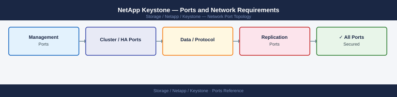

---
tags:
  - keystone
  - netapp
  - networking
  - firewall
  - ports
  - storage-as-a-service
description: "Firewall port reference for NetApp Keystone (Storage as a Service). Keystone deploys NetApp hardware on-premises managed by NetApp. The Keystone Collector..."
---
# NetApp Keystone — Ports and Network Requirements

<div class="kb-summary">
Firewall port reference for NetApp Keystone (Storage as a Service). Keystone deploys NetApp hardware on-premises managed by NetApp. The Keystone Collector appliance handles metering and telemetry upload. Data access protocols are the same as the underlying ONTAP or StorageGRID system.

*Applies to: NetApp Keystone STaaS*
</div>


## How It Works

Keystone is a NetApp-managed STaaS offering using the same ONTAP / StorageGRID hardware as standard NetApp deployments. On-premises components include a **Keystone Collector** VM that measures consumed capacity and uploads usage data to NetApp.

## Keystone Collector (Outbound — Required)

| Port | Protocol | Source | Destination | Purpose |
|---|---|---|---|---|
| 443 | TCP | Keystone Collector appliance | keystone.netapp.com, aiqum.netapp.com | Capacity metering, usage reporting, and entitlement validation |
| 443 | TCP | Keystone Collector appliance | ONTAP cluster management LIF | Collector → ONTAP API (capacity collection via AIQUM / Active IQ Unified Manager) |

## Admin Access (Keystone Portal — SaaS)

| Port | Protocol | Destination | Purpose |
|---|---|---|---|
| 443 | TCP | keystone.netapp.com | Admin browser — Keystone service dashboard, capacity reports, SLA tracking |

## Data Access Protocols (Same as Underlying Storage)

Keystone uses ONTAP or StorageGRID hardware with identical data protocols:

| Underlying System | Relevant Ports Page |
|---|---|
| ONTAP (NAS/SAN/NVMe) | [NetApp ONTAP — Ports](../../../ontap/architecture/ports/) |
| StorageGRID (Object) | S3 443 / 9000 inbound from clients |

## Firewall Zone Summary

| From | To | Ports | Notes |
|---|---|---|---|
| Keystone Collector | keystone.netapp.com | 443 | Metering upload — required for STaaS billing |
| Keystone Collector | ONTAP mgmt LIF | 443 | Capacity data collection |
| Admin browsers | keystone.netapp.com | 443 | SaaS portal |
| Client hosts | ONTAP data LIFs | Per protocol | Same as ONTAP standard ports |

## Verify

```bash
# From Keystone Collector VM — test NetApp portal connectivity
curl -sk -o /dev/null -w "%{http_code}" https://keystone.netapp.com/

# From Keystone Collector — test ONTAP management API
curl -sk -o /dev/null -w "%{http_code}" https://<ontap-mgmt-lif>/api/cluster

# Check Keystone Collector service status
systemctl status keystone-collector
```


```text title="Expected output"
200
200
● keystone-collector.service - NetApp Keystone Collector
     Loaded: loaded (/etc/systemd/system/keystone-collector.service; enabled; vendor preset: disabled)
     Active: active (running) since Wed 2024-01-17 14:32:18 UTC; 2 days ago
       Docs: https://docs.netapp.com/keystone/
    Process: 8847 ExecStart=/opt/keystone/bin/collector --config=/etc/keystone/collector.conf (code=exited, status=0/SUCCESS)
   Main PID: 8848 (collector)
      Tasks: 12 (limit: 4096)
     Memory: 287.4M
     CGroup: /systemd/system.slice/keystone-collector.service
             └─8848 /opt/keystone/bin/collector --config=/etc/keystone/collector.conf
```

!!! warning "Common errors"
    **`curl: (60) SSL certificate problem: self signed certificate`** — Add `-k` flag to skip certificate verification, or import the ONTAP cluster's CA certificate into the system trust store.
    **`curl: (7) Failed to connect to keystone.netapp.com port 443: Connection timed out`** — Verify the Collector VM has outbound HTTPS access to keystone.netapp.com and check firewall/proxy rules.
    **`Unit keystone-collector.service could not be found.`** — Ensure the Keystone Collector package is installed with `rpm -i keystone-collector-*.rpm` and systemd daemon is reloaded with `systemctl daemon-reload`.
## See also

- [NetApp Keystone — Architecture](../how-it-works/)
- [NetApp ONTAP — Ports](../../ontap/architecture/ports.md)
- [NetApp SnapCenter — Ports](../../snapcenter/architecture/ports.md)
