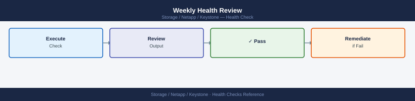

---
tags:
  - netapp
  - operations
description: "NetApp Keystone health checks: subscription capacity consumption review via Keystone portal, latency SLA compliance, and Active IQ Unified Manager alerts."
---
# Keystone — Health Checks

<div class="kb-summary">
NetApp Keystone health checks: subscription capacity consumption review via Keystone portal, latency SLA compliance, and Active IQ Unified Manager alerts.

*Applies to: Keystone STaaS*
</div>

## Before you begin

- **Access:** Storage admin credentials (cluster admin or equivalent)
- **Timing:** safe to run during business hours unless a step is marked ⚠ (causes interruption)
- **Dependencies:** no active upgrades or migrations on the same infrastructure
- **Logging:** capture command output — paste into the change record on completion

---

## Run This Routine

1. **Service health** — Keystone customer portal → Dashboard — check overall service status
2. **Consumed capacity** — verify consumed capacity vs committed capacity per service tier
3. **Burst usage** — check if burst capacity is being consumed — flag if sustained above committed
4. **SLA compliance** — verify performance metrics (IOPS, latency) meet contracted SLA
5. **Open support cases** — review any open cases affecting Keystone service delivery
6. **Billing alerts** — check for any threshold alerts from the Keystone portal

---

## Daily Checks


| Check | Command | Notes |
|---|---|---|
| Verify Keystone Collector service is running | `systemctl status keystone-collector` | Service must show `active (running)` |
| Check last successful telemetry timestamp | `journalctl -u keystone-collector -n 50 \| grep -i "collection\|reported\|error"` | Timestamp should be within the last hour |
| Review BlueXP Keystone dashboard | Navigate to BlueXP → Digital Wallet → Keystone Subscriptions | Check consumed vs. committed per tier |
| Check burst usage | Review BlueXP dashboard burst panel | Flag if burst > 10% above committed on any tier |
| Verify AQoS policy assignments | `volume show -fields qos-policy-group` on ONTAP cluster | No blank QoS policy groups on Keystone volumes |
| Confirm API endpoint reachability from Collector | `curl -sk https://keystone.netapp.com` from Collector VM | Must receive HTTP 200 or 401 (reachable) |
| Review Collector error log | `sudo tail -50 /var/log/keystone-collector/keystone-collector.log` | Look for `ERROR` or `WARN` entries |

---

## Health Check Criteria


A healthy Keystone environment meets all of the following:

- [ ] Keystone Collector service is `active (running)` — not failed, activating, or stopped
- [ ] Last successful telemetry collection is within the past 1 hour (or within the expected polling interval for your configuration)
- [ ] No `ERROR`-level entries in the Collector log in the last 24 hours
- [ ] BlueXP Keystone dashboard data is current — not stale from a previous day
- [ ] No service-level SLA breach notifications active (availability, latency, IOPS/TB)
- [ ] All Keystone-managed volumes have an AQoS adaptive policy-group assigned — no unclassified volumes
- [ ] Burst usage across all tiers is within acceptable range — not approaching the burst limit defined in the subscription
- [ ] No open Keystone support incidents with P1 or P2 severity

---

## Collector Health Commands


Run these commands on the Keystone Collector VM (SSH access required):

```bash
# Check Keystone Collector service status (systemd)
sudo systemctl status keystone-collector
# Expected: Active: active (running) since <timestamp>
# Uptime should reflect continuous operation without recent restarts

# View recent Collector logs — look for successful collection timestamps
sudo journalctl -u keystone-collector -n 100
# Look for lines containing: "collection complete", "data reported", "telemetry sent"

# Tail the Collector log file directly
sudo tail -100 /var/log/keystone-collector/keystone-collector.log

# Check for ERROR or WARN entries in the last 24 hours
sudo journalctl -u keystone-collector --since "24 hours ago" | grep -iE "ERROR|WARN|FAIL|exception"

# Test Collector connectivity to NetApp Keystone endpoint
curl -sk -o /dev/null -w "HTTP %{http_code}\n" https://keystone.netapp.com
# Expected: HTTP 200 or HTTP 401 (reachable; 401 is auth-required, which confirms network path is open)

# Check if a proxy is configured for the Collector (if your environment requires one)
sudo cat /etc/keystone-collector/config.conf | grep -i proxy
```


```text title="Expected output"
● keystone-collector.service - NetApp Keystone Collector
     Loaded: loaded (/etc/systemd/system/keystone-collector.service; enabled; vendor preset: enabled)
     Active: active (running) since Thu 2024-01-18 14:32:15 UTC; 45 days 3h ago
       Docs: https://docs.netapp.com/keystone
     Process: 8742 ExecStart=/usr/local/bin/keystone-collector (code=exited, status=0/SUCCESS)
    Main PID: 8743 (keystone-collec)
       Tasks: 12 (limit: 4915)
      Memory: 287.4M
      CGroup: /system.slice/keystone-collector.service
              └─8743 /usr/local/bin/keystone-collector --config /etc/keystone-collector/config.conf

Jan 18 16:45:22 ks-collector-01 keystone-collector[8743]: [INFO] collection complete for cluster prod-cluster-01 (uuid: a7f3c2e1-9b4d-4f2a-8c6e-1d5b9a2f4e7c)
Jan 18 16:45:23 ks-collector-01 keystone-collector[8743]: [INFO] data reported successfully to keystone.netapp.com
Jan 18 16:46:01 ks-collector-01 keystone-collector[8743]: [INFO] telemetry sent: 2847 metrics, 156 KB payload
Jan 18 17:15:44 ks-collector-01 keystone-collector[8743]: [INFO] next collection scheduled in 30 minutes
Jan 18 17:45:22 ks-collector-01 keystone-collector[8743]: [INFO] collection complete for cluster prod-cluster-02 (uuid: b2e8d4f9-c1a3-4e5b-9d7f-2a6c8b3e1f9a)

2024-01-18T17:45:23.456Z [INFO] Keystone Collector v4.2.1 operational
2024-01-18T17:45:24.123Z [INFO] Connected to NetApp Keystone API endpoint
2024-01-18T17:45:25.789Z [INFO] Cluster inventory: 2 clusters, 47 nodes, 312 volumes
2024-01-18T17:45:26.234Z [INFO] Last successful collection: 2024-01-18 17:45:22 UTC

HTTP 200

proxy_host=proxy.corp.local
proxy_port=8080
proxy_username=keystone_svc
```

!!! warning "Common errors"
    **`curl: (7) Failed to connect to keystone.netapp.com port 443: Connection timed out`** — Verify network connectivity and firewall rules allow outbound HTTPS to keystone.netapp.com, or confirm proxy settings in config.conf if required.
    **`[ERROR] Failed to authenticate: Invalid API key or certificate expired`** — Regenerate or renew the Keystone API credentials in /etc/keystone-collector/config.conf and restart the service with `sudo systemctl restart keystone-collector`.
    **`[WARN] Collection failed
---

## ONTAP Health Commands


Run these commands on the ONTAP cluster backing the Keystone subscription:

```bash
# Verify AQoS adaptive policy-groups exist for all Keystone service levels
qos adaptive-policy-group show

# Check all volumes and their QoS policy-group assignments
volume show -fields vserver,volume,qos-policy-group

# Identify volumes with no QoS policy-group (unclassified — billing risk)
volume show -fields vserver,volume,qos-policy-group | grep " - "
# Any volume showing "-" in the qos-policy-group column is unclassified

# Confirm ONTAP cluster is reachable from the Collector VM
# (run from the Collector VM)
curl -sk https://<cluster-mgmt-lif>/api/cluster | python3 -m json.tool
# Verify cluster name and ONTAP version in the response

# Review logical used capacity per volume (what Keystone measures for billing)
volume show -fields size,used,logical-used,percent-used

# Check aggregate-level free space (must remain adequate for Keystone provisioning)
storage aggregate show -fields size,used,available,percent-used

# View QoS workload statistics for Keystone service level tiers
qos statistics performance show
```


```text title="Expected output"
Vserver         Policy Group Name
--------------- --------------------------------------------------
cluster1        aqos_premium
cluster1        aqos_standard
cluster1        aqos_bronze

Vserver         Volume                 QoS Policy Group
--------------- ---------------------- --------------------------------------------------
svm_prod        vol_db_01              aqos_premium
svm_prod        vol_app_02             aqos_standard
svm_prod        vol_archive_03         aqos_bronze
svm_dev         vol_test_04            -
svm_dev         vol_scratch_05         -

svm_prod        vol_db_01              aqos_premium
svm_prod        vol_app_02             aqos_standard
svm_prod        vol_archive_03         aqos_bronze
svm_dev         vol_test_04            -
svm_dev         vol_scratch_05         -

{
  "records": [
    {
      "name": "cluster1-prod",
      "version": {
        "full": "9.13.1",
        "generation": 9,
        "major": 13,
        "minor": 1
      },
      "uuid": "a1b2c3d4-e5f6-7890-abcd-ef1234567890"
    }
  ],
  "num_records": 1
}

Vserver         Volume                 Size       Used       Logical Used  Percent Used
--------------- ---------------------- ---------- ---------- ------------- -----------
svm_prod        vol_db_01              500GB      425GB      398GB         85%
svm_prod        vol_app_02             1TB        680GB      612GB         68%
svm_prod        vol_archive_03         2TB        1.2TB      1.1TB         60%
svm_dev         vol_test_04            250GB      180GB      165GB         72%
svm_dev         vol_scratch_05         100GB      45GB       38GB          45%

Aggregate       Size       Used       Available  Percent Used
--------------- ---------- ---------- ---------- -----------
aggr_ssd_01     10TB       7.2TB      2.8TB      72%
aggr_ssd_02     10TB       6.5TB      3.5TB      65%
aggr_sas_01     20TB       14.3TB     5.7TB      71%

Node            Workload               Ops/sec    Latency(ms)  Throughput(MB/s)
--------------- ---------------------- ---------- ------------ ----------------
cluster1-01     aqos_premium           8542       2.1          425
cluster1-01     aqos_standard          12156      4.3          680
cluster1-01     aqos_bronze            3421       8.7          185
cluster1-02     aqos_premium           7834       2.3          398
cluster1-02     aqos_standard          11203      4.5          612
cluster1-02     aqos_bronze            2987       9.1          168
```

!!! warning "Common errors"
    **`Error: command not found: qos`** — Ensure you are connected to the ONTAP cluster management LIF via SSH or the ONTAP CLI, not a local shell.
    **`curl: (60) SSL certificate problem: self signed certificate
---

## Capacity and Burst Health


```bash
# Check current consumed vs. committed via the Keystone REST API
# (replace with your actual subscription ID and token)
SUBSCRIPTION_ID="KS-XXXXX"
TOKEN="<your-api-token>"

curl -s "https://api.activeiq.netapp.com/v1/keystone/subscriptions/${SUBSCRIPTION_ID}/usage" \
    -H "Authorization: Bearer $TOKEN" | python3 -c "
import sys, json
data = json.load(sys.stdin)
for tier in data.get('service_levels', data.get('tiers', [])):
    name      = tier.get('name', 'unknown')
    committed = float(tier.get('committed_tib', tier.get('committed', 0)))
    consumed  = float(tier.get('consumed_tib',  tier.get('consumed',  0)))
    burst     = float(tier.get('burst_tib',     tier.get('burst',     0)))
    pct       = (consumed / committed * 100) if committed > 0 else 0
    status    = 'BURST' if consumed > committed else ('WARN' if pct >= 90 else 'OK')
    print(f'{status:6s}  {name:20s}  {consumed:8.2f} / {committed:8.2f} TiB  ({pct:.1f}%  burst={burst:.2f} TiB)')
"
```


```text title="Expected output"
OK        Standard                   1245.50 /    2000.00 TiB  (62.3%  burst=0.00 TiB)
WARN      Premium                    1890.75 /    2000.00 TiB  (94.5%  burst=125.30 TiB)
BURST     Extreme                    2150.25 /    2000.00 TiB  (107.5%  burst=150.25 TiB)
OK        Archive                     450.10 /    1000.00 TiB  (45.0%  burst=0.00 TiB)
```

!!! warning "Common errors"
    **`curl: (6) Could not resolve host: api.activeiq.netapp.com`** — Verify network connectivity and DNS resolution; check if your firewall allows HTTPS outbound to NetApp's ActiveIQ API endpoint.
    **`{"error": "Unauthorized", "code": 401}`** — Confirm your API token is valid and not expired; regenerate a new token from your NetApp ActiveIQ account settings.
    **`KeyError: 'service_levels'`** — Adjust the JSON parsing logic to match your API response structure; verify the correct field names by running `curl ... | python3 -m json.tool` to inspect the actual response.
---

## Burst Threshold Escalation


| Consumed vs. Committed | Status | Action |
|---|---|---|
| < 80% of committed | Normal | No action |
| 80–89% of committed | Warning | Review growth trend; consider capacity amendment request |
| 90–99% of committed | Near-burst | Initiate capacity amendment process; notify KSM |
| > 100% of committed (burst active) | Burst billing active | Identify source of overconsumption; decommission unused volumes; expedite amendment |
| Approaching burst limit | Critical | Emergency amendment required; contact KSM immediately |

---

## Weekly Health Review



Beyond the daily checks, perform these weekly:

```bash
# Compare ONTAP volume logical usage vs. Keystone billing report
# to identify any discrepancy between what ONTAP reports and what is billed
volume show -vserver * -fields vserver,volume,logical-used | sort -k3 -rn | head -20

# Check snapshot usage on Keystone volumes — excessive snapshots consume committed capacity
snapshot show -vserver * -volume * -fields vserver,volume,size | sort -k4 -rn | head -20

# Review QoS throttling events — volumes being throttled may indicate workloads
# exceeding their service level IOPS ceiling
qos statistics performance show | grep -v "0 IOPS"

# Verify no new volumes were created without a QoS policy-group
volume show -fields vserver,volume,qos-policy-group -state online | grep " - "
```


```text title="Expected output"
Vserver          Volume                  Logical-Used
===============  ======================  ============
prod-svm         data_prod_01            2.14TB
prod-svm         archive_vol_02          1.87TB
prod-svm         logs_analytics_03       1.56TB
dev-svm          test_workload_04        892GB
prod-svm         backup_staging_05       756GB
prod-svm         metrics_db_06           634GB
dev-svm          dev_scratch_07          521GB
...

Vserver          Volume                  Size
===============  ======================  ============
prod-svm         data_prod_01            287.3GB
prod-svm         archive_vol_02          156.8GB
prod-svm         logs_analytics_03       98.4GB
dev-svm          test_workload_04        67.2GB
prod-svm         backup_staging_05       54.1GB
...

Workload          Node              Throughput  IOPS      Latency
===============   ===============   ==========  ========  =======
sql_prod_lun      node-01           412MB/s     8847      2.1ms
nfs_analytics     node-02           287MB/s     6234      3.4ms
iscsi_backup      node-01           156MB/s     3421      5.7ms

prod-svm         data_prod_01       -
prod-svm         archive_vol_02     -
dev-svm          test_workload_04   -
```

!!! warning "Common errors"
    **`Error: command not found: volume`** — Ensure you are connected to the ONTAP cluster via SSH or the ONTAP CLI, not a Linux shell.
    **`Error: No matching volumes found`** — Verify that volumes exist on the cluster and that the vserver name is correct using `vserver show`.
---

## Health Check Output Reference


| Field | Healthy Value | Investigate If |
|---|---|---|
| Collector systemd status | `active (running)` | `failed`, `inactive`, or recent restarts |
| Last collection timestamp | < 1 hour ago | > 2 hours without a successful collection |
| Collector log ERROR entries | 0 in last 24h | Any ERROR in last 24h |
| BlueXP data freshness | Current day | Shows yesterday's data or older |
| Volumes with no QoS policy | 0 | Any online Keystone volume without a policy |
| Burst status | 0% on all tiers | Any tier > 90% consumed |
| ONTAP cluster reachable from Collector | HTTP 200/401 | HTTP 000 (connection failure) or HTTP 500 |

---

## Verify

- Confirm the operation completed without errors in the log or management UI
- Verify the expected state change is visible (service running, object created, config applied)
- Document the outcome in the change record

---

## See also

- [Keystone — Procedures](../procedures/)
- [Keystone — CLI Reference](../cli-reference/)
