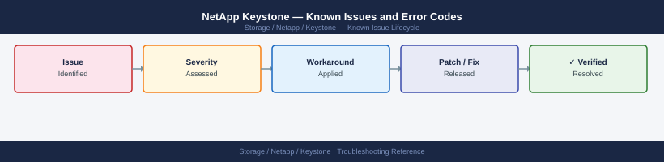

---
tags:
  - troubleshooting
  - keystone
  - netapp
  - known-issues
description: "Catalog of known Keystone STaaS bugs, error codes, and workarounds. Most Keystone issues relate to the Keystone Collector appliance or portal connectivity..."
---
# NetApp Keystone — Known Issues and Error Codes

<div class="kb-summary">
Catalog of known Keystone STaaS bugs, error codes, and workarounds. Most Keystone issues relate to the Keystone Collector appliance or portal connectivity — underlying ONTAP storage issues are tracked separately.

*Applies to: NetApp Keystone STaaS*
</div>



```d2
direction: down

symptom: Identify Symptom {shape: diamond}
keystone_collector: "Keystone Collector" {shape: rectangle}
keystone_portal: "Keystone Portal" {shape: rectangle}
resolution: Resolve or Escalate {shape: oval}

symptom -> keystone_collector: investigate
symptom -> keystone_portal: investigate
keystone_collector -> resolution
keystone_portal -> resolution
```

## Before you begin

- Keystone Collector logs: `journalctl -u keystone-collector` on the Collector VM.
- Portal access issues should be reported to NetApp Keystone support at `keystone.netapp.com`.
- ONTAP-layer issues (NFS, SMB, iSCSI, SnapMirror) are tracked in [ONTAP Known Issues](../../../ontap/troubleshooting/known-issues/).

## Keystone Collector

| Error / Symptom | Affected Versions | Cause | Workaround / Fix | Fixed In |
|---|---|---|---|---|
| Collector not uploading metrics: `Connection refused to keystone.netapp.com` | Keystone | Port 443 blocked from Collector to keystone.netapp.com | Verify TCP 443 outbound from Collector VM; check proxy settings if applicable | N/A |
| `ONTAP API authentication failed` in Collector | Keystone | Collector service account credentials expired on ONTAP | Rotate password; update Collector config: `keystone-collector config update` | N/A |
| Capacity usage not matching Keystone portal values | Keystone | Collector polling lag (up to 24h for portal sync) | Wait 24 hours; if mismatch persists after 48h, raise support ticket | N/A |

## Keystone Portal

| Error / Symptom | Affected Versions | Cause | Workaround / Fix | Fixed In |
|---|---|---|---|---|
| Portal shows `No data` for recently onboarded cluster | Keystone | Initial baseline collection takes 24–48 hours | Wait 48 hours after Collector setup before raising issue | N/A |
| Burst billing alert unexpected | Keystone | Thin provisioning over-allocation exceeds committed capacity | Review actual consumed capacity; compare with committed Keystone tier in portal | N/A |

## See also

- [NetApp ONTAP — Known Issues](../../ontap/troubleshooting/known-issues.md)
