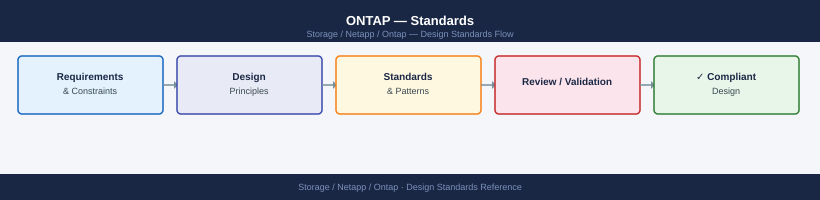

---
tags:
  - architecture
  - netapp
---
# ONTAP — Standards

Standards reference covering Naming Conventions, Build Baseline, Sizing Guidelines, Configuration Checklist.

*Applies to: ONTAP 9.x*

## Naming Conventions

| Object | Pattern | Example |
|---|---|---|
| Cluster | `<site>-<platform>-cl<nn>` | `lon-affa400-cl01` |
| Node | `<cluster-name>-0<n>` | `lon-affa400-cl01-01` |
| HA pair | `<cluster-name>-hap<n>` | `lon-affa400-cl01-hap1` |
| Aggregate | `<node-short>_aggr<n>_<tier>` | `cl01n01_aggr1_ssd` |
| SVM | `<env>-<app/team>-svm` | `prod-oracle-svm`, `dev-vmware-svm` |
| Data volume | `<svm-short>_<app>_<purpose>_<nn>` | `prodoracle_db01_data_01` |
| Root volume | `<svm-name>_root` | `prod-oracle-svm_root` |
| LUN | `<host>_<app>_<type>_<nn>` | `dbhost01_oracle_data_01` |
| igroup | `<host>_<protocol>_ig` | `dbhost01_fc_ig` |
| Snapshot policy | `<frequency>-<retention>` | `daily-7`, `hourly-24` |
| SnapMirror policy | `<type>-<purpose>` | `async-dr`, `xdp-vault` |
| QoS policy group | `<tier>-<env>-qos` | `gold-prod-qos`, `silver-dev-qos` |
| Intercluster LIF | `<node-short>_ic_lif<n>` | `cl01n01_ic_lif1` |
| Data LIF | `<svm-short>_<protocol>_lif<n>` | `prodoracle_nfs_lif1` |

## Build Baseline

- ONTAP version: track the current recommended release on the [NetApp support site](https://mysupport.netapp.com); prefer the latest 9.x GA build shown in BlueXP upgrade advisor
- All clusters must have AutoSupport configured and confirmed sending (HTTPS preferred over SMTP)
- Cluster-management LIF must have a resolvable DNS entry
- NTP configured on all nodes with at least two external NTP sources
- SNMP v3 only; no SNMP v1/v2c in production
- SSH access to cluster management only; RSA-4096 or Ed25519 keys required; password auth disabled for admin
- Volume space guarantee: `none` (thin provisioning) on all data volumes; fractional reserve set to 0%
- Autogrow enabled on all volumes with an explicit maximum no greater than 2× initial size
- Snapshot policies: default `daily-7` on data volumes; no snapshots on temp/scratch volumes
- Aggregates: RAID-DP on AFF (SSD); RAID-DP on hybrid FAS; RAID-TEC on large SATA aggregates

## Sizing Guidelines

- **Nodes per cluster**: 2–24 nodes; AFF A-series for all-flash, FAS for hybrid; ONTAP Select for software-defined deployments
- **Aggregates**: Keep usable capacity below 90% to avoid WAFL metadata overhead and Snapshot spill-over; target 70–80% for production
- **Volumes per SVM**: Supported up to several thousand per cluster; practical limit depends on workload mix and management overhead
- **HA pair fan-out**: Each HA pair supports up to 12–24 disk shelves depending on platform; consult the NetApp Hardware Universe for exact limits
- **Protocols per SVM**: An SVM can serve multiple protocols simultaneously; for security and isolation, dedicated SVMs per protocol are common in regulated environments
- **QoS**: Set throughput floors (minimum) and ceilings (maximum) per volume or workload using adaptive QoS policies to prevent noisy-neighbor issues in mixed workload clusters

## Configuration Checklist

- [ ] Cluster name, time zone, and NTP sources set
- [ ] AutoSupport enabled, HTTPS delivery tested, proxy configured if needed
- [ ] Admin account uses public-key authentication; built-in `admin` password rotated and stored in vault
- [ ] SNMPv3 trap host configured; SNMP v1/v2 disabled
- [ ] Cluster management LIF on dedicated management VLAN
- [ ] Intercluster LIFs created on each node for SnapMirror and cluster peering
- [ ] HA storage failover enabled and verified (`storage failover show`)
- [ ] Aggregates named and within 80% capacity at build
- [ ] Root SVM created; data SVMs created per application domain with appropriate protocol licenses
- [ ] Broadcast domains and failover groups match physical NIC/switch topology
- [ ] QoS adaptive policy groups created and assigned to production volumes
- [ ] EMS email notifications configured for CRITICAL and ERROR severity events
- [ ] SnapMirror relationships initialized for all protected volumes

---

## See also

- [Ontap — How It Works](../how-it-works/)
- [Ontap — Integrations](../integrations/)
