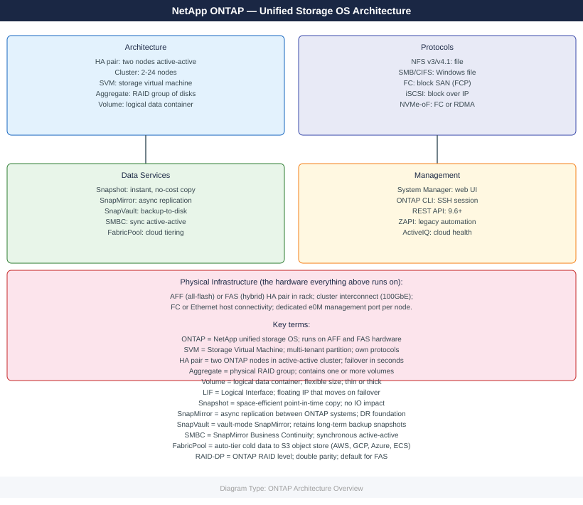
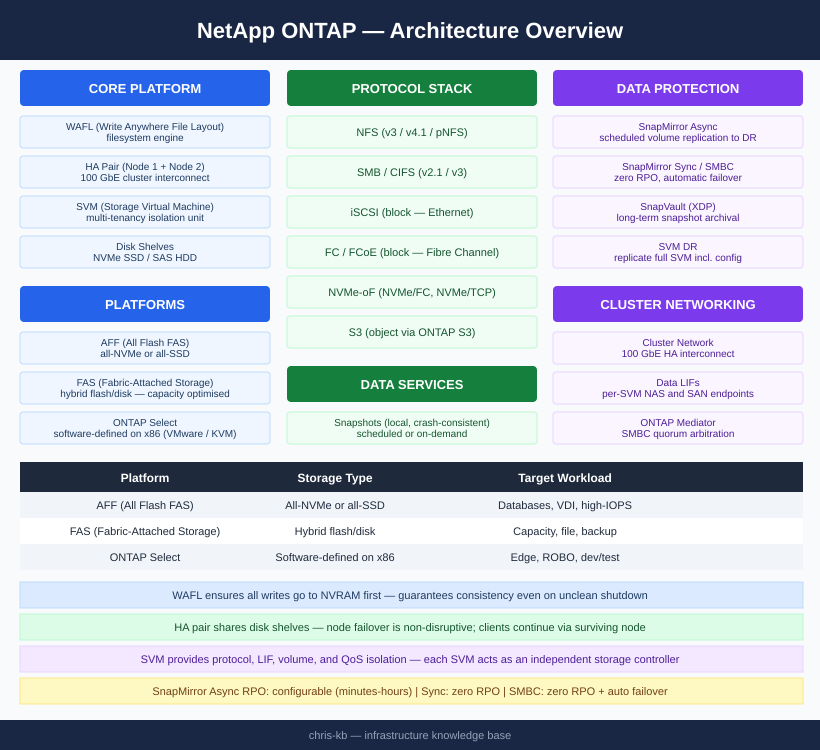

---
tags:
  - architecture
  - netapp
description: "ONTAP architecture reference — HA topology, WAFL filesystem engine, SVM design, cluster networking, protocol stack, and data protection built-ins."
---
# ONTAP — Architecture

<div class="kb-summary">
ONTAP architecture reference — HA topology, WAFL filesystem engine, SVM design, cluster networking, protocol stack, and data protection built-ins.

*Applies to: ONTAP 9.x*
</div>



```d2
direction: right

N1: "Node 1 (Controller" {shape: rectangle}
N2: "Node 2 (Controller" {shape: rectangle}
SHELVES: "Disk Shelves\nNVMe SSD / SAS HDD" {shape: rectangle}
NAS: "NFS · SMB/CIFS" {shape: rectangle}
SAN: "iSCSI · FC · NVMe-oF" {shape: rectangle}
NC: "NAS Clients" {shape: rectangle}
SC: "SAN Hosts" {shape: rectangle}

N1 -> N2
N2 -> SHELVES
N1 -> NAS
N1 -> SAN
N2 -> NAS
NAS -> SAN
NAS -> NC
SAN -> SC
```


<div class="kb-grid kb-grid-3">
<a class="kb-card" href="how-it-works/"><strong>How It Works</strong><span>HA topology, WAFL engine, cluster networking, SVM architecture, protocols, and data protection.</span></a>
<a class="kb-card" href="integrations/"><strong>Integrations</strong><span>VMware, SnapCenter, Active Directory, Veeam, REST API, and cloud integrations.</span></a>
<a class="kb-card" href="design-standards/"><strong>Design Standards</strong><span>Naming conventions, sizing guidelines, and configuration checklist.</span></a>
</div>

| Platform | Storage Type | Target Workload |
|---|---|---|
| AFF (All Flash FAS) | All-NVMe or all-SSD | Latency-sensitive databases, VDI, high-IOPS workloads |
| FAS (Fabric-Attached Storage) | Hybrid flash/disk | Capacity-optimised, mixed, file, and backup workloads |
| ONTAP Select | Software-defined on x86 | Edge, ROBO, dev/test; VMware or KVM hypervisor |

