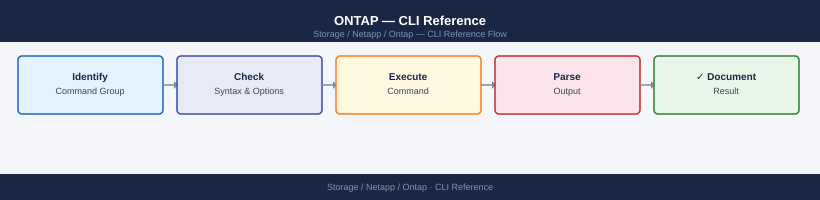

---
tags:
  - netapp
  - operations
description: "NetApp ONTAP is the operating system that runs on NetApp storage arrays (AFF, FAS, ONTAP Select). The CLI uses a dot-separated namespace — storage..."
---
# ONTAP — CLI Reference

<div class="kb-summary">
NetApp ONTAP is the operating system that runs on NetApp storage arrays (AFF, FAS, ONTAP Select). The CLI uses a dot-separated namespace — `storage aggregate show`, `network interface create` — and runs at the `cluster::>` prompt.

*Applies to: ONTAP 9.x*
</div>


 Most data access configuration (NFS, CIFS, iSCSI, FC) happens at the SVM (Storage Virtual Machine) level — each SVM is an isolated data access instance within the cluster.

> SSH to the cluster management IP and log in as `admin`. Use `cluster-name::>` as your prompt. Commands that affect a specific SVM typically require `-vserver <svm>`.

---

## Before you begin

- **Access:** Storage admin credentials (cluster admin or equivalent)
- **Timing:** safe to run during business hours unless a step is marked ⚠ (causes interruption)
- **Dependencies:** no active upgrades or migrations on the same infrastructure
- **Logging:** capture command output — paste into the change record on completion

---

## Cluster & Nodes

Cluster-level identity, health status, HA pairs, NTP, and node-level diagnostics. Run these first when connecting to an unfamiliar cluster.

```bash
# Identity and status
cluster show
cluster identity show
cluster identity modify -name <new_name>
cluster ring show
cluster ha show
version

# NTP (time sync is critical — certificate errors and log correlation break without it)
cluster time-service ntp server show
cluster time-service ntp server create -server <ip>
cluster time-service ntp server delete -server <ip>

# Node status
node show
node show -fields node,health,uptime,model,serial-number

# Node-level diagnostics (drops to node shell)
node run -node <node> sysconfig
node run -node <node> sysconfig -a
node run -node <node> sysconfig -r
node run -node <node> df -h
node run -node <node> environment status
```


```text title="Expected output"
Cluster Identifier: 4a1b2c3d-5e6f-7g8h-9i0j-1k2l3m4n5o6p
Cluster Name: prod-cluster-01
Cluster Serial Number: 4-80-000001
Cluster Location: 
Cluster Contact: storage-admin@company.com
Cluster UUID: a1b2c3d4-e5f6-7890-abcd-ef1234567890

                     Enabled            Configured
NTP Server           true               true
NTP Server IP        192.168.1.50       -
NTP Server IP        10.20.30.40        -

Node                Health  Uptime        Model         Serial Number
node-01             true    45d 3h 22m    A400          4141000001
node-02             true    45d 3h 18m    A400          4141000002

System Configuration for node-01:
System Serial Number: 4141000001
System Model name: NetApp A400
Number of Processors: 2
Memory Size: 192 GB
Number of Disk Shelves: 3

Filesystem            Size  Used Avail Use% Mounted on
/dev/sda1            929G  456G  473G  49% /
/dev/sdb1            1.8T  1.2T  600G  67% /mnt/data

Environment Status for node-01:
Power Supply 1: OK
Power Supply 2: OK
Fan Module 1: OK
Fan Module 2: OK
Temperature Sensor 1: 28°C (OK)
Temperature Sensor 2: 31°C (OK)
```

!!! warning "Common errors"
    | Error | Fix |
    |---|---|
    | `Error: command not found: cluster show` | Ensure you are connected to the ONTAP cluster management interface (SSH to cluster IP, not node IP). |
    | `Error: NTP server 192.168.1.50 is already configured` | Delete the existing NTP server entry first with `cluster time-service ntp server delete -server 192.168.1.50` before creating a new one. |
    | `Error: node-01: command not found: sysconfig` | Verify the node name is correct and the node is in a healthy state; use `node show` to confirm node availability. |
---

## System Health & Events

Overall health status, active alerts, the EMS event log, firmware updates, and AutoSupport. Start here when investigating issues or before maintenance windows.

```bash
# Overall health
system health status show                     # expected: ok
system health alert show                      # unresolved alerts
system health subsystem show
system health node-connectivity show

# EMS event log
event log show
event log show -severity emergency
event log show -severity alert
event log show -severity error
event log show -node <node_name>
event log show -time ">1h"
event log show -time ">24h"
event log show -messagename wafl.vol.full

# EMS notification destinations (email, syslog)
event notification show
event notification destination show

# Software images
system node image show

# Firmware updates (disk, shelf, SP)
system node firmware update -node <node>
system node upgrade-revert show

# AutoSupport
system node autosupport show
system node autosupport show -fields state,last-successful-destination
system node autosupport invoke -node <node> -type all -message "Manual test"
```


```text title="Expected output"
Status: ok

Node: node-01
  Subsystem                  Status
  ─────────────────────────  ──────
  SAS-connect                ok
  Storage                    ok
  NVMe-connect               ok
  CPU                        ok
  Memory                     ok

Node: node-02
  Subsystem                  Status
  ─────────────────────────  ──────
  SAS-connect                ok
  Storage                    ok
  NVMe-connect               ok
  CPU                        ok
  Memory                     ok

Time                 Severity  Node      Message
─────────────────────────────────────────────────────────────────
2024-01-15 14:32:18  ERROR     node-01   wafl.vol.full: Volume vol_data is 95% full
2024-01-15 13:45:22  WARNING   node-02   raid.disk.fail: Disk SN:ABC123XYZ failed
2024-01-15 12:10:05  ALERT     node-01   scsiblade.fcp.linkdown: FC port 0a down
2024-01-14 09:22:41  ERROR     node-02   nfs.mount.denied: NFS mount denied from 192.168.1.50
2024-01-14 08:15:33  NOTICE    node-01   repl.snapshot.create: Snapshot created successfully

Notification Destination: mail-server.example.com
  Filter-Name: important-events
  Severity: error,alert,emergency

Node: node-01
  Current Version: 9.13.1
  Installed Version: 9.13.1
  Last Update: 2024-01-10 08:30:15

Node: node-02
  Current Version: 9.13.1
  Installed Version: 9.13.1
  Last Update: 2024-01-10 08:30:15

AutoSupport is enabled
  State: on
  Last Successful Destination: mail-server.example.com
  Last Sent: 2024-01-15 10:45:22

AutoSupport invoked successfully on node-01. Message ID: 123e4567-e89b-12d3-a456-426614174000
```

!!! warning "Common errors"
    | Error | Fix |
    |---|---|
    | `Error: command not found: system health status show` | Ensure you are connected to the ONTAP cluster CLI (ssh admin@<cluster-ip>) and not the local shell. |
    | `Error: Access denied. Insufficient privileges to run "system health alert show"` | Verify your user role has admin or read-only admin privileges using `security login show`. |
    | `Error: Node "<node_name>" not found` | Confirm the node name exists by running `cluster show` and use the exact node name from the "Node" column. |
---

## Storage — Aggregates & Disks

An aggregate is the physical RAID group that holds one or more volumes. Disks are the raw drives. Check aggregate capacity before provisioning new volumes.

```bash
# Aggregates
storage aggregate show
storage aggregate show -state online
storage aggregate show -fields aggr-name,node,size,availsize,usedsize,state
storage aggregate show-space
storage aggregate show-space -aggregate <aggr>

# Aggregate operations
storage aggregate rename -aggregate <old_name> -newname <new_name>
storage aggregate modify -aggregate <aggr> -maxraidsize 24
storage aggregate add-disks -aggregate <aggr> -diskcount <n>

# Disks
storage disk show
storage disk show -broken                           # failed or suspect
storage disk show -container-type spare             # available spares
storage disk show -fields disk,bay,node,container-type,disk-type,rpm,size,position

# Disk operations
storage disk unfail -disk <disk_name>               # re-add after investigation
storage disk assign -disk <disk_name> -owner <node_name>

# RAID groups
storage aggregate show-raidtree -aggregate <aggr>
storage aggregate show -fields raidtype

# Disk shelves
storage shelf show
storage shelf show -detail
```


```text title="Expected output"
Aggregate               State   Size       Used       Avail      % Used
aggr0                  online  10.92TB    4.23TB     6.69TB       38%
aggr1                  online  21.87TB    8.91TB     12.96TB      40%
aggr2                  online  10.92TB    2.14TB     8.78TB       19%

Name     Node         Size       AvailSize  UsedSize   State
aggr0    node-01      10.92TB    6.69TB     4.23TB     online
aggr1    node-02      21.87TB    12.96TB    8.91TB     online

Disk     Bay  Node     Container Type  Type   RPM    Size   Position
SAS2.1   1    node-01  aggregate       SSD    N/A    1.6TB  shared
SAS2.2   2    node-01  spare           SSD    N/A    1.6TB  shared
SAS3.5   5    node-02  aggregate       HDD    7200   4.0TB  shared

Shelf ID  Shelf UID                    Shelf Model  Status
shelf1    50:0a:09:80:12:34:56:78     DS224C       normal
shelf2    50:0a:09:80:87:65:43:21     DS224C       normal
```

!!! warning "Common errors"
    | Error | Fix |
    |---|---|
    | `Error: "aggr0" does not exist` | Verify the aggregate name with `storage aggregate show` and use the correct name. |
    | `Error: Disk "SAS2.1" is not a spare disk` | Check disk status with `storage disk show -fields disk,container-type` before attempting operations. |
    | `Error: RAID group size cannot exceed maximum allowed for this aggregate` | Reduce the requested RAID size or add more disks to the aggregate with `storage aggregate add-disks`. |
---

## Volumes

Volumes are the logical containers for data in ONTAP. Each volume lives in an aggregate and can be mounted at a junction path in the SVM namespace. FlexClone creates instant space-efficient copies for test/dev.

```bash
# List and status
volume show
volume show -vserver <svm>
volume show -fields volume,vserver,size,used,available,percent-used,state
volume show -state offline
volume show -junction-path <path>

# Create / modify / delete
volume create -vserver <svm> -volume <vol> -aggregate <aggr> -size <size> \
    -junction-path <path> -policy <export-policy>
volume modify -vserver <svm> -volume <vol> -size <size>
volume modify -vserver <svm> -volume <vol> -percent-snapshot-space <n>
volume rename -vserver <svm> -volume <old> -newname <new>
volume delete -vserver <svm> -volume <vol>

# Mount / unmount
volume mount -vserver <svm> -volume <vol> -junction-path <path>
volume unmount -vserver <svm> -volume <vol>

# Bring online / offline
volume online -vserver <svm> -volume <vol>
volume offline -vserver <svm> -volume <vol>

# Storage efficiency (dedup / compression)
volume efficiency show
volume efficiency show -vserver <svm> -volume <vol>
volume efficiency start -vserver <svm> -volume <vol>
volume efficiency stop -vserver <svm> -volume <vol>

# FlexClone (instant space-efficient copy — great for dev/test)
volume clone create -vserver <svm> -flexclone <name> -parent-volume <vol>
volume clone create -vserver <svm> -flexclone <name> -parent-volume <vol> -parent-snapshot <snap>
volume clone split start -vserver <svm> -flexclone <name>
volume clone split status -vserver <svm> -flexclone <name>
```


```text title="Expected output"
Vserver   Volume       Aggregate  State      Type  Size       Used       Available Percent-Used
--------- ------------ ---------- ---------- ----- ---------- ---------- --------- ------------
svm01     prod_data    aggr1      online     RW    500GB      287GB      213GB     57%
svm01     backup_vol   aggr2      online     RW    1TB        612GB      412GB     61%
svm02     dev_clone    aggr1      online     RW    250GB      89GB       161GB     36%
svm02     archive      aggr3      offline    RW    2TB        0B         2TB       0%
svm01     logs         aggr1      online     RW    100GB      78GB       22GB      78%

Volume Efficiency Status for Vserver svm01:
Volume       State      Status       Savings    Savings %  Dedup  Compression
------------ ---------- ------------ ---------- ---------- ------ -----------
prod_data    enabled    idle         156GB      35%        on     on
backup_vol   enabled    running      89GB       15%        on     off

Volume clone split status for flexclone dev_clone:
Vserver: svm02
Flexclone: dev_clone
Parent Volume: prod_data
Split Status: in progress
Percent Complete: 42%
```

!!! warning "Common errors"
    | Error | Fix |
    |---|---|
    | `Error: command failed: volume does not exist` | Verify the volume name and SVM name are correct with `volume show -vserver <svm>`. |
    | `Error: command failed: aggregate does not have enough space` | Check aggregate free space with `storage aggregate show` and request a larger aggregate or reduce the requested volume size. |
    | `Error: command failed: volume is in use and cannot be deleted` | Unmount the volume with `volume unmount` and ensure no clients are connected before attempting deletion. |
---

## Snapshots

ONTAP snapshots are read-only point-in-time copies stored within the same volume's snapshot reserve. They're near-instant and space-efficient — only changed blocks consume additional space.

```bash
# List snapshots
volume snapshot show
volume snapshot show -vserver <svm> -volume <vol>
volume snapshot show -vserver <svm> -volume <vol> -fields size,create-time,busy

# Create
volume snapshot create -vserver <svm> -volume <vol> -snapshot <snap_name>

# Delete
volume snapshot delete -vserver <svm> -volume <vol> -snapshot <snap_name>
volume snapshot delete -vserver <svm> -volume <vol> -snapshot * -force true   # all snapshots

# Rename
volume snapshot rename -vserver <svm> -volume <vol> -snapshot <old_name> -new-name <new_name>

# Restore (volume must be offline or quiesced)
volume snapshot restore -vserver <svm> -volume <vol> -snapshot <snap_name>
volume snapshot restore -vserver <svm> -volume <vol> -snapshot <snap_name> -online true

# Snapshot policies
volume snapshot policy show
volume snapshot policy create -policy <policy_name> -enabled true
volume snapshot policy add-schedule -policy <policy_name> -schedule hourly -count 24
volume modify -vserver <svm> -volume <vol> -snapshot-policy <policy_name>

# Snapshot reserve
volume show -vserver <svm> -volume <vol> -fields snapshot-percent
volume modify -vserver <svm> -volume <vol> -percent-snapshot-space 15

# Accessing snapshots from the client
# NFS: ls /mnt/data/.snapshot/
# SMB: \\server\share\~snapshot\
```


```text title="Expected output"
Vserver     Volume       Snapshot                                Create Time            Size
----------- ------------ ---------------------------------------- ---------------------- --------
svm-prod    data_vol     hourly.2024-01-15_0800                  01/15 08:00:23         2.1GB
svm-prod    data_vol     hourly.2024-01-15_0900                  01/15 09:00:18         1.8GB
svm-prod    data_vol     hourly.2024-01-15_1000                  01/15 10:00:22         2.3GB
svm-prod    data_vol     daily.2024-01-14_2300                   01/14 23:00:15         5.6GB
svm-prod    data_vol     manual_backup_20240115                  01/15 11:30:45         3.2GB

Volume Snapshot Policy    Enabled
----- ------------------- -------
svm-prod data_vol         default true

Policy Name     Schedule Count
-------------- ---------- -----
default         hourly     24
default         daily      7
default         weekly     4
default         monthly    12

Snapshot Reserve Percent
------------------------
15%

Volume snapshot create: Command completed successfully.
Volume snapshot delete: Command completed successfully.
Volume snapshot rename: Command completed successfully.
Volume snapshot restore: Command completed successfully.
```

!!! warning "Common errors"
    | Error | Fix |
    |---|---|
    | `Error: command failed: Snapshot "snap_name" does not exist on volume "data_vol"` | Verify the snapshot name exists with `volume snapshot show -vserver <svm> -volume <vol>` before attempting deletion or restore. |
    | `Error: command failed: Cannot restore snapshot while volume is online and in use` | Either take the volume offline with `volume offline -vserver <svm> -volume <vol>` or use the `-online true` parameter to restore while online. |
    | `Error: command failed: Snapshot reserve space is insufficient` | Increase the snapshot reserve percentage with `volume modify -vserver <svm> -volume <vol> -percent-snapshot-space <higher_value>`. |
---

## SVMs (Storage Virtual Machines)

SVMs (also called Vservers) are the data access layer. Each SVM has its own namespace, protocols, network interfaces, and security configuration — think of each SVM as an isolated virtual storage appliance within the cluster.

```bash
# List and view
vserver show
vserver show -fields vserver,type,state,allowed-protocols
vserver show -vserver <svm>

# Create
vserver create \
    -vserver <svm_name> \
    -rootvolume <vol_name> \
    -aggregate <aggr_name> \
    -rootvolume-security-style unix \
    -language C.UTF-8
vserver modify -vserver <svm_name> -allowed-protocols nfs,cifs

# Delete
vserver stop -vserver <svm_name>
vserver delete -vserver <svm_name>

# Protocol management
vserver show-protocols -vserver <svm_name>
vserver modify -vserver <svm_name> -allowed-protocols nfs,cifs,iscsi

# Network interfaces (LIFs)
network interface show -vserver <svm_name>
network interface create -vserver <svm_name> -lif <lif_name> -role data \
    -data-protocol nfs -home-node <node_name> -home-port <port> \
    -address <ip> -netmask <mask>
network interface migrate -vserver <svm_name> -lif <lif_name> \
    -dest-node <node_name> -dest-port <port>

# Join SVM to Active Directory (CIFS)
vserver cifs create -vserver <svm_name> -cifs-server <netbios_name> \
    -domain corp.local -ou "OU=StorageServers,DC=corp,DC=local"
vserver cifs show -vserver <svm_name>

# NFS service
vserver nfs create -vserver <svm_name> -access true -v3 enabled -v4.1 enabled
vserver nfs show -vserver <svm_name>

# SVM state management
vserver stop -vserver <svm_name>
vserver start -vserver <svm_name>
```


```text title="Expected output"
Vserver       Type       State    Allowed Protocols
------------- ---------- -------- -------------------
admin         admin      running  nfs,cifs,iscsi
svm-prod-01   data       running  nfs,cifs
svm-prod-02   data       running  nfs
svm-test-01   data       stopped  nfs,cifs,iscsi

Vserver       Type       State    Allowed Protocols
------------- ---------- -------- -------------------
svm-prod-01   data       running  nfs,cifs

(no output — command completes silently)

Vserver       Type       State    Allowed Protocols
------------- ---------- -------- -------------------
svm-prod-01   data       running  nfs,cifs

Vserver: svm-prod-01
  Allowed Protocols: nfs,cifs,iscsi

Vserver       Lif                    IP              Status       Is Home
------------- ---------------------- --------------- ------------ --------
svm-prod-01   svm-prod-01_nfs_lif01  192.168.1.50    up           true
svm-prod-01   svm-prod-01_cifs_lif01 192.168.1.51    up           true

(no output — command completes silently)

Vserver       CIFS Server    Domain      State
------------- -------------- ----------- -------
svm-prod-01   STORAGE01      corp.local  running

Vserver       NFS Status    NFSv3    NFSv4.1
------------- ------------- -------- --------
svm-prod-01   enabled       enabled  enabled

(no output — command completes silently)
(no output — command completes silently)
```

!!! warning "Common errors"
    | Error | Fix |
    |---|---|
    | `Error: command failed: Vserver "svm-prod-01" already exists.` | Verify the SVM name is unique or use a different name before creation. |
    | `Error: command failed: Cannot delete Vserver "svm-prod-01": Vserver is in running state.` | Stop the SVM with `vserver stop -vserver <svm_name>` before attempting deletion. |
    | `Error: command failed: Cannot create CIFS server: Domain "corp.local" is not reachable.` | Verify DNS resolution and network connectivity to the Active Directory domain controller. |
---

## Network

LIFs (Logical Interfaces) are the IP addresses that clients connect to. Each LIF lives on a port and can be migrated between nodes for load balancing or maintenance.

```bash
# LIFs
network interface show
network interface show -vserver <svm>
network interface show -fields lif,vserver,address,home-node,home-port,status-oper
network interface create -vserver <svm> -lif <lif> -role data -data-protocol nfs \
    -home-node <node> -home-port <port> -address <ip> -netmask <mask>
network interface modify -vserver <svm> -lif <lif> -address <ip> -netmask <mask>
network interface delete -vserver <svm> -lif <lif>
network interface migrate -vserver <svm> -lif <lif> -dest-node <node> -dest-port <port>
network interface revert -vserver <svm> -lif <lif>
network interface failover-groups show

# Ports
network port show
network port show -role data
network port show -fields node,port,speed,health-status,link-status
network port ifgrp show
network port vlan show

# Routes
network route show
network route create -vserver <svm> -destination 0.0.0.0/0 -gateway <gw>
network route delete -vserver <svm> -destination 0.0.0.0/0 -gateway <gw>

# Connectivity test
network ping -lif <lif> -vserver <svm> -destination <ip>
```


```text title="Expected output"
Vserver     Interface       Address         Home Node       Home Port       Status
----------- --------------- --------------- --------------- --------------- ----------
svm-prod    nfs_lif_01      192.168.1.100   cluster-01      e0d             up
svm-prod    nfs_lif_02      192.168.1.101   cluster-02      e0d             up
svm-mgmt    mgmt_lif        192.168.1.50    cluster-01      e0c             up

Node        Port    Speed   Health Status   Link Status
----------- ------- ------- --------------- ---------------
cluster-01  e0a     10Gb    healthy         up
cluster-01  e0b     10Gb    healthy         up
cluster-02  e0a     10Gb    healthy         down
cluster-02  e0b     10Gb    healthy         up

Vserver     Destination     Gateway         Metric
----------- --------------- --------------- -------
svm-prod    0.0.0.0/0       192.168.1.1     20

PING nfs_lif_01 (192.168.1.100) from 192.168.1.100: 56 data bytes
64 bytes from 192.168.1.100: icmp_seq=0 ttl=64 time=0.123 ms
64 bytes from 192.168.1.100: icmp_seq=1 ttl=64 time=0.098 ms
64 bytes from 192.168.1.100: icmp_seq=2 ttl=64 time=0.105 ms
```

!!! warning "Common errors"
    | Error | Fix |
    |---|---|
    | `Error: "cluster-01" is not a valid home node for this cluster` | Verify the node name matches output from `cluster show` and that the node is healthy. |
    | `Error: Port "e0d" does not exist on node "cluster-02"` | Confirm the port exists using `network port show -node <node>` before assigning it to a LIF. |
    | `Error: Address 192.168.1.100 is already in use by interface nfs_lif_01` | Assign a unique IP address or delete the existing LIF first with `network interface delete`. |
---

## NFS

Configure the NFS service, export policies, and access rules. Export policies control which clients can mount which volumes — every volume references an export policy by name.

```bash
# NFS service
vserver nfs show
vserver nfs show -vserver <svm>
vserver nfs create -vserver <svm> -v3 enabled -v4.0 enabled -v4.1 enabled
vserver nfs modify -vserver <svm> -v4.1 enabled

# Export policies
vserver export-policy show
vserver export-policy show -vserver <svm>
vserver export-policy create -vserver <svm> -policyname <name>
vserver export-policy delete -vserver <svm> -policyname <name>

# Export rules (each rule defines who can access and how)
vserver export-policy rule show
vserver export-policy rule show -vserver <svm> -policyname <name>
vserver export-policy rule create \
    -vserver <svm> \
    -policyname <name> \
    -ruleindex 1 \
    -clientmatch <cidr_or_ip> \
    -rorule sys \
    -rwrule sys \
    -superuser sys
vserver export-policy rule delete -vserver <svm> -policyname <name> -ruleindex <n>

# Assign policy to volume
volume modify -vserver <svm> -volume <vol> -policy <export-policy>

# Verify client access
vserver nfs check-client -vserver <svm> -client-ip <ip>

# Connected NFS clients
nfs connected-client show -vserver <svm>
```


```text title="Expected output"
Vserver: svm-prod-01
   Enabled Protocols: nfs
   NFSv3: enabled
   NFSv4.0: enabled
   NFSv4.1: enabled
   NFSv4.2: disabled
   Is Showmount Enabled?: true
   Maximum Number of Records Displayed: 1000000

Vserver: svm-prod-01
Policy Name: default
Policy Name: clients-rw
Policy Name: clients-ro

Vserver: svm-prod-01
Policy Name: clients-rw
Rule Index: 1
Client Match: 10.20.0.0/16
RO Rule: sys
RW Rule: sys
Superuser: sys
Anonymous UID: 65534
Allow SUID?: true

Volume modify successful: volume vol-data01 export policy set to clients-rw

Vserver: svm-prod-01
Client IP: 10.20.15.42
Access Level: read-write
Auth Flavor: sys
Mounted Path: /vol/vol-data01

Vserver: svm-prod-01
Client IP: 10.20.15.42
Client Hostname: app-server-03.prod.local
Access Level: read-write
NFS Version: nfsv4.1
...
```

!!! warning "Common errors"
    | Error | Fix |
    |---|---|
    | `Error: command failed: Vserver "svm-prod-01" does not exist.` | Verify the SVM name with `vserver show` and use the correct name in the -vserver parameter. |
    | `Error: command failed: Export policy "clients-rw" does not exist on Vserver "svm-prod-01".` | Create the export policy first using `vserver export-policy create` before assigning it to a volume. |
    | `Error: command failed: Client IP 10.20.15.42 does not have access to volume vol-data01.` | Verify the export policy rule includes the client IP/CIDR and is assigned to the volume with `volume show -fields policy`. |
---

## CIFS / SMB

Create and manage CIFS (SMB) file shares. The CIFS server is joined to Active Directory. Shares expose volume paths to Windows clients.

```bash
# CIFS server
vserver cifs show
vserver cifs show -vserver <svm>
vserver cifs create -vserver <svm> -cifs-server <name> -domain <domain>
vserver cifs delete -vserver <svm>

# Shares
vserver cifs share show
vserver cifs share show -vserver <svm>
vserver cifs share create -vserver <svm> -share-name <name> -path <path>
vserver cifs share modify -vserver <svm> -share-name <name> -comment <text>
vserver cifs share delete -vserver <svm> -share-name <name>
vserver cifs share access-control show -vserver <svm> -share <name>
vserver cifs share access-control modify \
    -vserver <svm> -share <name> \
    -user-or-group <group> -permission Full_Control

# Sessions and open files
vserver cifs session show
vserver cifs session show -vserver <svm>
vserver cifs session show -fields node,vserver,connection-count
vserver cifs session file show -vserver <svm>
vserver cifs session close -node <node> -vserver <svm> -session-id <id>

# SMB version settings (disable SMB1 for security)
vserver cifs options show -vserver <svm>
vserver cifs options modify -vserver <svm> -smb1-enabled false
vserver cifs options modify -vserver <svm> -smb2-enabled true

# AD connectivity check
vserver cifs show -vserver <svm> -fields ad-status
```


```text title="Expected output"
Vserver       CIFS Server    Domain
------------- -------------- ----------------
svm-prod-01   fileserver01   corp.example.com
svm-prod-02   fileserver02   corp.example.com

Vserver       Share Name     Path
------------- -------------- -------------------------
svm-prod-01   data           /vol/vol_data
svm-prod-01   users          /vol/vol_users
svm-prod-02   archive        /vol/vol_archive

Vserver       User or Group              Permission
------------- -------------------------- ----------------
svm-prod-01   corp.example.com\Domain Users Full_Control

Node          Vserver       Connection Count
------------- ------------- ----------------
node-01       svm-prod-01   12
node-02       svm-prod-01   8

Vserver       AD Status
------------- ---------
svm-prod-01   up
svm-prod-02   up
```

!!! warning "Common errors"
    | Error | Fix |
    |---|---|
    | `Error: command failed: CIFS server "fileserver01" already exists on Vserver "svm-prod-01"` | Verify the CIFS server does not already exist with `vserver cifs show -vserver <svm>` before creation. |
    | `Error: command failed: Cannot delete CIFS server while shares exist` | Delete all CIFS shares first using `vserver cifs share delete -vserver <svm> -share-name <name>` before deleting the CIFS server. |
    | `Error: command failed: Active Directory connection failed for domain "corp.example.com"` | Verify DNS resolution and AD credentials are correct, and check network connectivity to domain controllers with `network ping -vserver <svm> -destination <dc-ip>`. |
---

## Block Protocols (iSCSI / FC)

Present LUNs to hosts via iSCSI or Fibre Channel. LUNs are mapped to igroups (initiator groups) — an igroup lists the WWNs or IQNs of hosts that are allowed to see the LUN.

```bash
# iSCSI service
vserver iscsi show
vserver iscsi create -vserver <svm>
vserver iscsi modify -vserver <svm> -is-admin-enabled true

# LUNs
lun show
lun show -vserver <svm>
lun show -fields path,vserver,size,state,mapped,os-type
lun create -vserver <svm> -path <path> -size <size> -ostype vmware
lun delete -vserver <svm> -path <path>
lun resize -vserver <svm> -path <path> -size <size>
lun online -vserver <svm> -path <path>
lun offline -vserver <svm> -path <path>
lun map -vserver <svm> -path <path> -igroup <igroup>
lun unmap -vserver <svm> -path <path> -igroup <igroup>
lun mapping show
lun mapping show -vserver <svm>

# igroups (define which hosts can see which LUNs)
lun igroup show
lun igroup show -vserver <svm>
lun igroup create -vserver <svm> -igroup <name> -protocol iscsi -ostype vmware
lun igroup add -vserver <svm> -igroup <name> -initiator <iqn>
lun igroup remove -vserver <svm> -igroup <name> -initiator <iqn>
lun igroup delete -vserver <svm> -igroup <name>

# Fibre Channel
vserver fcp show
vserver fcp create -vserver <svm>
fcp adapter show
fcp adapter show -fields node,adapter,state,speed,fabric-established
fcp interface show
fcp initiator show
lun igroup create -vserver <svm> -igroup <name> -protocol fcp -ostype vmware
```


```text title="Expected output"
Vserver Name                   Admin Operational
----------------------- ---------- -----------
svm_prod                      true       true
svm_dr                        true       true

Vserver   Path                                   Size       State    Mapped OS Type
--------- -------------------------------------- ---------- -------- ------ --------
svm_prod  /vol/datastore01/lun_vm_prod_001     100GB      online   true   vmware
svm_prod  /vol/datastore01/lun_vm_prod_002     50GB       online   true   vmware
svm_prod  /vol/backup/lun_backup_001           500GB      online   false  vmware
svm_dr    /vol/dr_vol/lun_dr_001               200GB      online   true   vmware
...

Vserver   Igroup Name       Protocol OS Type Initiators
--------- ----------------- -------- ------- ----------
svm_prod  igroup_esxi_01    iscsi    vmware  3
svm_prod  igroup_esxi_02    iscsi    vmware  2
svm_dr    igroup_dr_hosts   iscsi    vmware  4

Vserver   Igroup Name       LUN Path                           LUN ID
--------- ----------------- ---------------------------------- ------
svm_prod  igroup_esxi_01    /vol/datastore01/lun_vm_prod_001  0
svm_prod  igroup_esxi_01    /vol/datastore01/lun_vm_prod_002  1
svm_prod  igroup_esxi_02    /vol/backup/lun_backup_001        0

Node      Adapter State  Speed Fabric-Established
--------- ------- ------ ----- ------------------
node-01   0a      online 16Gb  true
node-01   0b      online 16Gb  true
node-02   0a      online 16Gb  true
node-02   0b      online 16Gb  false
```

!!! warning "Common errors"
    | Error | Fix |
    |---|---|
    | `Error: command failed: LUN /vol/datastore01/lun_vm_prod_001 is already mapped to igroup igroup_esxi_01` | Verify the LUN is not already mapped to the target igroup before attempting to map it again. |
    | `Error: command failed: igroup igroup_esxi_01 does not exist` | Create the igroup first using `lun igroup create` before adding initiators or mapping LUNs to it. |
    | `Error: command failed: LUN /vol/datastore01/lun_vm_prod_001 cannot be deleted while it is mapped` | Unmap the LUN from all igroups using `lun unmap` before attempting deletion. |
---

## SnapMirror

SnapMirror replicates volumes between SVMs or clusters for disaster recovery. The destination volume is read-only until a failover (break). Monitor lag time to ensure RPO is being met.

```bash
# View relationships
snapmirror show
snapmirror show -destination-path <svm>:<vol>
snapmirror show -fields source-path,destination-path,state,lag-time,health
snapmirror show -health false                                          # unhealthy only

# Create
snapmirror create \
    -source-path <src_svm>:<src_vol> \
    -destination-path <dest_svm>:<dest_vol> \
    -type DP \
    -policy MirrorAllSnapshots
snapmirror delete -destination-path <svm>:<vol>
snapmirror release -source-path <svm>:<vol> -destination-path <svm>:<vol>

# Operations
snapmirror initialize -destination-path <svm>:<vol>    # baseline transfer
snapmirror update -destination-path <svm>:<vol>        # manual sync
snapmirror quiesce -destination-path <svm>:<vol>       # pause
snapmirror break -destination-path <svm>:<vol>         # make destination writable (failover)
snapmirror resync -destination-path <svm>:<vol>        # re-establish after break
snapmirror abort -destination-path <svm>:<vol>

# Monitoring
snapmirror history show -destination-path <svm>:<vol>
snapmirror lag show
snapmirror show -transfer-progress
```


```text title="Expected output"
Source                Destination             State     Lag-time
prod-svm:vol_data     dr-svm:vol_data         SnapMirror Idle  00:15:32
prod-svm:vol_logs     dr-svm:vol_logs         SnapMirror Idle  00:08:47
prod-svm:vol_backup   dr-svm:vol_backup       Transferring     00:02:15

Source Path           Destination Path        State           Lag-time  Health
prod-svm:vol_data     dr-svm:vol_data         Snapmirrored    00:15:32  true
prod-svm:vol_logs     dr-svm:vol_logs         Snapmirrored    00:08:47  true

Source                Destination             State           Health
prod-svm:vol_archive  dr-svm:vol_archive      Snapmirrored    false

Transfer Status
Source Destination                Progress  Elapsed
prod-svm:vol_data  dr-svm:vol_data  45%       00:23:18

Operation ID                             Job ID  State      Start Time
snapmirror_initialize_1702145632         12345   completed  11/09/2024 14:27:12
snapmirror_update_1702145891             12346   completed  11/09/2024 14:31:31
```

!!! warning "Common errors"
    | Error | Fix |
    |---|---|
    | `Error: command failed: Relationship does not exist` | Verify the destination path exists and the SnapMirror relationship has been created with `snapmirror create`. |
    | `Error: command failed: Destination volume is not a DP volume` | Ensure the destination volume was created with type `DP` (Data Protection) before creating the SnapMirror relationship. |
    | `Error: command failed: Transfer is in progress` | Wait for the current transfer to complete or use `snapmirror abort -destination-path <svm>:<vol>` before attempting another operation. |
---

## Quotas

Quotas limit disk space and file counts on volumes, qtrees, or users. Enable quotas on a volume, create rules, then resize to activate them without disrupting access.

```bash
# View quota status and usage
volume quota show
volume quota report -vserver <svm> -volume <vol>
volume quota policy rule show -vserver <svm>

# Enable / disable / resize
volume quota on -vserver <svm> -volume <vol>
volume quota off -vserver <svm> -volume <vol>
volume quota resize -vserver <svm> -volume <vol>    # pick up new rules without disabling

# Create quota rules
# Tree quota — limit a qtree
volume quota policy rule create \
    -vserver <svm> -policy-name default -volume <vol> \
    -type tree -target /qtree_name \
    -disk-limit 500g -soft-disk-limit 400g

# Default user quota (applies to all users)
volume quota policy rule create \
    -vserver <svm> -policy-name default -volume <vol> \
    -type user -target "" -disk-limit 100g

# Specific user quota
volume quota policy rule create \
    -vserver <svm> -policy-name default -volume <vol> \
    -type user -target "DOMAIN\username" -disk-limit 200g

# Modify / delete rules
volume quota policy rule modify \
    -vserver <svm> -policy-name default -volume <vol> \
    -type tree -target /qtree_name -disk-limit 1t
volume quota policy rule delete \
    -vserver <svm> -policy-name default -volume <vol> \
    -type tree -target /qtree_name
```


```text title="Expected output"
Vserver    Volume   Tree       Type    Target            Disk Limit   Soft Limit   Used       %Used
---------- -------- ---------- ------- ----------------- ------------ ------------ ---------- ------
svm-prod   vol_data /qtree_01  tree    /qtree_01         500GB        400GB        425GB      85%
svm-prod   vol_data -           user    ""                100GB        80GB         92GB       92%
svm-prod   vol_data -           user    DOMAIN\jsmith     200GB        160GB        145GB      72%
svm-prod   vol_data -           user    DOMAIN\achen      100GB        80GB         78GB       78%

Policy: default
Vserver: svm-prod
Volume: vol_data
Type    Target            Disk Limit   Soft Disk Limit   Files Limit   Soft Files Limit
------- ----------------- ------------ ----------------- ------------- ------------------
tree    /qtree_01         500GB        400GB             -             -
user    ""                100GB        80GB              -             -
user    DOMAIN\jsmith     200GB        160GB             -             -
user    DOMAIN\achen      100GB        80GB              -             -

(no output — command completes silently)
```

!!! warning "Common errors"
    | Error | Fix |
    |---|---|
    | `Error: command failed: Quotas are not enabled on volume "vol_data"` | Run `volume quota on -vserver <svm> -volume <vol>` before creating rules. |
    | `Error: command failed: Quota policy rule already exists` | Delete the existing rule with `volume quota policy rule delete` before recreating it with different parameters. |
    | `Error: command failed: Cannot disable quotas while resize is in progress` | Wait for the resize operation to complete by checking `volume quota resize` status before attempting to disable quotas. |
---

## Performance & QoS

ONTAP statistics require a sample start/stop cycle before viewing. QoS (Quality of Service) lets you cap or guarantee throughput for specific volumes or LUNs.

```bash
# Statistics collection
statistics start -object volume -sample-id perf_check
# wait 10–30 seconds
statistics stop -sample-id perf_check
statistics show -sample-id perf_check

# Filter statistics output
statistics show -sample-id perf_check | grep -E "total_latency|read_latency|write_latency"
statistics show -sample-id perf_check | grep -E "total_ops|read_ops|write_ops"

# QoS policy groups
qos policy-group show
qos policy-group create -policy-group prod-limit -vserver <svm> -max-throughput 5000IOPS
qos policy-group create -policy-group db-floor -vserver <svm> -min-throughput 2000IOPS
qos policy-group modify -policy-group prod-limit -max-throughput 8000IOPS
qos policy-group delete -policy-group prod-limit

# Apply QoS to a volume
volume modify -vserver <svm> -volume <vol> -qos-policy-group prod-limit
volume modify -vserver <svm> -volume <vol> -qos-policy-group none

# QoS workload monitoring
qos workload show
qos statistics performance show
```


```text title="Expected output"
cluster1::> statistics start -object volume -sample-id perf_check
cluster1::> statistics stop -sample-id perf_check
cluster1::> statistics show -sample-id perf_check
Object: volume
Instance: vol_data
Counter                                                     Value
------------------------------------------------------------ --------------------------------
total_latency                                               4521us
read_latency                                                3102us
write_latency                                               5847us
total_ops                                                   18432
read_ops                                                    12104
write_ops                                                   6328

cluster1::> qos policy-group show
Vserver: svm-prod
Policy Group Name: prod-limit
Max Throughput: 5000 IOPS
Min Throughput: —
Absolute Min IOPS: —

Vserver: svm-prod
Policy Group Name: db-floor
Max Throughput: —
Min Throughput: 2000 IOPS
Absolute Min IOPS: —

cluster1::> qos policy-group create -policy-group prod-limit -vserver svm-prod -max-throughput 5000IOPS
(no output — command completes silently)

cluster1::> qos policy-group modify -policy-group prod-limit -max-throughput 8000IOPS
(no output — command completes silently)

cluster1::> volume modify -vserver svm-prod -volume vol_data -qos-policy-group prod-limit
(no output — command completes silently)

cluster1::> qos workload show
Workload Name: vol_data
Policy Group: prod-limit
Throughput: 4821 IOPS
Latency: 4.2ms
```

!!! warning "Common errors"
    | Error | Fix |
    |---|---|
    | `Error: command failed: policy group "prod-limit" already exists` | Delete the existing policy group first with `qos policy-group delete -policy-group prod-limit` or use a different name. |
    | `Error: QoS policy group "prod-limit" is in use and cannot be deleted` | Remove the policy group from all volumes using `volume modify -vserver <svm> -volume <vol> -qos-policy-group none` before deletion. |
    | `Error: Invalid value specified for "-max-throughput": value must be between 100 and 999999` | Ensure throughput values are numeric and within the valid range (e.g., use `5000IOPS` not `5000 IOPS`). |
---

## Security & Users

User login accounts, role-based access control, certificate management, and CIFS/NFS audit logging.

```bash
# Login accounts
security login show
security login show -vserver <svm>
security login create \
    -username <user> \
    -application ssh \
    -authentication-method password \
    -role admin \
    -vserver <svm>
security login delete -username <user> -application ssh -vserver <svm>
security login password -username <user> -vserver <svm>
security login lock -username <user> -vserver <svm>
security login unlock -username <user> -vserver <svm>

# Roles
security login role show
security login role show -vserver <svm>
security login role create -role <role_name> -vserver <svm> \
    -cmddirname DEFAULT -access none
security login role create -role <role_name> -vserver <svm> \
    -cmddirname "volume show" -access readonly

# Certificates
security certificate show
security certificate show -vserver <svm>
security certificate install -vserver <svm> -type server
security certificate generate-csr \
    -common-name <cn> -size 2048 -country US \
    -state <state> -locality <city> -organization <org>

# Audit logging (file access events)
vserver audit show -vserver <svm>
vserver audit create -vserver <svm> -destination /audit_logs -format xml
vserver audit enable -vserver <svm>
```


```text title="Expected output"
cluster1::> security login show
Vserver: cluster1
                                                 Is-SysAdmin? Authentication
User/Group                 Application Method    Enabled      SASL Enabled
-------------------------- ----------- ---------- ------------ ----------------
admin                      console     password   true         -
admin                      ontapi      password   true         -
admin                      ssh         password   true         -
rsnapshot                  ontapi      password   true         -

cluster1::> security login role show
Role                                    Vserver
--------------------------------------- ---------------
admin                                   cluster1
readonly                                cluster1
vsadmin                                 cluster1
backup                                  cluster1

cluster1::> security certificate show
Vserver    Serial Number   Common Name                       Expiration Date
---------- --------------- ---------------------------------- -----------------
cluster1   01A2B3C4D5E6F7  cluster1.example.com              Dec 15 2025
svm-prod   02F7E6D5C4B3A1  svm-prod.example.com              Mar 22 2026

cluster1::> vserver audit show -vserver svm-prod
                             Vserver: svm-prod
                      Audit Log Format: xml
                             Enabled: true
                 Log Destination Path: /audit_logs
          Rotation Schedule (in days): 0
```

!!! warning "Common errors"
    | Error | Fix |
    |---|---|
    | `Error: entry already exists` | Verify the user does not already exist with `security login show -vserver <svm>` before creation. |
    | `Error: Cannot generate certificate: Certificate already exists for this vserver` | Delete the existing certificate with `security certificate delete -vserver <svm>` before generating a new one. |
    | `Error: Vserver "<svm>" does not exist` | Confirm the SVM name is correct and exists by running `vserver show`. |
---

## AutoSupport

AutoSupport sends telemetry and event data to NetApp support. It enables proactive case creation and feeds into NetApp Active IQ (cloud analytics). Keep it enabled and ensure delivery is working.

```bash
# Status
autosupport show
autosupport show -node <node>
autosupport show -fields last-subject-sent,last-successful-destination

# Send messages
autosupport invoke -node <node> -type test
autosupport invoke -node <node> -type all -message "Manual upload for case SR-XXXXX"

# History
autosupport history show
autosupport history show -node <node>
autosupport history show -fields seq-num,status,triggered-time,destination

# Configuration
autosupport modify -node <node> -state enable
autosupport modify -node <node> -state disable
autosupport modify -node <node> -mail-hosts <smtp_server>
autosupport modify -node <node> -proxy-url http://proxy.example.local:8080
autosupport modify -node <node> -noteto ops@corp.local
autosupport modify -node <node> -transport https

# Verify HTTPS connectivity
autosupport check show
```


```text title="Expected output"
Node: cluster1-01
  State: enable
  Node Enabled: true
  Message Logging Level: info
  Proxy URL: http://proxy.example.local:8080
  Mail Hosts: smtp.corp.local
  Noteto: ops@corp.local
  Transport: https
  Last Subject Sent: AutoSupport Notification sent by cluster1-01
  Last Successful Destination: https

Node: cluster1-02
  State: enable
  Node Enabled: true
  Message Logging Level: info
  Proxy URL: http://proxy.example.local:8080
  Mail Hosts: smtp.corp.local
  Noteto: ops@corp.local
  Transport: https
  Last Subject Sent: AutoSupport Notification sent by cluster1-02
  Last Successful Destination: https

Seq-num  Status      Triggered-time           Destination
1847     success     10/15/2024 14:32:18      https
1846     success     10/15/2024 08:15:42      https
1845     success     10/14/2024 22:01:05      https
1844     success     10/14/2024 15:47:33      https
1843     success     10/14/2024 09:22:19      https

AutoSupport HTTPS Connectivity Check Results:
  cluster1-01: PASS
  cluster1-02: PASS
```

!!! warning "Common errors"
    | Error | Fix |
    |---|---|
    | `Error: "cluster1-03" is not a valid node name` | Verify the node name matches output from `cluster show` and use the correct node identifier. |
    | `Error: SMTP server "invalid.mail.local" is not reachable` | Confirm the mail host is resolvable and accessible on port 25 from the cluster management network. |
    | `Error: AutoSupport invoke failed: transport https not configured` | Enable HTTPS transport first using `autosupport modify -node <node> -transport https` before invoking HTTPS-based AutoSupport messages. |
---

## Verify

- Confirm the operation completed without errors in the log or management UI
- Verify the expected state change is visible (service running, object created, config applied)
- Document the outcome in the change record

---

## See also

- [Ontap — Procedures](../procedures/)
- [Ontap — Scripts](../scripts/)
- [Ontap — Health Checks](../health-checks/)
