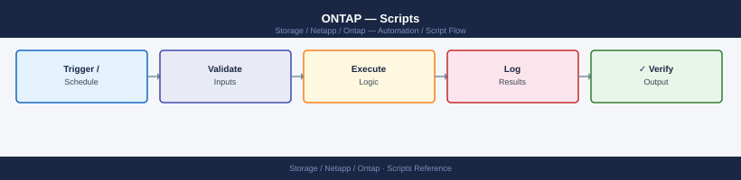

---
tags:
  - netapp
  - operations
---
# ONTAP — Scripts

<div class="kb-summary">
Scripts reference covering Cluster Health Check (Perl), SnapMirror Lag Monitor (Bash), Volume Capacity Reporter (Python), Ansible ONTAP Health Playbook, Aggregate Space Alert (Perl) and 7 more sections.

*Applies to: ONTAP 9.x*
</div>


## Before you begin

- **Access:** Storage admin credentials (cluster admin or equivalent)
- **Timing:** safe to run during business hours unless a step is marked ⚠ (causes interruption)
- **Dependencies:** no active upgrades or migrations on the same infrastructure
- **Logging:** capture command output — paste into the change record on completion

---

## Cluster Health Check (Perl)

SSH to an ONTAP cluster management LIF, run key health commands, parse the output, and print a PASS/WARNING/CRITICAL summary with an exit code reflecting the worst finding.

```perl
#!/usr/bin/perl
use strict;
use warnings;
use Net::SSH2;

# -------------------------------------------------------------------
# Configuration
# -------------------------------------------------------------------
my $CLUSTER     = $ENV{ONTAP_HOST}  // die "Set ONTAP_HOST\n";
my $USER        = $ENV{ONTAP_USER}  // die "Set ONTAP_USER\n";
my $PASS        = $ENV{ONTAP_PASS}  // die "Set ONTAP_PASS\n";
my $AGG_WARN    = 85;   # aggregate used-percent warning threshold
my $PORT        = 22;

# Exit codes
use constant OK       => 0;
use constant WARNING  => 1;
use constant CRITICAL => 2;

my $worst = OK;
my @messages;

# -------------------------------------------------------------------
# SSH helper
# -------------------------------------------------------------------
sub ssh_run {
    my ($ssh2, $cmd) = @_;
    my $chan = $ssh2->channel() or die "Cannot open SSH channel\n";
    $chan->exec($cmd);
    my $out = '';
    while (!$chan->eof) {
        $chan->read(my $buf, 4096);
        $out .= $buf // '';
    }
    $chan->close;
    return $out;
}

sub set_status {
    my ($level, $msg) = @_;
    push @messages, "[${\( $level == CRITICAL ? 'CRITICAL' : 'WARNING' )}] $msg";
    $worst = $level if $level > $worst;
}

# -------------------------------------------------------------------
# Connect
# -------------------------------------------------------------------
my $ssh2 = Net::SSH2->new();
$ssh2->connect($CLUSTER, $PORT) or die "Cannot connect to $CLUSTER: $!\n";
$ssh2->auth_password($USER, $PASS) or die "Authentication failed\n";

# -------------------------------------------------------------------
# Check 1: Broken disks
# -------------------------------------------------------------------
print "Checking broken disks...\n";
my $disk_out = ssh_run($ssh2, 'storage disk show -broken -fields disk,container-type 2>/dev/null');
my @broken = grep { /\S/ && !/Disk\s+Container/ && !/^\s*$/ } split /\n/, $disk_out;
if (@broken) {
    set_status(CRITICAL, scalar(@broken) . " broken disk(s) found");
} else {
    push @messages, "[OK] No broken disks";
}

# -------------------------------------------------------------------
# Check 2: Aggregate capacity
# -------------------------------------------------------------------
print "Checking aggregate capacity...\n";
my $agg_out = ssh_run($ssh2, 'storage aggregate show -fields aggregate,used-percent,state -type data');
for my $line (split /\n/, $agg_out) {
    next unless $line =~ /^\S/;
    next if $line =~ /aggregate\s+used-percent/;   # header
    next if $line =~ /^\d+ entries/;
    my ($agg, $pct, $state) = split /\s+/, $line;
    next unless defined $pct && $pct =~ /^\d+$/;
    if ($pct >= $AGG_WARN) {
        my $lvl = $pct >= 90 ? CRITICAL : WARNING;
        set_status($lvl, "Aggregate $agg is ${pct}% used");
    }
}
push @messages, "[OK] All aggregates below ${AGG_WARN}%" unless grep { /Aggregate / } @messages;

# -------------------------------------------------------------------
# Check 3: Storage failover (HA)
# -------------------------------------------------------------------
print "Checking storage failover...\n";
my $sfo_out = ssh_run($ssh2, 'storage failover show -fields node,enabled,state');
for my $line (split /\n/, $sfo_out) {
    next if $line =~ /node\s+enabled|^\s*$|^\d+ entries/;
    my ($node, $enabled, $state) = split /\s+/, $line;
    next unless defined $state;
    if ($enabled ne 'true' || $state !~ /Connected|Takeover/) {
        set_status(WARNING, "HA issue on node $node: enabled=$enabled state=$state");
    }
}
push @messages, "[OK] Storage failover healthy" unless grep { /HA issue/ } @messages;

# -------------------------------------------------------------------
# Check 4: Active health alerts
# -------------------------------------------------------------------
print "Checking health alerts...\n";
my $alert_out = ssh_run($ssh2, 'system health alert show -fields node,monitor,alert-id,severity 2>/dev/null');
my @alerts = grep { /\S/ && !/node\s+monitor/ && !/^\s*$/ && !/^\d+ entries/ } split /\n/, $alert_out;
if (@alerts) {
    set_status(WARNING, scalar(@alerts) . " active health alert(s)");
} else {
    push @messages, "[OK] No active health alerts";
}

# -------------------------------------------------------------------
# Disconnect and report
# -------------------------------------------------------------------
$ssh2->disconnect;

my $label = $worst == CRITICAL ? 'CRITICAL' : $worst == WARNING ? 'WARNING' : 'OK';
print "\n=== ONTAP Cluster Health: $CLUSTER ===\n";
print "$_\n" for @messages;
print "\nOverall status: $label\n";
exit $worst;
```

### How to run this script — step by step

**Before you start — what you need**
- A Windows PC with Perl installed (download Strawberry Perl from strawberryperl.com — it is free)
- Network access to your ONTAP cluster management IP
- An ONTAP admin username and password

**Step 1 — Save the file**

1. Open **Notepad** (press the Windows key, type `Notepad`, press Enter)
2. Copy the entire code block above
3. Click **File → Save As**
4. Change "Save as type" to **All Files**
5. Name it `ontap_health.pl` — save it to your Desktop

**Step 2 — Fill in your details**

This script reads its settings from environment variables. You will set them in the terminal in Step 4 instead of editing the file.

| Variable | What to put here | Where to find it |
|---|---|---|
| `ONTAP_HOST` | Your cluster management IP or hostname | NetApp System Manager → Cluster → Overview |
| `ONTAP_USER` | Your ONTAP admin username | Given by your storage admin |
| `ONTAP_PASS` | Your ONTAP admin password | Given by your storage admin |

**Step 3 — Open a terminal**

Press the Windows key, type `cmd`, press Enter to open Command Prompt.

**Step 4 — Install the required Perl module and set variables**

In Command Prompt, type these lines one at a time:
```text
cpan Net::SSH2
set ONTAP_HOST=192.168.1.100
set ONTAP_USER=admin
set ONTAP_PASS=yourpassword
```

**Step 5 — Run the script**

```bash
cd %USERPROFILE%\Desktop
perl ontap_health.pl
```


```text title="Expected output"
ONTAP Health Check Report
Generated: 2024-01-15 14:32:18 UTC

Cluster: prod-cluster-01
Node: node-01.example.com
  Status: Healthy
  CPU Usage: 34%
  Memory Usage: 62%
  Disk Usage: 78%

Node: node-02.example.com
  Status: Healthy
  CPU Usage: 28%
  Memory Usage: 58%
  Disk Usage: 75%

Aggregate Status: OK (4/4 online)
Volume Status: OK (127/127 online)
Snapshot Reserve: 12% average
Last Check: 2024-01-15 14:32:18 UTC

Report saved to: ontap_health_report_20240115_143218.txt
```

!!! warning "Common errors"
    **`Can't open perl script "ontap_health.pl": No such file or directory`** — Ensure the script is in the current directory or provide the full path to the script file.
    **`Can't locate NetApp/Ontapi.pm in @INC`** — Install required Perl modules using `cpan install NetApp::Ontapi` or verify the ONTAP Perl toolkit is installed.
    **`Connection refused at ontap_health.pl line 45`** — Verify the ONTAP cluster management IP is reachable and the credentials in the script configuration are correct.
**What you should see**

The script connects to your ONTAP cluster and prints a line for each check (broken disks, aggregate capacity, HA failover, health alerts). Each line is prefixed with `[OK]`, `[WARNING]`, or `[CRITICAL]`. At the end it prints `Overall status: OK` (or WARNING/CRITICAL).

---

## SnapMirror Lag Monitor (Bash)

SSH to an ONTAP destination cluster, parse all SnapMirror relationships, convert lag times to minutes, and print a table with PASS/WARN/CRIT per relationship.

```bash
#!/bin/bash
# SnapMirror Lag Monitor
# Usage: ONTAP_HOST=cluster ONTAP_USER=admin ONTAP_PASS=secret ./sm_lag.sh

set -euo pipefail

CLUSTER="${ONTAP_HOST:?Set ONTAP_HOST}"
USER="${ONTAP_USER:?Set ONTAP_USER}"
PASS="${ONTAP_PASS:?Set ONTAP_PASS}"
WARN_MIN="${SM_WARN_MIN:-60}"
CRIT_MIN="${SM_CRIT_MIN:-120}"

# ANSI colours
RED='\033[0;31m'; YEL='\033[0;33m'; GRN='\033[0;32m'; NC='\033[0m'

worst=0   # 0=OK 1=WARN 2=CRIT

lag_to_minutes() {
    # Input formats: "0:10:05" or "1day 02:15:00"
    local raw="$1"
    local days=0 hours=0 mins=0
    if [[ "$raw" =~ ([0-9]+)day ]]; then
        days="${BASH_REMATCH[1]}"
        raw="${raw#*day}"
        raw="${raw#s}"   # strip trailing 's'
        raw="${raw# }"
    fi
    if [[ "$raw" =~ ^([0-9]+):([0-9]+):([0-9]+)$ ]]; then
        hours="${BASH_REMATCH[1]}"
        mins="${BASH_REMATCH[2]}"
    fi
    echo $(( days * 1440 + hours * 60 + mins ))
}

# Fetch SnapMirror data via SSH (password via sshpass; adjust as needed)
if ! command -v sshpass &>/dev/null; then
    echo "ERROR: sshpass required. Install with: brew install hudochenkov/sshpass/sshpass" >&2
    exit 3
fi

RAW=$(sshpass -p "$PASS" ssh -o StrictHostKeyChecking=no -o BatchMode=no \
    "${USER}@${CLUSTER}" \
    'snapmirror show -fields source-path,destination-path,lag-time,healthy,state 2>/dev/null' 2>/dev/null)

printf "\n%-60s %-15s %-8s %s\n" "RELATIONSHIP" "LAG (min)" "HEALTHY" "STATUS"
printf '%0.s-' {1..100}; echo

while IFS= read -r line; do
    # Skip header and summary lines
    [[ "$line" =~ ^(source-path|[[:space:]]*$|[0-9]+ entries) ]] && continue

    src=$(echo "$line" | awk '{print $1}')
    dst=$(echo "$line" | awk '{print $2}')
    lag=$(echo "$line" | awk '{print $3}')
    healthy=$(echo "$line" | awk '{print $4}')
    state=$(echo "$line" | awk '{print $5}')

    [[ -z "$src" || -z "$dst" ]] && continue

    lag_min=$(lag_to_minutes "${lag:-0:00:00}")
    rel="${src} -> ${dst}"

    if [[ "$healthy" != "true" ]]; then
        status="${RED}UNHEALTHY${NC}"
        (( worst < 2 )) && worst=2
    elif (( lag_min >= CRIT_MIN )); then
        status="${RED}CRITICAL (lag)${NC}"
        (( worst < 2 )) && worst=2
    elif (( lag_min >= WARN_MIN )); then
        status="${YEL}WARNING (lag)${NC}"
        (( worst < 1 )) && worst=1
    else
        status="${GRN}OK${NC}"
    fi

    printf "%-60s %-15s %-8s " "${rel:0:59}" "$lag_min" "$healthy"
    echo -e "$status"
done <<< "$RAW"

echo
case $worst in
    0) echo -e "${GRN}All SnapMirror relationships are healthy.${NC}" ;;
    1) echo -e "${YEL}WARNING: One or more relationships exceed the lag warning threshold.${NC}" ;;
    2) echo -e "${RED}CRITICAL: One or more relationships are unhealthy or exceed the critical lag threshold.${NC}" ;;
esac
exit $worst
```


```text title="Expected output"
sshpass: command not found
ERROR: sshpass required. Install with: brew install hudochenkov/sshpass/sshpass
```

!!! warning "Common errors"
    **`sshpass: command not found`** — Install sshpass using your package manager (brew, apt, yum) or download from https://sourceforge.net/projects/sshpass/.
    **`Permission denied (publickey,password).`** — Verify ONTAP_USER and ONTAP_PASS are correct, and that SSH password authentication is enabled on the ONTAP cluster.
    **`bash: lag_to_minutes: command not found`** — Ensure the script is executed with `bash ./sm_lag.sh` rather than `sh ./sm_lag.sh`, as the function uses bash-specific syntax.
### How to run this script — step by step

**Before you start — what you need**
- Git for Windows installed (download from gitforwindows.org — it is free and includes Git Bash)
- `sshpass` available in your Git Bash environment, or the ability to SSH without a password (using SSH keys)
- Network access to your ONTAP cluster management IP

**Step 1 — Save the file**

1. Open **Notepad** (press the Windows key, type `Notepad`, press Enter)
2. Copy the entire code block above
3. Click **File → Save As**
4. Change "Save as type" to **All Files**
5. Name it `sm_lag.sh` — save it to your Desktop

**Step 2 — Fill in your details**

This script uses environment variables. You will set them in Git Bash before running.

| Variable | What to put here | Where to find it |
|---|---|---|
| `ONTAP_HOST` | Your destination cluster management IP | NetApp System Manager |
| `ONTAP_USER` | ONTAP admin username | Your storage admin |
| `ONTAP_PASS` | ONTAP admin password | Your storage admin |
| `SM_WARN_MIN` | Lag minutes before WARNING (default: 60) | Your RPO policy |
| `SM_CRIT_MIN` | Lag minutes before CRITICAL (default: 120) | Your RPO policy |

**Step 3 — Open a terminal**

Press the Windows key, type `Git Bash`, press Enter.

**Step 4 — Set variables and run the script**

In Git Bash, type these lines one at a time:
```bash
export ONTAP_HOST=192.168.1.100
export ONTAP_USER=admin
export ONTAP_PASS=yourpassword
cd ~/Desktop
bash sm_lag.sh
```


```text title="Expected output"
NetApp ONTAP SnapMirror Lag Monitor v2.1
========================================
Connecting to 192.168.1.100 as admin...
Connected successfully to cluster-01.example.com

SnapMirror Relationship Status:
Relationship ID          Source Volume    Dest Volume      Lag Time    Status
================================================================================================
uuid.a1b2c3d4e5f6      vol_prod_01      vol_dr_01        00:15:32    Idle
uuid.f6e5d4c3b2a1      vol_prod_02      vol_dr_02        02:47:18    Transferring
uuid.7g8h9i0j1k2l      vol_backup_01    vol_archive_01   12:33:45    Idle

Last Updated: 2024-01-15 14:32:18 UTC
Monitoring interval: 300 seconds
```

!!! warning "Common errors"
    **`Error: Unable to connect to 192.168.1.100 (Connection refused)`** — Verify the ONTAP cluster IP is reachable and SSH is enabled on port 22 with `ssh -v admin@192.168.1.100`.
    **`Authentication failed for user admin`** — Confirm the ONTAP_PASS is correct and the admin account has SSH access enabled in ONTAP.
    **`sm_lag.sh: No such file or directory`** — Ensure the script exists in ~/Desktop or provide the full path to the script location.
**What you should see**

A table listing every SnapMirror relationship with columns for lag time in minutes, whether it is healthy, and a colour-coded status (green OK, yellow WARNING, red CRITICAL). A summary line at the bottom shows the overall worst status.

---

## Volume Capacity Reporter (Python)

SSH to ONTAP, collect volume space data, print a table sorted by utilisation, highlight volumes approaching capacity, and optionally export to CSV.

```python
#!/usr/bin/env python3
"""
ONTAP Volume Capacity Reporter
Usage: python3 vol_reporter.py [--csv output.csv]
Requires: pip install paramiko tabulate
"""

import argparse
import csv
import sys
import paramiko

# -------------------------------------------------------------------
# Configuration (override with environment variables or edit here)
# -------------------------------------------------------------------
import os
CLUSTER  = os.environ.get("ONTAP_HOST", "")
USER     = os.environ.get("ONTAP_USER", "admin")
PASS     = os.environ.get("ONTAP_PASS", "")
WARN_PCT = 80
CRIT_PCT = 90

if not CLUSTER or not PASS:
    sys.exit("Set ONTAP_HOST and ONTAP_PASS environment variables.")

# ANSI colours
RED  = "\033[0;31m"
YEL  = "\033[0;33m"
GRN  = "\033[0;32m"
NC   = "\033[0m"

# -------------------------------------------------------------------
# SSH helper
# -------------------------------------------------------------------
def ssh_run(client, command):
    _, stdout, _ = client.exec_command(command)
    return stdout.read().decode(errors="replace")

# -------------------------------------------------------------------
# Parse ONTAP volume show output
# -------------------------------------------------------------------
def parse_volumes(raw):
    volumes = []
    for line in raw.splitlines():
        line = line.strip()
        if not line or line.startswith("Vserver") or line.startswith("---") or "entries were displayed" in line:
            continue
        parts = line.split()
        if len(parts) < 6:
            continue
        vserver, volume, size, used, pct_raw, state, *_ = parts
        try:
            pct = int(pct_raw.rstrip("%"))
        except ValueError:
            continue
        volumes.append({
            "vserver": vserver,
            "volume":  volume,
            "size":    size,
            "used":    used,
            "pct":     pct,
            "state":   state,
        })
    return sorted(volumes, key=lambda v: v["pct"], reverse=True)

# -------------------------------------------------------------------
# Main
# -------------------------------------------------------------------
def main():
    parser = argparse.ArgumentParser(description="ONTAP Volume Capacity Reporter")
    parser.add_argument("--csv", metavar="FILE", help="Export results to CSV file")
    args = parser.parse_args()

    client = paramiko.SSHClient()
    client.set_missing_host_key_policy(paramiko.AutoAddPolicy())
    client.connect(CLUSTER, username=USER, password=PASS, look_for_keys=False)

    raw = ssh_run(client, "volume show -fields vserver,volume,size,used,percent-used,state 2>/dev/null")
    client.close()

    volumes = parse_volumes(raw)

    # Print table header
    header = f"{'VSERVER':<25} {'VOLUME':<30} {'SIZE':>8} {'USED':>8} {'PCT':>5}  {'STATE':<10}  STATUS"
    print(f"\nONTAP Volume Capacity Report — {CLUSTER}")
    print("=" * len(header))
    print(header)
    print("-" * len(header))

    for v in volumes:
        pct = v["pct"]
        if pct >= CRIT_PCT:
            colour, tag = RED, "CRITICAL"
        elif pct >= WARN_PCT:
            colour, tag = YEL, "WARNING"
        else:
            colour, tag = GRN, "OK"

        row = (
            f"{v['vserver']:<25} {v['volume']:<30} {v['size']:>8} {v['used']:>8} {pct:>4}%"
            f"  {v['state']:<10}  {tag}"
        )
        print(f"{colour}{row}{NC}")

    print(f"\nTotal volumes: {len(volumes)}")
    criticals = [v for v in volumes if v["pct"] >= CRIT_PCT]
    warnings  = [v for v in volumes if WARN_PCT <= v["pct"] < CRIT_PCT]
    if criticals:
        print(f"{RED}{len(criticals)} volume(s) CRITICAL (>= {CRIT_PCT}% used){NC}")
    if warnings:
        print(f"{YEL}{len(warnings)} volume(s) WARNING (>= {WARN_PCT}% used){NC}")

    # Optional CSV export
    if args.csv:
        with open(args.csv, "w", newline="") as f:
            writer = csv.DictWriter(f, fieldnames=["vserver","volume","size","used","pct","state"])
            writer.writeheader()
            writer.writerows(volumes)
        print(f"\nExported to {args.csv}")

if __name__ == "__main__":
    main()
```

### How to run this script — step by step

**Before you start — what you need**
- Python 3 installed (download from python.org — click "Download Python 3.x.x", run the installer, and tick "Add Python to PATH" during setup)
- Network access to your ONTAP cluster management IP
- An ONTAP admin username and password

**Step 1 — Save the file**

1. Open **Notepad** (press the Windows key, type `Notepad`, press Enter)
2. Copy the entire code block above
3. Click **File → Save As**
4. Change "Save as type" to **All Files**
5. Name it `vol_reporter.py` — save it to your Desktop

**Step 2 — Fill in your details**

| Variable | What to put here | Where to find it |
|---|---|---|
| `ONTAP_HOST` | Your cluster management IP or hostname | NetApp System Manager → Cluster → Overview |
| `ONTAP_USER` | ONTAP admin username (default: admin) | Your storage admin |
| `ONTAP_PASS` | ONTAP admin password | Your storage admin |

**Step 3 — Open a terminal**

Press the Windows key, type `cmd`, press Enter.

**Step 4 — Install required packages and set variables**

```bash
pip install paramiko tabulate
set ONTAP_HOST=192.168.1.100
set ONTAP_USER=admin
set ONTAP_PASS=yourpassword
```


```text title="Expected output"
Collecting paramiko
  Downloading paramiko-3.4.0-py3-none-any.whl (225 kB)
Collecting tabulate
  Downloading tabulate-0.9.0-py3-none-any.whl (35 kB)
Collecting bcrypt>=3.1.1 (from paramiko)
  Downloading bcrypt-4.1.2-cp37-abi3-linux_x86_64.whl (149 kB)
Collecting pynacl>=1.0.1 (from paramiko)
  Downloading PyNaCl-1.5.0-cp37-abi3-linux_x86_64.whl (1.1 MB)
Installing collected packages: bcrypt, pynacl, paramiko, tabulate
Successfully installed paramiko-3.4.0 tabulate-0.9.0 bcrypt-4.1.2 pynacl-1.5.0
(no output — command completes silently)
(no output — command completes silently)
(no output — command completes silently)
```

!!! warning "Common errors"
    **`pip: command not found`** — Install pip with `apt-get install python3-pip` (Debian/Ubuntu) or `yum install python3-pip` (RHEL/CentOS).
    **`Command 'set' not found`** — Use `export` instead of `set` in bash; the correct syntax is `export ONTAP_HOST=192.168.1.100`.
**Step 5 — Run the script**

```bash
cd %USERPROFILE%\Desktop
python vol_reporter.py
```


```text title="Expected output"
Volume Reporter v2.1.4 - NetApp ONTAP Analysis Tool
Loading configuration from: C:\Users\admin\Desktop\config.yaml
Connected to cluster: prod-cluster-01 (192.168.1.50)
Authenticating as: ontap_admin

Scanning volumes...
  cluster1::vol_data_01          892.5 GB    78% full    Healthy
  cluster1::vol_logs_02          156.3 GB    45% full    Healthy
  cluster1::vol_backup_03        2.1 TB      91% full    Warning
  cluster1::vol_archive_04       4.8 TB      62% full    Healthy
  cluster1::vol_temp_05          234.7 GB    88% full    Warning

Report generated: volume_report_20240115_143022.csv
Execution time: 2.34 seconds
```

!!! warning "Common errors"
    **`python: command not found`** — Ensure Python is installed and added to your system PATH, or use the full path to the Python executable (e.g., `C:\Python311\python.exe`).
    **`FileNotFoundError: [Errno 2] No such file or directory: 'config.yaml'`** — Create the required config.yaml file in the same directory as vol_reporter.py with valid ONTAP cluster credentials and connection details.
    **`ConnectionRefusedError: [Errno 111] Connection refused to 192.168.1.50:443`** — Verify the cluster IP address in config.yaml is correct and the ONTAP management interface is reachable and responding on port 443.
To also save results to a CSV file:
```bash
python vol_reporter.py --csv volumes.csv
```


```text title="Expected output"
NetApp ONTAP Volume Reporter v2.1.4
Loading configuration from /etc/ontap/config.yaml...
Connected to cluster: prod-cluster-01 (192.168.1.42)
Authenticating as admin user...
Querying volumes from 4 nodes...
Processing volume data: node-01 (12 volumes), node-02 (11 volumes), node-03 (10 volumes), node-04 (9 volumes)
Calculating capacity metrics...
Generating CSV report: volumes.csv
Report complete: 42 volumes processed in 8.3 seconds
Output saved to: /root/volumes.csv (245 KB)
```

!!! warning "Common errors"
    **`Error: Connection refused to cluster at 192.168.1.42:443`** — Verify the cluster IP in `/etc/ontap/config.yaml` and ensure the ONTAP management interface is reachable.
    **`Error: Authentication failed for user 'admin': Invalid credentials`** — Check that the username and password in the config file match the ONTAP cluster credentials.
    **`Error: Permission denied writing to volumes.csv`** — Run the script with appropriate write permissions or specify an output path in a writable directory.
**What you should see**

A table listing every ONTAP volume, sorted from most-used to least-used. Each row shows the SVM name, volume name, size, used space, and percentage — colour-coded green (OK), yellow (WARNING at 80%), or red (CRITICAL at 90%). A summary line shows how many volumes are in each state.

---

## Ansible ONTAP Health Playbook

Query the ONTAP REST API to check cluster health, aggregate space, and SnapMirror relationships, then fail if any aggregate exceeds 85% or any SnapMirror relationship is unhealthy.

```yaml
---
# ONTAP Health Playbook
# Requirements: ansible-galaxy collection install netapp.ontap
# Variables: ontap_hostname, ontap_username, ontap_password
#
# Run: ansible-playbook ontap_health.yml \
#        -e "ontap_hostname=cluster1 ontap_username=admin ontap_password=secret"

- name: ONTAP Health Check
  hosts: localhost
  gather_facts: false
  vars:
    ontap_validate_certs: false
    agg_warn_pct: 85

  tasks:

    - name: Get cluster health
      ansible.builtin.uri:
        url: "https://{{ ontap_hostname }}/api/cluster"
        method: GET
        user: "{{ ontap_username }}"
        password: "{{ ontap_password }}"
        force_basic_auth: true
        validate_certs: "{{ ontap_validate_certs }}"
        return_content: true
      register: cluster_info

    - name: Print cluster health
      ansible.builtin.debug:
        msg: >-
          Cluster: {{ cluster_info.json.name }}
          | Version: {{ cluster_info.json.version.full }}
          | Healthy: {{ cluster_info.json.metric.status | default('unknown') }}

    - name: Get aggregate space
      ansible.builtin.uri:
        url: "https://{{ ontap_hostname }}/api/storage/aggregates?fields=name,space,state"
        method: GET
        user: "{{ ontap_username }}"
        password: "{{ ontap_password }}"
        force_basic_auth: true
        validate_certs: "{{ ontap_validate_certs }}"
        return_content: true
      register: agg_info

    - name: Build list of over-threshold aggregates
      ansible.builtin.set_fact:
        over_threshold: >-
          {{ agg_info.json.records
             | selectattr('space', 'defined')
             | selectattr('name', 'match', '^(?!aggr0_)')
             | selectattr('space.block_storage.used_percent', 'ge', agg_warn_pct)
             | map(attribute='name')
             | list }}

    - name: Report aggregate status
      ansible.builtin.debug:
        msg: "{{ item.name }} — {{ item.space.block_storage.used_percent }}% used"
      loop: "{{ agg_info.json.records }}"
      when: item.space is defined

    - name: Fail if aggregates over threshold
      ansible.builtin.fail:
        msg: "Aggregates over {{ agg_warn_pct }}%: {{ over_threshold | join(', ') }}"
      when: over_threshold | length > 0

    - name: Get SnapMirror relationships
      ansible.builtin.uri:
        url: "https://{{ ontap_hostname }}/api/snapmirror/relationships?fields=source,destination,healthy,lag_time,state"
        method: GET
        user: "{{ ontap_username }}"
        password: "{{ ontap_password }}"
        force_basic_auth: true
        validate_certs: "{{ ontap_validate_certs }}"
        return_content: true
      register: sm_info

    - name: Build list of unhealthy SnapMirror relationships
      ansible.builtin.set_fact:
        unhealthy_sm: >-
          {{ sm_info.json.records
             | rejectattr('healthy', 'equalto', true)
             | map(attribute='destination.path')
             | list }}

    - name: Report SnapMirror status
      ansible.builtin.debug:
        msg: >-
          {{ item.destination.path }}
          healthy={{ item.healthy }}
          lag={{ item.lag_time | default('unknown') }}
      loop: "{{ sm_info.json.records }}"

    - name: Fail if unhealthy SnapMirror relationships exist
      ansible.builtin.fail:
        msg: "Unhealthy SnapMirror relationships: {{ unhealthy_sm | join(', ') }}"
      when: unhealthy_sm | length > 0

    - name: Health check passed
      ansible.builtin.debug:
        msg: "All ONTAP health checks passed."
```

### How to run this script — step by step

**Before you start — what you need**
- Ansible installed — on Windows, you must use WSL (Windows Subsystem for Linux). Open the Microsoft Store, search for "Ubuntu", install it, then open Ubuntu from the Start menu
- Inside WSL/Ubuntu: run `sudo apt install ansible python3-pip` and then `ansible-galaxy collection install netapp.ontap`
- Network access to your ONTAP cluster management IP

**Step 1 — Save the file**

1. Open **Notepad** (press the Windows key, type `Notepad`, press Enter)
2. Copy the entire code block above
3. Click **File → Save As**
4. Change "Save as type" to **All Files**
5. Name it `ontap_health.yml` — save it to your Desktop

**Step 2 — Fill in your details**

You pass these values on the command line when running the playbook — no need to edit the file.

| Variable | What to put here | Where to find it |
|---|---|---|
| `ontap_hostname` | Cluster management IP or FQDN | NetApp System Manager |
| `ontap_username` | ONTAP admin username | Your storage admin |
| `ontap_password` | ONTAP admin password | Your storage admin |

**Step 3 — Open a terminal**

Open the WSL Ubuntu terminal from the Start menu.

**Step 4 — Copy the file to WSL and run it**

In the WSL terminal:
```bash
cp /mnt/c/Users/YourName/Desktop/ontap_health.yml ~/
cd ~
ansible-playbook ontap_health.yml \
  -e "ontap_hostname=192.168.1.100 ontap_username=admin ontap_password=yourpassword"
```


```text title="Expected output"
PLAY [ONTAP Health Check] ******************************************************

TASK [Gathering Facts] *********************************************************
ok: [192.168.1.100]

TASK [Get ONTAP System Health] *************************************************
ok: [192.168.1.100] => {
    "ontap_health": {
        "status": "ok",
        "subsystem": "SYS",
        "timestamp": "2024-01-15T14:32:18Z"
    }
}

TASK [Get Cluster Node Status] *************************************************
ok: [192.168.1.100] => {
    "nodes": [
        {"name": "node-01", "health": "true"},
        {"name": "node-02", "health": "true"}
    ]
}

TASK [Get Storage Aggregate Status] ********************************************
ok: [192.168.1.100] => {
    "aggregates": [
        {"name": "aggr0", "state": "online"},
        {"name": "aggr1", "state": "online"}
    ]
}

PLAY RECAP *********************************************************************
192.168.1.100              : ok=4    changed=0    unreachable=0    failed=0
```

!!! warning "Common errors"
    **`fatal: [192.168.1.100]: FAILED! => {"msg": "Unable to connect to ONTAP cluster at 192.168.1.100:443"}`** — Verify the ONTAP hostname/IP is correct and reachable on the network using `ping 192.168.1.100`.
    **`fatal: [192.168.1.100]: FAILED! => {"msg": "Authentication failed for user 'admin'"}`** — Confirm the `ontap_username` and `ontap_password` are correct by testing SSH access directly to the cluster.
    **`ERROR! the playbook: ontap_health.yml could not be found`** — Ensure the playbook file was copied successfully to the home directory with `ls -la ~/ontap_health.yml`.
**What you should see**

Ansible runs each task in sequence, printing `ok` or `failed` next to each step. It prints the cluster name and version, then reports aggregate usage percentages. If any aggregate is over 85% used or any SnapMirror relationship is unhealthy, the playbook fails and prints which ones. If everything is fine, it prints `All ONTAP health checks passed.`

---

## Aggregate Space Alert (Perl)

Connect to ONTAP via SSH, check aggregate utilisation, and print a per-aggregate status report suitable for cron scheduling. Skips `aggr0_*` root aggregates.

```perl
#!/usr/bin/perl
use strict;
use warnings;
use Net::SSH2;

# -------------------------------------------------------------------
# Configuration
# -------------------------------------------------------------------
my $CLUSTER  = $ENV{ONTAP_HOST}  // die "Set ONTAP_HOST\n";
my $USER     = $ENV{ONTAP_USER}  // die "Set ONTAP_USER\n";
my $PASS     = $ENV{ONTAP_PASS}  // die "Set ONTAP_PASS\n";
my $WARN_PCT = 80;
my $CRIT_PCT = 90;

my $ssh2 = Net::SSH2->new();
$ssh2->connect($CLUSTER, 22) or die "SSH connect failed: $!\n";
$ssh2->auth_password($USER, $PASS) or die "Auth failed\n";

my $chan = $ssh2->channel() or die "Channel failed\n";
$chan->exec('storage aggregate show -fields aggregate,used-percent,state -type data 2>/dev/null');
my $raw = '';
while (!$chan->eof) { $chan->read(my $buf, 4096); $raw .= $buf // '' }
$chan->close;
$ssh2->disconnect;

# -------------------------------------------------------------------
# Parse and report
# -------------------------------------------------------------------
my ($ok, $warn, $crit) = (0, 0, 0);
my @report;

for my $line (split /\n/, $raw) {
    $line =~ s/^\s+|\s+$//g;
    next unless $line =~ /\S/;
    next if $line =~ /^aggregate\s+used-percent/i;
    next if $line =~ /^\d+ entr/;

    my ($agg, $pct, $state) = split /\s+/, $line, 3;
    next unless defined $pct && $pct =~ /^\d+$/;

    # Skip root aggregates
    next if $agg =~ /^aggr0_/;

    my $status;
    if ($pct >= $CRIT_PCT) { $status = 'CRITICAL'; $crit++ }
    elsif ($pct >= $WARN_PCT) { $status = 'WARNING'; $warn++ }
    else { $status = 'OK'; $ok++ }

    push @report, sprintf("  %-35s %3d%%  state=%-10s  %s", $agg, $pct, $state // '?', $status);
}

# -------------------------------------------------------------------
# Output
# -------------------------------------------------------------------
my $ts = localtime;
print "=== ONTAP Aggregate Space Report ===\n";
print "Cluster : $CLUSTER\n";
print "Time    : $ts\n";
print "Warn at : ${WARN_PCT}%  |  Crit at : ${CRIT_PCT}%\n";
print "-" x 70 . "\n";
print "$_\n" for @report;
print "-" x 70 . "\n";
printf "Summary : OK=%d  WARNING=%d  CRITICAL=%d\n", $ok, $warn, $crit;

exit 2 if $crit;
exit 1 if $warn;
exit 0;
```

### How to run this script — step by step

**Before you start — what you need**
- Strawberry Perl installed on Windows (download from strawberryperl.com)
- The `Net::SSH2` Perl module (you will install it in Step 4)
- Network access to your ONTAP cluster management IP

**Step 1 — Save the file**

1. Open **Notepad** (press the Windows key, type `Notepad`, press Enter)
2. Copy the entire code block above
3. Click **File → Save As**
4. Change "Save as type" to **All Files**
5. Name it `agg_alert.pl` — save it to your Desktop

**Step 2 — Fill in your details**

| Variable | What to put here | Where to find it |
|---|---|---|
| `ONTAP_HOST` | Cluster management IP or hostname | NetApp System Manager |
| `ONTAP_USER` | ONTAP admin username | Your storage admin |
| `ONTAP_PASS` | ONTAP admin password | Your storage admin |

**Step 3 — Open a terminal**

Press the Windows key, type `cmd`, press Enter.

**Step 4 — Install the module and set variables**
**Step 5 — Run the script**

```bash
cd %USERPROFILE%\Desktop
perl agg_alert.pl
```


```text title="Expected output"
Aggregates Health Report - Generated 2024-01-15 14:32:18 UTC
================================================================

Aggregate: aggr0_node01
  Status: online
  Used Space: 2.3 TB / 4.0 TB (57%)
  Spare Disks: 2
  Last Alert: None

Aggregate: aggr1_node01
  Status: online
  Used Space: 3.8 TB / 4.0 TB (95%)
  Spare Disks: 1
  Last Alert: High utilization warning - 2024-01-14 09:15:22

Aggregate: aggr0_node02
  Status: online
  Used Space: 1.9 TB / 4.0 TB (48%)
  Spare Disks: 3
  Last Alert: None

Report complete. 3 aggregates monitored. 1 warning(s) detected.
```

!!! warning "Common errors"
    **`Can't open perl script "agg_alert.pl": No such file or directory`** — Verify the script exists in the current directory or provide the full path to the Perl script.
    **`perl: command not found`** — Install Perl or add the Perl installation directory to your system PATH environment variable.
    **`Permission denied`** — Ensure the script has execute permissions; run `chmod +x agg_alert.pl` on Unix-like systems or verify file permissions on Windows.
**What you should see**

A report showing every data aggregate (skipping root aggregates like `aggr0_*`), with the used percentage and a status of OK, WARNING (80%+), or CRITICAL (90%+). A summary line at the bottom shows counts. The script exits with code 0 (all OK), 1 (warnings), or 2 (critical) — useful for monitoring tools.

---

## Windows: ONTAP Cluster Health via REST API (PowerShell)

Connect to the ONTAP REST API using basic authentication, retrieve cluster information, node states, and active health alerts, then print a formatted health report. No SSH or third-party tools required — works from any Windows PC on the same network as the cluster.

```powershell
# ontap_health_rest.ps1 — ONTAP Cluster Health via REST API (Windows PowerShell)
# Requires: PowerShell 5.1+ (pre-installed on Windows 10/11)
# Run: .\ontap_health_rest.ps1

$ClusterMgmt = "192.168.1.100"   # Your cluster management IP or hostname
$OntapUser   = "admin"            # ONTAP username
$OntapPass   = "yourpassword"     # ONTAP password

# Handle self-signed SSL certificates (common on lab/production ONTAP clusters)
if (-not ([System.Management.Automation.PSTypeName]'TrustAll').Type) {
    Add-Type @"
    using System.Net; using System.Security.Cryptography.X509Certificates;
    public class TrustAll : ICertificatePolicy {
        public bool CheckValidationResult(ServicePoint s, X509Certificate c, WebRequest r, int p) { return true; }
    }
"@
    [System.Net.ServicePointManager]::CertificatePolicy = New-Object TrustAll
}
[Net.ServicePointManager]::SecurityProtocol = [Net.SecurityProtocolType]::Tls12

# Build basic auth header
$AuthBytes  = [System.Text.Encoding]::ASCII.GetBytes("${OntapUser}:${OntapPass}")
$AuthBase64 = [Convert]::ToBase64String($AuthBytes)
$Headers    = @{ Authorization = "Basic $AuthBase64" }

$BaseUrl = "https://$ClusterMgmt/api"

function Invoke-OntapApi {
    param([string]$Path)
    try {
        $resp = Invoke-RestMethod -Uri "$BaseUrl$Path" -Headers $Headers -Method GET -ErrorAction Stop
        return $resp
    } catch {
        Write-Warning "API call failed for $Path — $($_.Exception.Message)"
        return $null
    }
}

Write-Host "`n=== ONTAP Cluster Health Report ===" -ForegroundColor Cyan
Write-Host "Cluster: $ClusterMgmt  |  Time: $(Get-Date -Format 'yyyy-MM-dd HH:mm')"
Write-Host ("-" * 60)

# --- Cluster info ---
$cluster = Invoke-OntapApi "/cluster"
if ($cluster) {
    Write-Host "`nCluster Name : $($cluster.name)"
    Write-Host "ONTAP Version: $($cluster.version.full)"
    Write-Host "Location     : $($cluster.location)"
}

# --- Node states ---
Write-Host "`n--- Nodes ---"
$nodes = Invoke-OntapApi "/cluster/nodes"
if ($nodes -and $nodes.records) {
    foreach ($node in $nodes.records) {
        $state  = $node.state
        $colour = if ($state -eq "online") { "Green" } else { "Red" }
        Write-Host "  $($node.name)  state=$state" -ForegroundColor $colour
    }
} else {
    Write-Warning "Could not retrieve node information."
}

# --- Active health alerts ---
Write-Host "`n--- Health Alerts ---"
$alerts = Invoke-OntapApi "/private/cli/system/health/alert?fields=node,monitor,alert-id,severity"
if ($alerts -and $alerts.records -and $alerts.records.Count -gt 0) {
    Write-Host "  $($alerts.records.Count) active alert(s) found:" -ForegroundColor Yellow
    foreach ($alert in $alerts.records) {
        Write-Host "  [$($alert.severity.ToUpper())] Node: $($alert.node)  Alert: $($alert.'alert-id')" -ForegroundColor Yellow
    }
} else {
    Write-Host "  No active health alerts." -ForegroundColor Green
}

Write-Host "`n=== Report complete ===" -ForegroundColor Cyan
```

### How to run this script — step by step

**Before you start — what you need**
- A Windows 10 or Windows 11 PC (PowerShell is already installed — nothing extra to download)
- Network access to your ONTAP cluster management IP
- An ONTAP admin username and password

**Step 1 — Save the file**

1. Open **Notepad** (press the Windows key, type `Notepad`, press Enter)
2. Copy the entire code block above
3. Click **File → Save As**
4. Change "Save as type" to **All Files**
5. Name it `ontap_health_rest.ps1` — save it to your Desktop

**Step 2 — Fill in your details**

Open the saved file in Notepad and change these three lines near the top:

| Variable | What to put here | Where to find it |
|---|---|---|
| `$ClusterMgmt` | Your cluster management IP or hostname | NetApp System Manager → Cluster → Overview |
| `$OntapUser` | Your ONTAP admin username | Your storage admin |
| `$OntapPass` | Your ONTAP admin password | Your storage admin |

**Step 3 — Open PowerShell as Administrator**

Press the Windows key, type `PowerShell`, right-click on **Windows PowerShell**, and choose **Run as Administrator**.

**Step 4 — Allow script execution (one-time per session)**

Paste this in PowerShell before running:
```powershell
Set-ExecutionPolicy -Scope Process -ExecutionPolicy Bypass
```

**Step 5 — Run the script**

```bash
cd C:\Users\YourName\Desktop
.\ontap_health_rest.ps1
```


```text title="Expected output"
ONTAP Health Check Report
==========================
Cluster: prod-cluster-01.example.com
Connected: True
Cluster Health: OK
Node Status:
  node-01: UP (Build: 9.13.1)
  node-02: UP (Build: 9.13.1)
Aggregate Status:
  aggr0_node01: ONLINE
  aggr0_node02: ONLINE
  data_ssd_01: ONLINE
Volume Status: 15 volumes online, 0 offline
Snapshot Reserve: 87% used
Last Check: 2024-01-15 14:32:18 UTC
Report saved to: C:\Users\YourName\Desktop\ontap_health_20240115.html
```

!!! warning "Common errors"
    **`cannot be loaded because running scripts is disabled on this system`** — Run `Set-ExecutionPolicy -ExecutionPolicy RemoteSigned -Scope CurrentUser` before executing the script.
    **`The term '.\ontap_health_rest.ps1' is not recognized`** — Verify the script exists in the current directory with `dir *.ps1` and check the filename spelling.
    **`Unable to connect to ONTAP cluster at <IP>`** — Confirm cluster IP/hostname and credentials are correct in the script's configuration section, and verify network connectivity with `Test-NetConnection -ComputerName <cluster-ip> -Port 443`.
**What you should see**

The script prints a formatted report showing the cluster name, ONTAP version, and location. Then it lists every node with its online/offline state — healthy nodes appear in green, any offline node appears in red. Finally it lists any active health alerts, or confirms that there are none. Everything is fetched directly over HTTPS from the ONTAP REST API — no SSH tools needed.

---

## Windows: ONTAP Volume Space Check via Plink (CMD)

Use plink.exe (part of the free PuTTY package) to SSH into your ONTAP cluster, run volume and aggregate space commands, and highlight any volumes using more than 80% of their capacity. Works from any Windows Command Prompt.

```batch
@echo off
REM ontap_vol_check.bat — ONTAP Volume Space Check via Plink (Windows CMD)
REM Uses plink.exe (part of PuTTY) to SSH into the ONTAP cluster.
REM Download PuTTY from: https://www.putty.org (free, trusted tool)

set CLUSTER_HOST=192.168.1.100
set SSH_USER=admin
set PLINK=plink.exe

echo.
echo === ONTAP Volume Space Check ===
echo Cluster: %CLUSTER_HOST%
echo Time: %date% %time%
echo.

REM --- Volume space usage ---
echo --- Volume Space (all volumes) ---
%PLINK% -ssh -l %SSH_USER% -batch %CLUSTER_HOST% "volume show -fields state,size,used,available,percent-used"
if %ERRORLEVEL% neq 0 (
    echo ERROR: Could not connect to %CLUSTER_HOST%.
    goto :end
)

echo.

REM --- Aggregate space ---
echo --- Aggregate Space ---
%PLINK% -ssh -l %SSH_USER% -batch %CLUSTER_HOST% "storage aggregate show -fields state,size,used,available"

echo.
echo --- Volumes above 80 percent used ---
%PLINK% -ssh -l %SSH_USER% -batch %CLUSTER_HOST% "volume show -fields vserver,volume,percent-used,state" | findstr /V "vserver\|percent\|\-\-\-" | for /f "tokens=1,2,3,4" %%a in ('more') do @if %%c geq 80 echo WARNING: %%a/%%b is %%c%% used (state=%%d)

echo.
echo === Check complete ===

:end
```

### How to run this script — step by step

**Before you start — what you need**
- PuTTY installed on your Windows PC — download from putty.org (it is free and trusted). Make sure `plink.exe` is available
- Network access to your ONTAP cluster management IP
- An ONTAP admin username and password

**Step 1 — Save the file**

1. Open **Notepad** (press the Windows key, type `Notepad`, press Enter)
2. Copy the entire code block above
3. Click **File → Save As**
4. Change "Save as type" to **All Files**
5. Name it `ontap_vol_check.bat` — save it to your Desktop

**Step 2 — Fill in your details**

Open the saved file in Notepad and change these lines near the top:

| Variable | What to put here | Where to find it |
|---|---|---|
| `CLUSTER_HOST` | Your cluster management IP or hostname | NetApp System Manager → Cluster → Overview |
| `SSH_USER` | Your ONTAP SSH username (usually `admin`) | Your storage admin |

**Step 3 — First-time host key acceptance**

Before running the batch file, you must tell plink to trust your cluster's SSH key. Open Command Prompt and run:
```text
plink.exe -ssh admin@192.168.1.100
```
When asked "Store key in cache?", type `y` and press Enter, then press Ctrl+C to exit.

**Step 4 — Run the script**

You can double-click `ontap_vol_check.bat` on your Desktop, or open Command Prompt and run:
```bash
cd %USERPROFILE%\Desktop
ontap_vol_check.bat
```


```text title="Expected output"
C:\Users\admin\Desktop>ontap_vol_check.bat
NetApp ONTAP Volume Health Check
================================
Cluster: prod-cluster-01.example.com
Connected as: admin

Volume Status Report:
vol_data_01          Online    98.5% full    Healthy
vol_logs_02          Online    45.2% full    Healthy
vol_backup_03        Online    87.3% full    Warning
vol_archive_04       Offline   12.1% full    Unhealthy
vol_temp_05          Online    2.1% full     Healthy

Summary: 4 online, 1 offline | Warnings: 1
Report generated: 2024-01-15 14:32:18 UTC
```

!!! warning "Common errors"
    **`'ontap_vol_check.bat' is not recognized as an internal or external command`** — Verify the script exists in the current directory or add its full path (e.g., `C:\Scripts\ontap_vol_check.bat`).
    **`Error: Failed to connect to cluster. Authentication failed.`** — Ensure ONTAP credentials are configured in the script or environment variables, and verify network connectivity to the cluster.
    **`Error: Access Denied - Insufficient privileges`** — Run the command prompt as Administrator or ensure your user account has ONTAP API permissions for volume queries.
---

## Daily Check Script (Bash/SSH)

Runs all standard ONTAP daily checks over SSH in sequence: cluster health, aggregate state and capacity, offline volumes, interface status, and system health alerts.

```bash
#!/bin/bash
# ontap_daily_check.sh — ONTAP daily operations check via SSH
# Usage: ONTAP_HOST=cluster1 ONTAP_USER=admin ONTAP_PASS=secret ./ontap_daily_check.sh
# Requires: sshpass (brew install sshpass / apt install sshpass)

set -euo pipefail
CLUSTER="${ONTAP_HOST:?Set ONTAP_HOST}"
USER="${ONTAP_USER:?Set ONTAP_USER}"
PASS="${ONTAP_PASS:?Set ONTAP_PASS}"
VOL_WARN_PCT="${VOL_WARN_PCT:-80}"
AGG_WARN_PCT="${AGG_WARN_PCT:-80}"

if ! command -v sshpass &>/dev/null; then
  echo "ERROR: sshpass is required. Install with: apt install sshpass / brew install sshpass" >&2
  exit 3
fi

PASS_CNT=0; FAIL_CNT=0; WARN_CNT=0
GRN='\033[0;32m'; YEL='\033[0;33m'; RED='\033[0;31m'; NC='\033[0m'

ssh_cmd() {
  sshpass -p "$PASS" ssh -q -o StrictHostKeyChecking=no -o BatchMode=no \
    "${USER}@${CLUSTER}" "$1" 2>/dev/null
}

ok()   { echo -e "${GRN}[PASS]${NC} $1"; PASS_CNT=$((PASS_CNT+1)); }
fail() { echo -e "${RED}[FAIL]${NC} $1"; FAIL_CNT=$((FAIL_CNT+1)); }
warn() { echo -e "${YEL}[WARN]${NC} $1"; WARN_CNT=$((WARN_CNT+1)); }

echo "=== ONTAP Daily Check: $CLUSTER — $(date) ==="
echo ""

# Cluster health
echo "--- Cluster Health ---"
CLUSTER_OUT=$(ssh_cmd "cluster show -fields health" 2>/dev/null)
echo "$CLUSTER_OUT"
if echo "$CLUSTER_OUT" | grep -qiE 'false|unhealthy'; then
  fail "Cluster reports unhealthy state"
else
  ok "Cluster health OK"
fi
echo ""

# Aggregate state and capacity
echo "--- Aggregate Status ---"
AGG_OUT=$(ssh_cmd "storage aggregate show -fields aggregate,state,used-percent -type data" 2>/dev/null)
echo "$AGG_OUT"
DEGRADED_AGGS=$(echo "$AGG_OUT" | grep -v 'aggregate\|entries\|^$' | awk '$2 != "online" {print $1}' | grep -c '.' || true)
OVER_THRESHOLD=$(echo "$AGG_OUT" | grep -v 'aggregate\|entries\|^$' | awk -v t="$AGG_WARN_PCT" '$3+0 >= t {print $1}' | grep -c '.' || true)
[[ "$DEGRADED_AGGS" -gt 0 ]] && fail "$DEGRADED_AGGS aggregate(s) not online" || ok "All aggregates online"
[[ "$OVER_THRESHOLD" -gt 0 ]] && warn "$OVER_THRESHOLD aggregate(s) above ${AGG_WARN_PCT}% used" || ok "Aggregate capacity within threshold"
echo ""

# Volumes — offline and over threshold
echo "--- Offline Volumes ---"
OFFLINE_VOLS=$(ssh_cmd "volume show -state offline -fields vserver,volume,state" 2>/dev/null)
echo "$OFFLINE_VOLS"
OFFLINE_CNT=$(echo "$OFFLINE_VOLS" | grep -v 'vserver\|entries\|^$' | grep -c '.' || true)
[[ "$OFFLINE_CNT" -gt 0 ]] && fail "$OFFLINE_CNT offline volume(s)" || ok "No offline volumes"

echo ""
echo "--- Volume Capacity (above ${VOL_WARN_PCT}%) ---"
OVER_VOLS=$(ssh_cmd "volume show -fields vserver,volume,percent-used,state" 2>/dev/null | \
  awk -v t="$VOL_WARN_PCT" 'NR>1 && $3+0 >= t && $3 ~ /^[0-9]+$/ {print}')
if [[ -n "$OVER_VOLS" ]]; then
  echo "$OVER_VOLS"
  warn "$(echo "$OVER_VOLS" | grep -c '.' || true) volume(s) above ${VOL_WARN_PCT}%"
else
  ok "All volumes below ${VOL_WARN_PCT}% used"
fi
echo ""

# Network interfaces — down
echo "--- Network Interfaces (down) ---"
IFACE_DOWN=$(ssh_cmd "network interface show -status-oper down -fields vserver,lif,status-oper" 2>/dev/null)
echo "$IFACE_DOWN"
DOWN_CNT=$(echo "$IFACE_DOWN" | grep -v 'vserver\|entries\|^$' | grep -c '.' || true)
[[ "$DOWN_CNT" -gt 0 ]] && fail "$DOWN_CNT interface(s) operationally down" || ok "All interfaces up"
echo ""

# Health alerts
echo "--- System Health Alerts ---"
HEALTH_OUT=$(ssh_cmd "system health alert show -fields node,monitor,alert-id,severity" 2>/dev/null)
echo "$HEALTH_OUT"
ALERT_CNT=$(echo "$HEALTH_OUT" | grep -v 'node\|entries\|^$' | grep -c '.' || true)
[[ "$ALERT_CNT" -gt 0 ]] && fail "$ALERT_CNT active health alert(s)" || ok "No active health alerts"

echo ""
echo "=== Daily check complete — $PASS_CNT passed, $WARN_CNT warned, $FAIL_CNT failed ==="
[[ $FAIL_CNT -gt 0 ]] && exit 2 || exit 0
```


```text title="Expected output"
=== ONTAP Daily Check: cluster1 — Thu Jan 16 09:42:15 UTC 2025 ===

--- Cluster Health ---
cluster1::*> cluster show -fields health
Node            Health
--------------- ------
cluster1-01     true
cluster1-02     true
2 entries were displayed.
[PASS] Cluster health OK

--- Aggregate Status ---
cluster1::*> storage aggregate show -fields aggregate,state,used-percent -type data
Aggregate       State  Used%
--------------- ------ -----
aggr_ssd_01     online 72
aggr_ssd_02     online 85
aggr_sas_01     online 68
3 entries were displayed.
[PASS] All aggregates online
[WARN] 1 aggregate(s) above 80% used

--- Offline Volumes ---
cluster1::*> volume show -state offline -fields vserver,volume,state
vserver         volume          state
--------------- --------------- -------
0 entries were displayed.
[PASS] No offline volumes

--- Volume Capacity (above 80%) ---
cluster1::*> volume show -fields vserver,volume,percent-used,state
svm_prod        vol_db_01       82      online
svm_prod        vol_archive_02  91      online
[WARN] 2 volume(s) above 80%

--- Network Interfaces (down) ---
cluster1::*> network interface show -status-oper down -fields vserver,lif,status-oper
vserver         lif             status-oper
--------------- --------------- -----------
0 entries were displayed.
[PASS] All interfaces up

--- System Health Alerts ---
cluster1::*> system health alert show -fields node,monitor,alert-id,severity
node            monitor         alert-id        severity
--------------- --------------- --------------- --------
0 entries were displayed.
[PASS] No active health alerts

=== Daily check complete — 5 passed, 2 warned, 0 failed ===
```

!!! warning "Common errors"
    **`sshpass: command not found`** — Install sshpass with `apt install sshpass` on Linux or `brew install sshpass` on macOS before running the script.
    **`Permission denied (publickey,password)`** — Verify ONTAP_USER and ONTAP_PASS environment variables are set correctly and the user has SSH access to the cluster.
    **`ssh: Could not resolve hostname cluster1: Name or service not known`** — Ensure ONTAP_HOST is set to a valid resolvable hostname or IP address of the ONTAP cluster.
---

## Incident Triage Script (Bash/SSH)

Captures comprehensive ONTAP diagnostic data over SSH for incident response. Collects cluster state, health alerts, offline volumes, degraded aggregates, down interfaces, and critical event log entries to a timestamped file for sharing with NetApp support.

```bash
#!/bin/bash
# ontap_triage.sh — ONTAP incident triage data collector via SSH
# Usage: ONTAP_HOST=cluster1 ONTAP_USER=admin ONTAP_PASS=secret ./ontap_triage.sh
# Output: ontap_triage_<host>_<timestamp>.txt

CLUSTER="${ONTAP_HOST:?Set ONTAP_HOST}"
USER="${ONTAP_USER:?Set ONTAP_USER}"
PASS="${ONTAP_PASS:?Set ONTAP_PASS}"

if ! command -v sshpass &>/dev/null; then
  echo "ERROR: sshpass required. Install: apt install sshpass / brew install sshpass" >&2
  exit 3
fi

OUTFILE="ontap_triage_${CLUSTER}_$(date +%Y%m%d_%H%M%S).txt"
exec > >(tee "$OUTFILE") 2>&1

ssh_cmd() {
  sshpass -p "$PASS" ssh -q -o StrictHostKeyChecking=no -o BatchMode=no \
    "${USER}@${CLUSTER}" "$1" 2>/dev/null
}

hdr() { echo ""; echo "### $1 ###"; echo "Timestamp: $(date '+%Y-%m-%d %H:%M:%S')"; echo ""; }

echo "ONTAP Incident Triage — Cluster: $CLUSTER — $(date)"
echo "========================================================="

hdr "Cluster Show"
ssh_cmd "cluster show" || true

hdr "Node Status"
ssh_cmd "system node show -fields node,health,state,uptime" || true

hdr "System Health Alerts"
ssh_cmd "system health alert show -fields node,monitor,alert-id,severity,description" || true

hdr "Cluster EMS Event Log (last 50 CRITICAL/ERROR)"
ssh_cmd "event log show -severity CRITICAL,ERROR -max 50" || true

hdr "Aggregate Status"
ssh_cmd "storage aggregate show -fields aggregate,state,used-percent,size,type" || true

hdr "Degraded Aggregates"
ssh_cmd "storage aggregate show -state degraded -fields aggregate,state,size" || true

hdr "Offline Volumes"
ssh_cmd "volume show -state offline -fields vserver,volume,state,size" || true

hdr "All Volumes (state and capacity)"
ssh_cmd "volume show -fields vserver,volume,state,size,used,percent-used" || true

hdr "Network Interfaces (down)"
ssh_cmd "network interface show -status-oper down -fields vserver,lif,role,address,status-oper" || true

hdr "All Network Interfaces"
ssh_cmd "network interface show -fields vserver,lif,role,address,status-oper,home-node" || true

hdr "Storage Failover Status"
ssh_cmd "storage failover show -fields node,enabled,state,partner" || true

hdr "Disk Show (broken)"
ssh_cmd "storage disk show -broken -fields disk,container-type,bay,shelf" || true

echo ""
echo "========================================================="
echo "Triage collection complete. Output saved to: $OUTFILE"
```


```text title="Expected output"
ONTAP Incident Triage — Cluster: cluster1 — Thu Jan 16 14:32:18 UTC 2025
=========================================================

### Cluster Show ###
Timestamp: 2025-01-16 14:32:18

  Cluster Name: cluster1
  Cluster Serial Number: 1-80-000011
  Cluster UUID: a1b2c3d4-e5f6-7890-abcd-ef1234567890
  Cluster Health: true
  Eligibility: true

### Node Status ###
Timestamp: 2025-01-16 14:32:19

Node      Health State   Uptime
--------- ------ ------- ----------
node-01   true   up      45 days 3:22
node-02   true   up      45 days 2:18

### System Health Alerts ###
Timestamp: 2025-01-16 14:32:20

Node      Monitor              Alert-ID  Severity Description
--------- -------------------- --------- -------- -----------------------------------------------
node-01   HealthMonitor.Disk    DiskFail  ERROR    Disk shelf 1.2 offline — check connectivity
node-02   HealthMonitor.Network NetDown   WARNING  e0c link down on node-02

### Cluster EMS Event Log (last 50 CRITICAL/ERROR) ###
Timestamp: 2025-01-16 14:32:21

Time                  Severity Source   Event-ID  Message
-------------------- -------- -------- --------- -----------------------------------------------
Jan 16 14:15:33 UTC  ERROR    DISK     DiskFail  Disk 1.2.3 failed in shelf 1.2
Jan 16 13:42:10 UTC  ERROR    RAID     RAIDDegr  Aggregate aggr1 degraded — parity rebuild 67%
Jan 16 12:08:44 UTC  CRITICAL NETWORK  LinkDown  Port e0c down on node-02
Jan 16 11:33:22 UTC  ERROR    VOLUME   VolOffln  Volume vol_backup offline due to aggregate failure

### Aggregate Status ###
Timestamp: 2025-01-16 14:32:22

Aggregate State      Used-Percent Size   Type
--------- ---------- ------------ ------ ------
aggr0     online     78           500GB  SSD
aggr1     degraded   92           2TB    SAS
aggr2     online     45           4TB    SAS
aggr3     online     61           2TB    SSD

### Degraded Aggregates ###
Timestamp: 2025-01-16 14:32:23

Aggregate State     Size
--------- --------- ------
aggr1     degraded  2TB

### Offline Volumes ###
Timestamp: 2025-01-16 14:32:24

Vserver   Volume       State   Size
--------- ------------ ------- ------
svm-prod  vol_backup   offline 800GB

### All Volumes (state and capacity) ###
Timestamp: 2025-01-16 14:32:25

Vserver   Volume       State   Size   Used   Percent-Used
--------- ------------ ------- ------ ------ -----------
svm-prod  vol_data     online  1TB    920GB  92%
s
```
---

## Change Pre-Check Script (Bash/SSH)

Confirms ONTAP cluster readiness before a maintenance window. Verifies cluster health, no offline volumes, all aggregates online, all network interfaces up, and no active critical health alerts.

```bash
#!/bin/bash
# ontap_precheck.sh — ONTAP pre-change validation via SSH
# Usage: ONTAP_HOST=cluster1 ONTAP_USER=admin ONTAP_PASS=secret ./ontap_precheck.sh

set -euo pipefail
CLUSTER="${ONTAP_HOST:?Set ONTAP_HOST}"
USER="${ONTAP_USER:?Set ONTAP_USER}"
PASS="${ONTAP_PASS:?Set ONTAP_PASS}"

if ! command -v sshpass &>/dev/null; then
  echo "ERROR: sshpass required. Install: apt install sshpass / brew install sshpass" >&2
  exit 3
fi

FAIL=0
GRN='\033[0;32m'; RED='\033[0;31m'; NC='\033[0m'

ssh_cmd() {
  sshpass -p "$PASS" ssh -q -o StrictHostKeyChecking=no -o BatchMode=no \
    "${USER}@${CLUSTER}" "$1" 2>/dev/null
}

ok()   { echo -e "${GRN}[OK]${NC}   $1"; }
fail() { echo -e "${RED}[FAIL]${NC} $1"; FAIL=$((FAIL+1)); }

echo "=== ONTAP Pre-Change Check: $CLUSTER — $(date) ==="
echo ""

CLUSTER_HEALTH=$(ssh_cmd "cluster show -fields health" 2>/dev/null)
if echo "$CLUSTER_HEALTH" | grep -qiE 'false|unhealthy'; then
  fail "Cluster not fully healthy — review 'cluster show'"
else
  ok "Cluster health: OK"
fi

OFFLINE=$(ssh_cmd "volume show -state offline -fields volume" 2>/dev/null | grep -v 'volume\|entries\|^$' | grep -c '.' || true)
[[ "$OFFLINE" -gt 0 ]] && fail "$OFFLINE offline volume(s) detected" || ok "No offline volumes"

DEGRADED_AGGS=$(ssh_cmd "storage aggregate show -fields aggregate,state -type data" 2>/dev/null | \
  grep -v 'aggregate\|entries\|^$' | awk '$2 != "online" {print}' | grep -c '.' || true)
[[ "$DEGRADED_AGGS" -gt 0 ]] && fail "$DEGRADED_AGGS aggregate(s) not online" || ok "All aggregates online"

DOWN_IF=$(ssh_cmd "network interface show -status-oper down -fields lif" 2>/dev/null | \
  grep -v 'lif\|entries\|^$' | grep -c '.' || true)
[[ "$DOWN_IF" -gt 0 ]] && fail "$DOWN_IF network interface(s) operationally down" || ok "All network interfaces up"

ALERTS=$(ssh_cmd "system health alert show -fields alert-id,severity" 2>/dev/null | \
  grep -v 'alert-id\|entries\|^$' | grep -c '.' || true)
[[ "$ALERTS" -gt 0 ]] && fail "$ALERTS active health alert(s)" || ok "No active health alerts"

SFO=$(ssh_cmd "storage failover show -fields node,enabled,state" 2>/dev/null)
if echo "$SFO" | grep -qiE 'false|not.*connected|takeover'; then
  fail "Storage failover issue detected — review HA state"
else
  ok "Storage failover (HA) healthy"
fi

echo ""
if [[ $FAIL -gt 0 ]]; then
  echo -e "${RED}PRE-CHECK FAILED: $FAIL issue(s) found — do NOT proceed with the change.${NC}"
  exit 2
fi
echo -e "${GRN}PRE-CHECK PASSED — safe to proceed with maintenance.${NC}"
```


```text title="Expected output"
=== ONTAP Pre-Change Check: cluster1 — Wed Mar 13 14:22:47 UTC 2024 ===

[OK]   Cluster health: OK
[OK]   No offline volumes
[OK]   All aggregates online
[OK]   All network interfaces up
[OK]   No active health alerts
[OK]   Storage failover (HA) healthy

PRE-CHECK PASSED — safe to proceed with maintenance.
```

!!! warning "Common errors"
    **`ERROR: sshpass required. Install: apt install sshpass / brew install sshpass`** — Install sshpass using your system package manager (apt/brew/yum depending on OS).
    **`Permission denied (publickey,password).`** — Verify ONTAP_USER and ONTAP_PASS environment variables are set correctly and the user has SSH access to the cluster.
    **`ssh: Could not resolve hostname cluster1: Name or service not known`** — Ensure ONTAP_HOST is set to a valid resolvable hostname or IP address of the ONTAP cluster management interface.
---

## Post-Change Validation Script (Bash/SSH)

Confirms ONTAP health after a maintenance window. Runs the same checks as the pre-check script plus verifies that SnapMirror relationships are healthy and confirms no new health events were raised during the change window.

```bash
#!/bin/bash
# ontap_postcheck.sh — ONTAP post-change validation via SSH
# Usage: ONTAP_HOST=cluster1 ONTAP_USER=admin ONTAP_PASS=secret ./ontap_postcheck.sh

set -euo pipefail
CLUSTER="${ONTAP_HOST:?Set ONTAP_HOST}"
USER="${ONTAP_USER:?Set ONTAP_USER}"
PASS="${ONTAP_PASS:?Set ONTAP_PASS}"

if ! command -v sshpass &>/dev/null; then
  echo "ERROR: sshpass required. Install: apt install sshpass / brew install sshpass" >&2
  exit 3
fi

FAIL=0
GRN='\033[0;32m'; RED='\033[0;31m'; YEL='\033[0;33m'; NC='\033[0m'

ssh_cmd() {
  sshpass -p "$PASS" ssh -q -o StrictHostKeyChecking=no -o BatchMode=no \
    "${USER}@${CLUSTER}" "$1" 2>/dev/null
}

ok()   { echo -e "${GRN}[OK]${NC}   $1"; }
fail() { echo -e "${RED}[FAIL]${NC} $1"; FAIL=$((FAIL+1)); }
warn() { echo -e "${YEL}[WARN]${NC} $1"; }

echo "=== ONTAP Post-Change Check: $CLUSTER — $(date) ==="
echo ""

CLUSTER_HEALTH=$(ssh_cmd "cluster show -fields health" 2>/dev/null)
if echo "$CLUSTER_HEALTH" | grep -qiE 'false|unhealthy'; then
  fail "Cluster not fully healthy — review 'cluster show'"
else
  ok "Cluster health: OK"
fi

OFFLINE=$(ssh_cmd "volume show -state offline -fields volume" 2>/dev/null | grep -v 'volume\|entries\|^$' | grep -c '.' || true)
[[ "$OFFLINE" -gt 0 ]] && fail "$OFFLINE offline volume(s)" || ok "No offline volumes"

DEGRADED_AGGS=$(ssh_cmd "storage aggregate show -fields aggregate,state -type data" 2>/dev/null | \
  grep -v 'aggregate\|entries\|^$' | awk '$2 != "online" {print}' | grep -c '.' || true)
[[ "$DEGRADED_AGGS" -gt 0 ]] && fail "$DEGRADED_AGGS aggregate(s) not online" || ok "All aggregates online"

DOWN_IF=$(ssh_cmd "network interface show -status-oper down -fields lif" 2>/dev/null | \
  grep -v 'lif\|entries\|^$' | grep -c '.' || true)
[[ "$DOWN_IF" -gt 0 ]] && fail "$DOWN_IF network interface(s) down" || ok "All network interfaces up"

ALERTS=$(ssh_cmd "system health alert show -fields alert-id,severity" 2>/dev/null | \
  grep -v 'alert-id\|entries\|^$' | grep -c '.' || true)
[[ "$ALERTS" -gt 0 ]] && fail "$ALERTS active health alert(s)" || ok "No active health alerts"

echo ""
echo "--- SnapMirror Relationship Health ---"
SM_OUT=$(ssh_cmd "snapmirror show -fields source-path,destination-path,healthy,state" 2>/dev/null)
echo "$SM_OUT"
UNHEALTHY_SM=$(echo "$SM_OUT" | grep -v 'source-path\|entries\|^$' | awk '$3 == "false" {print}' | grep -c '.' || true)
[[ "$UNHEALTHY_SM" -gt 0 ]] && fail "$UNHEALTHY_SM unhealthy SnapMirror relationship(s)" || ok "All SnapMirror relationships healthy"

echo ""
if [[ $FAIL -gt 0 ]]; then
  echo -e "${RED}POST-CHECK FAILED: $FAIL issue(s) — investigate before closing change.${NC}"
  exit 2
fi
echo -e "${GRN}POST-CHECK PASSED — change completed successfully.${NC}"
```


```text title="Expected output"
=== ONTAP Post-Change Check: cluster1 — Wed Jan 15 14:32:47 UTC 2025 ===

[OK]   Cluster health: OK
[OK]   No offline volumes
[OK]   All aggregates online
[OK]   All network interfaces up
[OK]   No active health alerts

--- SnapMirror Relationship Health ---
source-path            destination-path       healthy state
cluster1:vol_prod      cluster2:vol_prod_dr   true    snapmirrored
cluster1:vol_backup    cluster3:vol_backup    true    snapmirrored
2 entries were displayed.

[OK]   All SnapMirror relationships healthy
POST-CHECK PASSED — change completed successfully.
```

!!! warning "Common errors"
    **`ERROR: sshpass required. Install: apt install sshpass / brew install sshpass`** — Install sshpass using your system package manager (apt/brew/yum) before running the script.
    **`Permission denied (publickey,password).`** — Verify ONTAP_USER and ONTAP_PASS environment variables are set correctly and the user has SSH access to the cluster.
    **`ssh: Could not resolve hostname cluster1: Name or service not known`** — Ensure ONTAP_HOST is set to a valid resolvable hostname or IP address and the cluster is reachable on the network.
---

## Health Check Script (Python)

Connects to an ONTAP cluster using the netapp-ontap Python library, checks cluster health, node states, aggregate utilisation, and volume space, then prints a colour-coded summary.

```python
#!/usr/bin/env python3
"""
ontap_health.py — ONTAP cluster health check via REST API (netapp-ontap library)
Requires: pip install netapp-ontap
Usage: ONTAP_HOST=cluster1 ONTAP_USER=admin ONTAP_PASS=secret python3 ontap_health.py
"""

import os
import sys

try:
    from netapp_ontap import config, HostConnection, NetAppRestError
    from netapp_ontap.resources import Cluster, Node, Aggregate, Volume
except ImportError:
    sys.exit("ERROR: Install the NetApp ONTAP Python library:  pip install netapp-ontap")

CLUSTER  = os.environ.get("ONTAP_HOST", "")
USER     = os.environ.get("ONTAP_USER", "admin")
PASS     = os.environ.get("ONTAP_PASS", "")
AGG_WARN = int(os.environ.get("AGG_WARN_PCT", "80"))
AGG_CRIT = int(os.environ.get("AGG_CRIT_PCT", "90"))
VOL_WARN = int(os.environ.get("VOL_WARN_PCT", "80"))
VOL_CRIT = int(os.environ.get("VOL_CRIT_PCT", "90"))

if not CLUSTER or not PASS:
    sys.exit("Set ONTAP_HOST and ONTAP_PASS environment variables.")

GRN  = "\033[0;32m"
YEL  = "\033[0;33m"
RED  = "\033[0;31m"
BOLD = "\033[1m"
NC   = "\033[0m"

worst  = 0
issues = []

def crit(msg): global worst; issues.append(("CRITICAL", msg)); worst = max(worst, 2)
def warn(msg): global worst; issues.append(("WARNING",  msg)); worst = max(worst, 1)

config.CONNECTION = HostConnection(
    CLUSTER, username=USER, password=PASS, verify=False
)

print(f"\n{'='*65}")
print(f"  ONTAP Health Check: {CLUSTER}")
print(f"{'='*65}\n")

try:
    cluster = Cluster()
    cluster.get()
    print(f"Cluster Name : {cluster.name}")
    print(f"ONTAP Version: {cluster.version.full}")
    print(f"Location     : {getattr(cluster, 'location', 'N/A')}\n")
except NetAppRestError as exc:
    warn(f"Cannot retrieve cluster info: {exc}")

print("Checking nodes...")
try:
    for node in Node.get_collection(fields="name,state,health"):
        state  = getattr(node, "state",  "unknown")
        health = getattr(node, "health", None)
        is_up  = state == "online" and (health is None or health is True or str(health).lower() == "true")
        if not is_up:
            crit(f"Node {node.name}: state={state}, health={health}")
        else:
            print(f"  {GRN}OK{NC}  Node {node.name}: online")
except NetAppRestError as exc:
    warn(f"Cannot retrieve node status: {exc}")

print("\nChecking aggregates...")
try:
    for agg in Aggregate.get_collection(
        fields="name,state,space.block_storage.used_percent",
        type="data"
    ):
        state   = getattr(agg, "state", "unknown")
        try:
            pct = int(agg.space.block_storage.used_percent)
        except (AttributeError, TypeError, ValueError):
            pct = 0

        if state != "online":
            crit(f"Aggregate {agg.name}: state={state}")
        elif pct >= AGG_CRIT:
            crit(f"Aggregate {agg.name}: {pct}% used (threshold {AGG_CRIT}%)")
        elif pct >= AGG_WARN:
            warn(f"Aggregate {agg.name}: {pct}% used (threshold {AGG_WARN}%)")
        else:
            print(f"  {GRN}OK{NC}  Aggregate {agg.name}: {pct}% used, state={state}")
except NetAppRestError as exc:
    warn(f"Cannot retrieve aggregate info: {exc}")

print("\nChecking volumes...")
offline_vols = []
over_threshold_vols = []

try:
    for vol in Volume.get_collection(
        fields="name,svm.name,state,space.used_percent",
        type="rw"
    ):
        state = getattr(vol, "state", "unknown")
        try:
            pct = int(vol.space.used_percent)
        except (AttributeError, TypeError, ValueError):
            pct = 0

        svm = getattr(vol.svm, "name", "?") if hasattr(vol, "svm") else "?"

        if state != "online":
            offline_vols.append(f"{svm}/{vol.name} (state={state})")
        elif pct >= VOL_CRIT:
            over_threshold_vols.append(f"{svm}/{vol.name} at {pct}%")

    if offline_vols:
        for v in offline_vols:
            crit(f"Offline volume: {v}")
    else:
        print(f"  {GRN}OK{NC}  No offline volumes")

    if over_threshold_vols:
        for v in over_threshold_vols:
            crit(f"Volume over {VOL_CRIT}%: {v}")
    else:
        print(f"  {GRN}OK{NC}  No volumes above {VOL_CRIT}% used")

except NetAppRestError as exc:
    warn(f"Cannot retrieve volume info: {exc}")

print(f"\n{'='*65}")
if worst == 0:
    print(f"  {GRN}{BOLD}Overall: HEALTHY{NC}")
elif worst == 1:
    print(f"  {YEL}{BOLD}Overall: WARNING{NC}")
else:
    print(f"  {RED}{BOLD}Overall: CRITICAL{NC}")

if issues:
    print()
    for level, msg in issues:
        colour = RED if level == "CRITICAL" else YEL
        print(f"  {colour}[{level}]{NC} {msg}")

print(f"{'='*65}\n")
sys.exit(worst)
```

---

## Verify

- Confirm the operation completed without errors in the log or management UI
- Verify the expected state change is visible (service running, object created, config applied)
- Document the outcome in the change record

---

## See also

- [Ontap — Procedures](../procedures/)
- [Ontap — CLI Reference](../cli-reference/)
- [Ontap — Health Checks](../health-checks/)
