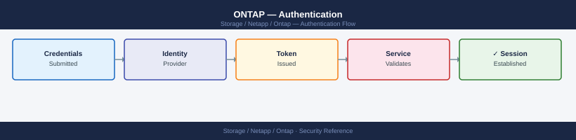

---
tags:
  - netapp
  - security
description: "Authentication in ONTAP controls how administrators and service accounts gain access to cluster and SVM management interfaces. ONTAP supports local..."
---
# ONTAP — Authentication

<div class="kb-summary">
Authentication in ONTAP controls how administrators and service accounts gain access to cluster and SVM management interfaces. ONTAP supports local accounts, Active Directory (LDAP/Kerberos), SSH public keys, and SAML-based SSO for System Manager.

*Applies to: ONTAP 9.x*
</div>


## Before you begin

- **Access:** Storage admin credentials (cluster admin or equivalent)
- **Change management:** security changes require CAB approval in most environments
- **Rollback plan:** document current state before any security control change
- **Testing:** validate in a non-production environment first where possible

---

## Authentication Flow

```d2
direction: right

user: "Administrator / Service Account" {shape: rectangle}
accessType: "Access Type" {shape: rectangle}
sshAuth: "Auth Method" {shape: rectangle}
httpsAuth: "Auth Method" {shape: rectangle}
nfsAuth: "NSSwitch → files / LDAP\nUID/GID resolution" {shape: rectangle}
smbAuth: "Kerberos\nAD Domain Join" {shape: rectangle}
localCheck: "Local credential store\non ONTAP node" {shape: rectangle}
keyCheck: "SSH key match\nstored in ONTAP" {shape: rectangle}
adCheck: "AD Kerberos\nvia LDAP lookup" {shape: rectangle}
certCheck: "Mutual TLS\nclient certificate" {shape: rectangle}
samlFlow: "Redirect to IdP\nADFS / Okta / Azure AD" {shape: rectangle}
mfa: "MFA at IdP" {shape: rectangle}
token: "SAML assertion\nreturned to ONTAP" {shape: rectangle}
rbac: "RBAC Role\npermission check" {shape: rectangle}
access: "Access granted\nto cluster or SVM" {shape: rectangle}

user -> accessType
accessType -> sshAuth
accessType -> httpsAuth
accessType -> nfsAuth
accessType -> smbAuth
sshAuth -> localCheck
sshAuth -> keyCheck
sshAuth -> adCheck
httpsAuth -> localCheck
httpsAuth -> certCheck
httpsAuth -> samlFlow
samlFlow -> mfa
mfa -> token
localCheck -> rbac
keyCheck -> rbac
adCheck -> rbac
certCheck -> rbac
token -> rbac
rbac -> access
```

## Authentication Methods Summary

| Method | Application | Use Case |
|---|---|---|
| Password | SSH, HTTP, ONTAPI | Local accounts; should be avoided for admin in production |
| Public key | SSH | Service accounts and admin access; preferred for SSH |
| Certificate | HTTPS (REST API, ONTAPI) | API automation; mutual TLS |
| Domain (AD) | SSH, HTTP | AD-integrated admin accounts; uses Kerberos |
| SAML | HTTP (System Manager UI) | Browser-based SSO via IdP (ADFS, Okta) |
| NSSWITCH / LDAP | NFS/CIFS data access | UID/GID resolution for NFS; user mapping for CIFS |

---

## Local Accounts

ONTAP supports local admin accounts at both the cluster level and the SVM level. Local accounts are independent of Active Directory and are used for break-glass access and service accounts.

### Managing Local Accounts

```bash
# List all login accounts across all SVMs
security login show

# List accounts for a specific SVM
security login show -vserver <svm>

# Show account details including role and last login
security login show -fields username,application,authmethod,role,is-account-locked

# Create a local account with password authentication
security login create \
    -username <user> \
    -application ssh \
    -authentication-method password \
    -role admin \
    -vserver <cluster-or-svm>

# Create a local account with public key authentication
security login create \
    -username svc-monitor \
    -application ssh \
    -authentication-method publickey \
    -role monitor-role \
    -vserver <cluster-name>

# Change a user password
security login password -username <user> -vserver <svm>

# Lock an account (disable access without deleting)
security login lock -username <user> -vserver <svm>

# Unlock an account
security login unlock -username <user> -vserver <svm>

# Delete an account
security login delete -username <user> -application ssh -vserver <svm>
```


```text title="Expected output"
cluster1::> security login show
Vserver: cluster1
                                                                   Is-SU-
User/Group                 Application                 Method    Locked
-------------------------- --------------------------- ---------- ------
admin                      console                     password  false
admin                      http                        password  false
admin                      ontapi                      password  false
admin                      ssh                         password  false
cluster1::> security login show -vserver svm-prod
Vserver: svm-prod
                                                                   Is-SU-
User/Group                 Application                 Method    Locked
-------------------------- --------------------------- ---------- ------
dataadmin                  ssh                         password  false
monitor                    ssh                         publickey false
cluster1::> security login show -fields username,application,authmethod,role,is-account-locked
Vserver   Username   Application   Authmethod   Role              Is-Account-Locked
--------- ---------- ------------- ------------ ----------------- ------------------
cluster1  admin      ssh           password     admin             false
cluster1  backup-svc ssh           publickey    backup            false
svm-prod  dataadmin  ssh           password     vsadmin           false
svm-prod  monitor    ssh           publickey    monitor-role      false
cluster1::> security login create -username svc-backup -application ssh -authentication-method password -role admin -vserver cluster1
Enter a password for user "svc-backup":
Confirm the password:
(no output — command completes silently)
cluster1::> security login password -username dataadmin -vserver svm-prod
Enter a password for user "dataadmin":
Confirm the password:
(no output — command completes silently)
cluster1::> security login lock -username monitor -vserver svm-prod
(no output — command completes silently)
cluster1::> security login unlock -username monitor -vserver svm-prod
(no output — command completes silently)
cluster1::> security login delete -username svc-backup -application ssh -vserver cluster1
(no output — command completes silently)
```

!!! warning "Common errors"
    **`Error: "svc-monitor" is not a valid user name for Vserver "cluster1".`** — Verify the username exists with `security login show` before attempting to modify it.
    **`Error: Failed to set password: Account is locked.`** — Unlock the account first using `security login unlock -username <user> -vserver <svm>`.
    **`Error: Cannot delete user "admin" from application "ssh": Admin user cannot be deleted.`** — Create an alternative admin account before attempting to remove the default admin user.
### Built-in Accounts

| Account | Default State | Notes |
|---|---|---|
| `admin` | Active | Primary cluster admin; rotate password and enforce key auth |
| `diag` | Active | Node diagnostic access; lock in production |
| `autosupport` | Internal | AutoSupport service; do not modify |

Always lock the `diag` account on production clusters:

```bash
security login lock -username diag -vserver <cluster-name>
```


```text title="Expected output"
(no output — command completes silently)
```

!!! warning "Common errors"
    **`Error: "diag" is not a valid user on vserver "cluster-prod"`** — Verify the username exists with `security login show` before locking.
    **`Error: This operation is not permitted: user "admin" cannot lock built-in user "diag"`** — Use a cluster admin account or check if the user role permits lock operations.
---

## SSH Public Key Authentication

Public key authentication is required for admin accounts and service accounts in production environments. Password authentication for SSH should be disabled for the `admin` account once key access is confirmed.

### Adding Public Keys

```bash
# Add a public key for an existing user account
security login publickey create \
    -username admin \
    -index 0 \
    -publickey "ssh-rsa AAAA...rest_of_key...user@host"

# Add an Ed25519 key (preferred for new keys)
security login publickey create \
    -username svc-ansible \
    -index 0 \
    -publickey "ssh-ed25519 AAAA...key...user@host"

# List all configured public keys
security login publickey show

# Show public keys for a specific user
security login publickey show -username admin
```


```text title="Expected output"
Public Key created.

Public Key created.

Index Username                   Algorithm  Fingerprint
----- -------------------------- ---------- ----------------------------------------
0     admin                      rsa        SHA256:KxZ9pL2mN8vQ3rT5wY7aB1cD4eF6gH9jK0lM2nO4pQ
1     admin                      rsa        SHA256:9mK8lJ7iH6gF5dE4cR3bQ2aP1oN0mL9kJ8iH7gF6e
0     svc-ansible                ed25519    SHA256:TpQ1rS2tU3vW4xY5zA6bB7cC8dD9eE0fF1gG2hH3iI
0     diag                       rsa        SHA256:MnO9pQ0rR1sS2tT3uU4vV5wW6xX7yY8zA9bB0cC1dD

Index Username                   Algorithm  Fingerprint
----- -------------------------- ---------- ----------------------------------------
0     admin                      rsa        SHA256:KxZ9pL2mN8vQ3rT5wY7aB1cD4eF6gH9jK0lM2nO4pQ
1     admin                      rsa        SHA256:9mK8lJ7iH6gF5dE4cR3bQ2aP1oN0mL9kJ8iH7gF6e
```

!!! warning "Common errors"
    **`Error: Entry already exists at index 0`** — Use a different index number (e.g., `-index 1`) or delete the existing key first with `security login publickey delete`.
    **`Error: Invalid public key format`** — Ensure the key string is complete and properly formatted (starts with `ssh-rsa`, `ssh-ed25519`, or `ecdsa-sha2-nistp256`).
### Requiring Key-Only Authentication

After confirming key authentication works, disable password auth for the admin account:

```bash
# Verify key authentication is working first (test in a separate SSH session)
# Then remove the password-based login method
security login delete -username admin -application ssh -authentication-method password

# Confirm only publickey auth remains for admin
security login show -username admin
```


```text title="Expected output"
(no output — command completes silently)

Vserver Name: cluster1
UserName                Vserver Name            Authentication Methods
-------                 -------                 ----------------------
admin                   cluster1                publickey
```

!!! warning "Common errors"
    **`Error: entry doesn't exist`** — Verify the admin user exists and the authentication method is currently set to password using `security login show -username admin` before deletion.
    **`Error: Cannot delete the last authentication method`** — Ensure key-based authentication is already configured and tested for admin before removing the password method, or use a different user account for the deletion command.
### Key Rotation

```bash
# Add the new key (index 1) before removing the old one
security login publickey create -username admin -index 1 -publickey "ssh-ed25519 AAAA...new_key"

# After confirming new key works, delete the old key
security login publickey delete -username admin -index 0

# Renumber index if needed
security login publickey modify -username admin -index 1 -new-index 0
```


```text title="Expected output"
(no output — command completes silently)
(no output — command completes silently)
(no output — command completes silently)
```

!!! warning "Common errors"
    **`Error: entry already exists`** — Verify the public key doesn't already exist for this user with `security login publickey show -username admin`.
    **`Error: cannot delete the last public key for user`** — Ensure at least one valid public key remains; create the new key and test SSH access before deleting the old one.
---

## Active Directory / CIFS Authentication

Joining an SVM to Active Directory enables CIFS/SMB file access using Kerberos authentication and allows domain accounts to be used for ONTAP management login.

### Joining an SVM to Active Directory

```bash
# Join an SVM to Active Directory for CIFS/SMB
# Requires Domain Admin credentials at join time
vserver cifs create \
    -vserver <svm> \
    -cifs-server <netbios-name> \
    -domain <domain.corp> \
    -ou "OU=StorageServers,DC=domain,DC=corp"

# Verify CIFS domain join and DC connectivity
vserver cifs domain info -vserver <svm>

# Check AD join status
vserver cifs show -vserver <svm> -fields ad-status

# Check which DCs the SVM is communicating with
vserver cifs domain discovered-servers show -vserver <svm>
```


```text title="Expected output"
Vserver: svm_prod_01
CIFS Server Name: NAS-PROD-01
Domain: domain.corp
Organizational Unit: OU=StorageServers,DC=domain,DC=corp
Domain Workgroup: DOMAIN
Status: joined

Vserver            AD-Status
------------------ ----------
svm_prod_01        joined

Server Name          Address         Preferred
-------------------- --------------- ---------
dc01.domain.corp     192.168.10.45   true
dc02.domain.corp     192.168.10.46   false
dc03.domain.corp     192.168.10.47   false
```

!!! warning "Common errors"
    **`CIFS server "NAS-PROD-01" already exists on Vserver "svm_prod_01".`** — Verify the SVM is not already domain-joined using `vserver cifs show -vserver <svm>` before attempting to create a new CIFS server.
    **`Failed to join domain "domain.corp": Authentication failed (Kerberos error 24)`** — Confirm Domain Admin credentials are correct and the SVM has network connectivity to at least one domain controller on port 389 (LDAP) and 88 (Kerberos).
    **`Failed to join domain "domain.corp": The specified organizational unit does not exist.`** — Verify the OU path exists in Active Directory and use the correct DN format (e.g., `OU=StorageServers,DC=domain,DC=corp`).
### Domain Account Management Login

Domain accounts can be granted ONTAP management access without requiring a local account:

```bash
# Grant an AD user SSH access with a specific role
security login create \
    -username "DOMAIN\\admin-user" \
    -application ssh \
    -authentication-method domain \
    -role admin \
    -vserver <cluster-name>

# Grant an AD group access (ONTAP 9.8+)
security login create \
    -username "DOMAIN\\StorageAdmins" \
    -application ssh \
    -authentication-method domain \
    -role admin \
    -vserver <cluster-name>

# Verify domain login configuration
security login show -authentication-method domain
```


```text title="Expected output"
cluster1::> security login create -username "DOMAIN\admin-user" -application ssh -authentication-method domain -role admin -vserver cluster1
(no output — command completes silently)

cluster1::> security login create -username "DOMAIN\StorageAdmins" -application ssh -authentication-method domain -role admin -vserver cluster1
(no output — command completes silently)

cluster1::> security login show -authentication-method domain
Vserver: cluster1
                                                 Authentication             Acct
User/Group Name              Application Method    Locked Role Name
---------------------------- ----------- --------- ------ ----------------
DOMAIN\admin-user            ssh         domain     false  admin
DOMAIN\StorageAdmins         ssh         domain     false  admin
2 entries were displayed.
```

!!! warning "Common errors"
    **`Error: "DOMAIN\admin-user" is not a valid user name`** — Escape the backslash properly in your shell context or use single quotes around the username string.
    **`Error: This user already exists`** — The login entry already exists; use `security login modify` to change its role or authentication method instead.
    **`Error: Domain authentication is not configured`** — Configure LDAP or Active Directory on the cluster first using `security config modify -authentication-method domain`.
---

## LDAP Integration

LDAP is used for name service lookups — resolving NFS UIDs and GIDs to usernames, and mapping Windows SIDs to UNIX IDs for mixed-security volumes.

### LDAP Client Configuration

```bash
# Create an LDAP client configuration
vserver services name-service ldap client create \
    -vserver <svm> \
    -client-config <ldap-config-name> \
    -servers <ldap-server-ip> \
    -base-dn "DC=domain,DC=corp" \
    -schema RFC-2307 \
    -bind-dn "CN=svc-ontap-ldap,OU=Service Accounts,DC=domain,DC=corp" \
    -bind-password <password>

# Apply LDAP client config to the SVM
vserver services name-service ldap create \
    -vserver <svm> \
    -client-config <ldap-config-name> \
    -client-enabled true

# Show LDAP configuration for an SVM
vserver services name-service ldap show -vserver <svm>

# Test LDAP connectivity
vserver services name-service ldap check -vserver <svm>
```


```text title="Expected output"
LDAP client configuration created successfully.

LDAP configuration applied to SVM.

Vserver: svm-prod-01
Client Config: ldap-corp-primary
Servers: 10.50.12.45
Base DN: DC=domain,DC=corp
Bind DN: CN=svc-ontap-ldap,OU=Service Accounts,DC=domain,DC=corp
Schema: RFC-2307
Client Enabled: true
Query Timeout: 3 seconds
Bind Timeout: 3 seconds

LDAP connectivity check results:
Server: 10.50.12.45
Port: 389
Status: up
Response Time: 142ms
Bind Status: successful
```

!!! warning "Common errors"
    **`Error: "LDAP client config <ldap-config-name> already exists"`** — Use a unique client configuration name or delete the existing config with `vserver services name-service ldap client delete`.
    **`Error: "LDAP server <ldap-server-ip> is unreachable"`** — Verify network connectivity to the LDAP server, check firewall rules for port 389/636, and confirm the IP address is correct.
    **`Error: "Invalid bind DN or password"`** — Verify the bind account credentials and DN format match your Active Directory structure using `ldapsearch` from a test client.
### Name Service Switch

The name service switch defines the order in which ONTAP resolves user and group information:

```bash
# Show name service lookup order
vserver services name-service ns-switch show -vserver <svm>

# Configure lookup order (files first, then LDAP for passwd/group)
vserver services name-service ns-switch modify -vserver <svm> \
    -database passwd -sources files,ldap
vserver services name-service ns-switch modify -vserver <svm> \
    -database group -sources files,ldap
vserver services name-service ns-switch modify -vserver <svm> \
    -database netgroup -sources files,ldap
```


```text title="Expected output"
Vserver: svm-prod-01
Database    Sources
----------  ----------------
hosts       files,dns
passwd      files,ldap
group       files,ldap
netgroup    files,ldap
services    files
netmasks    files
protocols   files
rpc         files
ethers      files
bootparams  files

(no output — command completes silently)
(no output — command completes silently)
(no output — command completes silently)
```

!!! warning "Common errors"
    **`Error: "svm-prod-01" is not a valid vserver name`** — Verify the SVM name exists with `vserver show` and use the correct name in the `-vserver` parameter.
    **`Error: Invalid value specified for option "sources": "files,ldap"`** — Ensure LDAP is configured on the SVM first with `vserver services name-service ldap client create` before adding it to ns-switch sources.
    **`Error: Access denied. Insufficient privileges to perform the requested operation`** — Run the commands with cluster admin credentials or ensure your role has `vserver-admin` privileges.
---

## SNMPv3 Authentication

SNMP is used for monitoring integration (Nagios, Zabbix, Prometheus via SNMP exporters). Only SNMPv3 should be used in production — SNMPv1 and v2c transmit community strings in plaintext.

```bash
# Configure an SNMPv3 user with authentication and privacy (AES-128 encryption)
system snmp user create \
    -username snmpv3monitor \
    -authmethod sha \
    -authpassword <auth-passphrase> \
    -privmethod aes128 \
    -privpassword <priv-passphrase>

# Add an SNMPv3 trap host (monitoring server)
system snmp traphost add -ipaddr <monitoring-host-ip> -username snmpv3monitor

# Verify SNMP configuration
system snmp show
system snmp user show

# Delete all SNMPv1/v2c community strings
system snmp community delete -community-name public
system snmp community delete -community-name <any-other-community>

# Confirm no v1/v2c communities remain
system snmp community show
# Expected: no entries
```


```text title="Expected output"
SNMPv3 user "snmpv3monitor" created successfully.
Trap host 192.168.45.120 added for user snmpv3monitor.

SNMP Status:
  Status: enabled
  Auth Traps Enabled: true
  Contact: 
  Location: 

SNMPv3 Users:
  User Name: snmpv3monitor
  Engine ID: 800007E5A1A2B3C4D5E6F7A8B9C0D1E2F3
  Auth Protocol: sha
  Privacy Protocol: aes128
  Access Level: admin

SNMPv1/v2c Communities:
  (no entries)
```

!!! warning "Common errors"
    **`Error: SNMP user "snmpv3monitor" already exists`** — Delete the existing user with `system snmp user delete -username snmpv3monitor` before recreating it.
    **`Error: Invalid IP address <monitoring-host-ip>`** — Replace `<monitoring-host-ip>` with a valid IPv4 address (e.g., 192.168.45.120) and ensure the monitoring host is reachable from the cluster.
    **`Error: Community string "public" does not exist`** — Verify the community name exists first by running `system snmp community show` before attempting deletion.
Recommended SNMPv3 security levels:

| Parameter | Recommended Value | Notes |
|---|---|---|
| Auth method | SHA (SHA-256 preferred) | MD5 is deprecated; use SHA |
| Privacy method | AES-128 | DES is deprecated; use AES |
| Security level | authPriv | Both auth and encryption required |

---

## SAML SSO for System Manager

ONTAP 9.8+ supports SAML 2.0-based single sign-on for the System Manager web UI. This integrates with enterprise identity providers (ADFS, Okta, Azure AD) to enforce corporate MFA and session policies.

### SAML Configuration Overview

```bash
# Enable SAML on the cluster
security saml-sp create \
    -idp-uri <idp-metadata-url> \
    -sp-host <cluster-management-fqdn>

# Show SAML SP configuration
security saml-sp show

# Show SAML IdP configuration
security saml-sp idp show
```


```text title="Expected output"
SAML Service Provider created successfully.

Vserver: cluster
IdP URI: https://idp.example.com/metadata.xml
SP Host: cluster-mgmt.example.com
Enabled: true
Binding: urn:oasis:names:tc:SAML:2.0:bindings:HTTP-POST
NameID Format: urn:oasis:names:tc:SAML:1.1:nameid-format:emailAddress

Vserver: cluster
IdP URI: https://idp.example.com/metadata.xml
IdP Cert Issuer: CN=idp.example.com,O=Example Corp,C=US
IdP Cert Serial: 4A:B2:C3:D4:E5:F6:7A:8B
IdP Cert Expiry: 2026-03-15
```

!!! warning "Common errors"
    **`Error: Invalid IdP metadata URL format`** — Verify the `-idp-uri` parameter is a valid HTTPS URL and the metadata endpoint is accessible from the cluster.
    **`Error: SAML SP already exists on vserver "cluster"`** — Delete the existing SAML SP configuration with `security saml-sp delete` before creating a new one.
    **`Error: Cannot resolve cluster management FQDN`** — Ensure the `-sp-host` parameter matches the cluster's management interface FQDN and is resolvable in DNS.
SAML configuration requires:
1. Download the ONTAP SP metadata from `https://<cluster-mgmt>/saml-service-provider-metadata.xml`
2. Register the SP in your IdP (ADFS, Okta, or Azure AD) using the SP metadata
3. Configure IdP metadata URI in ONTAP: the IdP must be reachable from the cluster management LIF
4. Test login via System Manager — ONTAP redirects to the IdP for authentication

### SAML Bypass (Break-Glass)

SAML enforcement locks out password-based System Manager login. Maintain a local `admin` account with SSH key access as a break-glass method in case the IdP is unavailable.

```bash
# SAML applies to HTTP (System Manager) only
# SSH with local admin account always works regardless of SAML state
# Verify local admin SSH key access before enabling SAML
security login show -username admin -application ssh
```


```text title="Expected output"
Vserver: cluster1
Username: admin
Application: ssh
Authentication-method: publickey
Role: admin
Locked: false
Expire-time: -
Comment: -
```

!!! warning "Common errors"
    **`Error: "admin" is not a valid username for Vserver "cluster1"`** — Verify the username exists with `security login show` and use the correct Vserver name with `-vserver` parameter if in a multi-Vserver environment.
    **`Error: entry doesn't exist`** — Ensure an SSH public key is already configured for the admin user with `security login publickey load-from-uri` or `security login publickey create` before enabling SAML.
---

## Kerberos for NFS

NFSv4.1 with Kerberos (krb5, krb5i, krb5p) provides strong authentication and optional integrity/privacy for NFS data. This is required in environments with compliance mandates for in-flight encryption of NAS traffic.

```bash
# Check NFS Kerberos configuration on an SVM
vserver nfs kerberos interface show -vserver <svm>

# Enable Kerberos on a specific NFS LIF
vserver nfs kerberos interface enable \
    -vserver <svm> \
    -lif <lif_name> \
    -spn nfs/<lif_fqdn>@<KERBEROS_REALM>

# Show Kerberos realms configured
vserver nfs kerberos realm show -vserver <svm>

# Create a Kerberos realm configuration
vserver nfs kerberos realm create \
    -vserver <svm> \
    -realm <KERBEROS_REALM> \
    -kdc-vendor Microsoft \
    -kdc-ip <domain-controller-ip> \
    -kdc-port 88 \
    -adserver-ip <domain-controller-ip> \
    -adserver-name <dc-hostname>
```


```text title="Expected output"
Vserver: svm-prod-01
LIF: nfs_lif_01
Kerberos Enabled: true
SPN: nfs/nfs-prod-01.corp.local@CORP.LOCAL
Realm: CORP.LOCAL

Vserver: svm-prod-01
LIF: nfs_lif_01
SPN: nfs/nfs-prod-01.corp.local@CORP.LOCAL
Status: enabled

Vserver: svm-prod-01
Realm: CORP.LOCAL
KDC Vendor: Microsoft
KDC IP: 192.168.1.50
KDC Port: 88
AD Server IP: 192.168.1.50
AD Server Name: dc-01.corp.local

Vserver: svm-prod-01
Realm: CORP.LOCAL
KDC Vendor: Microsoft
KDC IP: 192.168.1.50
KDC Port: 88
AD Server IP: 192.168.1.50
AD Server Name: dc-01.corp.local
Status: created
```

!!! warning "Common errors"
    **`Error: command failed: Kerberos realm CORP.LOCAL already exists`** — Check existing realms with `vserver nfs kerberos realm show` before creating a new one.
    **`Error: command failed: LIF nfs_lif_01 is not configured for NFS`** — Ensure the LIF has NFS protocol enabled using `vserver nfs create` or `network interface modify`.
    **`Error: command failed: Cannot resolve KDC hostname or IP address unreachable`** — Verify network connectivity to the domain controller IP and confirm the KDC port 88 is open in firewall rules.
Kerberos security flavors for NFS exports:

| Flavor | Authentication | Integrity | Encryption |
|---|---|---|---|
| `krb5` | Kerberos | No | No |
| `krb5i` | Kerberos | Yes (checksum) | No |
| `krb5p` | Kerberos | Yes | Yes (AES-256) |

Configure the required flavor in the NFS export policy rule:

```bash
vserver export-policy rule modify \
    -vserver <svm> \
    -policyname <policy> \
    -ruleindex 1 \
    -rorule krb5p \
    -rwrule krb5p \
    -superuser krb5p
```

```text title="Expected output"
(no output — command completes silently)
```

!!! warning "Common errors"
    **`Error: "krb5p" is not a valid value for this parameter`** — Use valid authentication methods like `krb5`, `krb5i`, `sys`, or `none` instead of `krb5p`.
    **`Error: policy <policy> does not exist`** — Verify the policy name is correct and exists on the SVM using `vserver export-policy show -vserver <svm>`.
    **`Error: rule index 1 does not exist in policy <policy>`** — Check available rule indices with `vserver export-policy rule show -vserver <svm> -policyname <policy>` before modifying.
---

## Related Reference

- [Standard LDAP Integration](../../../../../security/ldap-integration/index.md) — field reference, service account standards, TLS requirements, and connectivity testing
- [Standard SAML Configuration](../../../../../security/saml-configuration/index.md) — SP/IdP setup, Azure AD and Okta steps, attribute mapping, and security requirements

---

## See also

- [Ontap — Access Control](../access-control/)
- [Ontap — Hardening](../hardening/)
- [Ontap — Encryption](../encryption/)
