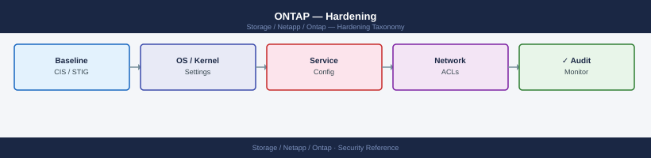
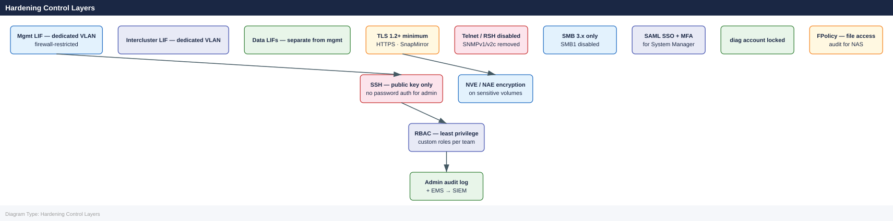

---
tags:
  - netapp
  - security
description: "Security hardening for ONTAP focuses on reducing attack surface, enforcing strong authentication, encrypting management and data traffic, and enabling..."
---
# ONTAP — Hardening

<div class="kb-summary">
Security hardening for ONTAP focuses on reducing attack surface, enforcing strong authentication, encrypting management and data traffic, and enabling comprehensive audit logging. Apply this baseline to all production clusters at build and validate quarterly.

*Applies to: ONTAP 9.x*
</div>


## Before you begin

- **Access:** Storage admin credentials (cluster admin or equivalent)
- **Change management:** security changes require CAB approval in most environments
- **Rollback plan:** document current state before any security control change
- **Testing:** validate in a non-production environment first where possible

---

## Hardening Control Layers



## Hardening Checklist

### Authentication and Access

- [ ] Password authentication disabled for `admin` account; SSH public key only
- [ ] Built-in `diag` account locked: `security login lock -username diag`
- [ ] All service/automation accounts use minimum-privilege custom RBAC roles
- [ ] No shared accounts; each administrator has an individual named account
- [ ] SSH idle session timeout configured: `security session timeout modify -timeout 600`
- [ ] SSH host key type restricted to Ed25519 or RSA-4096+

### Protocol Security

- [ ] TLS 1.2 minimum enforced for HTTPS management: `security config modify -interface HTTPS -min-protocol-version TLSv1.2`
- [ ] Telnet and RSH disabled: `security protocol show` confirms both are `false`
- [ ] SNMPv1 and SNMPv2c community strings deleted; SNMPv3 only
- [ ] SMB1 disabled on all CIFS SVMs: `vserver cifs options modify -smb1-enabled false`
- [ ] SSH ciphers restricted to AES-CTR and AES-GCM variants; weak ciphers removed

### Encryption

- [ ] NVE or NAE enabled on all volumes containing sensitive or regulated data
- [ ] External KMIP key manager configured (OKM acceptable for non-regulated environments)
- [ ] AutoSupport configured for HTTPS delivery (not HTTP or SMTP)
- [ ] SnapMirror relationships using TLS encryption (ONTAP 9.6+ default)

### Auditing and Monitoring

- [ ] Admin action audit logging enabled and confirmed active: `security audit log show`
- [ ] EMS log forwarding to SIEM configured
- [ ] AutoSupport delivering successfully to NetApp; proxy configured if required
- [ ] FPolicy configured on production NAS SVMs for file access auditing if required by compliance
- [ ] EMS email alerts configured for CRITICAL and ERROR severity events

### Network

- [ ] Cluster management LIF on a dedicated management VLAN; not reachable from untrusted networks
- [ ] Firewall rules restrict cluster management LIF access to authorized management hosts only
- [ ] Intercluster LIFs are on a dedicated VLAN separate from data LIFs
- [ ] No data LIFs on the management VLAN

---

## Authentication Hardening

### Disable Admin Password Authentication

```bash
# First: ensure a public key is configured and working
security login publickey show -username admin

# Verify key auth works — test SSH with the key in a separate terminal before proceeding
# ssh -i /path/to/key admin@<cluster-mgmt-ip>

# Remove password-based SSH login for admin
security login delete -username admin -application ssh -authentication-method password

# Confirm only publickey method remains
security login show -username admin
```


```text title="Expected output"
Vserver: cluster1
Username: admin
Application: ssh
Authentication Method: publickey
Public Key Index: 1
Public Key Comment: admin-key-2024
Public Key Hash: SHA256:aBcD1234EfGhIjKlMnOpQrStUvWxYz5678+9/0AbCdEfG==

Vserver: cluster1
Username: admin
Application: ssh
Authentication Method: password
Public Key Index: —
Public Key Comment: —
Public Key Hash: —

(no output — command completes silently)

Vserver: cluster1
Username: admin
Application: ssh
Authentication Method: publickey
Public Key Index: 1
Public Key Comment: admin-key-2024
Public Key Hash: SHA256:aBcD1234EfGhIjKlMnOpQrStUvWxYz5678+9/0AbCdEfG==
```

!!! warning "Common errors"
    | Error | Fix |
    |---|---|
    | `Error: entry doesn't exist` | Ensure the public key has been added to the admin account using `security login publickey create` before attempting deletion. |
    | `Error: Cannot delete the only authentication method` | Verify the public key is working via SSH before deleting the password method, or add an additional authentication method first. |
### Lock Diagnostic Accounts

```bash
# Lock the built-in diag account
security login lock -username diag -vserver <cluster-name>

# Verify it is locked
security login show -username diag -fields is-account-locked
# Expected: is-account-locked: true
```


```text title="Expected output"
(no output — command completes silently)

Vserver     Username Account Locked
----------- -------- --------------
prod-cluster diag     true
```

!!! warning "Common errors"
    | Error | Fix |
    |---|---|
    | `Error: "diag" is not a valid username for Vserver "prod-cluster"` | Verify the cluster name with `cluster show` and ensure the diag account exists on that specific Vserver. |
    | `Error: This operation is not permitted: User "admin" does not have permission to execute the command "security login lock"` | Confirm your user account has the "admin" or equivalent security role by running `security login show -username <your-user>`. |
### Session Timeout

```bash
# Set CLI SSH idle timeout to 10 minutes (600 seconds)
security session timeout modify -timeout 600

# Verify timeout
security session timeout show
```


```text title="Expected output"
(no output — command completes silently)

Session Timeout
---------------
Idle Timeout: 600 seconds
```

!!! warning "Common errors"
    | Error | Fix |
    |---|---|
    | `Error: "security session timeout modify" is not a valid command.` | Verify you are running ONTAP 9.1 or later, as this command was introduced in that version. |
    | `Error: Invalid value "600" for parameter "timeout".` | Use a value between 0 and 86400 seconds; 600 seconds is valid, so check for typos or ensure the parameter name matches your ONTAP version exactly. |
### Account Lockout Policy

ONTAP does not have a configurable account lockout after N failed attempts in the same way as Active Directory. Enforce this compensating control:

- Monitor failed login events via EMS: `event log show -messagename security.authentication.failed`
- Use LDAP/AD-integrated accounts where lockout is enforced at the IdP
- For local accounts, review `security audit log show` for repeated failed attempts

---

## Protocol Hardening

### TLS Hardening

```bash
# Enforce TLS 1.2 minimum for HTTPS management interfaces
security config modify -interface HTTPS -min-protocol-version TLSv1.2

# Verify current TLS configuration
security config show

# For highest security environments, enforce TLS 1.2 only on both interfaces
security config modify -interface SSL -min-protocol-version TLSv1.2

# Verify with an external SSL test
openssl s_client -connect <cluster-mgmt-ip>:443 -tls1_1
# Should fail if TLS 1.2 minimum is properly enforced
```


```text title="Expected output"
(no output — command completes silently)

Interface  Min Protocol Version  Max Protocol Version
---------  -------------------  -------------------
HTTPS      TLSv1.2              TLSv1.3
SSL        TLSv1.2              TLSv1.3

(no output — command completes silently)

CONNECTED(00000000)
140735289847616:error:1409442E:SSL routines:ssl3_read_bytes:tlsv1 alert protocol version:../ssl/record/rec_read_c.c:659:SSL alert number 70
```

!!! warning "Common errors"
    | Error | Fix |
    |---|---|
    | `Error: Invalid value for "-min-protocol-version": "TLSv1.2"` | Verify the exact protocol version string supported by your ONTAP version (may be `TLSv1.2` or `TLSV1_2` depending on release); check the admin guide for valid enum values. |
    | `Error: command not found: openssl` | Install openssl on your management workstation or use a dedicated SSL testing tool; the ONTAP cluster itself does not require openssl for this configuration. |
    | `Error: Connection refused` | Ensure the cluster management IP is correct and reachable from your test host, and verify the HTTPS management interface is enabled with `network interface show -vserver <cluster> -role mgmt`. |
### SSH Cipher Hardening

```bash
# Restrict SSH to strong ciphers (remove CBC mode ciphers)
security ssh modify \
    -vserver <cluster-name> \
    -ciphers aes256-ctr,aes192-ctr,aes128-ctr,aes256-gcm@openssh.com,aes128-gcm@openssh.com \
    -macs hmac-sha2-256,hmac-sha2-512

# Verify SSH settings
security ssh show -vserver <cluster-name>
```


```text title="Expected output"
Vserver: cluster-prod-01
Ciphers: aes256-ctr,aes192-ctr,aes128-ctr,aes256-gcm@openssh.com,aes128-gcm@openssh.com
MACs: hmac-sha2-256,hmac-sha2-512
Key Exchange Algorithms: diffie-hellman-group-exchange-sha256,ecdh-sha2-nistp256,ecdh-sha2-nistp384,ecdh-sha2-nistp521
Hostkey Algorithms: ssh-rsa,rsa-sha2-256,rsa-sha2-512,ecdsa-sha2-nistp256,ecdsa-sha2-nistp384,ecdsa-sha2-nistp521,ssh-ed25519
```

!!! warning "Common errors"
    | Error | Fix |
    |---|---|
    | `Error: Vserver "<cluster-name>" does not exist` | Replace `<cluster-name>` with the actual cluster name from `cluster identity show`. |
    | `Error: Invalid cipher name "aes256-ctr"` | Verify cipher names match your ONTAP version's supported list using `security ssh show -fields ciphers`. |
### Disable Legacy Protocols

```bash
# Disable Telnet
security protocol modify -application telnet -enabled false

# Disable RSH
security protocol modify -application rsh -enabled false

# Verify both are disabled
security protocol show
```


```text title="Expected output"
security protocol modify -application telnet -enabled false
(no output — command completes silently)

security protocol modify -application rsh -enabled false
(no output — command completes silently)

security protocol show
Application     Enabled
-----------     -------
telnet          false
rsh             false
ssh             true
snmp            true
http            false
https           true
ndmp            true
nfs             true
cifs            true
```

!!! warning "Common errors"
    | Error | Fix |
    |---|---|
    | `Error: "telnet" is not a valid application name` | Use the exact application name from `security protocol show` output; verify spelling matches ONTAP's protocol list. |
    | `Error: This operation is not permitted: admin role lacks "security" API access` | Ensure your user account has the "admin" or equivalent security management role assigned. |
### Disable SMB1

```bash
# Disable SMB1 (vulnerable to EternalBlue and similar exploits)
vserver cifs options modify -vserver <svm> -smb1-enabled false

# Verify SMB1 is disabled
vserver cifs options show -vserver <svm> -fields smb1-enabled
# Expected: smb1-enabled: false

# Enable SMB signing (prevents man-in-the-middle attacks on SMB traffic)
vserver cifs security modify -vserver <svm> -is-signing-required true
```


```text title="Expected output"
vserver cifs options modify -vserver prod-svm-01 -smb1-enabled false
(no output — command completes silently)

vserver cifs options show -vserver prod-svm-01 -fields smb1-enabled
Vserver          SMB1 Enabled
---------------- ----------------
prod-svm-01      false

vserver cifs security modify -vserver prod-svm-01 -is-signing-required true
(no output — command completes silently)
```

!!! warning "Common errors"
    | Error | Fix |
    |---|---|
    | `Error: "prod-svm-01" is not a valid vserver name` | Verify the SVM name with `vserver show` and replace `<svm>` with the correct vserver name. |
    | `Error: CIFS is not configured on vserver "prod-svm-01"` | Enable CIFS on the SVM first with `vserver cifs create -vserver <svm> -cifs-server <netbios-name> -domain <domain>`. |
    | `Error: This operation is not permitted: SMB1 is required for legacy clients` | If legacy clients require SMB1, document the exception and use `-smb1-enabled true` instead, or plan a client upgrade. |
---

## SNMP Hardening

```bash
# Delete all SNMPv1/v2c community strings
system snmp community delete -community-name public
system snmp community delete -community-name private

# Confirm no community strings remain
system snmp community show
# Expected: no entries

# Create an SNMPv3 user with authentication and privacy
system snmp user create \
    -username snmpv3monitor \
    -authmethod sha \
    -authpassword <strong-auth-passphrase> \
    -privmethod aes128 \
    -privpassword <strong-priv-passphrase>

# Add the monitoring server as an SNMPv3 trap host
system snmp traphost add -ipaddr <monitoring-server-ip> -username snmpv3monitor

# Enable SNMP
system snmp modify -is-enabled true

# Verify SNMP configuration
system snmp show
system snmp user show
system snmp traphost show
```


```text title="Expected output"
system snmp community delete -community-name public
(no output — command completes silently)
system snmp community delete -community-name private
(no output — command completes silently)
system snmp community show
(no entries)

system snmp user create -username snmpv3monitor -authmethod sha -authpassword ••••••••••••••• -privmethod aes128 -privpassword •••••••••••••••
(no output — command completes silently)

system snmp traphost add -ipaddr 192.168.1.45 -username snmpv3monitor
(no output — command completes silently)

system snmp modify -is-enabled true
(no output — command completes silently)

system snmp show
SNMP Status: enabled
SNMP Traps: enabled
Authentication Traps: enabled
Contact: admin@example.com
Location: Data Center 1

system snmp user show
User Name: snmpv3monitor
Auth Protocol: sha
Privacy Protocol: aes128
Engine ID: 80:00:1f:88:03:00:08:c0:a8:01:2d

system snmp traphost show
IP Address: 192.168.1.45
Username: snmpv3monitor
Port: 162
```

!!! warning "Common errors"
    | Error | Fix |
    |---|---|
    | `Error: entry already exists.` | Verify the community string or user does not already exist before creation; use `system snmp community show` or `system snmp user show` to check. |
    | `Error: Invalid IP address <monitoring-server-ip>` | Replace the placeholder with a valid IPv4 or IPv6 address in dotted-decimal or colon-hexadecimal notation. |
    | `Error: Authentication failed: invalid password complexity` | Ensure both `<strong-auth-passphrase>` and `<strong-priv-passphrase>` meet minimum length (8 characters) and complexity requirements. |
---

## AutoSupport Security

AutoSupport transmits cluster telemetry to NetApp and optionally to internal addresses. Ensure HTTPS is used and that proxy configuration is in place if direct internet access is not available from the cluster management network.

```bash
# Set all nodes to use HTTPS for AutoSupport delivery
autosupport modify -node * -transport https

# Configure a proxy if the cluster management LIF cannot reach the internet directly
autosupport modify -node * -proxy-url http://proxy.example.local:8080

# Set the internal notification address for callhome events
autosupport modify -node * -noteto ops-storage@corp.local

# Verify HTTPS connectivity to NetApp AutoSupport endpoints
autosupport check show

# Test AutoSupport delivery
autosupport invoke -node * -type test

# Confirm test message was delivered
autosupport history show -node * -most-recent 3
# Look for status: sent-successful
```


```text title="Expected output"
node-1::*> autosupport modify -node * -transport https
node-2::*> autosupport modify -node * -transport https
(no output — command completes silently)

node-1::*> autosupport modify -node * -proxy-url http://proxy.example.local:8080
node-2::*> autosupport modify -node * -proxy-url http://proxy.example.local:8080
(no output — command completes silently)

node-1::*> autosupport modify -node * -noteto ops-storage@corp.local
node-2::*> autosupport modify -node * -noteto ops-storage@corp.local
(no output — command completes silently)

node-1::*> autosupport check show
Node: node-1
  Connectivity Status: PASSED
  HTTPS Connectivity: PASSED
  Proxy Configuration: PASSED
  DNS Resolution: PASSED

Node: node-2
  Connectivity Status: PASSED
  HTTPS Connectivity: PASSED
  Proxy Configuration: PASSED
  DNS Resolution: PASSED

node-1::*> autosupport invoke -node * -type test
node-1: AutoSupport test message queued for delivery
node-2: AutoSupport test message queued for delivery

node-1::*> autosupport history show -node * -most-recent 3
Node: node-1
  Sequence Number: 4521
  Subject: AutoSupport DAILY [node-1] 192.168.1.10
  Status: sent-successful
  Timestamp: 2024-01-15 14:32:15 UTC

  Sequence Number: 4520
  Subject: AutoSupport TEST [node-1] 192.168.1.10
  Status: sent-successful
  Timestamp: 2024-01-15 14:28:42 UTC

  Sequence Number: 4519
  Subject: AutoSupport DAILY [node-1] 192.168.1.10
  Status: sent-successful
  Timestamp: 2024-01-14 23:00:08 UTC

Node: node-2
  Sequence Number: 4518
  Subject: AutoSupport DAILY [node-2] 192.168.1.11
  Status: sent-successful
  Timestamp: 2024-01-15 14:32:10 UTC
  ...
```

!!! warning "Common errors"
    | Error | Fix |
    |---|---|
    | `Error: Proxy URL is invalid or unreachable` | Verify the proxy hostname resolves and is reachable from the cluster management LIF using `network ping -vserver Cluster -destination proxy.example.local`. |
    | `Error: AutoSupport check show reports FAILED for HTTPS Connectivity` | Confirm port 443 is not blocked to NetApp AutoSupport endpoints by checking firewall rules and running `network traceroute -destination support.netapp.com`. |
    | `Error: autosupport history show displays status: sent-failed` | Check the AutoSupport destination email address is correct and review logs with `autosupport history show -node <node> -fields subject,status,error-detail` to identify the delivery failure reason. |
---

## Audit and SIEM Forwarding

### Admin Action Audit Log

All CLI, System Manager, and API operations by authenticated users are recorded in the ONTAP administrative audit log. This is enabled by default and cannot be disabled.

```bash
# View recent administrative audit events
security audit log show

# Filter by username
security audit log show -user admin

# Filter by time range (last 24 hours)
security audit log show -time-range "24h"

# Filter by command
security audit log show -cmdname "security login"
```


```text title="Expected output"
Time                     User   Vserver      Command                          Result
------------------------  -----  -----------  --------------------------------  ------
2024-01-15 14:32:18 UTC  admin  cluster1     security login create            Success
2024-01-15 13:47:02 UTC  admin  cluster1     volume create                    Success
2024-01-15 12:15:44 UTC  root   cluster1     cluster modify                   Success
2024-01-15 11:28:19 UTC  admin  cluster1     security login delete            Success
2024-01-15 10:05:33 UTC  diag   cluster1     system node reboot               Success
2024-01-15 09:42:11 UTC  admin  cluster1     security login                   Success
...
(7 entries displayed)

Time                     User   Vserver      Command                          Result
------------------------  -----  -----------  --------------------------------  ------
2024-01-15 14:32:18 UTC  admin  cluster1     security login create            Success
2024-01-15 13:47:02 UTC  admin  cluster1     volume create                    Success
2024-01-15 11:28:19 UTC  admin  cluster1     security login delete            Success
2024-01-15 09:42:11 UTC  admin  cluster1     security login                   Success
(4 entries displayed)

Time                     User   Vserver      Command                          Result
------------------------  -----  -----------  --------------------------------  ------
2024-01-15 14:32:18 UTC  admin  cluster1     security login create            Success
2024-01-15 13:47:02 UTC  admin  cluster1     volume create                    Success
2024-01-15 12:15:44 UTC  root   cluster1     cluster modify                   Success
2024-01-15 11:28:19 UTC  admin  cluster1     security login delete            Success
(4 entries displayed)

Time                     User   Vserver      Command                          Result
------------------------  -----  -----------  --------------------------------  ------
2024-01-15 14:32:18 UTC  admin  cluster1     security login create            Success
2024-01-15 11:28:19 UTC  admin  cluster1     security login delete            Success
(2 entries displayed)
```

!!! warning "Common errors"
    | Error | Fix |
    |---|---|
    | `Error: Invalid time range format "24h"` | Use valid ONTAP time format such as "2024-01-14T00:00:00" or specify "-time-range -24h" with a leading dash for relative time. |
    | `Error: Access denied for user 'readonly' to command 'security audit log show'` | Ensure the user account has the "admin" or "security" role assigned via `security login modify`. |
### EMS Syslog Forwarding to SIEM

```bash
# Create a syslog destination for your SIEM
event notification destination create \
    -name siem-dest \
    -syslog <siem-server-ip>

# Create an event notification filter for CRITICAL and ERROR events
event filter create -filter-name critical-errors
event filter rule add -filter-name critical-errors -type include -severity critical
event filter rule add -filter-name critical-errors -type include -severity error
event filter rule add -filter-name critical-errors -type include -severity alert

# Create the notification linking filter to destination
event notification create \
    -filter-name critical-errors \
    -destinations siem-dest

# Verify notification configuration
event notification destination show
event notification show
```


```text title="Expected output"
cluster1::> event notification destination create -name siem-dest -syslog 192.168.1.50
(no output — command completes silently)

cluster1::> event filter create -filter-name critical-errors
(no output — command completes silently)

cluster1::> event filter rule add -filter-name critical-errors -type include -severity critical
(no output — command completes silently)

cluster1::> event filter rule add -filter-name critical-errors -type include -severity error
(no output — command completes silently)

cluster1::> event filter rule add -filter-name critical-errors -type include -severity alert
(no output — command completes silently)

cluster1::> event notification create -filter-name critical-errors -destinations siem-dest
(no output — command completes silently)

cluster1::> event notification destination show
Name            Syslog Server
--------------- ----------------
siem-dest       192.168.1.50

cluster1::> event notification show
Filter Name     Destinations
--------------- ----------------
critical-errors siem-dest
```

!!! warning "Common errors"
    | Error | Fix |
    |---|---|
    | `Error: Syslog server address is not reachable` | Verify network connectivity to the SIEM server IP and ensure the firewall permits syslog traffic (UDP 514 by default). |
    | `Error: "critical-errors" does not exist` | Create the filter before linking it to a notification destination using the event filter create command. |
    | `Error: Destination "siem-dest" does not exist` | Create the syslog destination first with event notification destination create before referencing it in the notification. |
### File Access Audit (ONTAP Audit Framework)

For NAS environments requiring file access audit logging (SOX, HIPAA, PCI-DSS):

```bash
# Configure file access auditing on an SVM
# First create a volume to store audit logs
volume create -vserver <svm> -volume audit_logs -aggregate <aggr> -size 50G -junction-path /audit_logs

# Configure the audit framework
vserver audit create \
    -vserver <svm> \
    -destination /audit_logs \
    -events file-ops,cifs-logon-logoff \
    -format xml \
    -rotate-size 50MB \
    -rotate-schedule-minute 0 \
    -rotate-schedule-hour 0 \
    -rotate-schedule-dayofweek 0

# Enable auditing
vserver audit enable -vserver <svm>

# Verify audit configuration
vserver audit show -vserver <svm>

# Show audit log files
vserver audit event-log show -vserver <svm>
```


```text title="Expected output"
Volume created successfully.

Vserver Audit Configuration for SVM "prod-svm-01":
                           Vserver: prod-svm-01
                       Destination: /audit_logs
                            Events: file-ops,cifs-logon-logoff
                            Format: xml
                       Rotate Size: 50MB
                Rotate Schedule Minute: 0
                  Rotate Schedule Hour: 0
              Rotate Schedule Dayofweek: 0
                            Enabled: true

Vserver Audit Event Log Files for SVM "prod-svm-01":
Index  Filename                          Size      Timestamp
-----  --------------------------------  --------  -------------------------
1      20240115_000000_audit.xml        12.4MB    Jan 15 2024 00:00:15 +0000
2      20240114_000000_audit.xml        50.0MB    Jan 14 2024 00:00:08 +0000
3      20240113_000000_audit.xml        50.0MB    Jan 13 2024 00:00:12 +0000
...
```

!!! warning "Common errors"
    | Error | Fix |
    |---|---|
    | `Error: destination path "/audit_logs" does not exist` | Create the volume and mount it at the junction path before configuring the audit destination. |
    | `Error: vserver audit create: command failed: Audit is already enabled on vserver "prod-svm-01"` | Run `vserver audit delete -vserver <svm>` first to remove the existing audit configuration, then recreate it. |
    | `Error: Invalid event type "file-ops"` | Use valid event types such as `file-ops`, `cifs-logon-logoff`, `cap-staging`, or `file-share-access` separated by commas without spaces. |
---

## RBAC Hardening for Service Accounts

Automation tools, monitoring agents, and backup software should never use the full `admin` role. Create dedicated roles with minimum required permissions.

### Read-Only Monitoring Role

```bash
# Create a monitoring role with no access by default
security login role create \
    -role monitoring-ro \
    -cmddirname "DEFAULT" \
    -access none \
    -vserver <cluster-name>

# Grant read-only access to specific command directories
security login role create -role monitoring-ro -cmddirname "version" -access readonly
security login role create -role monitoring-ro -cmddirname "cluster show" -access readonly
security login role create -role monitoring-ro -cmddirname "storage aggregate show" -access readonly
security login role create -role monitoring-ro -cmddirname "volume show" -access readonly
security login role create -role monitoring-ro -cmddirname "snapmirror show" -access readonly
security login role create -role monitoring-ro -cmddirname "network interface show" -access readonly
security login role create -role monitoring-ro -cmddirname "system health alert show" -access readonly
security login role create -role monitoring-ro -cmddirname "storage disk show" -access readonly
security login role create -role monitoring-ro -cmddirname "event log show" -access readonly

# Create the monitoring service account
security login create \
    -username svc-monitoring \
    -application ssh \
    -authentication-method publickey \
    -role monitoring-ro \
    -vserver <cluster-name>

# Add the monitoring service's public key
security login publickey create \
    -username svc-monitoring \
    -index 0 \
    -publickey "ssh-ed25519 AAAA...monitoring-service-key"
```


```text title="Expected output"
cluster1::> security login role create \
    -role monitoring-ro \
    -cmddirname "DEFAULT" \
    -access none \
    -vserver cluster1
(no output — command completes silently)

cluster1::> security login role create -role monitoring-ro -cmddirname "version" -access readonly
(no output — command completes silently)

cluster1::> security login role create -role monitoring-ro -cmddirname "cluster show" -access readonly
(no output — command completes silently)

cluster1::> security login role create -role monitoring-ro -cmddirname "storage aggregate show" -access readonly
(no output — command completes silently)

cluster1::> security login role create -role monitoring-ro -cmddirname "volume show" -access readonly
(no output — command completes silently)

cluster1::> security login role create -role monitoring-ro -cmddirname "snapmirror show" -access readonly
(no output — command completes silently)

cluster1::> security login role create -role monitoring-ro -cmddirname "network interface show" -access readonly
(no output — command completes silently)

cluster1::> security login role create -role monitoring-ro -cmddirname "storage disk show" -access readonly
(no output — command completes silently)

cluster1::> security login role create -role monitoring-ro -cmddirname "event log show" -access readonly
(no output — command completes silently)

cluster1::> security login create \
    -username svc-monitoring \
    -application ssh \
    -authentication-method publickey \
    -role monitoring-ro \
    -vserver cluster1
(no output — command completes silently)

cluster1::> security login publickey create \
    -username svc-monitoring \
    -index 0 \
    -publickey "ssh-ed25519 AAAA...monitoring-service-key"
(no output — command completes silently)
```

!!! warning "Common errors"
    | Error | Fix |
    |---|---|
    | `Error: "monitoring-ro" already exists.` | Drop the existing role with `security login role delete -role monitoring-ro -cmddirname DEFAULT` before recreating it, or use a different role name. |
    | `Error: Invalid vserver name "<cluster-name>"` | Replace `<cluster-name>` with the actual cluster name (e.g., `cluster1`) or omit the `-vserver` parameter to use the admin vserver. |
    | `Error: User "svc-monitoring" already exists.` | Delete the existing user with `security login delete -username svc-monitoring -application ssh` before recreating it. |
### SnapCenter / Backup Role

```bash
# Create a backup role for SnapCenter or Veeam with snapshot and SnapMirror access
security login role create -role backup-role -cmddirname "DEFAULT" -access none
security login role create -role backup-role -cmddirname "version" -access readonly
security login role create -role backup-role -cmddirname "volume snapshot" -access all
security login role create -role backup-role -cmddirname "snapmirror" -access all
security login role create -role backup-role -cmddirname "volume show" -access readonly
security login role create -role backup-role -cmddirname "volume clone" -access all
security login role create -role backup-role -cmddirname "lun show" -access readonly

security login create \
    -username svc-snapcenter \
    -application http \
    -authentication-method password \
    -role backup-role \
    -vserver <cluster-name>
```


```text title="Expected output"
cluster1::> security login role create -role backup-role -cmddirname "DEFAULT" -access none
(no output — command completes silently)
cluster1::> security login role create -role backup-role -cmddirname "version" -access readonly
(no output — command completes silently)
cluster1::> security login role create -role backup-role -cmddirname "volume snapshot" -access all
(no output — command completes silently)
cluster1::> security login role create -role backup-role -cmddirname "snapmirror" -access all
(no output — command completes silently)
cluster1::> security login role create -role backup-role -cmddirname "volume show" -access readonly
(no output — command completes silently)
cluster1::> security login role create -role backup-role -cmddirname "volume clone" -access all
(no output — command completes silently)
cluster1::> security login role create -role backup-role -cmddirname "lun show" -access readonly
(no output — command completes silently)
cluster1::> security login create -username svc-snapcenter -application http -authentication-method password -role backup-role -vserver cluster1
Please enter a password for user "svc-snapcenter":
Please confirm the password:
(no output — command completes silently)
```

!!! warning "Common errors"
    | Error | Fix |
    |---|---|
    | `Role "backup-role" already exists.` | Delete the existing role with `security login role delete -role backup-role` before recreating it. |
    | `"<cluster-name>" is not a valid vserver name.` | Replace `<cluster-name>` with the actual cluster name (e.g., `cluster1`) or use `-vserver *` for cluster-scoped access. |
    | `User "svc-snapcenter" already exists.` | Use `security login delete -username svc-snapcenter -application http` to remove the existing user first, or choose a different username. |
---

## Compliance Mode and Audit Readiness

For regulated environments (PCI-DSS, HIPAA, FedRAMP, ISO 27001):

| Control | ONTAP Feature | Command |
|---|---|---|
| Data encryption at rest | NVE / NAE / NSE | `volume show -fields encryption-state` |
| Data encryption in transit | TLS 1.2+, NFS Kerberos krb5p | `security config show` |
| Access control and least privilege | Custom RBAC roles | `security login role show` |
| Multi-factor authentication | SAML SSO with MFA at IdP | `security saml-sp show` |
| Audit logging | ONTAP audit log + vserver audit | `security audit log show` |
| Log forwarding to SIEM | EMS syslog notifications | `event notification destination show` |
| Key management | External KMIP | `security key-manager external show` |
| FIPS 140-2 | ONTAP FIPS mode | `security config show -fields is-fips-enabled` |
| Vulnerability management | AutoSupport + Active IQ | `autosupport history show` |
| Change management | AutoSupport maintenance messages | `autosupport invoke -type all` |

---

## See also

- [Ontap — Authentication](../authentication/)
- [Ontap — Access Control](../access-control/)
- [Ontap — Encryption](../encryption/)
