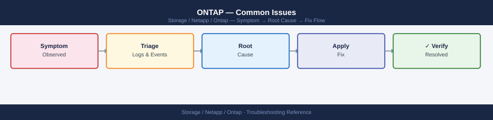

---
tags:
  - netapp
  - troubleshooting
search:
  boost: 2
---
# ONTAP — Common Issues

<div class="kb-summary">
Common Issues reference covering Incident Triage Decision Tree, Quick Reference, Volume Full / Write Errors, Aggregate Capacity Critical, SnapMirror Lag / Unhealthy Relationship and 6 more sections.

*Applies to: ONTAP 9.x*
</div>


```d2
direction: down

symptom: Identify Symptom {shape: diamond}
diagnostic_flow: "Diagnostic Flow" {shape: rectangle}
incident_triage_decision_tree: "Incident Triage Decision Tree" {shape: rectangle}
quick_reference: "Quick Reference" {shape: rectangle}
volume_full_write_errors: "Volume Full / Write Errors" {shape: rectangle}
aggregate_capacity_critical: "Aggregate Capacity Critical" {shape: rectangle}
snapmirror_lag_unhealthy_relationshi: "SnapMirror Lag / Unhealthy Relationship" {shape: rectangle}
resolution: Resolve or Escalate {shape: oval}

symptom -> diagnostic_flow: investigate
symptom -> incident_triage_decision_tree: investigate
symptom -> quick_reference: investigate
symptom -> volume_full_write_errors: investigate
symptom -> aggregate_capacity_critical: investigate
symptom -> snapmirror_lag_unhealthy_relationshi: investigate
diagnostic_flow -> resolution
incident_triage_decision_tree -> resolution
quick_reference -> resolution
volume_full_write_errors -> resolution
aggregate_capacity_critical -> resolution
snapmirror_lag_unhealthy_relationshi -> resolution
```

## Diagnostic Flow

```d2
direction: right

S: "What is the symptom?" {shape: rectangle}
A: "Volume offline or write errors" {shape: rectangle}
B: "NFS/CIFS share inaccessible" {shape: rectangle}
C: "Aggregate capacity critical" {shape: rectangle}
D: "SnapMirror lag / broken relationship" {shape: rectangle}
E: "Node takeover not triggering" {shape: rectangle}
A1: "A1" {shape: rectangle}
A2: "Bring online — see Volume Full / Write Errors" {shape: rectangle}
A3: "Check autogrow and snapshot reserve" {shape: rectangle}
B1: "B1" {shape: rectangle}
B2: "Check LIF and export policy — see NFS Mount Hangs" {shape: rectangle}
B3: "Check AD join and CIFS server — see SMB/CIFS Share\nInaccessible" {shape: rectangle}
C1: "C1" {shape: rectangle}
C2: "Move volumes or add disks — see Aggregate Capacity\nCritical" {shape: rectangle}
C3: "Check volume snapshot reserves" {shape: rectangle}
D1: "D1" {shape: rectangle}
D2: "Resume or resync — see SnapMirror Lag / Unhealthy\nRelationship" {shape: rectangle}
D3: "Check throttle and intercluster LIF" {shape: rectangle}
E1: "E1" {shape: rectangle}
E2: "Re-enable failover — see Storage Failover Not\nTriggering" {shape: rectangle}
E3: "Check cluster interconnect and heartbeat" {shape: rectangle}

S -> A
S -> B
S -> C
S -> D
S -> E
A1 -> A2
A1 -> A3
B1 -> B2
B1 -> B3
C1 -> C2
C1 -> C3
D1 -> D2
D1 -> D3
E1 -> E2
E1 -> E3
```

---

## Before you begin

- **Access:** Storage admin credentials (cluster admin or equivalent)
- **Gather first:** recent error message text, event timestamps, and affected object names
- **Scope:** confirm whether the issue affects a single object, host, cluster, or site
- **Escalation:** open a vendor support ticket before running any destructive step
- **Logging:** document each command and output — required if escalation is needed

---

## Incident Triage Decision Tree

```d2
direction: right

incident: "Incident Reported" {shape: rectangle}
clusterOk: "cluster show\nAll nodes healthy?" {shape: rectangle}
haCheck: "storage failover show\nHA takeover active?" {shape: rectangle}
waitGiveback: "Wait for auto-giveback\nor run manual giveback" {shape: rectangle}
nodeDown: "Node down — check\ncluster ping-cluster\nhardware / power" {shape: rectangle}
diskOk: "storage disk show -broken\nAny broken disks?" {shape: rectangle}
diskIssue: "Check RAID state\nstorage aggregate show-status\nCheck spares available" {shape: rectangle}
volOk: "volume show -state !online\nAny offline volumes?" {shape: rectangle}
volIssue: "Bring volume online\ncheck aggregate state" {shape: rectangle}
protocol: "Which protocol is failing?" {shape: rectangle}
nfsCheck: "network interface show\nnfs connected-client show\ncheck export policy" {shape: rectangle}
smbCheck: "vserver cifs show\nvserver cifs domain info\ncheck AD connectivity" {shape: rectangle}
iscsCheck: "iscsi session show\nlun mapping show\nmultipath on host" {shape: rectangle}
smCheck: "snapmirror show -health false\ncheck intercluster LIF\ncheck throttle" {shape: rectangle}

incident -> clusterOk
clusterOk -> haCheck
haCheck -> waitGiveback
haCheck -> nodeDown
clusterOk -> diskOk
diskOk -> diskIssue
diskOk -> volOk
volOk -> volIssue
volOk -> protocol
protocol -> nfsCheck
protocol -> smbCheck
protocol -> iscsCheck
protocol -> smCheck
```

## Quick Reference

| Symptom | Likely Cause | Action |
|---|---|---|
| Volume full / write errors to hosts | Volume space exhausted; autogrow not configured or hit max | `volume show -fields used-percent,autosize-mode`; increase max-autosize or delete old snapshots with `snapshot delete` |
| Aggregate nearly full (>90%) | Thin-provisioned volumes grew beyond aggregate free space | `storage aggregate show`; move volumes with `volume move start` or reduce snapshot reserves |
| SnapMirror lag exceeding RPO | Network bandwidth contention, dedupe/SnapMirror scheduling conflict, or throttle active | `snapmirror show -fields lag-time,transfer-bytes`; adjust schedule; check `snapmirror config-replication show` |
| NFS mount hangs after SP takeover | Stale NFS lock; automount not recovering after LIF migration | Verify LIF on correct port: `network interface show`; unmount and remount on client; check NFS grace period |
| iSCSI session dropped | LIF failover changed IP; host iSCSI initiator did not reconnect | `iscsi session show`; confirm LIF IP stability; rescan iSCSI on host; verify multipath (`multipath -ll` on Linux) |
| Node takeover not auto-triggering | Storage failover disabled or partner unreachable | `storage failover show`; check cluster interconnect with `cluster ping-cluster -node <node>`; verify `options cf.mode` |
| SMB/CIFS shares inaccessible | CIFS server stopped or Kerberos ticket issue with Active Directory | `vserver cifs show`; `vserver cifs domain info -vserver <svm>`; verify AD connectivity and DNS resolution |
| Slow NFS performance | Jumbo frames not configured end-to-end, or QoS ceiling throttling workload | Check MTU on ONTAP ports (`network port show -fields mtu`) and switches; review QoS stats: `qos statistics performance show` |
| Volume move failing mid-way | Destination aggregate too full, or a cutover window was missed | `volume move show`; check destination aggregate space; re-run `volume move start` with `-cutover-window` extended |
| EMS callhome alerts firing | Disk failure, RAID degraded, or hardware fault | `storage disk show -broken`; `storage aggregate show -state degraded`; check `system health alert show` |

---

## Volume Full / Write Errors

### Symptoms

- Hosts receive write errors or I/O timeouts
- Applications report filesystem full errors
- NFS clients return `No space left on device`
- iSCSI/FC hosts receive SCSI reservation conflicts or status check conditions

### Diagnosis

```bash
# Identify volumes at or near capacity
volume show -fields volume,vserver,used-percent,size,available,autosize-mode

# Check if autogrow is configured and its limits
volume show -vserver <svm> -volume <vol> -fields autosize-mode,max-autosize,grow-threshold-percent

# Check snapshot reserve consumption — snapshots can fill volume space
volume show -vserver <svm> -volume <vol> -fields snapshot-percent,snapshot-count

# List snapshots by size (largest first)
volume snapshot show -vserver <svm> -volume <vol> -fields size,create-time | sort -k2 -rn

# Check aggregate available space — thin volumes must have aggregate backing
storage aggregate show -fields aggr-name,available,percent-used
```


```text title="Expected output"
Volume       Vserver      Used%  Size       Available  Autosize-Mode
-----------  -----------  -----  ---------  ---------  ---------------
vol_data_01  svm_prod     87%    500GB      65GB       grow
vol_logs_02  svm_prod     94%    200GB      12GB       off
vol_backup   svm_dr       45%    1TB        550GB      grow
vol_temp_03  svm_dev      72%    100GB      28GB       off

Autosize-Mode  Max-Autosize  Grow-Threshold-Percent
--------------  -----------  ----------------------
grow            600GB        80%

Snapshot-Percent  Snapshot-Count
-----------------  ---------------
18%                247

Volume Snapshot                    Size       Create-Time
------  ---------------------------  ---------  -------------------------
vol_data_01  hourly.2024-01-15_0600  8.2GB      Jan 15 06:00:15 +0000
vol_data_01  hourly.2024-01-15_0500  7.9GB      Jan 15 05:00:22 +0000
vol_data_01  daily.2024-01-14        12.1GB     Jan 14 00:00:08 +0000
vol_data_01  weekly.2024-01-08       15.3GB     Jan 08 00:00:03 +0000

Aggregate      Available  Percent-Used
-----------    ---------  -----------
aggr_ssd_01    120GB      78%
aggr_ssd_02    340GB      62%
aggr_sas_01    85GB       81%
aggr_sas_02    450GB      55%
```

!!! warning "Common errors"
    **`Error: command failed: No such vserver <svm>`** — Verify the SVM name with `vserver show` and use the exact name from the Vserver column.
    **`Error: command failed: No such volume <vol>`** — Confirm the volume exists on the target SVM using `volume show -vserver <svm>` before running field-specific queries.
### Resolution

```bash
# Option 1 — Increase volume size immediately
volume size -vserver <svm> -volume <vol> -new-size 500G

# Option 2 — Enable or extend autogrow
volume modify -vserver <svm> -volume <vol> \
    -autosize-mode grow_shrink \
    -max-autosize 1T \
    -grow-threshold-percent 85

# Option 3 — Delete old or unnecessary snapshots
volume snapshot show -vserver <svm> -volume <vol>
volume snapshot delete -vserver <svm> -volume <vol> -snapshot <snap_name>

# Delete all non-busy snapshots (use with caution)
volume snapshot delete -vserver <svm> -volume <vol> -snapshot * -force true

# Option 4 — Reduce snapshot reserve percentage
volume modify -vserver <svm> -volume <vol> -percent-snapshot-space 10

# Option 5 — Run deduplication to reclaim space
volume efficiency start -vserver <svm> -volume <vol> -scan-all true
```


```text title="Expected output"
cluster1::> volume size -vserver svm_prod -volume vol_data -new-size 500G
Volume modify successful: volume "vol_data" size set to 500GB.

cluster1::> volume modify -vserver svm_prod -volume vol_data -autosize-mode grow_shrink -max-autosize 1T -grow-threshold-percent 85
Volume modify successful: volume "vol_data" autogrow enabled.

cluster1::> volume snapshot show -vserver svm_prod -volume vol_data
Vserver  Volume   Snapshot                                  State    Busy
-------- -------- ----------------------------------------- -------- ------
svm_prod vol_data hourly.2024-01-15_0500                    valid    false
svm_prod vol_data hourly.2024-01-15_0400                    valid    false
svm_prod vol_data daily.2024-01-14_0000                     valid    false
svm_prod vol_data weekly.2024-01-08_0000                    valid    false
svm_prod vol_data nightly_backup.2024-01-14_2200            valid    true

cluster1::> volume snapshot delete -vserver svm_prod -volume vol_data -snapshot hourly.2024-01-15_0400
Snapshot deleted successfully.

cluster1::> volume modify -vserver svm_prod -volume vol_data -percent-snapshot-space 10
Volume modify successful: snapshot reserve set to 10%.

cluster1::> volume efficiency start -vserver svm_prod -volume vol_data -scan-all true
Efficiency operation started on volume "vol_data" (UUID: a1b2c3d4-e5f6-7890-abcd-ef1234567890).
```

!!! warning "Common errors"
    **`Error: entry doesn't have a value for field "snapshot"`** — Specify the exact snapshot name or use `*` with `-force true` to delete all non-busy snapshots.
    **`Error: volume is currently involved in a SnapMirror transfer`** — Wait for the active SnapMirror operation to complete before modifying volume properties or deleting snapshots.
    **`Error: cannot set max-autosize to a value smaller than current volume size`** — Set `-max-autosize` to a value larger than the current volume size (e.g., 1T for a 500G volume).
### Prevention

- Enable autogrow with an explicit maximum on all production volumes
- Set volume snapshot reserve to 10–15% for active volumes; reduce to 5% on volumes with SnapMirror (destination retains snaps separately)
- Monitor volume capacity daily and alert at 80%
- Configure EMS email alerts for `wafl.vol.full` and `wafl.vol.autoSize.fail`

---

## Aggregate Capacity Critical

### Symptoms

- `storage aggregate show` shows aggregate above 90% used
- Volume autogrow fails because aggregate is full
- New volume creation fails with "No space available in aggregate"
- ONTAP issues EMS events: `aggr.nearly.full`, `aggr.full`

### Diagnosis

```bash
# Show all aggregates with usage
storage aggregate show -fields aggr-name,node,available,size,percent-used,state

# Show per-aggregate space breakdown including snapshot reserve
storage aggregate show-space -aggregate <aggr_name>

# Identify which volumes are consuming space
volume show -aggregate <aggr_name> -fields volume,vserver,size,used,percent-used

# Check for volumes with large snapshot reserves
volume show -aggregate <aggr_name> -fields volume,snapshot-percent,percent-used

# Identify volumes with large unused space (candidate for move)
volume show -aggregate <aggr_name> -fields volume,size,used,available | sort -k4
```


```text title="Expected output"
Aggregate                Node            Available         Size Percent Used State
aggr0                   node-01         45.2GB            500GB       90%      online
aggr1                   node-02         120.5GB           2TB         94%      online
aggr2                   node-01         8.3GB             1TB         99%      online
aggr3                   node-02         250.1GB           4TB         94%      online

Physical Used       Physical Reserved  Physical Total      Snapshot Reserve
450.2GB             50GB                500GB               5%

Volume              Vserver           Size      Used      Percent Used
vol_prod_01         vs_prod           500GB     485GB     97%
vol_prod_02         vs_prod           300GB     156GB     52%
vol_backup_01       vs_backup         1TB       920GB     92%
vol_test_01         vs_test           200GB     45GB      22%

Volume              Snapshot Percent  Percent Used
vol_prod_01         8%                97%
vol_prod_02         2%                52%
vol_backup_01       12%               92%
vol_test_01         15%               22%

Volume              Size      Used      Available
vol_test_01         200GB     45GB      155GB
vol_prod_02         300GB     156GB     144GB
vol_prod_01         500GB     485GB     15GB
vol_backup_01       1TB       920GB     104GB
```

!!! warning "Common errors"
    **`Error: command not found: storage aggregate show`** — Ensure you are connected to the ONTAP cluster via SSH or the ONTAP CLI, not a Linux shell.
    **`Error: There is no entry in the Compat database for command "storage aggregate show-space"`** — Verify your ONTAP version supports this command (available in ONTAP 9.1+); use `version` to check cluster version.
    **`Error: invalid fieldname "percent-used"`** — Use the correct field name `percent_used` (underscore instead of hyphen) in the -fields parameter.
### Resolution

```bash
# Option 1 — Move a volume to a less-full aggregate (non-disruptive)
volume move start -vserver <svm> -volume <vol> -destination-aggregate <dest_aggr>
volume move show -vserver <svm> -volume <vol>

# Option 2 — Add disks to the aggregate
storage aggregate add-disks -aggregate <aggr_name> -diskcount 4

# Confirm unassigned disks available
storage disk show -container-type unassigned

# Option 3 — Reduce snapshot reserves across volumes in the aggregate
volume modify -vserver <svm> -volume <vol> -percent-snapshot-space 5

# Option 4 — Run storage efficiency on all volumes in the aggregate
volume efficiency start -aggregate <aggr_name>
```


```text title="Expected output"
cluster1::> volume move start -vserver svm1 -volume vol_data01 -destination-aggregate aggr2
Operation started successfully.

cluster1::> volume move show -vserver svm1 -volume vol_data01
Vserver   Volume             State      Progress
--------- ------------------ ---------- ----------
svm1      vol_data01         running    28%

cluster1::> storage aggregate add-disks -aggregate aggr1 -diskcount 4
Added 4 disks to aggregate aggr1.

cluster1::> storage disk show -container-type unassigned
Disk       Container Type    Size      RPM   Checksum
---------- ----------------- --------- ----- ----------
1.0.1      unassigned        1.75TB    7200  block
1.0.2      unassigned        1.75TB    7200  block
1.0.3      unassigned        1.75TB    7200  block
1.0.4      unassigned        1.75TB    7200  block

cluster1::> volume modify -vserver svm1 -volume vol_data01 -percent-snapshot-space 5
Volume modify successful.

cluster1::> volume efficiency start -aggregate aggr1
Efficiency operation started on 6 volumes.
```

!!! warning "Common errors"
    **`Error: command failed: No unassigned disks available`** — Verify spare disks exist with `storage disk show -container-type spare` and ensure they are not reserved for RAID reconstruction.
    **`Error: volume move failed: Destination aggregate does not have sufficient space`** — Check destination aggregate free space with `storage aggregate show -fields usedsize,availsize` and select an aggregate with at least 120% of the source volume size.
    **`Error: Invalid percent-snapshot-space value: must be between 0 and 90`** — Use a snapshot reserve percentage within the valid range (typically 5–20% for production volumes).
---

## SnapMirror Lag / Unhealthy Relationship

### Symptoms

- `snapmirror show` reports `healthy: false`
- Lag time exceeds RPO threshold
- Transfer state stuck in `transferring` or `idle` unexpectedly
- EMS events: `snapmirror.dest.lag.warn`, `snapmirror.src.unreachable`

### Diagnosis

```bash
# Show all relationships with health and lag
snapmirror show -fields source-path,destination-path,lag-time,healthy,state,last-transfer-size

# Show only unhealthy relationships
snapmirror show -health false

# Check transfer history for failures
snapmirror history show -destination-path <dest_svm>:<dest_vol>

# Check for throttle limiting transfer speed
snapmirror config-replication show

# Check intercluster LIF connectivity between clusters
network interface show -role intercluster
cluster peer show

# Verify intercluster LIF reachability
network ping -lif <ic_lif> -vserver <cluster_admin_svm> -destination <remote_ic_lif_ip>
```


```text title="Expected output"
Source Path                Destination Path           Lag Time State    Healthy Last Transfer Size
------------------------   ------------------------   -------- -------- ------- ------------------
svm1:vol_data              svm2:vol_data_mirror       00:15:32 snapmirrored true   2.4GB
svm1:vol_logs              svm2:vol_logs_mirror       00:08:47 snapmirrored true   856MB
svm3:vol_archive           svm4:vol_archive_mirror    02:34:19 snapmirrored false  0B

Source Path                Destination Path           State
------------------------   ------------------------   --------
svm3:vol_archive           svm4:vol_archive_mirror    broken-off

Snapshot              Bytes Transferred  Duration   Result
-------------------  -----------------  ---------  ------
2024.01.15_0200       5.2GB              00:18:32   Success
2024.01.14_1400       0B                 00:02:15   Failed
2024.01.14_0600       4.8GB              00:16:47   Success

Vserver              Policy              Throttle (KB/s)  RPO (minutes)
-------------------  -----------------  ---------------  ---------------
svm1                 DPDefault           Unlimited        60
svm3                 DPDefault           51200            60

Interface Name       IP Address          Role         Status
-------------------  ------------------  -----------  ------
cluster1_ic_lif1     192.168.100.45      intercluster up
cluster1_ic_lif2     192.168.100.46      intercluster up
cluster2_ic_lif1     192.168.101.50      intercluster up
cluster2_ic_lif2     192.168.101.51      intercluster down

Peer Cluster         Peer Address        Status
-------------------  ------------------  --------
cluster2             192.168.101.50      available

PING 192.168.101.50 (192.168.101.50): 56 data bytes
64 bytes from 192.168.101.50: icmp_seq=0 ttl=64 time=2.341 ms
64 bytes from 192.168.101.50: icmp_seq=1 ttl=64 time=2.287 ms
64 bytes from 192.168.101.50: icmp_seq=2 ttl=64 time=2.415 ms
```

!!! warning "Common errors"
    **`Error: command failed: No snapmirror relationships found`** — Verify the source and destination paths exist and the snapmirror relationship has been initialized with `snapmirror initialize -source-path <src> -destination-path <dst>`.
    **`Error: network ping: failed to resolve destination address`** — Confirm the remote intercluster LIF IP address is correct and reachable by checking `cluster peer show` and verifying firewall rules allow ICMP traffic on port 10000-10001.
    **`Error: command failed: Intercluster LIF is not configured`** — Create an intercluster LIF on both clusters using `network interface create -vserver <admin_svm> -lif <lif_name> -role intercluster -home-node <node> -home-port <port> -address <ip> -netmask
### Resolution

```bash
# Resume a quiesced relationship
snapmirror resume -destination-path <dest_svm>:<dest_vol>

# Force a manual update to catch up on lag
snapmirror update -destination-path <dest_svm>:<dest_vol>

# Abort a stuck transfer and restart
snapmirror abort -destination-path <dest_svm>:<dest_vol>
snapmirror update -destination-path <dest_svm>:<dest_vol>

# If relationship is broken-off (after a failover), resync it
snapmirror resync -destination-path <dest_svm>:<dest_vol>

# Remove a throttle if one is limiting transfer speed
snapmirror modify -destination-path <dest_svm>:<dest_vol> -throttle unlimited

# Re-initialize from scratch (only if relationship is corrupt — destructive)
snapmirror initialize -destination-path <dest_svm>:<dest_vol>
```


```text title="Expected output"
Operation succeeded: SnapMirror relationship for "dr_svm:dr_vol01" resumed.
Operation succeeded: SnapMirror update started for destination "dr_svm:dr_vol01".
Operation succeeded: SnapMirror transfer aborted for destination "dr_svm:dr_vol01".
Operation succeeded: SnapMirror update started for destination "dr_svm:dr_vol01".
Operation succeeded: SnapMirror relationship for "dr_svm:dr_vol01" resynchronized.
Operation succeeded: SnapMirror modify operation completed for destination "dr_svm:dr_vol01".
Operation succeeded: SnapMirror initialize started for destination "dr_svm:dr_vol01".
```

!!! warning "Common errors"
    **`Error: command failed: There is no SnapMirror relationship for destination "dr_svm:dr_vol01"`** — Verify the destination SVM and volume names are correct using `snapmirror show`.
    **`Error: command failed: SnapMirror relationship is in "broken-off" state and cannot be resumed`** — Use `snapmirror resync` instead of `snapmirror resume` for broken-off relationships.
    **`Error: command failed: Transfer is already in progress for destination "dr_svm:dr_vol01"`** — Wait for the current transfer to complete or use `snapmirror abort` before issuing a new update command.
---

## NFS Mount Hangs / Stale Lock After Failover

### Symptoms

- NFS clients hang indefinitely after a node failover (HA takeover or SP switchover)
- `df` or any file access on the mount hangs
- Linux clients show processes in `D` state (uninterruptible wait)
- Automount does not recover after LIF migration

### Diagnosis

```bash
# Verify the LIF is online and on the correct port
network interface show -vserver <svm> -fields lif,address,curr-node,curr-port,status-oper

# Check if the LIF is on its home port (takeover may have migrated it)
network interface show -vserver <svm> -fields lif,home-node,home-port,curr-node,curr-port

# Check NFS grace period state (clients waiting for lock reclaim)
# Grace period is typically 45 seconds after failover
nfs show -vserver <svm> -fields grace-period

# Check for connected NFS clients
nfs connected-client show -vserver <svm>

# Check export policy — did it change during failover?
vserver export-policy show -vserver <svm>
```


```text title="Expected output"
cluster1::> network interface show -vserver nfs_svm -fields lif,address,curr-node,curr-port,status-oper
Vserver     LIF            Address         Curr-Node       Curr-Port Status-Oper
----------- -------------- --------------- --------------- --------- -----------
nfs_svm     nfs_lif_01     192.168.1.45    node-01         e0d       up
nfs_svm     nfs_lif_02     192.168.1.46    node-02         e0d       up

cluster1::> network interface show -vserver nfs_svm -fields lif,home-node,home-port,curr-node,curr-port
Vserver     LIF            Home-Node       Home-Port Curr-Node       Curr-Port
----------- -------------- --------------- --------- --------------- ---------
nfs_svm     nfs_lif_01     node-01         e0d       node-02         e0c
nfs_svm     nfs_lif_02     node-02         e0d       node-02         e0d

cluster1::> nfs show -vserver nfs_svm -fields grace-period
Vserver Grace-Period
------- ---------------
nfs_svm 0 seconds

cluster1::> nfs connected-client show -vserver nfs_svm
Vserver Client-IP       Protocol Version State
------- --------------- -------- ------- -------
nfs_svm 10.50.12.88     tcp      nfs3    connected
nfs_svm 10.50.12.89     tcp      nfs4    connected
nfs_svm 10.50.12.90     tcp      nfs4    connected

cluster1::> vserver export-policy show -vserver nfs_svm
Vserver         Policy Name
--------------- ----------------
nfs_svm         default
nfs_svm         prod_exports
nfs_svm         backup_exports
```

!!! warning "Common errors"
    **`Error: command failed: Invalid field "status-oper" for "network interface show"`** — Use `status-admin` and `status-oper` as separate queries, or check ONTAP version compatibility for field names.
    **`Error: There is no data to display`** — Verify the SVM name is correct with `vserver show` and confirm NFS is licensed and enabled on the SVM.
    **`Error: command failed: Invalid vserver name "nfs_svm"`** — Confirm the SVM exists and you are connected to the correct cluster with `vserver show`.
### Resolution

On the storage side:

```bash
# Revert LIF to home port if it migrated during failover
network interface revert -vserver <svm> -lif <lif_name>

# Verify LIF is accessible from the client IP
network ping -lif <lif_name> -vserver <svm> -destination <client_ip>
```


```text title="Expected output"
Reverting LIF "data_lif01" on Vserver "prod_svm" to home port...
LIF data_lif01 successfully reverted to home port e0a on node cluster-01.

PING data_lif01 (192.168.1.45) from 192.168.1.45: 56 data bytes
64 bytes from 192.168.1.45: icmp_seq=0 ttl=64 time=0.891 ms
64 bytes from 192.168.1.45: icmp_seq=1 ttl=64 time=0.756 ms
64 bytes from 192.168.1.45: icmp_seq=2 ttl=64 time=0.823 ms
64 bytes from 192.168.1.45: icmp_seq=3 ttl=64 time=0.712 ms
4 packets transmitted, 4 packets received, 0% packet loss
```

!!! warning "Common errors"
    **`Error: "data_lif01" does not exist`** — Verify the LIF name is correct and exists on the specified Vserver using `network interface show -vserver <svm>`.
    **`Error: LIF data_lif01 is administratively down`** — Bring the LIF online with `network interface modify -vserver <svm> -lif <lif_name> -status-admin up` before reverting.
    **`PING: sendto: No route to host`** — Ensure the client IP is reachable and on the same network segment as the LIF, or check firewall rules blocking ICMP traffic.
On the NFS client side:
```bash
# Force unmount a hung NFS mount (lazy unmount)
umount -f -l /mnt/data

# Remount after confirming LIF is accessible
mount -t nfs <lif_ip>:/vol/data /mnt/data

# For automount, bounce the autofs service
systemctl restart autofs
```


```text title="Expected output"
(no output — command completes silently)
(no output — command completes silently)
Stopping automount service... done.
Starting automount service... done.
```

!!! warning "Common errors"
    **`umount: /mnt/data: target is busy`** — Use `lsof /mnt/data` to identify processes holding the mount, kill them, then retry the lazy unmount.
    **`mount.nfs: Connection timed out`** — Verify the LIF IP is reachable with `ping <lif_ip>` and confirm the NFS export exists on the NetApp array with `ssh admin@<netapp_ip> volume show`.
    **`Failed to restart autofs.service: Unit autofs.service not found`** — Install autofs with `apt-get install autofs` (Debian/Ubuntu) or `yum install autofs` (RHEL/CentOS), then retry the systemctl restart.
If NFSv4 state is stale, the NFS server grace period (default 45 seconds) must expire before new locks are granted. Do not reboot NFS clients during the grace period — this resets their lock reclaim timer.

---

## iSCSI Session Dropped / Host Cannot Access LUN

### Symptoms

- Host multipath shows one or more paths failed
- `iscsiadm -m session` shows disconnected sessions
- Block I/O errors in Linux dmesg: `device-mapper: multipath: Failing path`
- Windows Disk Management shows disk offline

### Diagnosis

```bash
# Check iSCSI sessions from ONTAP side
iscsi session show -vserver <svm>
iscsi session show -vserver <svm> -fields initiator-name,tpgroup,lif

# Check iSCSI LIFs are operational
network interface show -vserver <svm> -data-protocol iscsi

# Verify LUN is online and mapped
lun show -vserver <svm> -fields path,state,mapped
lun mapping show -vserver <svm>

# Check igroup has the correct initiator IQN
lun igroup show -vserver <svm>
```


```text title="Expected output"
Vserver    Session ID  Initiator Name                          Target Name                             TSIH
---------- ----------- --------------------------------------- --------------------------------------- ------
svm-prod   1           iqn.1991-05.com.example:host01.local    iqn.1992-08.com.netapp:sn.a1b2c3d4e5f6 65535
svm-prod   2           iqn.1991-05.com.example:host02.local    iqn.1992-08.com.netapp:sn.a1b2c3d4e5f6 65534

Vserver    Initiator Name                          Tpgroup
---------- --------------------------------------- -------
svm-prod   iqn.1991-05.com.example:host01.local    default
svm-prod   iqn.1991-05.com.example:host02.local    default

Vserver    Lif                 Status      Data Protocol
---------- ------------------- ----------- ---------------
svm-prod   iscsi_lif_01        up          iscsi
svm-prod   iscsi_lif_02        up          iscsi

Vserver    Path                                    State    Mapped
---------- --------------------------------------- -------- ------
svm-prod   /vol/lun_vol_01/lun_01                 online   yes
svm-prod   /vol/lun_vol_02/lun_02                 online   yes

Vserver    Igroup Name         Protocol  OS Type   Initiators
---------- ------------------- --------- --------- -----------------------------------------------
svm-prod   igroup_linux_01     iscsi     linux     iqn.1991-05.com.example:host01.local
svm-prod   igroup_linux_02     iscsi     linux     iqn.1991-05.com.example:host02.local
```

!!! warning "Common errors"
    **`Error: "No iSCSI sessions found for Vserver <svm>"`** — Verify the initiator is connected and the target portal group is reachable using `iscsi connection show`.
    **`Error: "LUN is offline"`** — Check the volume status with `volume show -vserver <svm>` and verify the aggregate is online.
    **`Error: "Initiator IQN not found in igroup"`** — Add the missing initiator IQN to the igroup using `lun igroup add -vserver <svm> -igroup <igroup_name> -initiator <iqn>`.
### Resolution

```bash
# Bring a LUN back online if it went offline
lun online -vserver <svm> -path /vol/<vol>/<lun_name>

# Verify iSCSI service is running on the SVM
iscsi show -vserver <svm>
iscsi modify -vserver <svm> -is-admin-enabled true
```


```text title="Expected output"
LUN /vol/data_vol/lun_prod_01 brought online.

Vserver: svm_prod_01
Admin Enabled: true
Status: running
Node: cluster-01-01
Target Alias: svm_prod_01.iscsi.local
Allowed Initiators: ALL
Authentication Type: CHAP
CHAP Inbound Username: initiator_user
...

(no output — command completes silently)
```

!!! warning "Common errors"
    **`Error: command failed: LUN /vol/data_vol/lun_prod_01 is not found`** — Verify the volume and LUN names exist with `lun show -vserver <svm>` and correct the path syntax.
    **`Error: command failed: Vserver <svm> does not exist`** — Confirm the SVM name is correct by running `vserver show` to list all available SVMs.
    **`Error: command failed: LUN /vol/data_vol/lun_prod_01 is already online`** — This is informational; the LUN is already in the desired state and no action is needed.
On the Linux host:
```bash
# Rescan iSCSI targets
iscsiadm -m session --rescan

# Log back into a target after network recovery
iscsiadm -m node -T <iqn.target> -p <lif_ip>:3260 --login

# Rescan SCSI bus to pick up re-connected LUN
rescan-scsi-bus.sh
multipath -r     # reload multipath maps
```


```text title="Expected output"
Scanning for new I/O devices...
iSCSI Connection: [1] 10.48.12.45:3260,1 iqn.1992-08.com.netapp:sn.a1b2c3d4e5f6 (non-flash)
iSCSI Connection: [2] 10.48.12.46:3260,1 iqn.1992-08.com.netapp:sn.a1b2c3d4e5f6 (non-flash)
Rescanning existing sessions
Session [sid=1, target=iqn.1992-08.com.netapp:sn.a1b2c3d4e5f6, portal=10.48.12.45,3260]
	Rescanning session [1]
Logging in to [iface: default, target: iqn.1992-08.com.netapp:sn.a1b2c3d4e5f6, portal: 10.48.12.46,3260]
Login to [iface: default, target: iqn.1992-08.com.netapp:sn.a1b2c3d4e5f6, portal: 10.48.12.46,3260] successful.
Scanning for new I/O devices...
Scanning host 3 for new devices
Scanning host 4 for new devices
Scanning host 5 for new devices
Found new device(s) on host 3: sdc (36001405a1b2c3d4e5f6g7h8i9j0k1l2)
Found new device(s) on host 4: sdd (36001405a1b2c3d4e5f6g7h8i9j0k1l3)
Reconfiguring multipath devices
mpatha (36001405a1b2c3d4e5f6g7h8i9j0k1l2) dm-0 NETAPP,LUN
size=500G features='3 queue_if_no_path pg_init_retries 50' hwhandler='1 alua' wp=rw
mpathb (36001405a1b2c3d4e5f6g7h8i9j0k1l3) dm-1 NETAPP,LUN
size=250G features='3 queue_if_no_path pg_init_retries 50' hwhandler='1 alua' wp=rw
```

!!! warning "Common errors"
    **`iscsiadm: No records found`** — Verify the target IQN and portal IP are correct, and that the iSCSI daemon is running with `systemctl status iscsid`.
    **`rescan-scsi-bus.sh: command not found`** — Install the sg3-utils package with `apt-get install sg3-utils` or `yum install sg3-utils`.
    **`multipathd: error in blacklist section`** — Check `/etc/multipath.conf` for syntax errors and reload the daemon with `systemctl restart multipathd`.
---

## Storage Failover (HA) Not Triggering

### Symptoms

- A node fails but the partner does not automatically take over
- `storage failover show` shows `Disabled` or `Disconnected`
- Cluster shows one node unreachable but storage is not serving from the surviving node

### Diagnosis

```bash
# Check HA failover state on all nodes
storage failover show

# Expected output: Enabled = true, State = Connected

# Check cluster interconnect (heartbeat link)
cluster ping-cluster -node <node_name>

# Check HA interconnect port state
network port show -node <node_name> -fields port,health-status,link-status

# Check if failover is manually disabled
storage failover show -fields node,enabled,mode
```


```text title="Expected output"
Node           Partner        State      HA-Configured
-------------- -------------- ---------- ---------------
node-01        node-02        Connected  true
node-02        node-01        Connected  true

Cluster Ping to node-02 (10.0.1.45):
  Sent 5, Received 5, Lost 0%
  Min/Avg/Max/Stddev = 0.842/1.156/2.104/0.487 ms

Cluster Ping to node-01 (10.0.1.44):
  Sent 5, Received 5, Lost 0%
  Min/Avg/Max/Stddev = 0.756/0.998/1.892/0.401 ms

Node  Port      Health-Status Link-Status
----- --------- ------------- -----------
node-01 e0a    healthy       up
node-01 e0b    healthy       up
node-02 e0a    healthy       up
node-02 e0b    healthy       up

Node           Enabled Mode
-------------- ------- ----
node-01        true    HA
node-02        true    HA
```

!!! warning "Common errors"
    **`Error: command not found: storage failover show`** — Verify you are connected to the cluster management interface and have cluster admin privileges.
    **`Cluster Ping to <node> (<ip>): Sent 5, Received 0, Lost 100%`** — Check network connectivity and HA interconnect cables; verify the target node is online with `cluster show`.
    **`Node           Enabled Mode`** `node-01        false   HA` — Re-enable failover with `storage failover modify -node <node_name> -enabled true` if failover was manually disabled.
### Resolution

```bash
# Re-enable storage failover if it was disabled
storage failover modify -node <node_name> -enabled true

# Trigger a manual takeover (planned maintenance)
storage failover takeover -ofnode <node_to_take_over>

# After node recovery, return ownership
storage failover giveback -ofnode <node_name>

# Force giveback if stuck in partial state
storage failover giveback -ofnode <node_name> -require-partner-waiting false
```


```text title="Expected output"
Node: node-01
Takeover of node node-02 will commence in 10 seconds...
Waiting for node node-02 to halt...
Takeover complete. Node node-02 is now halted.
node-01> storage failover modify -node node-02 -enabled true
(no output — command completes silently)
node-01> storage failover giveback -ofnode node-02
Waiting for node node-02 to boot...
Giveback of aggregates from node-01 to node-02 complete.
node-01>
```

!!! warning "Common errors"
    **`Error: node node-02 is not in a halted state`** — Ensure the node has fully shut down before attempting giveback, or use `system node halt -node <node_name>` to force shutdown.
    **`Error: storage failover is not enabled for node node-01`** — Run `storage failover modify -node <node_name> -enabled true` on both nodes to enable failover before takeover.
    **`Error: giveback cannot proceed, aggregates are offline`** — Wait for aggregates to come online using `storage aggregate show` to verify state, or manually bring them online with `storage aggregate online -aggregate <name>`.
---

## SMB/CIFS Share Inaccessible

### Symptoms

- Windows clients receive "Network path not found" or "Access denied"
- CIFS shares disappear from browsing
- Kerberos errors in Windows event log

### Diagnosis

```bash
# Check CIFS server status and domain join health
vserver cifs show -vserver <svm>
vserver cifs domain info -vserver <svm>

# Check for Active Directory connectivity issues
vserver cifs check -vserver <svm>

# Check CIFS sessions — are any clients connected?
vserver cifs session show -vserver <svm>

# Verify the CIFS LIF is operational
network interface show -vserver <svm> -data-protocol cifs

# Check if the SVM is running
vserver show -vserver <svm> -fields state
```


```text title="Expected output"
Vserver       CIFS Server    Domain/Workgroup Comment
------------- -------------- --------------- ---------
svm-prod-01   CIFS-SVM-01    corp.example.com Configured

Vserver       Domain              Trusted Domains
------------- ------------------- ----------------
svm-prod-01   corp.example.com    child.corp.example.com

CIFS server check for vserver "svm-prod-01":
  DNS: OK
  LDAP: OK
  Kerberos: OK
  Active Directory: OK

Vserver       Node            Session ID  Client IP      User Name              Connected Time
------------- --------------- ----------- -------------- ---------------------- ----------------
svm-prod-01   node-01         1           192.168.10.45  CORP\jsmith            2h 15m 32s
svm-prod-01   node-01         2           192.168.10.67  CORP\mchen             1h 8m 19s

Vserver       Interface       IP Address      Status  MTU
------------- --------------- --------------- ------- -----
svm-prod-01   cifs_lif_01     10.50.20.15     up      1500
svm-prod-01   cifs_lif_02     10.50.20.16     up      1500

Vserver       State
------------- -------
svm-prod-01   running
```

!!! warning "Common errors"
    **`CIFS server check for vserver "svm-prod-01": Active Directory: FAILED`** — Verify DNS resolution is working with `dns check -vserver <svm>` and confirm the CIFS server account password is synchronized with Active Directory.
    **`vserver cifs show: There is no data to display`** — Create a CIFS server configuration on the SVM using `vserver cifs create -vserver <svm> -cifs-server <server-name> -domain <domain-name>`.
    **`network interface show: There is no data to display`** — Create a CIFS data LIF on the SVM with `network interface create -vserver <svm> -lif <lif-name> -role data -data-protocol cifs -home-node <node> -home-port <port> -address <ip> -netmask <mask>`.
### Resolution

```bash
# Start the SVM if it is stopped
vserver start -vserver <svm>

# Re-join Active Directory if the machine account is broken
vserver cifs delete -vserver <svm>
vserver cifs create -vserver <svm> -cifs-server <netbios_name> \
    -domain <domain.corp> -ou "OU=Servers,DC=domain,DC=corp"

# Reset the CIFS machine account password (requires Domain Admin)
vserver cifs password -vserver <svm>

# Verify DNS resolution from the SVM
vserver services name-service dns check -vserver <svm>

# Disable SMB1 if legacy clients cause negotiation failures
vserver cifs options modify -vserver <svm> -smb1-enabled false
```


```text title="Expected output"
SVM "svm_prod_01" started successfully.
CIFS configuration deleted for SVM "svm_prod_01".
CIFS server "NETAPP-SVM01" created successfully for domain "domain.corp".
CIFS machine account password reset for SVM "svm_prod_01".
Vserver "svm_prod_01" DNS Check
    Vserver Name: svm_prod_01
    Nameserver: 10.20.30.40
    Query FQDN: svm_prod_01.domain.corp
    Query Result: successful
    Nameserver: 10.20.30.41
    Query FQDN: svm_prod_01.domain.corp
    Query Result: successful
SMB1 disabled for CIFS server "NETAPP-SVM01" on SVM "svm_prod_01".
```

!!! warning "Common errors"
    **`Error: command failed: CIFS configuration already exists for SVM "svm_prod_01"`** — Delete the existing CIFS configuration with `vserver cifs delete -vserver <svm>` before creating a new one.
    **`Error: DNS name resolution failed for domain.corp`** — Verify DNS nameservers are configured on the SVM with `vserver services name-service dns modify -vserver <svm> -servers <ip1>,<ip2>` and that the domain controller is reachable.
    **`Error: Failed to reset CIFS machine account password: Access Denied`** — Ensure the account running the command has Domain Admin privileges and the machine account exists in Active Directory.
---

## Disk Failure / RAID Degraded

### Symptoms

- `storage disk show -broken` lists one or more disks
- EMS event: `raid.config.phy.degraded`, `diskown.diskNotFound`
- `storage aggregate show-status` shows RAID group in `degraded` state

### Diagnosis

```bash
# List all broken disks
storage disk show -broken -fields disk,container-type,bay,shelf,node

# Check RAID status per aggregate
storage aggregate show-status -aggregate <aggr_name>

# Identify available spare disks for automatic RAID rebuild
storage disk show -container-type spare

# Check if reconstruction is already in progress
storage aggregate show -fields aggr-name,state,raid-status

# Get full disk details including location
storage disk show -fields disk,serial-number,bay,shelf,node,rpm,size
```


```text title="Expected output"
Disk            Container Type  Bay  Shelf  Node
--------------- --------------- ---- ------ --------
1.0.0           aggregate       0    0      node-01
1.0.1           aggregate       1    0      node-01
1.0.5           broken          5    0      node-01
1.0.8           broken          8    0      node-02
2.0.3           broken          3    1      node-02

                                    Aggregate Status
Name                State           RAID Status
------------------- --------------- ----------------
aggr1               online          raid_deg
aggr2               online          raid_ok
aggr3               degraded        raid_rebuilding

Disk            Container Type
--------------- ---------------
1.1.0           spare
1.1.1           spare
2.1.2           spare

Aggregate Name  State           RAID Status
--------------- --------------- ----------------
aggr1           online          raid_rebuilding
aggr2           online          raid_ok
aggr3           degraded        raid_rebuilding

Disk     Serial Number        Bay  Shelf  Node      RPM   Size
-------- -------------------- ---- ------ -------- ----- --------
1.0.0    SN0A1B2C3D4E5F6G7    0    0      node-01  7200  1.75TB
1.0.1    SN0F5E4D3C2B1A0G9    1    0      node-01  7200  1.75TB
1.0.5    SN0X9Y8Z7W6V5U4T3    5    0      node-01  7200  1.75TB
1.0.8    SN0M2L3K4J5I6H7G8    8    0      node-02  7200  1.75TB
2.0.3    SN0P9O8N7M6L5K4J3    3    1      node-02  7200  1.75TB
2.1.2    SN0A1B2C3D4E5F6G7    2    1      node-02  7200  1.75TB
```

!!! warning "Common errors"
    **`Error: command not found: storage`** — Ensure you are logged into the ONTAP cluster CLI (not the host shell) and have cluster admin privileges.
    **`Error: There is no entry in the Compat database for the specified aggregate <aggr_name>`** — Verify the aggregate name is correct by running `storage aggregate show` without the `-aggregate` parameter.
    **`Error: Access denied. You do not have permission to run this command`** — Confirm your user role includes "admin" or equivalent cluster-wide permissions using `security login show`.
### Resolution

ONTAP will automatically initiate RAID reconstruction when a spare disk is available. No manual intervention is needed for reconstruction to start.

```bash
# Confirm reconstruction is underway
storage disk show -raid-state reconstructing

# Mark a disk as failed if ONTAP has not done so automatically
storage disk fail -disk <disk_id>

# Unfail a disk if it was transiently removed and re-seated successfully
storage disk unfail -disk <disk_id>

# Assign an unassigned spare to replace a failed disk
storage disk assign -disk <spare_disk_id> -owner <node_name>
```


```text title="Expected output"
Disk     Aggregate  Container  RA    FSID State    Rebuild%
-----    ---------  ---------  --    ---- -----    --------
1.0.0    aggr0      shared     4K    N/A  reconstructing  12
1.0.1    aggr0      shared     4K    N/A  reconstructing  12
1.0.2    aggr1      shared     4K    N/A  reconstructing   8
1.0.3    -          -          4K    N/A  failed    0

Disk assignment successful. Disk 1.0.4 assigned to node-01.
```

!!! warning "Common errors"
    **`Error: command failed: disk <disk_id> is not in a failed state`** — Use `storage disk show` to verify the disk state before attempting to unfail it.
    **`Error: No spare disks available for assignment`** — Confirm spare disks exist with `storage disk show -container-type spare` and check node ownership constraints.
If no spare disks are available, RAID reconstruction cannot proceed. Escalate immediately — a second disk failure in the same RAID group will cause aggregate loss.

---

## Before Calling Support

1. Capture current cluster state: `cluster show`, `storage failover show`, `system health alert show`
2. Collect EMS events for the relevant timeframe: `event log show -time-range <start>..<end>`
3. Generate an AutoSupport: `system node autosupport invoke -node * -type all -message "case <number>"`
4. Note the exact ONTAP version: `system image show`
5. Record the hardware platform and serial numbers: `system node show -fields model,serial-number`
6. Describe the timeline of the issue — when it started, what changed (upgrade, config change, load change)
7. Have the NetApp support site login ready: [https://mysupport.netapp.com](https://mysupport.netapp.com)

---

## Verify resolution

- Confirm the original symptom no longer occurs
- Check logs for any residual errors related to the issue
- Monitor for 10–15 minutes to confirm the fix is stable

---

## See also

- [Ontap — Diagnostics](../diagnostics/)
- [Ontap — Escalation](../escalation/)
- [Ontap — Health Checks](../../operations/health-checks/)
