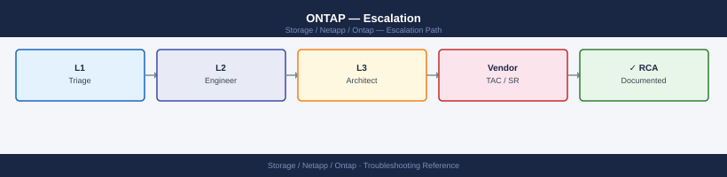
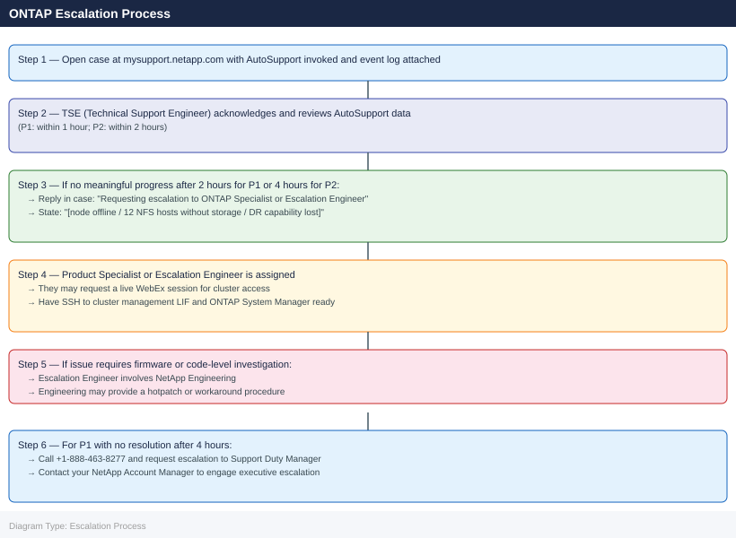

---
tags:
  - netapp
  - troubleshooting
search:
  boost: 1.5
description: "How to escalate NetApp ONTAP issues to NetApp support: what data to collect, how to invoke AutoSupport, step-by-step case creation on..."
---
# ONTAP — Escalation

<div class="kb-summary">
How to escalate NetApp ONTAP issues to NetApp support: what data to collect, how to invoke AutoSupport, step-by-step case creation on mysupport.netapp.com, and the escalation path when progress stalls.

*Applies to: ONTAP 9.x*
</div>



---

```d2
direction: down

symptom: Identify Symptom {shape: diamond}
preescalation_selfcheck: "Pre-Escalation Self-Check" {shape: rectangle}
stepbystep_data_collection: "Step-by-Step Data Collection" {shape: rectangle}
how_to_open_the_sr_on_mysupportnetap: "How to Open the SR on mysupport.netapp.com" {shape: rectangle}
escalation_path: "Escalation Path" {shape: rectangle}
what_not_to_do: "What NOT to Do" {shape: rectangle}
useful_commands_for_case_updates: "Useful Commands for Case Updates" {shape: rectangle}
resolution: Resolve or Escalate {shape: oval}

symptom -> preescalation_selfcheck: investigate
symptom -> stepbystep_data_collection: investigate
symptom -> how_to_open_the_sr_on_mysupportnetap: investigate
symptom -> escalation_path: investigate
symptom -> what_not_to_do: investigate
symptom -> useful_commands_for_case_updates: investigate
preescalation_selfcheck -> resolution
stepbystep_data_collection -> resolution
how_to_open_the_sr_on_mysupportnetap -> resolution
escalation_path -> resolution
what_not_to_do -> resolution
useful_commands_for_case_updates -> resolution
```

## Before you begin

- **Access required:** ONTAP cluster admin credentials (SSH to cluster management LIF); NetApp support account at mysupport.netapp.com with serial numbers registered
- **Do this first:** invoke AutoSupport (Step 1 below) before opening the case. NetApp's first question will be whether AutoSupport has been sent — having it delivered cuts first-response time significantly
- **Do NOT pull failed disks** without NetApp guidance. A failed disk may still hold RAID group parity that is needed for reconstruction — pulling it prematurely can cause data loss
- **Do NOT destroy aggregates** that are in a degraded or partial state — let NetApp confirm the disk group is fully reconstructed first

---

## Pre-Escalation Self-Check

Run these before opening the case. Many ONTAP issues are resolvable without vendor support.

| Check | Command | Expected result |
|---|---|---|
| Cluster health | `cluster show` | All nodes healthy, quorum achieved |
| Node failover | `storage failover show` | Both nodes show `Connected` and `Takeover Enabled` |
| Health alerts | `system health alert show` | No CRITICAL alerts (resolve or document each one) |
| Disk status | `storage disk show -broken` | Empty output (no broken disks) |
| Aggregate status | `storage aggregate show -fields state,status` | All aggregates `online` |
| Volume space | `volume show -fields used-percent` | No volume above 90% |
| SnapMirror health | `snapmirror show -fields healthy` | All relationships show `true` |
| Network ports | `network port show -fields health-status` | All ports `healthy` |
| NTP sync | `cluster time-service ntp status show` | All nodes synchronized |
| AutoSupport delivery | `system node autosupport history show -node * -most-recent 5` | Recent deliveries with status `sent-successful` |

---

## Step-by-Step Data Collection

Run from the ONTAP cluster management interface (SSH as cluster admin).

### 1. Get the ONTAP version and node serial numbers

```bash
# ONTAP version on all nodes — include in the case description
system node show -fields model,ontap-version,serial-number

# Example output:
# Node         Model       ONTAP-Version  Serial-Number
# -------      --------    -------------  -------------
# node-01      AFF A400    9.13.1P5       8ABC123456
# node-02      AFF A400    9.13.1P5       8ABC123457
```


```text title="Expected output"
Node         Model       ONTAP-Version  Serial-Number
-------      --------    -------------  -------------
node-01      AFF A400    9.13.1P5       8ABC123456
node-02      AFF A400    9.13.1P5       8ABC123457
node-03      AFF A400    9.13.1P5       8ABC123458
node-04      AFF A400    9.13.1P5       8ABC123459
```

!!! warning "Common errors"
    | Error | Fix |
    |---|---|
    | `Error: command not found` | Verify you are connected to the ONTAP cluster management interface and have admin privileges; use `cluster show` to confirm cluster connectivity first. |
    | `Error: access denied for command` | Ensure your user account has the "admin" role; contact your cluster administrator to grant the necessary RBAC permissions. |
### 2. Invoke AutoSupport (ties your system data to the case)

```bash
# Invoke full AutoSupport with a message referencing the incident
# Do this BEFORE opening the case — it takes ~5 min to reach NetApp
system node autosupport invoke -node * -type all -message "Production incident: [brief description]"

# Verify delivery — wait 5 minutes, then check
system node autosupport history show -node * -most-recent 5
# Look for "sent-successful" in the Delivery-Status column

# If AutoSupport is not configured or delivery fails, collect locally:
system node autosupport invoke -node * -type all -uri mailto:support@netapp.com
# Or attach the event log output to the case manually
```


```text title="Expected output"
node-01: Invoking AutoSupport [Notification]
node-02: Invoking AutoSupport [Notification]
node-01: AutoSupport notification sent successfully.
node-02: AutoSupport notification sent successfully.

Node     Sequence-Number Notification-Type Delivery-Status Timestamp
-------- --------------- ----------------- --------------- ------------------------
node-01  847362          all               sent-successful 2024-01-15 14:32:18 +00:00
node-02  847361          all               sent-successful 2024-01-15 14:31:55 +00:00
node-01  847360          all               sent-successful 2024-01-15 14:15:42 +00:00
node-02  847359          all               sent-successful 2024-01-15 14:15:09 +00:00
node-01  847358          all               sent-successful 2024-01-15 13:58:33 +00:00

node-01: Invoking AutoSupport [Notification]
node-02: Invoking AutoSupport [Notification]
node-01: AutoSupport notification sent successfully.
node-02: AutoSupport notification sent successfully.
```

!!! warning "Common errors"
    | Error | Fix |
    |---|---|
    | `Error: AutoSupport is not configured. Please configure the AutoSupport destination.` | Run `system node autosupport modify -node * -to support@netapp.com -enabled true` to enable and configure AutoSupport. |
    | `Error: Failed to send AutoSupport notification to the configured destination` | Verify network connectivity to the AutoSupport destination and check firewall rules with `network ping -vserver admin_vserver -destination support.netapp.com`. |
### 3. Collect the current health state

```bash
# Overall cluster health
cluster show

# Node failover status
storage failover show

# Active health alerts — paste full output into the case description
system health alert show

# EMS error events in last 24 hours
event log show -severity error -time-range 24h

# Failed or broken disks
storage disk show -broken
storage disk show -fields state | grep -v online | grep -v spare
```


```text title="Expected output"
cluster show
  Cluster                   Health  Eligibility
  ----------------------- --------- -----------
  cluster-prod-01            true      true

storage failover show
                              Takeover
  Node              Partner    Possible  State
  --------------- ----------- --------- ---------
  node-01           node-02      true    Normal
  node-02           node-01      true    Normal

system health alert show
There are no alerts present.

event log show -severity error -time-range 24h
Time                 Node      Severity  Event
-------------------- --------- --------- ----------------------------------------
2024-01-15 14:32:18  node-02   ERROR     RAID.disk.lifeExpectancy: Disk 1.2.3 nearing end of life
2024-01-15 09:15:42  node-01   ERROR     LUN.offline: LUN /vol/data/lun0 offline
2024-01-15 03:47:09  node-02   ERROR     WAFL.inconsistent: Aggregate aggr1 inconsistency detected

storage disk show -broken
(no output — command completes silently)

storage disk show -fields state | grep -v online | grep -v spare
Disk                 State
-------------------- ----------
1.3.7                failed
1.4.2                broken
```

!!! warning "Common errors"
    | Error | Fix |
    |---|---|
    | `Error: command failed: permission denied` | Verify you are logged in with cluster admin credentials using `security login show`. |
    | `Error: No such command or command not found` | Confirm you are connected to the ONTAP cluster management interface, not a node shell; exit node shell with `exit` if needed. |
### 4. Collect the aggregate and volume state

```bash
# Aggregate status
storage aggregate show -fields state,status,used-percent

# If a specific aggregate is degraded
storage aggregate show-status -aggregate <aggr-name>

# Volume space
volume show -fields used-percent | sort -k3 -rn | head -20

# SnapMirror relationships
snapmirror show -fields state,lag-time,healthy,relationship-status
```


```text title="Expected output"
Aggregate                State    Status       Used%
aggr0                    online   raid_degraded 78%
aggr1                    online   normal       45%
aggr2                    online   normal       92%
data_ssd                 online   normal       61%

Aggregate: aggr0
  Plex /aggr0/plex0: degraded
    RAID group /aggr0/plex0/rg0: degraded
      RAID Status: One disk failed
      Failed Disk: 1.0.5 (SSD)

Volume                   Used%
vol_backup               94%
vol_database             87%
vol_logs                 76%
vol_archive              68%
vol_home                 52%

Source Destination       State    Lag-Time Healthy Relationship-Status
svm1:vol_prod svm2:vol_prod_dr SnapMirrored 00:15:32 true idle
svm1:vol_data svm3:vol_data_dr SnapMirrored 01:02:18 false transferring
svm2:vol_test svm1:vol_test_dr Broken-off   -       false broken-off
```

!!! warning "Common errors"
    | Error | Fix |
    |---|---|
    | `Error: entry doesn't have a value for field "state"` | Ensure the aggregate exists and the field name matches your ONTAP version (use `storage aggregate show -fields ?` to list available fields). |
    | `Error: No matching aggregates found` | Verify the aggregate name spelling with `storage aggregate show` and confirm you have cluster admin privileges. |
    | `SnapMirror relationship not found` | Check that both source and destination SVMs/volumes exist and the relationship hasn't been deleted; use `snapmirror list-destinations` to verify active relationships. |
### 5. Write the timeline

```text
ONTAP version: 9.13.1P5
Cluster: cluster-01 (nodes: node-01, node-02)
Node serial numbers: 8ABC123456, 8ABC123457
Issue first observed: 2026-06-14 14:30 UTC
Last known good state: 2026-06-14 12:00 UTC
Changes in the 24h before the issue:
  - 12:00: ONTAP patch 9.13.1P4 → 9.13.1P5 applied to both nodes
  - 14:25: EMS shows "DISK.degraded" on aggregate aggr_data on node-01
  - 14:30: 3 volumes show "partial" state; host I/O errors reported
Steps already taken:
  - Ran: storage aggregate show-status -aggregate aggr_data
  - Confirmed: 2 of 8 disks show "broken" status
  - Did NOT pull the broken disks or destroy the aggregate
Blast radius: 3 volumes with 12 NFS mounts are degraded; ESXi hosts show I/O errors
AutoSupport sent: Yes — invoked at 14:35 UTC with message "aggr_data degraded, case pending"
```

---

## How to Open the SR on mysupport.netapp.com

1. Go to **mysupport.netapp.com** and sign in with your NetApp SSO account. If you do not have one: click **Register** and use your company email — entitlement is linked to your NetApp support contract and system serial numbers.

2. Click **Support** → **Cases & Claims** → **Create a New Case** (or click the **Create Case** button in the top navigation).

3. Under **Select a Product**, choose **ONTAP** (for FAS/AFF hardware) or **ONTAP Select** for software-only deployments.

4. Under **Software Version**, select your ONTAP version from the drop-down.

5. Under **Serial Number**, enter the node serial number from Step 1. This validates entitlement and links the case to your AutoSupport data.

6. Under **Priority**, select:
   - **P1 — Critical**: Node down or in takeover; aggregate failed; I/O completely stopped; data inaccessible; no workaround
   - **P2 — High**: Aggregate or volume degraded; significant performance impact; SnapMirror broken in active DR; workaround exists but impractical
   - **P3 — Medium**: Non-critical feature affected; workaround available; single volume or protocol degraded
   - **P4 — Low**: How-to question, pre-upgrade planning, or non-urgent configuration review

7. In the **Title** field, write one sentence: platform + symptom + scope. Example: `AFF A400 cluster-01 — aggr_data degraded, 2 disks broken, 3 volumes partial, 12 NFS mounts affected`.

8. In the **Description** field, paste:
   - ONTAP version and serial numbers from Step 1
   - The AutoSupport invocation message and confirmation of delivery from Step 2
   - The health alert output from Step 3
   - The aggregate and volume state from Step 4
   - The timeline from Step 5
   - What you have already tried

9. Under **Attachments**, upload any files not captured by AutoSupport (manual event log exports, performance captures).

10. Click **Submit**. You will receive a case number immediately by email. The case is automatically linked to your AutoSupport data.

11. **P1 only:** call NetApp support immediately after submission:
    - **Global/North America:** +1-888-463-8277 (24×7 with SupportEdge)
    - **EMEA:** check mysupport.netapp.com for your regional number
    - State "P1 — [node down / aggregate failed / I/O stopped]" at the start of the call.

---

## Escalation Path



---

## What NOT to Do

| Do NOT do this | Why | What to do instead |
|---|---|---|
| Pull broken disks from a degraded aggregate | Disk may still hold parity needed for reconstruction; removing it can cause data loss | Wait for NetApp to confirm the aggregate is not in a state where removal causes further loss |
| Destroy a degraded aggregate | Unrecoverable data loss if any data is still readable | Let NetApp guide the recovery sequence |
| Delete Snapshots during an incident | Snapshots may be the only recovery path if volumes fail further | Leave Snapshots intact until NetApp confirms they are not needed |
| Run `storage disk unfail` or `storage disk assign` without guidance | Can assign disks incorrectly and corrupt RAID groups | Let NetApp provide the exact commands for your situation |
| Upgrade ONTAP mid-incident | Adds variables; may change log format; upgrade may be blocked by the current issue | Freeze all changes until the case is resolved |
| Open multiple parallel cases for the same incident | Splits NetApp's diagnostic context across cases | Use one case; add all updates to it |

---

## Useful Commands for Case Updates

Paste these into case replies to show NetApp the current state.

```bash
# Cluster health snapshot — paste into every case update
cluster show
storage failover show
system health alert show

# EMS events since the incident
event log show -severity error -time-range 24h

# Aggregate status (if storage issue)
storage aggregate show -fields state,status,used-percent
storage aggregate show-status -aggregate <aggr-name>

# Disk status
storage disk show -broken
storage disk show -fields state,aggregate,position | grep -v online | grep -v spare

# SnapMirror (if DR/replication issue)
snapmirror show -fields state,lag-time,healthy
snapmirror show -destination-path <vserver>:<volume> -instance

# Node performance (for latency/throughput issues)
node run -node <nodename> sysstat -c 5 -x 2

# Volume IOPS and latency
qos statistics performance show
```


```text title="Expected output"
cluster show
  Node                  Health  Eligibility   Epsilon
  --------------------- ------- ------------- -------
  ontap-node-01         true    true          false
  ontap-node-02         true    true          true

storage failover show
                              Takeover
  Node              Partner   Possible State Description
  --------------- ----------- -------- --------------------
  ontap-node-01    ontap-node-02 true   Connected to ontap-node-02

system health alert show
(no alerts)

event log show -severity error -time-range 24h
Time                 Node      Severity Event
-------------------- ---------- -------- -----------------------------------------------
2024-01-15 14:32:18  ontap-node-01 ERROR    RAID.disk.badBlockFound: Disk 1.45.3 bad block detected
2024-01-15 09:17:52  ontap-node-02 ERROR    SAS.link.down: SAS link down on shelf 1.1
2024-01-15 03:45:10  ontap-node-01 ERROR    SHELF.ps.failed: Power supply failed in shelf 1.0

storage aggregate show -fields state,status,used-percent
Aggregate State Status Used%
--------- ----- ------ -----
aggr0_n01 online raid_dp 67
aggr1_n01 online raid_dp 82
aggr0_n02 online raid_dp 71

storage disk show -broken
(no broken disks)

storage disk show -fields state,aggregate,position | grep -v online | grep -v spare
Disk       State      Aggregate Position
---------- ---------- --------- --------
1.45.3     broken     aggr1_n01 shared
1.1.2      reconstructing aggr0_n02 shared

snapmirror show -fields state,lag-time,healthy
Source Destination State Lag-Time Healthy
------ ----------- ----- -------- -------
svm1:vol_data svm2:vol_data snapmirrored 00:00:15 true
svm1:vol_logs svm2:vol_logs snapmirrored 00:02:34 true

node run -node ontap-node-01 sysstat -c 5 -x 2
  CPU   NFS   CIFS   HTTP   Total   Net-In  Net-Out   Disk-In Disk-Out
  ---- ----- ------ ------ ------- ------- ------- --------- ---------
  42%   1250   340    120    1710    45.2M   38.7M    125.3M   98.4M
  45%   1380   355    115    1850    48.1M   41.2M    132.1M   105.2M
  41%   1210   325    125    1660    42.8M   36.5M    118.9M   92.7M

qos statistics performance show
Vserver Volume Ops/sec Latency(ms) Read% Write%
------- ------ -------- ---------- ----- ------
svm1    vol_data 8450 2.3 65 35
svm1    vol_logs 12100 1.8 40 60
svm2    vol_backup 2340
```
---

## Support SLA Reference

| Priority | Definition | Initial Response SLA |
|---|---|---|
| P1 — Critical | Node down; aggregate failed; I/O stopped; data inaccessible | 1 hour (24×7 — requires SupportEdge 24×7) |
| P2 — High | Aggregate degraded; major replication failure; significant I/O impact | 2 hours (24×7 — requires SupportEdge 24×7) |
| P3 — Medium | Partial degradation; workaround exists; single volume or protocol affected | 4 hours (business hours) |
| P4 — Low | How-to question, planning, non-impacting issue | Next business day |

---

## See also

- [ONTAP — Diagnostics](../diagnostics/)
- [ONTAP — Common Issues](../common-issues/)

---

## Verify resolution

- Run `cluster show` and confirm all nodes are healthy and in quorum
- Run `storage failover show` — both nodes show `Connected` and `Takeover Enabled`
- Run `system health alert show` — no active CRITICAL alerts
- Run `storage aggregate show` — all aggregates show `online` status
- Run `storage disk show -broken` — no broken disks remaining (or replacement confirmed)
- Verify SnapMirror relationships: `snapmirror show -fields healthy` shows `true` for all
- Run an I/O test from an affected host and confirm storage responds within expected latency
- Invoke a final AutoSupport tied to the resolved case: `system node autosupport invoke -node * -type all -message "case <number> resolved"`
