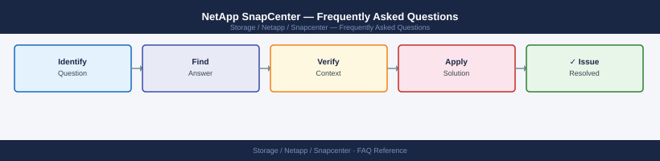

---
tags:
  - netapp-snapcenter
  - faq
  - operations
---
# NetApp SnapCenter — Frequently Asked Questions

*Applies to: NetApp ONTAP 9.x*

Common questions about NetApp SnapCenter operations, configuration, and troubleshooting. For step-by-step procedures, see the <a href="index.md">Operations</a> section.

## General

**Q: What SnapCenter version is recommended?**
A: SnapCenter 6.0.x is the current recommendation. Check via SnapCenter UI → Settings → Software. Keep SnapCenter within 1 major version of your ONTAP version for full compatibility.

**Q: How do I check the current NetApp SnapCenter version?**
A: `SnapCenter UI → Settings → Software → Version`

## Configuration

**Q: What is the default retention policy and when should it change?**
A: Default is 3 snapshots (hourly). Increase for critical workloads: hourly × 24, daily × 7, weekly × 4 is a common production baseline. Define retention policies per resource group to match recovery objectives.

**Q: How do I enable SnapCenter application-consistent backups for SQL Server?**
A: Install the SnapCenter Plug-in for Microsoft SQL Server on the SQL hosts. In SnapCenter, add the SQL host under Hosts → Add. Create a resource group selecting the SQL databases. Enable VSS quiescing for application consistency.

## Operations

**Q: How do I upgrade SnapCenter without disrupting scheduled backups?**
A: SnapCenter upgrades require a brief maintenance window (UI unavailable during upgrade). Scheduled jobs that trigger during upgrade will fail and retry. Upgrade the SnapCenter server first, then push plug-in updates to hosts.

**Q: What is the correct procedure to add a new host to SnapCenter?**
A: SnapCenter UI → Hosts → Add Host. Provide the hostname, OS type, and credentials. SnapCenter installs the appropriate plug-in automatically. Verify the host appears with a green status before creating resource groups.

## Troubleshooting

**Q: SnapCenter job fails with 'Snapshot operation not allowed while volume move is in progress'. What does it mean?**
A: ONTAP is moving the volume to another aggregate. SnapCenter snapshot operations are blocked during volume move. Wait for the move to complete (`volume move show`) then retry the backup job.

**Q: SnapCenter backup jobs are slow — where do I start?**
A: Check ONTAP aggregate performance during backup windows. Review concurrent job count — reduce parallelism if ONTAP is saturated. For SQL, check VSS quiesce time. Enable SnapCenter logging for detailed timing analysis.

## Backup and Recovery

**Q: How often should I back up SnapCenter configuration?**
A: Weekly via SnapCenter → Settings → Settings → Backup SnapCenter Server. Includes all policies, resource groups, and credentials. Store off-server. Test restore annually.

**Q: Can I restore a single file from a SnapCenter backup?**
A: Yes — SnapCenter supports file-level restore for Windows (via SnapCenter Plug-in for Windows), Oracle, and SQL. For VMware VMs, use SnapCenter Plug-in for VMware → File Restore → browse the mounted backup.

## See Also

- [NetApp SnapCenter Operations](index.md)
- [NetApp SnapCenter Troubleshooting](../../../../troubleshooting/index.md)
