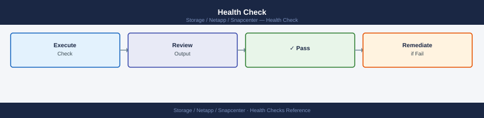

---
tags:
  - netapp
  - operations
description: "SnapCenter health checks: Get-SmJob -State Failed, plugin service status, repository database connectivity, SnapMirror lag, and storage capacity via..."
---
# SnapCenter — Health Checks

<div class="kb-summary">
SnapCenter health checks: `Get-SmJob -State Failed`, plugin service status, repository database connectivity, SnapMirror lag, and storage capacity via `Get-SmStorageResources`.

*Applies to: SnapCenter 5.x*
</div>

## Before you begin

- **Access:** Storage admin credentials (cluster admin or equivalent)
- **Timing:** safe to run during business hours unless a step is marked ⚠ (causes interruption)
- **Dependencies:** no active upgrades or migrations on the same infrastructure
- **Logging:** capture command output — paste into the change record on completion

---

## Run This Routine

1. **SnapCenter service** — On SnapCenter server run `Get-Service SnapCenter* | Select Name,Status` — all services should be Running
2. **Plugin connectivity** — SnapCenter UI → Hosts — all plugins should show Connected/Running
3. **Recent job failures** — SnapCenter → Monitor → Jobs → filter Last 24h + Failed — investigate any failures
4. **Storage system connectivity** — SnapCenter → Storage Systems — all systems should show Connected
5. **Policy compliance** — SnapCenter → Resources — verify backups completed per scheduled policy
6. **Catalog integrity** — SnapCenter → Settings → Jobs → check for any Catalog errors
7. **License status** — SnapCenter → Settings → Licenses — check for upcoming expiry
8. **Disk space on SnapCenter server** — `Get-PSDrive C | Select @{n='FreeGB';e={[math]::Round($_.Free/1GB,1)}}` — verify adequate free space

---

## Daily Checks


| Check | Command | Notes |
|---|---|---|
| [ ] Review backup jobs from the last 24 hours | `Get-SmJob -StartTime (Get-Date).AddHours(-24) \| Select JobId,JobType,Status,StartDateTime,EndDateTime` | |
| [ ] Flag any failed or stuck jobs (Status = `Failed` or `Running` for > expected duration) | `Failed` | |
| [ ] Check plugin host connectivity | `Get-SmHost \| Select HostName,HostType,PlugInStatus` | all hosts should show `Running` |
| [ ] Verify secondary (SnapVault/SnapMirror) copies exist for critical resources | `Get-SmBackup -ResourceName <resource>` | |
| [ ] Check SnapCenter Server disk usage | | review log partition growth (default logs under `C:\Program Files\NetApp\SnapCenter\SMCore\logs\`) |
| [ ] Confirm all resources are within their backup SLA window | | no resource should be missing a backup beyond the defined retention interval |
| [ ] Check certificate expiry on the SnapCenter Server | | |

## Health Check



- [ ] All backup jobs in the last 24 hours completed with `Completed` status
- [ ] No jobs are currently stuck in `Running` or `Queued` state
- [ ] All plugin hosts show `PlugInStatus: Running`
- [ ] SnapVault/SnapMirror relationships on secondary storage are healthy (verify from ONTAP: `snapmirror show -fields healthy`)
- [ ] SnapCenter Server has sufficient disk space on the log and repository partitions
- [ ] No unprotected resources flagged in the SnapCenter Dashboard
- [ ] Server TLS certificate is valid and not expiring within 30 days

```bash
# Connect to SnapCenter (run from a host with SnapCenter PowerShell toolkit installed)
Open-SmConnection -SMSbaseurl https://<snapcenter-server>:8146

# List all backup jobs from the last 24 hours with status
Get-SmJob -StartTime (Get-Date).AddHours(-24) | Select JobId, JobType, Status, StartDateTime, EndDateTime

# List all jobs currently in Running or Queued state
Get-SmJob | Where-Object { $_.Status -in @("Running","Queued") } | Select JobId, JobType, Status, StartDateTime

# Check plugin host connectivity and status
Get-SmHost | Select HostName, HostType, PlugInStatus, OverallStatus

# List all resource groups and their protection status
Get-SmResourceGroup | Select ResourceGroupName, PluginCode, Status

# List available backups for a specific resource
Get-SmBackup -ResourceName <resource_name> | Select BackupName, BackupTime, Status

# Check all policies
Get-SmPolicy | Select PolicyName, PluginType, BackupType
```


```text title="Expected output"
Name                             Value
----                             -----
SmSbaseUrl                       https://snapcenter-server.corp.local:8146
IsConnected                      True
UserName                         CORP\snapadmin

JobId JobType                Status       StartDateTime           EndDateTime
----- -------                ------       -------------           -----------
1247  BackupResources        Completed    11/14/2024 02:15:33 AM  11/14/2024 02:47:22 AM
1246  BackupResources        Completed    11/13/2024 14:30:15 PM  11/13/2024 15:02:44 PM
1245  VerifyBackup           Completed    11/13/2024 08:22:10 AM  11/13/2024 08:35:18 AM
1244  BackupResources        Failed       11/12/2024 22:15:00 PM  11/12/2024 22:18:33 PM
1243  RestoreResources       Completed    11/12/2024 16:45:22 PM  11/12/2024 17:12:55 PM

JobId JobType                Status       StartDateTime
----- -------                ------       -------------
1251  BackupResources        Running      11/14/2024 08:30:22 AM
1250  VerifyBackup           Queued       11/14/2024 08:15:10 AM

HostName                    HostType      PlugInStatus  OverallStatus
--------                    --------      ------------  --------------
db-prod-01.corp.local       Windows       Available     Normal
db-prod-02.corp.local       Linux         Available     Normal
nas-01.corp.local           Storage       Available     Normal
app-server-03.corp.local    Windows       Unavailable   Warning

ResourceGroupName             PluginCode  Status
-----------------             ----------  ------
MSSQL_Daily_Backup            MSSQL       Protected
Oracle_Hourly_RG              Oracle      Protected
MySQL_Weekly_Backup           MySQL       Unprotected
VMware_VMs_RG                 VMware      Protected

BackupName                                    BackupTime              Status
----------                                    ----------              ------
MSSQL_DB_20241114_023000                      11/14/2024 02:30:00 AM  Completed
MSSQL_DB_20241113_143000                      11/13/2024 14:30:00 PM  Completed
MSSQL_DB_20241112_223000                      11/12/2024 22:30:00 PM  Completed

PolicyName                    PluginType  BackupType
----------                    ----------  ----------
Daily_Full_Backup             MSSQL       Full
Hourly_Log_Backup             MSSQL       Log
Weekly_Full_Backup            Oracle      Full
Monthly_Archive               MySQL       Full
```

!!! warning "Common errors"
    **`Open-SmConnection : Cannot find a promo provider 'SnapCenter' for PowerShell version 5.1`** — Install the SnapCenter PowerShell toolkit matching your PowerShell version, or run the script from a SnapCenter server with the toolkit pre-installed.
    **`Get-SmJob : The term 'Get-
---

## Verify

- Confirm the operation completed without errors in the log or management UI
- Verify the expected state change is visible (service running, object created, config applied)
- Document the outcome in the change record

---

## See also

- [Snapcenter — Procedures](../procedures/)
- [Snapcenter — CLI Reference](../cli-reference/)
- [Snapcenter — Common Issues](../../troubleshooting/common-issues/)
