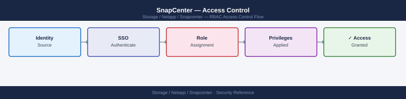

---
tags:
  - netapp
  - security
description: "SnapCenter access control: RBAC role assignment for App Backup Admin and Backup Viewer, Get-SmRole, resource group ownership scoping, and audit trail..."
---
# SnapCenter — Access Control

<div class="kb-summary">
SnapCenter access control: RBAC role assignment for App Backup Admin and Backup Viewer, `Get-SmRole`, resource group ownership scoping, and audit trail review.

*Applies to: SnapCenter 5.x*
</div>


---

## Before you begin

- **Access:** Storage admin credentials (cluster admin or equivalent)
- **Change management:** security changes require CAB approval in most environments
- **Rollback plan:** document current state before any security control change
- **Testing:** validate in a non-production environment first where possible

---

## RBAC

SnapCenter implements role-based access control at the application level, layered on top of ONTAP-level permissions.

### Built-in Roles

| Role | Access Level |
|---|---|
| SnapCenter Admin | Full access — all operations, settings, user management |
| Infrastructure Admin | Storage connections, hosts, plugins — no backup/restore operations |
| Application Backup and Clone Admin | Create/modify policies, resource groups, run backups, clones, restores |
| Backup and Clone Viewer | Read-only view of jobs, backups, resource groups — no modifications |

### Custom Roles

Create custom roles to delegate specific operations to application teams:

```powershell
# Create a custom role
Add-SmRole -RoleName "Oracle-Restore-Only" -Description "Oracle DBA can restore and clone only"

# Add permissions to the role
Set-SmRole -RoleName "Oracle-Restore-Only" -AllowedOperations "RestoreFromBackup","Clone"

# Assign an AD user to the role
Add-SmUser -UserName "domain\ora-dba01" -RoleName "Oracle-Restore-Only"
```

Assign RBAC at the resource or resource-group level — a user can be granted access to specific resource groups without seeing all resources in SnapCenter.

## ONTAP Service Account Security

SnapCenter connects to ONTAP using credentials stored in the SnapCenter Credential Store. Best practices:

```bash
# On ONTAP — create a dedicated SnapCenter service account with minimum permissions
security login role create -role sc-backup-role -cmddirname "DEFAULT" -access none -vserver <admin-svm>
security login role create -role sc-backup-role -cmddirname "volume" -access all -vserver <admin-svm>
security login role create -role sc-backup-role -cmddirname "snapshot" -access all -vserver <admin-svm>
security login role create -role sc-backup-role -cmddirname "snapmirror" -access all -vserver <admin-svm>
security login role create -role sc-backup-role -cmddirname "lun" -access all -vserver <admin-svm>

# Create the service account
security login create -username svc-snapcenter -application ontapi -authmethod password -role sc-backup-role -vserver <admin-svm>
security login create -username svc-snapcenter -application http -authmethod password -role sc-backup-role -vserver <admin-svm>
```


```text title="Expected output"
Role "sc-backup-role" created successfully.
Role "sc-backup-role" created successfully.
Role "sc-backup-role" created successfully.
Role "sc-backup-role" created successfully.
Role "sc-backup-role" created successfully.
User "svc-snapcenter" created successfully.
User "svc-snapcenter" created successfully.
```

!!! warning "Common errors"
    | Error | Fix |
    |---|---|
    | `Error: command failed: Role "sc-backup-role" already exists` | Delete the existing role with `security login role delete -role sc-backup-role -vserver <admin-svm>` before recreating it. |
    | `Error: command failed: User "svc-snapcenter" already exists` | Use `security login modify` instead of `create`, or delete the user first with `security login delete -username svc-snapcenter -vserver <admin-svm>`. |
    | `Error: command failed: Invalid vserver name "<admin-svm>"` | Replace `<admin-svm>` with the actual admin SVM name (typically the cluster name or use `-vserver *` for cluster scope). |
## Audit Logging

- All SnapCenter user operations (login, job trigger, policy change, restore, clone) are written to the audit log
- Access audit log: Settings → Settings → Audit Logs in the GUI, or query via REST API
- Export audit logs to a SIEM: configure syslog forwarding from the Windows Server (use Windows Event Forwarding or a Splunk/Elastic agent on the SnapCenter Server)
- Audit log tampering protection: SnapCenter 6.1+ signs audit log entries with a hash chain for integrity verification

---

## See also

- [Snapcenter — Authentication](../authentication/)
- [Snapcenter — Hardening](../hardening/)
- [Snapcenter — Encryption](../encryption/)
