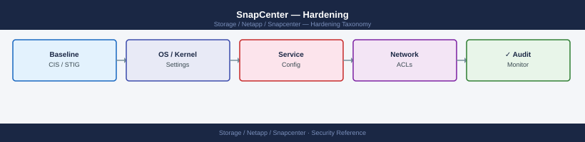

---
tags:
  - netapp
  - security
---
# SnapCenter — Hardening

<div class="kb-summary">
SnapCenter hardening: TLS 1.2 enforcement, disabling unused plug-in ports, Windows Firewall rules, CIS benchmark alignment, and audit log retention.

*Applies to: SnapCenter 5.x*
</div>


---

## Before you begin

- **Access:** Storage admin credentials (cluster admin or equivalent)
- **Change management:** security changes require CAB approval in most environments
- **Rollback plan:** document current state before any security control change
- **Testing:** validate in a non-production environment first where possible

---

## Hardening Checklist

Apply this baseline at installation and validate quarterly. Each item links to the relevant configuration section below.

### Initial Build

- [ ] Default `admin` password changed from the installation default; stored in a secrets vault (HashiCorp Vault, CyberArk, or equivalent)
- [ ] SnapCenter Server VM is dedicated to SnapCenter only — no other applications or services running on the same Windows Server
- [ ] Windows Server hosting SnapCenter is hardened per the CIS Windows Server Benchmark (Level 1 minimum)
- [ ] Default self-signed TLS certificate replaced with a CA-signed certificate on port 8146 before granting user access
- [ ] TLS 1.0 and 1.1 disabled in Windows SCHANNEL registry; TLS 1.2 minimum enforced

### Access Control

- [ ] All operational users authenticate via Active Directory groups — no individual AD user accounts directly granted where group membership is manageable
- [ ] MFA enabled via SAML 2.0 IdP integration if SnapCenter 6.0+ is deployed and an IdP is available
- [ ] SnapCenter `admin` local account is treated as a break-glass account only; its usage is monitored via audit logs
- [ ] ONTAP service account uses a custom least-privilege RBAC role — not `vsadmin` or `admin`; see [Access Control](access-control.md)
- [ ] Plugin host credentials stored in SnapCenter Credential Store; no plaintext passwords in automation scripts or configuration files
- [ ] RBAC roles configured such that application owners (DBAs, sysadmins) can trigger restores and clones for their own resources without SnapCenter Admin access

### Network

- [ ] Network access to port 8146 (GUI/API) restricted by firewall or NSG to authorised management workstations and automation hosts only
- [ ] Network access to port 8145 (agent communication) restricted to allow only from the SnapCenter Server IP to managed hosts — not open to all hosts
- [ ] SnapCenter Server is not exposed to the internet; access is from corporate network or VPN only
- [ ] SMTP notification relay uses TLS (port 587 with STARTTLS or port 465 SMTPS) — not plain SMTP on port 25

### Monitoring and Audit

- [ ] Audit log review included in weekly operational checks — Settings → Settings → Audit Logs
- [ ] Email notifications configured for all resource groups on `On Error or Warning` — storage team alerted on every backup failure
- [ ] Log partition on the SnapCenter Server monitored for size — log rotation or archive configured to prevent disk fill
- [ ] SnapCenter Server and MySQL repository backed up daily; backup restored and tested quarterly

---

## ONTAP Service Account Hardening

The ONTAP service account used by SnapCenter must follow the principle of least privilege. The account needs access to snapshot, SnapMirror, LUN, and volume operations — but not full cluster admin.

```bash
# On the ONTAP cluster — create a dedicated SnapCenter service account

# Step 1: Create a custom role with only the required permissions
security login role create -role sc-backup-role -cmddirname "DEFAULT" \
    -access none -vserver <cluster-name>

# Grant required command access
security login role create -role sc-backup-role -cmddirname "volume" \
    -access all -vserver <cluster-name>
security login role create -role sc-backup-role -cmddirname "snapshot" \
    -access all -vserver <cluster-name>
security login role create -role sc-backup-role -cmddirname "snapmirror" \
    -access all -vserver <cluster-name>
security login role create -role sc-backup-role -cmddirname "lun" \
    -access all -vserver <cluster-name>
security login role create -role sc-backup-role -cmddirname "lun igroup" \
    -access all -vserver <cluster-name>
security login role create -role sc-backup-role -cmddirname "vserver export-policy" \
    -access all -vserver <cluster-name>
security login role create -role sc-backup-role -cmddirname "storage aggregate" \
    -access readonly -vserver <cluster-name>
security login role create -role sc-backup-role -cmddirname "network interface" \
    -access readonly -vserver <cluster-name>
security login role create -role sc-backup-role -cmddirname "event log" \
    -access readonly -vserver <cluster-name>

# Step 2: Create the service account with ontapi and http access
security login create \
    -username svc-snapcenter \
    -application ontapi \
    -authentication-method password \
    -role sc-backup-role \
    -vserver <cluster-name>

security login create \
    -username svc-snapcenter \
    -application http \
    -authentication-method password \
    -role sc-backup-role \
    -vserver <cluster-name>

# Step 3: Verify the account and role
security login show -username svc-snapcenter
security login role show -role sc-backup-role
```


```text title="Expected output"
cluster1::> security login role create -role sc-backup-role -cmddirname "DEFAULT" \
    -access none -vserver cluster1
(no output — command completes silently)

cluster1::> security login role create -role sc-backup-role -cmddirname "volume" \
    -access all -vserver cluster1
(no output — command completes silently)

cluster1::> security login role create -role sc-backup-role -cmddirname "snapshot" \
    -access all -vserver cluster1
(no output — command completes silently)

cluster1::> security login role create -role sc-backup-role -cmddirname "snapmirror" \
    -access all -vserver cluster1
(no output — command completes silently)

cluster1::> security login role create -role sc-backup-role -cmddirname "lun" \
    -access all -vserver cluster1
(no output — command completes silently)

cluster1::> security login role create -role sc-backup-role -cmddirname "lun igroup" \
    -access all -vserver cluster1
(no output — command completes silently)

cluster1::> security login role create -role sc-backup-role -cmddirname "vserver export-policy" \
    -access all -vserver cluster1
(no output — command completes silently)

cluster1::> security login role create -role sc-backup-role -cmddirname "storage aggregate" \
    -access readonly -vserver cluster1
(no output — command completes silently)

cluster1::> security login role create -role sc-backup-role -cmddirname "network interface" \
    -access readonly -vserver cluster1
(no output — command completes silently)

cluster1::> security login role create -role sc-backup-role -cmddirname "event log" \
    -access readonly -vserver cluster1
(no output — command completes silently)

cluster1::> security login create \
    -username svc-snapcenter \
    -application ontapi \
    -authentication-method password \
    -role sc-backup-role \
    -vserver cluster1
(no output — command completes silently)

cluster1::> security login create \
    -username svc-snapcenter \
    -application http \
    -authentication-method password \
    -role sc-backup-role \
    -vserver cluster1
(no output — command completes silently)

cluster1::> security login show -username svc-snapcenter
Vserver: cluster1
User Name: svc-snapcenter
Application: ontapi
Authentication Method: password
Role Name: sc-backup-role
Account Locked: false
Vserver: cluster1
User Name: svc-snapcenter
Application: http
Authentication Method: password
Role Name: sc-backup-role
Account Locked: false

cluster1::> security login role show -role sc-backup-role
Role Name: sc-backup-role
Vserver: cluster1
Command/Directory Name: DEFAULT
Access Level: none
Role Name: sc-backup-role
Vserver: cluster1
Command/Directory Name: volume
Access Level: all
Role Name: sc-backup-role
Vserver: cluster1
Command/Directory Name: snapshot
Access Level:
```
---

## Windows Server Hardening Baseline (SnapCenter Host)

These are the minimum OS-level controls to apply to the Windows Server hosting SnapCenter. Apply in addition to your standard server hardening baseline.

```powershell
# Verify Windows Firewall is enabled and SnapCenter ports are scoped correctly
Get-NetFirewallRule | Where-Object { $_.LocalPort -in @(8145, 8146) } | 
    Select-Object Name, Direction, Action, LocalPort, Enabled

# Port 8146 — GUI/API: should allow only from management VLANs or specific source IPs
# Port 8145 — agent: should allow only from plugin host IPs (not any source)

# Confirm Windows Defender is running (or equivalent AV)
Get-MpComputerStatus | Select-Object AMServiceEnabled, AntispywareEnabled, RealTimeProtectionEnabled

# Confirm Windows Update is configured and current patches applied
Get-WindowsUpdateLog
Get-HotFix | Sort-Object InstalledOn -Descending | Select-Object -First 10

# Verify no unnecessary Windows features are installed
Get-WindowsFeature | Where-Object { $_.InstallState -eq "Installed" } | 
    Select-Object Name, DisplayName | 
    Where-Object { $_.Name -notmatch "^(Web|IIS|NET|SnapCenter|MySQL)" }
# Review output — remove roles that are not required for SnapCenter

# Check local administrator group membership
Get-LocalGroupMember -Group "Administrators"
# Limit to: SYSTEM, SnapCenter service account, designated admins only
```

---

## IIS Hardening for SnapCenter

```powershell
# Run these on the SnapCenter Server as Administrator

# Remove server version headers from IIS responses
Import-Module WebAdministration
Set-WebConfigurationProperty -PSPath 'MACHINE/WEBROOT/APPHOST' `
    -filter "system.webServer/security/requestFiltering" `
    -name "removeServerHeader" -value "True"

# Disable directory browsing in IIS
Set-WebConfigurationProperty -PSPath 'IIS:\Sites\SnapCenter_WebApp' `
    -filter "system.webServer/directoryBrowse" `
    -name "enabled" -value "False"

# Set X-Frame-Options header to prevent clickjacking
Add-WebConfigurationProperty `
    -PSPath 'IIS:\Sites\SnapCenter_WebApp' `
    -Filter "system.webServer/httpProtocol/customHeaders" `
    -Name "." `
    -Value @{name="X-Frame-Options"; value="SAMEORIGIN"}

# Set X-Content-Type-Options to prevent MIME sniffing
Add-WebConfigurationProperty `
    -PSPath 'IIS:\Sites\SnapCenter_WebApp' `
    -Filter "system.webServer/httpProtocol/customHeaders" `
    -Name "." `
    -Value @{name="X-Content-Type-Options"; value="nosniff"}

# Verify headers are applied
Invoke-WebRequest -Uri "https://localhost:8146" -UseBasicParsing | 
    Select-Object -ExpandProperty Headers
```

---

## Audit Log Configuration and Review

SnapCenter records all user operations (login, backup, restore, clone, policy change, RBAC change) in its audit log. In SnapCenter 6.1+, audit log entries are protected with a hash chain to detect tampering.

### Accessing Audit Logs

```powershell
# Via PowerShell — list recent audit events
Get-SmAuditLog | Select-Object -First 50 | 
    Select-Object DateTime, UserName, Operation, Status, Message

# Filter for a specific user
Get-SmAuditLog | Where-Object { $_.UserName -eq "CORP\jsmith" }

# Filter for restore operations
Get-SmAuditLog | Where-Object { $_.Operation -like "*Restore*" }

# Export audit log for a date range
Get-SmAuditLog | Where-Object { $_.DateTime -ge (Get-Date).AddDays(-30) } |
    Export-Csv "C:\Reports\snapcenter-audit-$(Get-Date -f yyyyMMdd).csv" -NoTypeInformation
```

### Forwarding Audit Logs to SIEM

SnapCenter does not natively ship audit logs to a SIEM. Use one of these approaches:

1. **Windows Event Forwarding (WEF)**: Install a Splunk or Elastic agent on the SnapCenter Server to ship Windows Application event log entries (SnapCenter logs to the Windows Application log as well as its own log files)
2. **Scheduled export**: Script a scheduled PowerShell task that exports the SnapCenter audit log to a shared SIEM ingestion path daily
3. **API-based collection**: Poll the SnapCenter REST API for audit log entries and push to your SIEM via the SIEM's ingest API

```powershell
# Scheduled export script (run as a Windows Scheduled Task daily)
$yesterday = (Get-Date).AddDays(-1)
$logPath   = "\\siem-ingest\snapcenter\audit-$(Get-Date -f yyyyMMdd).json"

Open-SmConnection -SMSbaseurl https://snapcenter.example.com -Credential $cred
Get-SmAuditLog | Where-Object { $_.DateTime -ge $yesterday } |
    ConvertTo-Json | Out-File -FilePath $logPath -Encoding utf8
Close-SmConnection
```

---

## Quarterly Security Review

| Check | Action |
|---|---|
| Certificate expiry | `Get-ChildItem Cert:\LocalMachine\My` — renew if < 60 days remaining |
| Admin account usage audit | `Get-SmAuditLog \| Where-Object { $_.UserName -eq "admin" }` — should be near-zero activity |
| RBAC role assignments | `Get-SmUser` — remove departed users; review role assignments vs. job function |
| ONTAP service account password | Rotate in ONTAP and update in SnapCenter Credential Store |
| Windows patches | Verify KB patch history; apply outstanding Windows Updates |
| Plugin version alignment | `Get-SmHost` — confirm all plugin versions match the SnapCenter Server version |
| Log partition usage | Check `C:\Program Files\NetApp\SnapCenter\` disk usage; archive or purge old logs |
| Restore test | Execute a restore from backup on a non-production resource; confirm success |

---

## See also

- [Snapcenter — Authentication](../authentication/)
- [Snapcenter — Access Control](../access-control/)
- [Snapcenter — Encryption](../encryption/)
