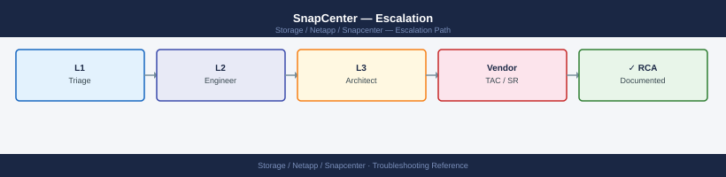
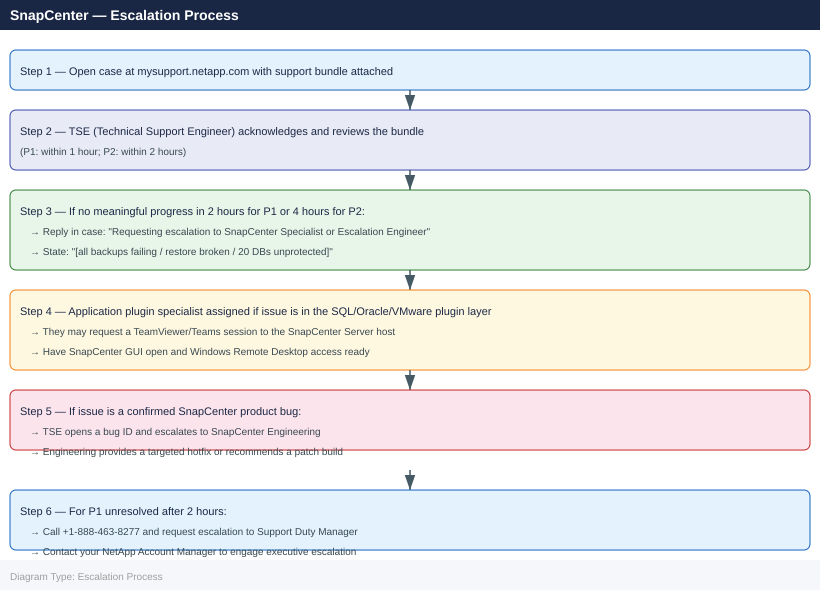

---
tags:
  - netapp
  - troubleshooting
search:
  boost: 1.5
description: "How to escalate NetApp SnapCenter issues to NetApp support: what data to collect, how to generate the support bundle, step-by-step case creation on..."
---
# SnapCenter — Escalation

<div class="kb-summary">
How to escalate NetApp SnapCenter issues to NetApp support: what data to collect, how to generate the support bundle, step-by-step case creation on mysupport.netapp.com, and the escalation path when progress stalls.

*Applies to: SnapCenter 5.x*
</div>



---

```d2
direction: down

symptom: Identify Symptom {shape: diamond}
preescalation_selfcheck: "Pre-Escalation Self-Check" {shape: rectangle}
stepbystep_data_collection: "Step-by-Step Data Collection" {shape: rectangle}
how_to_open_the_sr_on_mysupportnetap: "How to Open the SR on mysupport.netapp.com" {shape: rectangle}
escalation_path: "Escalation Path" {shape: rectangle}
what_not_to_do: "What NOT to Do" {shape: rectangle}
useful_commands_for_case_updates: "Useful Commands for Case Updates" {shape: rectangle}
resolution: Resolve or Escalate {shape: oval}

symptom -> preescalation_selfcheck: investigate
symptom -> stepbystep_data_collection: investigate
symptom -> how_to_open_the_sr_on_mysupportnetap: investigate
symptom -> escalation_path: investigate
symptom -> what_not_to_do: investigate
symptom -> useful_commands_for_case_updates: investigate
preescalation_selfcheck -> resolution
stepbystep_data_collection -> resolution
how_to_open_the_sr_on_mysupportnetap -> resolution
escalation_path -> resolution
what_not_to_do -> resolution
useful_commands_for_case_updates -> resolution
```

## Before you begin

- **Access required:** SnapCenter Administrator role; access to the SnapCenter Server Windows host; NetApp support account at mysupport.netapp.com with active SupportEdge
- **Do this first:** get the failing Job ID and collect the support bundle before restarting any services. NetApp TSE will ask for the bundle in their first response
- **Do NOT restart the SnapCenter Server service** without guidance — it aborts any in-progress jobs and may change log state the TSE needs to examine
- **Do NOT delete failed jobs** from Job History — each job record carries the detailed event log; deleting it removes the diagnostic data

---

## Pre-Escalation Self-Check

Run these before opening the case.

| Check | How to check | Expected result |
|---|---|---|
| SC Server version | SC GUI → Help → About | Note full version (e.g. 5.0.1) |
| Plugin versions | SC GUI → Settings → Hosts → plugin version column | Match expected SC Server compatibility |
| Failed job IDs | SC GUI → Jobs → Monitor | Note all failing Job IDs and error codes |
| SC Server service | Windows Services on SC Server host: `SnapCenter SMCore` | Running |
| MySQL service (SMF) | Windows Services: `SnapCenter MySQL DB` | Running |
| Disk space on SC Server | `Get-PSDrive C` (PowerShell) | `C:\` above 15% free (SC logs fill the drive fast) |
| ONTAP connectivity | SC GUI → Storage Systems → test connection | All storage systems show Connected |
| Plugin host connectivity | SC GUI → Settings → Hosts → check host status | All hosts show Connected |
| ONTAP EMS errors | `event log show -severity error -time-range 24h` (on ONTAP) | No errors for the snapshot or SnapMirror operations |

---

## Step-by-Step Data Collection

### 1. Get the SnapCenter Server version and plugin versions

```powershell
# Run on the SnapCenter Server host (PowerShell)
# Get SC Server version
Get-SmHost | Select-Object HostName, HostType, SnapCenterVersion | Format-Table

# Get plugin versions on all registered hosts
Get-SmHost -HostType Windows | Select-Object HostName, PlugInVersion | Format-Table
Get-SmHost -HostType Linux | Select-Object HostName, PlugInVersion | Format-Table

# Get registered storage system versions
Get-SmStorageConnection | Select-Object StorageName, ControllerName | Format-Table
# Then on each ONTAP cluster: system node show -fields ontap-version
```

### 2. Get the failing Job ID and exact error text

1. In SnapCenter GUI: click **Jobs → Monitor** (left sidebar).
2. In the job list, note the **Job ID** for each failing job (a numeric ID like `14521`).
3. Right-click the failing job → **View Logs** → expand the error event.
4. Copy the full error message text including any NetApp error code.

Or via PowerShell:

```powershell
# Get last 20 failed jobs with their IDs and error messages
Get-SmJob -JobState Failed | Select-Object JobId, JobType, Status, StartTime, EndTime | Format-Table

# Get the event details for a specific failing job
Get-SmJobDetails -JobId <job-id> | Format-List
```

### 3. Generate the SnapCenter support bundle

The support bundle packages all SnapCenter logs, configuration, job history, and database state.

**Via GUI:**
1. In SnapCenter GUI: click **Help → Support**.
2. Click **Generate Support Bundle**.
3. Select the SnapCenter Server and any affected plugin hosts.
4. Click **Generate** and wait 5–15 minutes.
5. Download the resulting archive when ready.

**Via PowerShell:**

```powershell
# Generate the support bundle directly (on SnapCenter Server host)
$bundlePath = "C:\Temp\sc-support-bundle-$(Get-Date -Format 'yyyyMMdd')"
Get-SmSupportBundle -Path $bundlePath

# The bundle is stored as a ZIP in the specified directory
Get-ChildItem $bundlePath | Sort-Object LastWriteTime -Descending | Select-Object -First 5
```

### 4. Collect the Windows Event Log (for service-level failures)

```powershell
# Export the Application log (SnapCenter logs here)
wevtutil epl Application "C:\Temp\Application-$(Get-Date -Format 'yyyyMMdd').evtx"

# Recent SnapCenter entries as text (for pasting into the case description)
Get-EventLog -LogName Application -Source "*SnapCenter*" -Newest 50 |
  Select-Object TimeGenerated, EntryType, Source, EventID, Message |
  Out-File "C:\Temp\sc-events-$(Get-Date -Format 'yyyyMMdd').txt"
```

### 5. Collect ONTAP events for snapshot/SnapMirror failures

If the issue involves snapshot creation or SnapMirror replication failures, run this on the ONTAP cluster:

```bash
# ONTAP EMS errors in last 24h — paste into the case description
event log show -severity error -time-range 24h

# SnapMirror relationship state (if replication is involved)
snapmirror show -fields state,lag-time,healthy,relationship-status
```


```text title="Expected output"
Time                Node             Severity Event
------------------ ---------------- -------- ----------------------------------------
11/15/2024 14:32:15 cluster-01-01    ERROR    WAFL.vol.autoGrow.aborted
11/15/2024 13:18:42 cluster-01-02    ERROR    SHELF.fcal.loop.down
11/15/2024 12:05:09 cluster-01-01    ERROR    SNAPMIRROR.transferAborted
11/15/2024 09:47:33 cluster-01-02    ERROR    CIFS.vserver.auth.failure
11/15/2024 08:22:18 cluster-01-01    ERROR    RAID.disk.lifeExpectancy.warning

Source Destination                   State    Lag-Time Healthy Relationship-Status
------ -------------------------------- -------- -------- ------- --------------------
svm1:vol_prod svm2:vol_prod_mirror    Snapmirrored 00:15:32 true    Idle
svm1:vol_data svm3:vol_data_dr        SnapMirrored 02:47:18 false   Transferring
svm1:vol_logs svm2:vol_logs_backup    Uninitialized 00:00:00 false   Broken-off
```

!!! warning "Common errors"
    **`Error: command not found`** — Verify you are connected to the ONTAP cluster CLI (ssh admin@<cluster-mgmt-ip>) and not the local shell.
    **`Error: Access denied for command "event log show"`** — Ensure your ONTAP user role has "admin" or equivalent privileges; check with `security login show -user-or-group-name <username>`.
    **`Error: No SnapMirror relationships found`** — This is expected if no replication is configured; verify relationships exist with `snapmirror list-destinations` before troubleshooting lag-time issues.
### 6. Write the timeline

```text
SnapCenter version: 5.0.1
Plugin version (SQL host): 5.0.1 on sql-prod-01.corp.local
ONTAP version: 9.13.1P5 (cluster: ontap-prod-01)
Issue first observed: 2026-06-14 02:15 UTC (nightly backup run)
Last known good backup: 2026-06-13 02:30 UTC
Changes in 24h before the issue:
  - 2026-06-13 20:00: SnapCenter 5.0.0 → 5.0.1 upgrade applied
  - 2026-06-14 02:15: All SQL resource group backup jobs failed
  - Error: "Failed to create snapshot on storage system — error code 13001"
  - Job IDs failing: 14521, 14522, 14523 (all SQL backup resource groups)
Steps already taken:
  - ONTAP: volume show — all volumes online and accessible
  - Checked ONTAP EMS: no snapshot errors in the event log
  - Did NOT restart SnapCenter service or delete failed jobs
Blast radius: All 20 SQL Server databases unprotected for 24h; RPO gap open
```

---

## How to Open the SR on mysupport.netapp.com

1. Go to **mysupport.netapp.com** and sign in with your NetApp SSO account.

2. Click **Support** → **Cases & Claims** → **Create a New Case**.

3. Under **Select a Product**, choose **Storage Software** → **SnapCenter**.

4. Under **Version**, select your SnapCenter Server version from Step 1.

5. Under **Serial Number**, enter the serial number of the primary ONTAP cluster associated with the failing SnapCenter jobs. This validates your SupportEdge entitlement.

6. Under **Priority**, select:
   - **P1 — Critical**: SnapCenter Server is completely down; all backup jobs failing with no workaround; active restore failing in a DR scenario; data protection gap poses immediate data loss risk
   - **P2 — High**: A significant subset of resource groups or backup jobs is failing; a restore capability is impaired; plugin installation failing on multiple hosts
   - **P3 — Medium**: A single resource group or plugin host is failing; workaround available; non-production workloads affected
   - **P4 — Low**: How-to question, pre-upgrade review, or non-urgent configuration question

7. In the **Title** field: product + symptom + scope. Example: `SnapCenter 5.0.1 — all SQL backup jobs failing error 13001 after SC upgrade, 20 DBs unprotected`.

8. In the **Description** field, paste:
   - SnapCenter Server version and plugin versions from Step 1
   - Failing Job IDs and exact error text from Step 2
   - ONTAP EMS errors from Step 5
   - The timeline from Step 6

9. Under **Attachments**, upload the support bundle from Step 3 and the Windows Event Log export from Step 4.

10. Click **Submit**. You will receive a case number by email immediately.

11. **P1 only:** call NetApp support after submission:
    - **Global/North America:** +1-888-463-8277 (24×7 with SupportEdge)
    - **EMEA:** check mysupport.netapp.com for your regional number
    - State "P1 — SnapCenter Server down / all backup jobs failing" at the start of the call.

---

## Escalation Path



---

## What NOT to Do

| Do NOT do this | Why | What to do instead |
|---|---|---|
| Delete failed jobs from Job History | Each job record carries its detailed event log; deleting it removes the diagnostic data NetApp needs | Leave job history intact; note Job IDs in the case |
| Restart the SnapCenter SMCore service | Aborts any in-progress operations; resets the log state the TSE is examining | Only restart if NetApp TSE explicitly instructs you to |
| Upgrade SnapCenter Server mid-incident | Adds variables; may change the plugin compatibility matrix; upgrade may be blocked by the issue itself | Freeze all SC upgrades until the case is resolved |
| Delete Snapshots tied to failed jobs | The failed job may be the only recovery path; deleting the snapshot closes that window | Leave all snapshots intact; let NetApp confirm which are safe to remove |
| Remove plugin hosts from SnapCenter mid-case | Changes the registered topology NetApp is analysing | Only remove hosts if NetApp directs you to as part of a reconfiguration step |
| Run a manual re-scan of storage systems | May trigger ONTAP operations that change the state NetApp is examining | Wait for NetApp to direct any re-scan operations |

---

## Useful Commands for Case Updates

```powershell
# SnapCenter state summary — paste into every case update
Get-SmHost | Select-Object HostName, HostType, PlugInVersion, SnapCenterVersion | Format-Table
Get-SmJob -JobState Failed | Select-Object JobId, JobType, Status, StartTime | Select-Object -First 20

# Storage connection health
Get-SmStorageConnection | Select-Object StorageName, ControllerName | Format-Table

# Recent failed job details
Get-SmJobDetails -JobId <job-id> | Format-List

# SnapCenter service status on SC Server (PowerShell)
Get-Service "SnapCenter*" | Select-Object Name, Status

# ONTAP connectivity test
Test-NetConnection -ComputerName <ontap-mgmt-ip> -Port 443
```

---

## Support SLA Reference

| Priority | Definition | Initial Response SLA |
|---|---|---|
| P1 — Critical | SC Server down; all backup jobs failing; active restore failure | 1 hour (24×7 — requires SupportEdge 24×7) |
| P2 — High | Most jobs failing; restore impaired; plugin failing on multiple hosts | 2 hours (24×7 — requires SupportEdge 24×7) |
| P3 — Medium | Single resource group failing; workaround available | 4 hours (business hours) |
| P4 — Low | How-to, pre-upgrade, non-urgent configuration | Next business day |

---

## See also

- [SnapCenter — Diagnostics](../diagnostics/)
- [SnapCenter — Common Issues](../common-issues/)

---

## Verify resolution

- Run `Get-SmJob -JobState Failed` and confirm no remaining failed jobs related to the issue
- Manually trigger a backup job for one of the previously failing resource groups and confirm it completes with `Completed` status
- Run `Get-SmHost | Select-Object HostName, PlugInVersion` and confirm all plugin hosts show Connected
- Check ONTAP: `volume snapshot show` and confirm snapshots are being created with expected timestamps
- Monitor the next scheduled backup run to confirm the fix is stable
- Run `event log show -severity error -time-range 1h` on ONTAP and confirm no new snapshot errors
