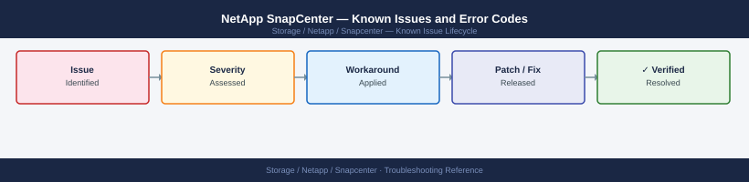

---
tags:
  - troubleshooting
  - snapcenter
  - netapp
  - known-issues
---
# NetApp SnapCenter — Known Issues and Error Codes

<div class="kb-summary">
Catalog of known SnapCenter bugs, error codes, and workarounds covering plugin deployment, backup jobs, and restore operations.

*Applies to: SnapCenter 5.x*
</div>



```d2
direction: down

symptom: Identify Symptom {shape: diamond}
plugin_deployment: "Plugin Deployment" {shape: rectangle}
backup_jobs: "Backup Jobs" {shape: rectangle}
restore: "Restore" {shape: rectangle}
resolution: Resolve or Escalate {shape: oval}

symptom -> plugin_deployment: investigate
symptom -> backup_jobs: investigate
symptom -> restore: investigate
plugin_deployment -> resolution
backup_jobs -> resolution
restore -> resolution
```

## Before you begin

- SnapCenter job errors appear in `Monitor → Jobs`; click the failed job for step-by-step detail.
- Logs: `C:\Program Files\NetApp\SnapCenter\SnapManagerWeb\Repository\logs\` on SnapCenter Server (Windows).
- Most failures are plugin connectivity (port 8145) or ONTAP credential issues.

## Plugin Deployment

| Error / Symptom | Affected Versions | Cause | Workaround / Fix | Fixed In |
|---|---|---|---|---|
| `Plugin deployment failed — Cannot connect to host` | SnapCenter 5.x | Port 8145 blocked from SnapCenter Server to plugin host | Verify TCP 8145 open from SnapCenter Server to all Windows plugin hosts | N/A |
| `SSH connection refused` during Linux plugin deployment | SnapCenter 5.x | SSH service not running or firewall blocking port 22 | Start SSH on Linux host; verify TCP 22 from SnapCenter Server | N/A |
| Plugin version mismatch after SnapCenter upgrade | SnapCenter 5.x | Plugin not auto-upgraded; old version incompatible | Manually upgrade plugin from SnapCenter Server → Hosts → Upgrade Plug-ins | N/A |

## Backup Jobs

| Error / Symptom | Affected Versions | Cause | Workaround / Fix | Fixed In |
|---|---|---|---|---|
| Snapshot backup fails: `Volume is busy` | SnapCenter 5.x | Another process holds a snapshot lock on volume | Identify and release lock: `snapshot show -volume <vol> -fields snaplock-expiry-time` | N/A |
| `Quiesce failed` for SQL Server backup | SnapCenter 5.x | SQL Server VSS writer in failed state | Run `vssadmin list writers` on SQL host; restart failed VSS writer service | N/A |
| Backup policy not triggering on schedule | SnapCenter 5.x | SnapCenter scheduler service stopped | Restart SnapCenter Scheduler: `services.msc` → `SnapCenter Scheduler Service` | N/A |

## Restore

| Error / Symptom | Affected Versions | Cause | Workaround / Fix | Fixed In |
|---|---|---|---|---|
| Volume restore fails: `Clone volume not found` | SnapCenter 5.x | Snapshot used for restore deleted from ONTAP before restore completed | Run restore from a more recent Snapshot; check Snapshot retention policy | N/A |
| `Restore failed — database not in correct state` (SQL) | SnapCenter 5.x | Target SQL database not in RESTORING state | Place database in RESTORING state manually; retry SnapCenter restore | N/A |

## See also

- [NetApp SnapCenter — Common Issues](../common-issues/)
- [NetApp ONTAP — Known Issues](../../ontap/troubleshooting/known-issues.md)
