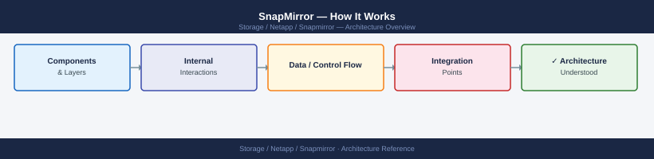
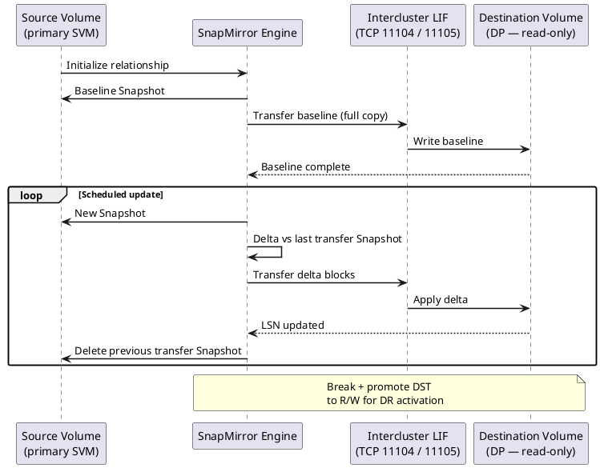

---
tags:
  - architecture
  - netapp
description: "How It Works reference covering Overview, Replication Types, Components, Connectivity, Key Commands and 2 more sections."
---
# SnapMirror — How It Works

<div class="kb-summary">
How It Works reference covering Overview, Replication Types, Components, Connectivity, Key Commands and 2 more sections.

*Applies to: SnapMirror*
</div>




## Overview

SnapMirror is ONTAP's built-in replication engine, providing volume-level and SVM-level replication across ONTAP clusters. It supports three primary operating modes: asynchronous (SnapMirror Async, RPO-based), synchronous (SnapMirror Synchronous, zero RPO), and extended data protection (XDP/SnapVault, backup retention). Relationships are always managed from the destination cluster. SnapMirror Business Continuity (SMBC/AutomatedFailOver) extends synchronous replication with transparent host-level failover for SAN workloads.

## Replication Types

| Type | RPO | Description |
|---|---|---|
| SnapMirror Async | Configurable, minutes to hours | Standard volume replication; transfers run on a schedule; destination is read-only DP volume |
| SnapMirror Sync | Zero RPO | Every write acknowledged on both source and destination; requires <5ms RTT between clusters |
| SnapMirror Business Continuity (SMBC) | Zero RPO, transparent failover | Consistency group-based; mediator-assisted automatic failover; no host reconfiguration |
| SnapVault / XDP | Daily/weekly backup copies | Extended data protection; independent retention on destination; replaces legacy SnapVault |

```d2
direction: right

SRC: "Source Volume\nSVM / Cluster A" {shape: rectangle}
DST: "Destination Volume\nSVM / Cluster B — read-only" {shape: rectangle}
SNAP: "Local Snapshots" {shape: rectangle}
DRACT: "DR Active Volume\n(after SnapMirror break" {shape: rectangle}

SRC -> DST
SRC -> SNAP
DST -> DRACT
```

## Components

| Component | Description |
|---|---|
| Source volume | Read/write volume on the source cluster; the origin of replicated data |
| Destination volume | DP (data protection) type, read-only; managed by the replication engine |
| SnapMirror policy | Defines rules, schedule, and retention for the relationship |
| Cluster peer relationship | Trust relationship between two ONTAP clusters; prerequisite for all SnapMirror |
| SVM peer relationship | Required for cross-SVM replication; establishes peer trust at the data SVM layer |
| Intercluster LIFs | Dedicated network interfaces used exclusively for SnapMirror replication traffic |
| ONTAP Mediator | External Linux VM used as a quorum witness for SMBC automatic failover |

## Connectivity

Intercluster LIFs must be on a dedicated replication network, separate from data and management traffic. ONTAP uses TCP ports 11104 and 11105 for intercluster replication. Cluster peering must be established before SVM peering, and SVM peering is required before any volume or SVM-level relationship can be created.

| Replication Type | Latency Requirement | Bandwidth Requirement |
|---|---|---|
| SnapMirror Async | No strict requirement | Based on change rate and schedule window |
| SnapMirror Sync | <5ms RTT (sustained) | Write throughput of source workload |
| SMBC | <5ms RTT (sustained) | Write throughput of consistency group |

Estimate required replication bandwidth: `(Daily change rate × source volume size) / replication window (seconds)`

## Key Commands

```bash
# Show all relationships with lag time and health
snapmirror show -fields lag-time,healthy,last-transfer-end-timestamp

# Show full detail for a specific relationship
snapmirror show -destination-path svm_dst:vol_dst

# Show relationships in broken-off state
snapmirror show -relationship-status broken-off

# Trigger immediate incremental update
snapmirror update -destination-path svm_dst:vol_dst

# Resync a broken-off relationship
snapmirror resync -destination-path svm_dst:vol_dst

# Break a relationship for DR failover (makes destination read-write)
snapmirror break -destination-path svm_dst:vol_dst

# Initialize a new relationship (baseline transfer)
snapmirror initialize -destination-path svm_dst:vol_dst

# Quiesce a relationship (pause future transfers, finishes current)
snapmirror quiesce -destination-path svm_dst:vol_dst

# Show transfer history
snapmirror show-history -destination-path svm_dst:vol_dst
```


```text title="Expected output"
Source Destination Lag Time Healthy Last Transfer End Timestamp
svm_src:vol_src svm_dst:vol_dst 00:15:32 true 2024-01-15 14:32:18 +00:00
svm_prod:vol_data svm_dr:vol_data 00:08:47 true 2024-01-15 14:39:05 +00:00
svm_app:vol_logs svm_backup:vol_logs 02:43:21 false 2024-01-15 12:04:33 +00:00

Source Destination Policy Type Healthy Lag Time
svm_dst:vol_dst svm_dst:vol_dst MirrorAllSnapshots XDP true 00:15:32
Last Transfer Size: 2.5GB
Last Transfer Duration: 8m 22s
Last Transfer End Timestamp: 2024-01-15 14:32:18 +00:00
Unhealthy Reason: -

Source Destination Relationship Status
svm_app:vol_logs svm_backup:vol_logs broken-off

Operation succeeded: SnapMirror update started for destination svm_dst:vol_dst

Operation succeeded: SnapMirror resync started for destination svm_dst:vol_dst

Operation succeeded: SnapMirror break completed for destination svm_dst:vol_dst

Operation succeeded: SnapMirror initialize started for destination svm_dst:vol_dst

Operation succeeded: SnapMirror quiesce completed for destination svm_dst:vol_dst

Source Destination Snapshot Timestamp Transfer Status
svm_dst:vol_dst svm_dst:vol_dst sm_daily.0 2024-01-15 14:32:18 +00:00 Success
svm_dst:vol_dst svm_dst:vol_dst sm_daily.1 2024-01-14 14:15:42 +00:00 Success
svm_dst:vol_dst svm_dst:vol_dst sm_daily.2 2024-01-13 14:08:09 +00:00 Success
```

!!! warning "Common errors"
    | Error | Fix |
    |---|---|
    | `Error: command failed: destination path is not a SnapMirror destination` | Verify the destination SVM and volume exist and are properly configured as a SnapMirror destination with `snapmirror show`. |
    | `Error: SnapMirror relationship is not in a state that allows this operation` | Ensure the relationship is healthy and not already in a transitional state (quiesced, transferring, or broken-off) before attempting the operation. |
    | `Error: transfer is already in progress for this destination` | Wait for the current transfer to complete or abort it with `snapmirror abort -destination-path <path>` before issuing a new update command. |
## DR Failover Sequence

1. **Detect RPO breach or site failure** — identify that the source is unavailable or lag has exceeded the RPO threshold
2. **Quiesce the relationship** — `snapmirror quiesce -destination-path svm_dst:vol_dst` (allows in-flight transfer to complete)
3. **Break the relationship** — `snapmirror break -destination-path svm_dst:vol_dst` (makes destination read-write)
4. **Mount/present the destination volume to DR hosts** — rescan iSCSI/FC on host or remount NFS exports
5. **Start application on DR hosts** — verify data integrity; bring application online
6. **Failback** — once source site recovers, reverse resync: `snapmirror resync -destination-path svm_src:vol_src` (treating the original source as the new destination until fully synced)
7. **Final reverse resync** — break and remount on original source hosts; re-establish the original replication direction

## SVM-Level Replication

SVM DR replicates the full SVM configuration (volumes, LIFs, NFS exports, CIFS shares, igroups) in addition to data:

```bash
# Create an SVM DR relationship
snapmirror create -source-path svm_src: -destination-path svm_dst: -type XDP -policy MirrorAllSnapshots

# Initialize SVM DR baseline
snapmirror initialize -destination-path svm_dst:

# Update SVM DR configuration
snapmirror update -destination-path svm_dst:

# Activate SVM at DR site
snapmirror break -destination-path svm_dst:
vserver start -vserver svm_dst
```


```text title="Expected output"
Operation succeeded: SnapMirror relationship created.
[Job 123] Job is running.
[Job 123] Job succeeded: transfer queued for SnapMirror relationship of type "XDP".
Operation succeeded: SnapMirror relationship initialized.
[Job 124] Job is running.
[Job 124] Job succeeded: SnapMirror baseline transfer completed. Transfer size: 847.3GB. Elapsed time: 18m42s.
Operation succeeded: SnapMirror relationship updated.
[Job 125] Job is running.
[Job 125] Job succeeded: SnapMirror update transfer completed. Transfer size: 2.1GB. Elapsed time: 3m15s.
Operation succeeded: SnapMirror relationship broken.
Vserver "svm_dst" started successfully.
```

!!! warning "Common errors"
    | Error | Fix |
    |---|---|
    | `Error: command failed: Relationship does not exist.` | Verify the source and destination SVM names are correct and the relationship was created successfully with `snapmirror show`. |
    | `Error: command failed: SnapMirror relationship is not idle.` | Wait for the previous transfer to complete or abort it with `snapmirror abort -destination-path svm_dst:` before breaking the relationship. |
    | `Error: command failed: Vserver is already running.` | Check the current state with `vserver show -vserver svm_dst` and skip the start command if the vserver is already online. |
---

## See also

- [Snapmirror — Design Standards](../design-standards/)
- [Snapmirror — Integrations](../integrations/)
- [Snapmirror — Deploy](../../deploy/)
